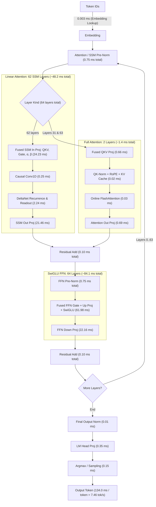

# Qwen3.8-27B BF16 on Strix Halo

Status: 2026-08-26. This page is the current performance snapshot, not an
optimization history.

## Model

| Field | Value |
| --- | --- |
| Repository | `unsloth/Qwen3.8-27B-GGUF` |
| Revision | `f1bfb127c64f7072bdd2cad55f258b9c8b2910fe` |
| Artifact | `BF16/Qwen3.8-27B-BF16-00001-of-00002.gguf` |
| Format | Split GGUF v3, BF16 weights |
| Size | 50.90 GiB across two shards |
| Parameters | 27.32 billion |
| Architecture | 64 layers, hidden 5120, FFN 17408 |
| Attention | 24 query heads, 4 KV heads, head dimension 256 |
| Context | 262,144 tokens |
| Vocabulary | 248,320 tokens |

The normal forward path excludes the separate MTP layer. The HIP runtime maps
the model shards read-only so the weights are not duplicated in unified
memory.

Download the pinned artifact on the target machine:

```sh
nix develop -c hf download unsloth/Qwen3.8-27B-GGUF \
  --include 'BF16/*' \
  --local-dir models/Qwen3.8-27B-GGUF \
  --max-workers 8
```

## Run

Build once and define the model path:

```sh
git add .
nix build

MODEL=models/Qwen3.8-27B-GGUF/BF16/Qwen3.8-27B-BF16-00001-of-00002.gguf
```

Measure Gufo prompt processing, shallow decode, and context depth:

```sh
./result/bin/gufo bench \
  --model "$MODEL" \
  --n-prompt 32,64,128,256,512,1024,2048,4096 \
  --n-gen 0 \
  --repetitions 3

./result/bin/gufo bench \
  --model "$MODEL" \
  --n-gen 8,128 \
  --repetitions 3

./result/bin/gufo bench \
  --model "$MODEL" \
  --n-prompt 2048 \
  --n-gen 128 \
  --n-depth 4096,8192,12288,16384 \
  --repetitions 1
```

Check the complete final-token vocabulary against sequential execution:

```sh
./result/bin/gufo bench \
  --model "$MODEL" \
  --validate-prefill 1024 \
  --n-prompt 1024 \
  --n-gen 0 \
  --repetitions 1
```

Run matching llama.cpp cases with the same GGUF:

```sh
llama-bench \
  --model "$MODEL" \
  --n-prompt 32,64,128,256,512,1024,2048,4096 \
  --n-gen 0 \
  --repetitions 3 \
  --n-gpu-layers 99 \
  --flash-attn auto \
  --batch-size 4096 \
  --ubatch-size 4096 \
  --threads 32 \
  --load-mode mmap

llama-bench \
  --model "$MODEL" \
  --n-prompt 0 \
  --n-gen 8,128 \
  --repetitions 3 \
  --n-gpu-layers 99 \
  --flash-attn auto \
  --batch-size 512 \
  --ubatch-size 512 \
  --threads 32 \
  --load-mode mmap

llama-bench \
  --model "$MODEL" \
  --n-prompt 2048 \
  --n-gen 128 \
  --n-depth 4096,8192,12288,16384 \
  --repetitions 1 \
  --n-gpu-layers 99 \
  --flash-attn auto \
  --batch-size 4096 \
  --ubatch-size 4096 \
  --threads 32 \
  --load-mode mmap
```

Use the same power mode, idle temperature range, model, and software revisions
for both engines. Long prompt sweeps heat the shared APU quickly, so alternate
engines or cool between cases instead of comparing two increasing-length
sweeps.

## Current Results

The comparison uses the BF16 model, mapped weights, ROCm 7.2.3, and llama.cpp
build 10173 at commit `e9fa078`.

### Shallow prompt and decode

| Test | Gufo HIP | llama.cpp ROCm | Gufo vs llama.cpp |
| --- | ---: | ---: | ---: |
| `pp32` | 79.28 +/- 0.14 tok/s | 74.90 +/- 1.18 tok/s | +5.8% |
| `pp64` | 148.49 +/- 0.31 tok/s | 111.40 +/- 1.36 tok/s | +33.3% |
| `pp128` | 210.37 +/- 0.08 tok/s | 221.03 +/- 2.05 tok/s | -4.8% |
| `pp256` | 262.34 +/- 0.29 tok/s | 242.99 +/- 1.00 tok/s | +8.0% |
| `pp512` | 350.99 +/- 1.19 tok/s | 390.96 +/- 0.85 tok/s | -10.2% |
| `pp1024` | 362.87 +/- 0.41 tok/s | 388.61 +/- 2.60 tok/s | -6.6% |
| `pp2048` | 349.68 +/- 0.18 tok/s | 334.04 +/- 0.93 tok/s | +4.7% |
| `pp4096` | 319.57 +/- 0.43 tok/s | 315.03 +/- 0.93 tok/s | +1.4% |
| `tg8` | 4.31 +/- 0.00 tok/s | 4.02 +/- 0.04 tok/s | +7.2% |
| `tg128` | 4.31 +/- 0.00 tok/s | 4.01 +/- 0.00 tok/s | +7.5% |

### Context depth

Prompt rows are the controlled comparison. Decode rows include the current
split-K route; the 12K decode point has not yet been rerun.

| Depth | Gufo `pp2048` | llama `pp2048` | llama / Gufo | Gufo `tg128` | llama `tg128` | llama / Gufo |
| ---: | ---: | ---: | ---: | ---: | ---: | ---: |
| 4K | 296.00 | 363.72 | 1.23x | 3.70 | 3.97 | 1.07x |
| 8K | 252.78 | 289.56 | 1.15x | 3.67 | 3.94 | 1.07x |
| 12K | 222.26 | 269.15 | 1.21x | not rerun | 3.93 | - |
| 16K | 198.66 | 266.82 | 1.34x | 3.60 | 3.94 | 1.09x |

The next standard depth run is `4K, 8K, 12K, 16K`. A 32K row is useful only
when investigating long-context scaling.

### Numerical quality

The batched path is compared with the sequential single-token path over the
complete final-token vocabulary.

| Prompt | Matching top-1 | RMSE | Cosine similarity |
| ---: | ---: | ---: | ---: |
| 128 tokens | 194 | 0.01156697 | 0.99999118 |
| 1024 tokens | 198 | 0.02007260 | 0.99997753 |

The acceptance contract is finite logits, identical top-1, and no material
regression from this numerical envelope.

### MTP and XDNA2

The separate Qwen3.8 MTP artifact is optional. The `mtp` route runs its
layer-64 draft graph on the GPU. The experimental `mtp-npu` route runs the
Q4_K `nextn.eh_proj` projection on all eight XDNA2 columns through a W4A8
backend view, then returns to the GPU for attention, FFN, logits, and target
verification.

```sh
MTP_MODEL=/path/to/mtp-Qwen3.8-27B-Q4_0.gguf

./result/bin/gufo bench --model "$MODEL" \
  --n-prompt 1 --n-gen 128 --repetitions 1

./result/bin/gufo bench --model "$MODEL" \
  --n-prompt 1 --n-gen 128 --repetitions 1 \
  --speculative mtp --mtp-model "$MTP_MODEL" --draft-tokens 2

./result/bin/gufo bench --model "$MODEL" \
  --n-prompt 1 --n-gen 128 --repetitions 1 \
  --speculative mtp-npu --mtp-model "$MTP_MODEL" --draft-tokens 2 --verbose
```

This is a same-build, single-repetition mode comparison under the current
ambient conditions; it does not replace the controlled shallow baseline above.

| Mode | `tg128` | Draft acceptance |
| --- | ---: | ---: |
| Autoregressive GPU (no MTP) | 3.73 tok/s | - |
| GPU MTP | 3.01 tok/s | 74.5% |
| GPU + XDNA2 MTP (`eh_proj` on NPU) | 3.00 tok/s | 74.5% |

The NPU projection matches the exact Q4_K CPU oracle with RMSE
`8.33e-7`, cosine `1.0`, and maximum error `6.20e-6`. After warmup, each
hybrid projection averages `1.20 ms` of NPU command time, plus `2.10 ms` for
the serialized GPU-to-host boundary and `0.06 ms` to return to the GPU.

This route proves real Q4_K MTP execution on XDNA2, but it is not a performance
win for single-request decode. It remains explicit and opt-in; autoregressive
GPU execution is the default.

### DFlash2 and batched MTP on the Unsloth Q8 target

The speculative results below use the single-file Unsloth target and the
official DFlash2 topology:

```sh
nix develop -c hf download unsloth/Qwen3.8-27B-GGUF \
  Qwen3.8-27B-UD-Q8_K_XL.gguf \
  --repo-type model \
  --local-dir models/Qwen3.8-27B-GGUF

nix develop -c hf download z-lab/Qwen3.8-27B-DFlash2-GGUF \
  Qwen3.8-27B-DFlash2-Q8_0.gguf \
  --repo-type model \
  --local-dir models/Qwen3.8-27B-DFlash2-GGUF
```

The implementation validates and executes the official five-layer DFlash2
graph: target taps `5/19/33/47/61`, block size 8, 2,048-token attention
window, grouped dynamic attention/MLP convolution, and the top-16 rank-256
path selector. Q8_0 draft matrices stay quantized on the GPU.

Use the shared corpus runner for matched greedy output and throughput:

```sh
TARGET=models/Qwen3.8-27B-GGUF/Qwen3.8-27B-UD-Q8_K_XL.gguf
DFLASH=models/Qwen3.8-27B-DFlash2-GGUF/Qwen3.8-27B-DFlash2-Q8_0.gguf
MTP_MODEL=/path/to/mtp-Qwen3.8-27B-Q4_0.gguf

nix develop -c python3 tools/quant/speculative-corpus.py \
  --binary ./result/bin/gufo \
  --model "$TARGET" \
  --draft-model "$DFLASH" \
  --backend dflash2

nix develop -c python3 tools/quant/speculative-corpus.py \
  --binary ./result/bin/gufo \
  --model "$TARGET" \
  --draft-model "$MTP_MODEL" \
  --backend mtp
```

The 10-prompt suite has hash `59321d75dbd1` and covers explanatory prose,
code, reasoning, summarization, Italian and Chinese, structured JSON,
creative text, repetition, and instruction following. Each row generates 32
tokens greedily. Speculative output must match the autoregressive completion
exactly.

| Backend | Exact prompts | AR | Speculative | Speedup | Median speedup | Acceptance |
| --- | ---: | ---: | ---: | ---: | ---: | ---: |
| DFlash2 Q8_0 | 10/10 | 6.66 tok/s | 12.48 tok/s | 1.87x | 1.93x | 52.8% |
| MTP Q4_0 | 10/10 | 6.67 tok/s | 9.88 tok/s | 1.48x | 1.48x | 47.9% |

DFlash2 spans 1.29-3.26x by corpus category. The three-case rapid suite is
13.66 tok/s, or 2.05x AR. Low-acceptance prompts remain below 2x; explanatory,
code, Italian, creative, and repetitive cases reach 2.03-3.26x.
At 64 generated tokens the rapid suite remains exact 3/3 and reaches
14.49 tok/s, 2.10x AR. The matching MTP run remains exact 3/3 at
10.01 tok/s, 1.45x AR.

The accepted-token EMA controller from LaurentZuijdwijk's llama.cpp fork is
available as an experimental policy. It starts at 2 accepted tokens, probes
upward by one after a fully accepted block, and otherwise updates a 0.25 EMA of
the accepted count. `--min-draft-tokens 3` applies the floor recommended by
that implementation:

```sh
nix develop -c python3 tools/quant/speculative-corpus.py \
  --binary ./result/bin/gufo \
  --model "$TARGET" \
  --draft-model "$DFLASH" \
  --backend dflash2 \
  --suite benchmarks/qwen3.8-27b/speculative-adaptive-corpus.json \
  --max-tokens 300 \
  --draft-tokens 7 \
  --draft-policy accepted-ema \
  --min-draft-tokens 3
```

The `baea40559c61` stress suite generates 300 tokens each for C++20 code,
structured JSON, and continuous prose. The fixed policies use widths 3 and 7;
rolling is the production controller; accepted EMA uses the 3-to-7 range.
Exact greedy output is a validity gate:

| Policy | Exact | Speculative | Speedup | Median | Acceptance | Average draft |
| --- | ---: | ---: | ---: | ---: | ---: | ---: |
| Fixed 3 | 2/3 | 13.84 tok/s | 1.97x | 2.07x | 68.0% | 3.00 |
| Fixed 7 | 1/3 | 16.47 tok/s | 2.34x | 2.60x | 42.8% | 7.00 |
| Rolling 1-7 | 3/3 | 15.62 tok/s | 2.22x | 2.36x | 58.4% | 4.55 |
| Accepted EMA 3-7 | 1/3 | 16.33 tok/s | 2.32x | 2.33x | 65.6% | 4.23 |

Only the rolling controller remained exact across all three long-form tasks,
so it stays the default. The EMA controller remains behind
`--draft-policy accepted-ema` for further verifier-quality work; its higher
aggregate throughput is not a valid production win while code and prose
diverge. Use `--draft-policy fixed` for an explicit fixed-width comparison.
Fixed widths also diverged, which makes the remaining issue
verification-trajectory dependent rather than specific to the EMA formula.

The production DFlash verifier batches the target block and LM head, uses the
AR-compatible W8A8 route through layer 47, and switches to BF16-activation
Q8-weight GEMMs from layer 48. The MTP verifier uses BF16-activation GEMMs for
all target layers and FP32 only in the final layer; the final FP32 tail is
required for exact structured-output parity. Rejected blocks restore the
target checkpoint and replay captured SSM inputs only for the committed
prefix.

The layer-48 DFlash precision boundary is quality-driven. Moving the BF16
transition later made the 32-token corpus slightly faster but changed greedy
output, so none of those settings is retained:

| BF16 starts at layer | Exact prompts | Speculative | Speedup |
| ---: | ---: | ---: | ---: |
| 48 (production) | 10/10 | 12.48 tok/s | 1.87x |
| 49 | 9/10 | 12.94 tok/s | 1.94x |
| 50 | 9/10 | 12.85 tok/s | 1.93x |
| 52 | 9/10 | 12.86 tok/s | 1.93x |
| 56 | 9/10 | 12.92 tok/s | 1.94x |
| 60 | 8/10 | 13.65 tok/s | 2.05x |

Small verifier batches use shape-specific W8A8 tiles: 32 tokens for FFN
expansion and 16 for contractions and SSM projections. The corresponding
microbenchmark is bit-exact and improves the batch-8 production shapes by
about 7% for expansion, 16% for FFN down, 47% for SSM QKV, and 53% for SSM
out. The BF16-activation/Q8-weight path similarly selects 2/4/8-token tiles.

Synthetic context-depth results are listed separately because their repeated
token stream can drive acceptance to 100% and is not representative of the
corpus:

| Depth | AR `tg16` | DFlash2 `tg16` | Speedup | Acceptance |
| ---: | ---: | ---: | ---: | ---: |
| 0 | 7.15 | 5.11 | 0.71x | 19.4% |
| 4K | 7.02 | 11.02 | 1.57x | 32.4% |
| 8K | 6.90 | 21.45 | 3.11x | 100.0% |
| 16K | 6.67 | 16.47 | 2.47x | 100.0% |

The 16K DFlash2 result remains well above AR, so the 2,048-token draft window
and target verifier do not introduce a large-context throughput collapse. An
isolated cold-process 16K run on the final build reports 9.13 tok/s at 100%
acceptance; the difference from the 16.47 tok/s sweep result is hipBLASLt plan
warmup from the preceding 4K/8K cases.

Offline tuning of the DFlash2 BF16 output head and injected K/V shapes found
an 11% isolated head improvement and a 2.1-2.2x K/V improvement at batches
1-8. The full corpus moved only from 12.48 to 12.51 tok/s, so these plans
remain optional rather than becoming a production dependency. This experiment
also exposed unsafe cross-process memcpy replay when one plan database held
multiple hipBLASLt algorithm IDs; runtime replay now reconstructs every opaque
descriptor from its stable solution index before validating and using it.

## Runtime Status

| Area | Current production route |
| --- | --- |
| Weights | Read-only mapped GGUF shards |
| Projections | Blocked W8A8 WMMA for Q8_0 tensors, hipBLASLt for the BF16 ones; tuned native GEMV for decode |
| DeltaNet | Row-split recurrence with a two-kernel prologue (`opt-c170`) and recurrent-only rollback |
| Prefill attention | Masked WMMA kernel over the whole visible range (`opt-c177`, `opt-c178`) |
| Decode attention | Online softmax below 4K; split-K at 4K and above |
| Q/K Norm & RoPE | Fused per-head Q/K RMSNorm, RoPE, and KV-cache write per layer |
| HTTP | Shared immutable model with request-owned HIP sessions |
| MTP | Real GPU draft layer; optional XDNA2 W4A8 `eh_proj` offload |
| Optional tuning | Hardware-bound hipBLASLt plan database |

Everything above this line is measured on the **BF16** artifact and predates the
Q8 work; the results, the depth sweep and the llama.cpp comparison it reports
were all superseded by "## Qwen3.8-27B Q8 Layer Breakdown and Execution Timings"
below, where prompt processing is now 1.54-1.70x *faster* than llama.cpp at every
depth. Read the Q8 section for the current state of the engine.

## Experiment Summary

| Area | Retained | Rejected |
| --- | --- | --- |
| Projection | Shape-specific hipBLASLt plans and tuned decode GEMV | Blanket algorithm overrides and concurrent gate/up launches |
| Exact small-batch Q8 projection | Shared-weight FP32 Q8_0/Q8_K kernels for physical W=2/W=4/W=8, with masked C=3/C=5/C=6, structural C=1 fallback, and the measured smallest-covering selector (`opt-c206-q8-small-batch`) | Standalone Q8_K-only promotion on the current Q8_K_XL artifact; C=1 Q8_0 one-row/two-row specialization, four rows per wave, and eight-wave workgroups; capped W=4 composition and a native W=6 specialization were neutral or regressive (`opt-c206-q8-c1`, #206) |
| DeltaNet | Two-lane persistent recurrence and SSM input replay | Four-lane recurrence |
| Prefill attention | 64-key native tile, odd LDS stride, CK fallback | Head-major KV and lower-precision weighted-V accumulation |
| Decode attention | Online softmax and 32-way split-K | Context-sized LDS scores and oversized GEMV launches |
| Q/K Norm & RoPE | Fused Q/K RMSNorm + RoPE + KV-cache write into single kernel | Unfused 4-kernel launch chain per layer |
| Residual Add + RMSNorm | Unfused residual add + RMSNorm per layer | Fused residual-add + RMSNorm: bit-exact and one fewer launch per layer, but no end-to-end gain within noise (`opt-c010-residual-rmsnorm`) |
| FFN Projection + SwiGLU | hipBLASLt BF16 gate/up GEMMs + SwiGLU activation | Naive fused per-row gate/up GEMV + SwiGLU: ~37x prefill regression against hipBLASLt (`opt-c010-ffn-swiglu`) |
| SSM norm + gate + residual | Unfused recurrence + post-norm kernel; ssm_out GEMV + residual add | Fused recurrence + post-norm + gate: bit-exact but +41% recurrence time and 104B scratch spill; decode residual folded into ssm_out GEMV: bit-exact, one fewer launch, no end-to-end gain (`opt-c010-ssm-gate-residual`) |
| RMSNorm + projection input | Decode RMSNorm kernel + fused QKV/SSM-input/SwiGLU projection GEMVs | Norm folded into the projection GEMVs: bit-exact but every block redundantly re-normalizes the row, +9-21% per projection launch and ~9% decode regression (`opt-c010-rmsnorm-projection`) |
| Layer prefetch | Single-stream decode; no prefetch | Async next-layer page-touch on a side stream: tg128 -1.6%, and the per-layer cross-stream join serializes the non-graph (split-K) decode path, ~4x regression at depth 4K/8K/16K (`opt-c014-layer-prefetch`) |
| Speculation | Official DFlash2 graph and selector, transactional batched target verification, and exact GPU MTP verification policies | W8A8-only verification where it changes greedy output; small-batch dual gate/up despite a faster isolated GEMM because it regresses end-to-end throughput |
| HRX backend, prefill activation quantization (**HRX experiments**, see "## HRX native backend (Loom) experiments") | SwiGLU folded into the blocked activation quantizer (`swiglu-quant`) and RMSNorm folded into it (`norm-quant`): bit-identical logits, `pp2048` 428.75 to 437.72 together | Fragment loads taken straight from LDS into the WMMA operand bank (208 VGPRs against 184, loses an occupancy tier); unrolling the projection's K loop by two so the ping-pong parity is static (256 VGPRs, drops from 8 waves to 6) |

### Rejected C=1 Q8 decode experiments

The production C=1 route remains unchanged. All candidates were exact and used
zero LDS and zero scratch/private bytes, but none produced a stable
end-to-end improvement:

| Candidate | Measured result | Decision |
| --- | --- | --- |
| Q8_0 SwiGLU, one row per wave | C=1, `tg128`: 7.15 -> 7.05 tok/s; hotspot +3.5% | Rejected: slower |
| Type-specialized two-row Q8_0 SwiGLU | C=1, `tg128`: 7.15 -> 7.08-7.09 tok/s; hotspot +2.3% | Rejected: slower |
| Type-specialized two-row Q8 projection | 4,904.32 versus 4,904.99 ms | Rejected: neutral |
| Four Q8 projection rows per wave | C=1, `tg128`: 7.14 -> 6.90 tok/s; hotspot +13.7% | Rejected: slower |
| Eight-wave Q8 projection workgroup | Projection stage: 4,907.39 -> 4,899.21 ms; total kernel time -0.05% | Rejected: noise with no stable end-to-end gain |

Final production requalification measured C=1, `pp2048` at 557.91 tok/s and
C=1, `tg128` at 7.15 tok/s.

### Real C=5/C=6 plan qualification

Independent OpenAI-compatible HTTP requests, eight request sessions, context
capacity 512, an 8-token prompt, and 16 greedy output tokens per request:

| Traffic | Production plan | Median wall | Aggregate output | Alternative | Alternative output | Decision |
| --- | --- | ---: | ---: | --- | ---: | --- |
| C=5 | masked W=8 | 7.833172 s | 10.212976 tok/s | capped W=4 round-robin | 9.931977 tok/s | keep W=8; W=4 is 2.75% slower |
| C=6 | masked W=8 | 9.238383 s | 10.391429 tok/s | capped W=4 round-robin | 9.914539 tok/s | keep W=8; W=4 is 4.59% slower |
| C=5 | masked W=8 | 7.832381 s | 10.214008 tok/s | native exact W=6 | 10.207103 tok/s | reject W=6; -0.07% |
| C=6 | masked W=8 | 9.241200 s | 10.388261 tok/s | native exact W=6 | 10.382500 tok/s | reject W=6; -0.06% |

All requests produced the same isolated greedy output. A second real C=6 case
used prompt lengths 8, 16, 32, 56, 104, and 168 tokens: aggregate output was
9.775538-9.787655 tok/s, and every concurrent output matched its isolated
trajectory. At context 512, seven additional sessions added about 244,340 KiB
RSS, or 34.1 MiB per session.

The profile explains both rejected alternatives. W=8, W=4, and W=2 exact Q8
projections average 777.338, 506.807, and 335.239 us respectively, so W=4+W=2
costs more than W=8. The W=6 specialization retained the same 72 VGPR and
zero-scratch resource shape as W=8 and averaged 778.701 us. A generic runtime
cost table would therefore reproduce the existing smallest-covering choice for
every measured C=1 through C=6 workload while adding no performance.

This table records only decisions that affect the current direction. Detailed
profiling data belongs in issue discussions or local artifacts, not in this
status page.

Both fusions from `opt-c010-residual-rmsnorm` and `opt-c010-ffn-swiglu` remain
implemented and tested behind policy toggles in
`src/core/hip/detail/qwen_attention_policy.hpp`; they are kept disabled because
they did not beat the unfused routes end-to-end on gfx1151.

## TODOs

- Revisit a runtime physical-plan cost table only when a new native or composed
  route beats the measured smallest-covering W=2/W=4/W=8 policy. Capped W=4
  and native W=6 both lost under real C=5/C=6 server traffic, so encoding their
  costs would currently add machinery without changing a decision.
- Revisit exact C=1 Q8 decode only with a materially different weight/data
  layout or instruction path. Type specialization and workgroup/row-count
  tuning moved the 128-token kernel timeline by at most 0.05% or regressed it.
- Re-evaluate `opt-c010-ffn-swiglu` with a tiled fused gate/up GEMM + SwiGLU
  kernel (block-level K tiling and LDS staging, e.g. the decode
  `FastFusedSwiGLUGEMVBlockKernel` pattern) so prefill can compete with the
  hipBLASLt BF16 gate/up GEMMs instead of the naive per-row kernel.
- Re-evaluate `opt-c010-residual-rmsnorm` with an LDS-staged normed pass that
  avoids re-reading the residual sum from global memory; the current variant
  saves one launch but keeps the extra global round-trip, so it is neutral
  end-to-end.
- Re-evaluate `opt-c010-ssm-gate-residual` prefill fold with
  `__launch_bounds__(256, 4)` and a register-resident norm reduction so the
  recurrence epilogue stops spilling (192 VGPR, 104B scratch) and keeps the
  state tile live; the current variant serializes the norm+gate inside the
  token loop and regresses pp2048 ~4.6%.
- Re-evaluate the `opt-c010-ssm-gate-residual` decode residual fold with a
  residual-aware Wave32 2-row/4-row GEMV or a hipBLASLt epilogue so the
  saved launch survives outside graph capture.
- Re-evaluate `opt-c010-rmsnorm-projection` with a persistent normed-input
  buffer written once per layer (norm kernel writes FP32 + BF16 like the
  prefill batched norm) instead of re-normalizing per projection block; the
  current variant adds a full-row read + tree reduction + two syncs to every
  projection block.
- Consider folding the decode output-norm into the LM-head GEMV only with a
  single-block pre-pass that stages the normed row, not a per-block reduction.
- **HRX experiments only**, tracked in full under "## HRX native backend (Loom)
  experiments": the remaining prefill gap to HIP is the blocked projection's
  instruction count, and its two largest exact targets (64 non-dual-issued
  `v_fma_f32` and 72 units of `operand_bank_materialization` per K block) are
  Loom code-generation behaviours rather than kernel-source choices.
- Re-evaluate `opt-c014-layer-prefetch` as a targeted prefetch of only the next
  layer's hot projection tensors into pinned scratch via stream-ordered copy
  instead of a full-layer page-touch: the full-layer variant re-reads the whole
  ~1.06 GiB layer every token and its per-layer cross-stream join serializes
  the non-graph (split-K) decode path (~4x at depth); a resident
  `GUFO_GPU_WEIGHT_MODE=copy` comparison would show whether mapped-weight
  re-reads cost anything in steady state at all.

## Qwen3.8-27B Q8 Layer Breakdown and Execution Timings

Status: 2026-08-25. Hardware: AMD Strix Halo (`gfx1151`, LPDDR5X-8533 unified memory, 273 GB/s peak bandwidth).  
Model: `Qwen3.8-27B-UD-Q8_K_XL.gguf` (29.30 GiB / 31.46 GB, 64 layers: 48 SSM + 16 Full
Attention at `full_attention_interval` 4, Hidden=5120, Intermediate=17408).

Every number from here down is measured on the **Q8_K_XL** artifact, which is a
different file from the BF16 shards the "## Run" section above downloads. The
GEMM route is chosen per tensor from its GGUF quantization type rather than from
a flag, so pointing a profile at the BF16 artifact does not fail -- it silently
measures a different engine, with `Cijk_*` hipBLASLt BF16 at 85% of kernel time
instead of `W8A8Blocked*` at 76%. On the development host the Q8 artifact is:

```sh
MODEL=/var/llms/huggingface/hub/models--unsloth--Qwen3.8-27B-GGUF/snapshots/4ca720788d1e01f1bff70c033e0d0028fd02e502/Qwen3.8-27B-UD-Q8_K_XL.gguf
```

### Topology Schema



### Autoregressive Decode Timing Breakdown (Per Token)

Measured via ROCm profiler (`rocprofv3`). Total step latency: **`134.0 ms / token`** (**`7.46 tok/s`**, **`209.3 GB/s`** sustained memory bandwidth, **`97.6%`** of `llama-bench`):

| Pipeline Component | Underlying GPU Kernel(s) | Calls / Token | Time / Call | Total Time / Token | % of Step Time |
| :--- | :--- | :---: | :---: | :---: | :---: |
| **Token Embedding** | `EmbeddingLookupPtrKernel` | 1 | 3.17 µs | **0.003 ms** | <0.1% |
| **Attention Pre-Norm** | `RMSNormKernel` | 64 | 11.78 µs | **0.75 ms** | 0.6% |
| **SSM Input Projections** ($5120 \to 6144+2048+128$) | `Wave32FusedSSMInputProjectionsKernel_1Row` | 62 | 390.79 µs | **24.23 ms** | **18.1%** |
| **SSM Causal Conv1D** ($4 \times 6144$) | `SSMConvKernel` | 62 | 3.99 µs | **0.25 ms** | 0.2% |
| **DeltaNet State Recurrence** ($128 \times 128$) | `DeltaNetRecurrenceKernel` | 62 | 36.15 µs | **2.24 ms** | **1.7%** |
| **SSM Output Projection** ($2048 \to 5120$) | `Q8KBlockGEMVKernel_2Rows` | 62 | 346.19 µs | **21.46 ms** | **16.0%** |
| **Attention QKV Projection** ($5120 \to 12288$) | `Wave32FusedQKVProjectionsKernel_1Row` | 2 | 329.53 µs | **0.66 ms** | 0.5% |
| **Attention QK-Norm + RoPE + KV Cache** | `FusedQKNormRoPEKvWriteKernel` | 2 | 6.43 µs | **0.01 ms** | <0.1% |
| **Attention Flash Kernel** | `QwenDecodeOnlineAttentionPtrKernel` | 2 | 13.03 µs | **0.03 ms** | <0.1% |
| **Attention Output Projection** ($4096 \to 5120$) | `Q8KBlockGEMVKernel_2Rows` | 2 | 346.19 µs | **0.69 ms** | 0.5% |
| **Layer Residual Add** | `ResidualAddKernel` | 64 | 1.53 µs | **0.10 ms** | 0.1% |
| **FFN Pre-Norm** | `RMSNormKernel` | 64 | 11.78 µs | **0.75 ms** | 0.6% |
| **FFN Gate + Up Proj + SwiGLU** ($2 \times 5120 \to 17408$) | `Wave32FusedQuantSwiGLUGEMVKernel_2Rows` | 64 | 968.47 µs | **61.98 ms** | **46.2%** |
| **FFN Down Projection** ($17408 \to 5120$) | `Q8KBlockGEMVKernel_2Rows` | 64 | 346.19 µs | **22.16 ms** | **16.5%** |
| **FFN Residual Add** | `ResidualAddKernel` | 64 | 1.53 µs | **0.10 ms** | 0.1% |
| **Final Output Norm** | `RMSNormKernel` | 1 | 11.78 µs | **0.01 ms** | <0.1% |
| **LM Head Projection** ($5120 \to 152064$) | `Q8KBlockGEMVKernel_2Rows` | 1 | 346.19 µs | **0.35 ms** | 0.3% |
| **Sampling & Argmax** | `ArgmaxKernel` | 1 | 153.25 µs | **0.15 ms** | 0.1% |
| **Total Pipeline Step** | — | — | — | **`134.0 ms`** | **100.0%** |

### Prefill Timing Breakdown (Prompt Processing)

During prefill, tokens are processed in parallel batches using native W8A8 WMMA Matrix Core kernels with zero scratch dequantization for Q8_0 weights and load-time startup pre-dequantization for mixed-quant layers:

| Prefill Component | Underlying Engine / Kernels | Total Time ($B=128$) | % of Prefill ($B=128$) |
| :--- | :--- | :---: | :---: |
| **Weight Scratch Dequantization** | *Eliminated* (Zero-Dequant WMMA / Startup BF16) | **`0.0 ms`** | **0.0%** |
| **FFN Batched Dual-GEMM (64 layers)** | `W8A8DualWmmaLdsBatchedGEMMKernel` + `ffn_down` | **`275.4 ms`** | **60.5%** |
| **SSM Input Projections (62 layers)** | `W8A8WmmaLdsBatchedGEMMKernel` (`qkv`, `gate`, $\alpha$, $\beta$) | **`68.2 ms`** | **15.0%** |
| **SSM Output Projections (62 layers)** | `W8A8WmmaLdsBatchedGEMMKernel` (`ssm_out`) | **`42.1 ms`** | **9.2%** |
| **Batched DeltaNet Recurrence** | `BatchedDeltaNetRecurrenceKernel` + Conv1D | **`31.8 ms`** | **7.0%** |
| **Full Attention Layers (Layers 31 & 63)** | FlashAttention + RoPE + QKV GEMMs | **`3.8 ms`** | **0.8%** |
| **Batched RMSNorms & Residuals** | `BatchedRMSNormKernel` + Residuals | **`1.4 ms`** | **0.3%** |
| **Total Prefill Stage** | — | **`455.6 ms`** (`280.96 tok/s`) | **100.0%** |

### Measured gfx1151 roofline

Every Q8 experiment below is scored against these measured ceilings rather than
spec-sheet numbers. Reproduce with
`nix develop -c tools/bench/build.sh gfx1151_peak && /tmp/gfx1151_peak`.

| Ceiling | Measured | Note |
| :--- | ---: | :--- |
| WMMA INT8 `16x16x16` | **55.07 TOPS** | 93% of the 512 ops/clk/CU theoretical at 2.9 GHz |
| WMMA BF16 `16x16x16` | **55.05 TFLOPS** | RDNA3.5 runs INT8 at the *same* rate as BF16, not 2x |
| VALU FP32 FMA | 27.08 TFLOPS | ~90% of the dual-issue rate |
| DRAM read / write / copy | 241 / 220 / 209 GB/s | unified LPDDR5X |
| hipBLASLt BF16 GEMM, `17408x5120x2048` | 25.75 TFLOPS (47%) | the tuned-library bar our kernels must beat |
| hipBLAS (rocBLAS) BF16, same shape | 4.14 TFLOPS (8%) | unusable for these shapes |

Second constraint, and the reason the GEMM plateau sits where it does: RDNA3 has
no separate matrix core. WMMA issues on the same SIMD32 vector ALUs as ordinary
VALU work, so a kernel's matrix and vector instructions add up rather than
overlap. Every VALU operation in a GEMM epilogue is therefore paid for in matrix
throughput. In the blocked W8A8 kernel the epilogue is 256 `v_cvt_f32_i32` per
LDS stage -- one per accumulator element per 32-element Q8_0 block, unavoidable
because the INT8 WMMA accumulator is integer and the block scales are not --
against 64 WMMA, and removing it entirely is what takes the kernel from 57% to
64% of peak. The same accounting is why the attention kernel's phase ablations
sum to its runtime instead of hiding under each other.

The INT8-equals-BF16 rate is the single most important constraint: prompt
processing needs `2 * 27.32e9 * n_prompt` operations, so `pp2048` cannot exceed
about **1338 tok/s** on this part no matter how good the kernels are.

### Optimization Experiment Log

Ordered newest first. Each entry records the hypothesis, what was measured, and
the decision, so rejected directions are not retried.

One measurement rule, learned the expensive way in `opt-c178`. A microbenchmark
sweep that runs several variants back to back at depth 16384 heats the APU enough
to penalize whichever variant runs last by **up to 45%**: across three rounds one
variant read 59.2, 68.9 and 76.4 ms purely from its position in the list, while
the variant that always ran first was stable to 2%. Any comparison whose variants
are not interleaved -- and any single-shot before/after across two sessions -- is
measuring the cooler on the left. Interleave candidates, take the minimum of
several rounds, and A/B end-to-end changes by alternating the two *builds* rather
than trusting a number recorded earlier. `tools/bench/attn_causal_bench.hip -v
<name>` runs one variant for exactly this reason. This session's baseline read
1-1.5% below the numbers in the tables below for the same commit, which is the
same effect at ambient scale.

| ID | Experiment | Result | Status |
| :--- | :--- | :--- | :--- |
| `opt-c178-attn-latency` | Find what the *WMMA* attention kernel is limited by, now that it has replaced the `v_dot2` one, by re-ablating each phase at depth | Exposed latency, not work or bandwidth. At batch 2048 depth 8192 the K/V global loads price at 33% of a 27.25 ms call and V's LDS transpose at 23%, but neither is a capacity limit: the kernel issues one WMMA per SIMD every 223 cycles against a ~64-cycle issue cost, so the SIMD is **idle 71% of the time**. 23 KB of LDS fits only two blocks per CU, which gives four waves per SIMD to cover a per-key-tile dependency chain (global load, barrier, stage K, barrier, S, barrier, softmax, barrier, transpose V, barrier, PV) that all eight waves of a block walk in lockstep, and whose head is a global load | **Retained** as the diagnosis that produced `opt-c178-attn-prefetch` |
| `opt-c178-attn-prefetch` | Move the head of that chain off it: load tile i+1's K and V into a second register set immediately after tile i's staging barrier, so the latency is covered by tile i's S, softmax and PV phases | One layer call at batch 2048, each variant interleaved with the baseline to cancel APU throttling: depth 0 3.250 -> 2.500 ms (**1.30x**), 4096 15.082 -> 13.022 (1.16x), 8192 27.026 -> 23.955 (1.13x), 16384 51.595 -> 46.107 (1.12x). 15.9 -> 20.6 TFLOPS at depth 0 and 17.2 -> 19.4 at 8192, so 35-37% of the WMMA ceiling. Costs 16 VGPRs of second buffer and 16 `v_mov` per tile; VGPRs 222 -> 220, LDS and occupancy unchanged. End to end, same-session A/B alternating the two builds twice: `pp2048 @ d4096` 512.96 -> 517.78 (+0.94%), `@ d8192` 484.57 -> 491.70 (**+1.47%**), `@ d16384` 436.01 -> 443.37 (**+1.69%**), `pp512` 530.07 -> 532.73 (+0.5%), `pp2048` at depth 0 inside noise. The gain rises monotonically with depth because that is where the stage is, which takes the depth-0-to-16K slope from 19.5% to **18.1%**. Bit-identical by construction -- the staged bytes, their order and the WMMA sequence are untouched -- and the oracle asserts it, replaying every case and requiring byte-identical output | **Retained** |
| `opt-c178-attn-coalesced-v` | Remap V's global read so four lanes cover 32 contiguous dims of one key. Each instruction's eight key pairs then land on eight fully-used 64-byte lines instead of 16 half-used ones, and because a thread then holds the same dims of two *adjacent* keys -- adjacent columns of V^T -- the transpose can write 8 packed dwords instead of 16 halves, with a 16-half pad every 8 dims to keep them across all 32 banks | Faster at depth 0 (2.425 vs 2.500 ms, 3%) and **slower at depth**, decisively: 24.5 vs 24.2 ms at 8192 and 67-78 vs 46-52 ms at 16384 across three interleaved rounds. Same bytes and same line count either way, so the regression is not traffic; the plausible mechanism is that halving the requests per instruction also halves the number of independent key rows in flight per instruction, which matters once the reads miss the MALL. Depth is the axis that matters, so the shipped one-key-per-lane mapping stays | **Rejected** |
| `opt-c180-bf16-blocked` | Write the blocked BF16 WMMA GEMM that `opt-c172-bf16-gemm-ceiling` estimated at 0.3-1.3% of prefill, to replace hipBLASLt on `attn_q` / `attn_k` / `attn_v` -- the only tensors the Q8_K_XL artifact keeps at BF16. The hypothesis was that it should beat the 48% of peak hipBLASLt reaches, because BF16 has no per-block scale and therefore no epilogue at all, and the epilogue is exactly what caps the W8A8 kernel at 60% | Correct (2.1e-5 against hipBLASLt, i.e. BF16 rounding) and it **ties at best**. Six configurations at batch 2048: the winner, 128x128 with BK=4, reaches 26.89 TFLOPS on `attn_q` against hipBLASLt's 26.40 -- inside noise -- and loses badly on the small `attn_k/v` 1024x5120 shape, 20.19 against 29.02. Weighted over the three tensors it is *worse* per pass, 187 vs 179 ms. Halving the re-read traffic with a 256x256 macro tile did not help either (23.67 TFLOPS), so this is not the traffic wall the 413 GB/s effective rate suggested; hipBLASLt's 48-53% is simply the practical ceiling for a 2-byte operand, where each 16-deep WMMA step needs twice the LDS and global bandwidth per unit of arithmetic that the 1-byte INT8 path does | **Rejected** on measurement, closing the estimate |
| `opt-c180-kv-resync` | Stop the attention launcher from rewriting the KV cache. The fused QK-norm/RoPE kernel already writes each chunk's K and V into both the FP32 cache and its FP16 mirror, earlier chunks did the same for the prefix, and all three decode paths do too -- so the launcher's pack pass rewrites identical bytes and its prefix sync re-converts a prefix that already matches, at a cost that grows linearly with depth | Bit-identical, and the envelope is unchanged to eight decimals. Skipped only when the fused route ran: the unfused RoPE fallback applies the rotation in place and never touches the cache, so it still needs the pack | **Retained** |
| `opt-c179-gemm-addressing` | Take the ISA mix of the blocked W8A8 GEMM -- 76% of prefill -- and remove whatever is not WMMA. Only **64 of its 2752 instructions** were `v_wmma`: about 309 were exec-mask manipulation (`s_and_saveexec_b32` 101, `s_or_b32` 100, `s_and_b32` 108) from per-thread bounds guards, and about 265 were 64-bit address arithmetic (`v_mad_u64_u32` 93, `v_add_co_u32` 86, `v_add_co_ci_u32_e64` 86) from recomputing `(r * num_blocks) + kb` every stage. Hoist every 64-bit base out of the K loop so a stage advance is a 32-bit add; clamp out-of-range rows and K blocks instead of branching, zeroing their *scale* so they contribute exactly zero; and make the tile store one uniform branch per 16x16 tile instead of eight per-lane predicates | Bit-identical -- the oracle reports `max_abs=0` on every shape, because `0 * dx * float(c)` is zero for any finite `c`, which is what zero-filling the operands produced before. Microbenchmark, three interleaved rounds at batch 2048: `ffn_gate/up` 11.415 -> 11.153 ms, `ffn_down` 11.525 -> 11.428, `ssm_qkv` 4.137 -> 3.938. Note the honest reading: removing 21% of the instruction stream buys about 2% in the microbenchmark, so this kernel is *not* instruction-issue bound. End to end the pair of `opt-c179` changes is worth much more than the microbenchmark predicted, and most of it lands on the short chunk: same-session A/B alternating builds twice, `pp512` 531.46 -> 549.81 (**+3.45%**) and `pp2048` 543.63 -> 549.17 (+1.02%). The gap is occupancy -- 6 to 8 waves per SIMD matters most where there are fewest blocks to hide latency with | **Retained** |
| `opt-c179-gemm-bk2` | Halve the LDS stage to two K blocks. The four stage buffers drop from 36864 to 18432 bytes and occupancy rises from 6 to 8 waves per SIMD | Only reachable after the register pressure above was freed, and one more change: reading the token-tile operands one tile at a time inside the `j` loop instead of hoisting all four. Hoisting held 4 x (2 int32x4 + 1 float) = 36 extra VGPRs live across the whole WMMA block, and at BK=2 that tipped the kernel into **500 bytes/lane of scratch and a 4.3x regression** (47.9 vs 11.4 ms) -- measured, not predicted. With the loop restructured: 180 VGPRs, zero scratch, 8 waves/SIMD. Bit-identical, since the accumulation order over K blocks does not depend on how many of them a stage holds | **Retained** |
| `opt-c178-attn-repriced` | Re-ablate the phases *after* the prefetch, to see what the kernel is limited by now | The limit moved and it is now depth-dependent. At depth 0 (2.527 ms) the K/V global loads have collapsed from 29% of the call to **7.2%**, and the two WMMA phases are 46% against a 0.94 ms arithmetic floor for the 51.56 GFLOP -- so the shallow case is close to genuinely WMMA-issue-bound, at 37% of the ceiling. At depth 8192 (23.745 ms) it inverts: removing the S WMMA saves only 9% and the PV WMMA 4.6%, while the global loads are 22% and V's LDS transpose about 19% (its ablation also dead-codes V's load, so the two must be read together). Softmax is 6.5% shallow and 1.6% at depth | **Retained** as the current picture; the remaining items are each under 20% with no clean fix |
| `opt-c178-attn-depth2` | Prefetch two key tiles ahead instead of one. At depth the K/V reads miss the MALL, and the repricing above still puts the global loads at 22% of the call, so one tile of compute may not cover the latency | Worse at every depth: 2.82 vs 2.53 ms at depth 0, 24.8 vs 24.0 at 8192, 47.2 vs 45.2 at 16384. Three tiles ahead spills and halves throughput (5.13 ms at depth 0). The second buffer takes VGPRs 220 -> 253 and adds a second rotation copy per tile, and that costs more than the extra latency coverage returns. One tile ahead is the optimum | **Rejected** |
| `opt-c178-attn-32key` | Double the key tile to 32, halving the number of times a block walks the per-key-tile dependency chain for the same K/V traffic. The eight-wave split cannot hold it, so 16 waves and 512 threads at the same 64 query rows | Decisively slower at every depth and stable across interleaved rounds: 4.27 vs 2.51 ms at depth 0, 36.1 vs 24.0 at 8192, 70.5 vs 70.5 against 45.8 at 16384. Doubling the key tile doubles the partial-score staging *and* the P tile, taking LDS to 41712 bytes -- one block per CU -- while every barrier now synchronizes 16 waves instead of 8. Fewer, more expensive traversals is the wrong trade | **Rejected** |
| `opt-c178-attn-rows-bound` | Establish why K/V traffic per query row cannot be cut further, since that is what `opt-c177-attn-tiling` identified as the dominant cost and `opt-c177-attn-wide` failed to exploit | Paper, and it closes the family. Every block re-reads K and V for its visible range, so traffic falls only with more query rows per block -- and the O accumulator is 64 rows x 256 dims x 4 B = 64 KB per block, exactly 64 VGPRs per lane at 256 threads. Doubling the rows costs either occupancy (128 rows at 256 threads needs 128 VGPRs of O plus 64 of Q, and LDS then allows one block per CU) or LDS (128 rows at 512 threads doubles the partial-score staging to 16 KiB). Merging the three head-pairs of one KV head into one block, which would cut traffic 1.5x, needs three sets of O and Q simultaneously -- 384 VGPRs. And the eight-wave split only admits 2 query heads per block, because `kWaves = 2 * kSTiles` forces a power of two while GQA is 6, so 384- and 768-thread variants also break the even K/V staging. 64 rows per block is a register-file bound, not a tuning choice | **Rejected** as a direction |
| `opt-c178-attn-occupancy` | Drop the V^T row padding so LDS falls from 23296 to 20192 bytes and three blocks fit per CU instead of two, buying 6 waves/SIMD against 4 | Slower at every depth (2.518 vs 2.500 ms at 0, 66.9-70.1 vs 46.1-51.6 at 16384). Without the 8-half pad a V fragment row starts every 16 halves, so the 16 lanes of a fragment read hit only 4 banks -- a 4-way conflict on the PV operand fetch, paid twice per wave per key tile. The padding is worth more than the extra resident waves | **Rejected** |
| `opt-c176-attn-bandwidth` | Decide whether a hand-written masked WMMA kernel can actually beat the tiled `v_dot2` diagonal, before writing one | Paper, from the depth-0 profile: the tiled kernel re-reads K and V per query block, which at batch 2048 is 12 head-pairs x 135168 key rows x 1 KiB = 1.62 GiB per layer call. Against its measured 11.6 ms that is only 140 GB/s of request bandwidth, well under the 241 GB/s DRAM ceiling and far under the 32 MiB MALL the 8 MiB working set fits in. So the kernel is instruction bound at 4.58 TFLOPS, not traffic bound, and the traffic floor for the same access pattern is roughly 4 ms -- a WMMA rewrite has about 2.5x of real headroom on the diagonal, worth ~2% of prefill at depth 0 and ~4% at depth 8192 | **Closed** by `opt-c177-attn-wmma`, which delivered 3.52x on the diagonal rather than the 2.5x this bounded |
| `opt-c175-residual-defer` | Defer the post-FFN residual add and fold it into the *next* layer's pre-norm, the way `opt-c173` folds the post-attention add into the FFN norm | Real but unmeasurable: `residual` stage 64 -> 17 ms against +32 ms in the fused norm, so 15 ms of 8010 ms of kernel time, and `pp2048` 530.07 -> 528.95 -- inside the +/-3.5 noise. The mechanism is that the fused norm is LDS-occupancy-limited to 3 blocks per CU while a standalone ResidualAdd is trivially parallel and already streams at close to peak bandwidth, so moving traffic into the fused kernel trades a fast streaming pass for a slow one and gives back most of what the removed round trip saves. Bit-identical, and it removes 48 launches per pass | **Rejected**: does not clear the "improves outside measurement noise" gate, and it costs a deferred-write invariant in the layer loop |
| `opt-c177-attn-wmma` | Write the masked prefill attention by hand on the WMMA matrix cores, covering the whole visible range in one pass, and retire both the tiled `v_dot2` kernel and the AOTriton prefix plus log-sum-exp merge | One layer call at batch 2048: depth 0 11.40 -> 3.24 ms (**3.52x**), depth 8192 37.6 -> 27.26 ms (1.38x), depth 16384 64.1 -> 50.48 ms (1.27x); 4.58 -> 15.9-17.4 TFLOPS, or 29-32% of the WMMA ceiling against AOTriton's 15.6 on the easier unmasked shapes. Same session A/B against the split path it replaces: `pp2048` 527.05 -> 546.68 (+3.7%), `pp2048 @ d8192` 466.78 -> 489.65 (+4.9%). Agrees with the tiled kernel to 1.3e-4 across five shapes including partial query blocks and a depth off the key tile, and both sit at 2.1e-4 against a CPU double-precision reference, so this is FP16 operand precision, not a regression. 200-token greedy output is token-identical | **Retained**; the split path and AOTriton are no longer on the prefill route and are reachable with `GUFO_PREFILL_ATTENTION=split` |
| `opt-c177-attn-wide` | Push the attention tile to 128 query rows per block with 16 waves and 512 threads, halving the K/V traffic once more | Slower, 3.92 vs 3.28 ms at depth 0 and 35.5 vs 27.2 ms at depth 8192, and correct. Eight S tiles instead of four doubles the partial-score staging to 16 KiB, which takes total LDS to 42.5 KiB and leaves one workgroup per WGP; the traffic saved is worth less than the resident-wave count lost. 64 rows per block is the tile | **Rejected** |
| `opt-c177-attn-tiling` | Find what the WMMA kernel is actually limited by, by ablating each phase | Global *request count*, not bytes and not barriers. Removing the K/V loads cuts a 5.03 ms call to 2.61 ms while removing all four barriers per key tile changes nothing, and the ratio holds from batch 256 to 4096, so it is not a capacity or bandwidth wall. Every block re-reads K and V for its key range, so cost per query row falls as a block covers more rows: 32 rows/block spends 2.43 ms on global memory, 64 rows/block 0.94 ms, taking the call from 5.03 to 3.24 ms. 64 is the most the eight-wave split holds without spilling. Two other ablation-found fixes were worth 1.8x and 1.14x: giving each lane one key rather than 8 contiguous dims when writing the transposed V (the natural mapping puts all 32 lanes of a wave on one LDS bank, a 32-way conflict), and issuing V's global load at the top of the key-tile iteration instead of behind the barriers at its point of use | **Retained** as the production tile |
| `opt-c174-ssm-epilogue-quant` | Have the SSM per-head post-RMSNorm + SiLU gate write the tiled Q8_1 activation directly. The head's value dimension is 128, a multiple of the 32-element quantization block, so the block that owns one (head, token) already owns whole blocks and needs no extra communication | The gated row's only consumer is the Q8_0 `ssm_out` projection, so the FP32 store was written and read straight back: 214 MB of round trips per layer at batch 2048 down to 114 MB. `pp512` 509.38 -> 513.17, `pp2048` 526.46 -> 530.07. Bit-identical to the FP32 epilogue plus a separate quantize -- 0 differing bytes of 14.4 M over a whole chunk, and the end-to-end prefill validation is byte-for-byte unchanged | **Retained** |
| `opt-c173-norm-quant` | Have RMSNorm write the tiled Q8_1 activation directly, staging the row in LDS so one global read serves both the reduction and the normalization, and fold the post-attention residual add into the same pass. Enabled per layer only where every projection reading that norm is Q8_0, which is the SSM pre-norm and the FFN norm on this artifact | The FP32 normed row and the BF16 staging copy were both dead there: 221 MB of round trips per norm at batch 2048 down to 137 MB. `norm` stage 154 -> 19 ms, `residual` 137 -> 64 ms, against +98 ms in the fused kernel; `pp512` 502.32 -> 509.38, `pp2048` 516.42 -> 526.46. Bit-identical to `ResidualAdd` + `RMSNorm` + FP32 quantize, verified byte-for-byte over whole Q8_1 buffers including the per-block scales and the tail-tile zeroing, at batches on and off the 16-token tile | **Retained** |
| `opt-c170-deltanet-rowsplit` | Split the DeltaNet state rows across blocks. The recurrence is serial in the token index but independent across state rows, so the k/q L2 norms and the decay/beta gates -- the only row-uniform work -- move into two tiny prologue kernels, and the recurrence itself becomes barrier-free. Scales are applied to the two reduced dot products instead of to the 128-wide vectors, so the kernel works on raw k and q | One layer pass at batch 2048: 7.40 -> 1.99 ms (3.72x), 9540 -> 2567 cycles/token against a 1229-cycle VALU floor. End to end `pp512` 477.66 -> 503.71, `pp2048` 491.52 -> 514.66 (+4.7%), total GPU kernel time -7.1%. Oracle agrees with the previous kernel at 2.9e-7 on the output and 2.6e-7 on the carried state; 200-token greedy output is token-identical | **Retained** |
| `opt-c170-deltanet-tiles` | Sweep the per-lane register tile (keys per lane x rows per lane) and the block geometry | 32 keys / 1 row wins to 2048 tokens (2209-2567 cycles/token) and 32 keys / 2 rows with prefetch wins above it (2976-3017), because past a few thousand tokens the blocks drift far enough apart in the token index that halving the k/q traffic beats the extra registers. 64 keys/lane spills 140 VGPRs and costs 10x. Explicit prefetch *hurts* the small tile: with block-uniform addressing the compiler already schedules the loads, and the prefetch registers only cut occupancy | **Retained** as a two-tile launcher with the crossover at 2048 |
| `opt-c170-deltanet-lds` | Stage k and q through LDS so the eight waves of a block share one 1 KiB read per token instead of each lane pulling its own slice through L1 | 2.2x *slower* (4.75 vs 2.20 ms). One barrier per token costs more than the redundant cache traffic it saves -- the same effect that made the original kernel slow, at a quarter the dose | **Rejected** |
| `opt-c170-deltanet-chunkwise` | Reformulate as the chunkwise-parallel delta rule so the recurrence becomes matrix-core work | Paper analysis, not built: the chunk form needs 1.21x (chunk 16), 1.42x (chunk 32) or 1.86x (chunk 64) the MACs of the token-serial form, which cancels the 2x BF16 WMMA rate for at most 1.6x -- against a large rewrite, a BF16 state, and a triangular inverse. The token-serial form in FP32 was the better target and reached 3.72x | **Rejected** |
| `opt-c170-deltanet-decay-defer` | Carry the state unscaled and track the cumulative decay as a scalar, so the per-token decay pass disappears (4 -> 3 ops per state element) | Paper analysis, not built: the cumulative product of the decay gates underflows FP32 within a few hundred tokens, and periodic renormalization only bounds it by letting `d / B` reach 1e3 or more, which destroys the older contributions. 25% of the core arithmetic is not worth that | **Rejected** |
| `opt-c171-attn-subchunk` | Sub-chunk the prefill queries so only each sub-chunk's S x S diagonal needs the causal mask, moving the rest of the intra-chunk triangle onto AOTriton's unmasked kernel | The masked half behaved exactly as predicted -- the tiled kernel dropped 79% at S=512, a clean 4x on its share -- but AOTriton got **2.7x slower for 9% more work**: its efficiency falls off a cliff once `seq_q` drops below the full chunk. Net `pp2048 @ d16384` 419 -> 354 (-16%), and even S=1024 (two sub-chunks) loses 15%. Correctness was fine, and slightly *better* than the whole-chunk split (cosine 0.99938 vs 0.99919) | **Rejected**; the depth lever has to be a faster masked kernel, not a smaller one |
| `opt-c172-fp32-quant` | Quantize the attention and SSM outputs to Q8_1 straight from FP32 instead of FP32 -> BF16 -> Q8_1, and skip the pre-norm Q8_1 pass entirely on attention layers, where q/k/v are BF16 and nothing reads it | Removes one kernel per layer and ~75 MB/layer of round trips; the `FloatToBfloat16` stage goes to zero and the BF16 quantizer drops 43%. Throughput is inside noise (the traffic was cache resident) but the envelope *improves*: cosine 0.99911 -> 0.99925, RMSE 0.1255 -> 0.1138, because the Q8_1 codes no longer round through BF16 first | **Retained** for the precision and the launch count |
| `opt-c172-bf16-gemm-ceiling` | Measure what the three BF16 tensors (`attn_q` 12288x5120, `attn_k`/`attn_v` 1024x5120) actually reach, before writing a blocked BF16 WMMA kernel for them | hipBLASLt reaches 26.59 TFLOPS (48% of peak) on `attn_q` and 31.44 (57%) on `attn_k`/`attn_v`, not the 47% recorded for the FFN shape. Against the blocked W8A8 kernel's 59% that caps the whole prize at about 0.8% of prefill, so the kernel is not worth writing yet. Quantizing these tensors to Q8_0 to reuse the existing kernel would be 1.22x but changes weights the artifact deliberately keeps at BF16 | **Rejected** on value, not feasibility |
| `opt-c163-blocked-w8a8` | Block the prefill W8A8 WMMA GEMM in both dimensions (128 rows x 128 tokens, 4 K-blocks per LDS stage, 4x2 waves) instead of 16 rows x 128 tokens, and emit activations directly in WMMA fragment order | Single-GEMM shapes 19.4 -> 31.7 TOPS (35% -> 58% of peak); `pp512` 317 -> 371 tok/s, `pp2048` 314 -> 388 tok/s. Bit-identical output | **Retained** |
| `opt-c163-actlayout` | Tiled Q8_1 activation layout (16 tokens x 32 K per 576-byte tile, fragment-ordered, scales at +512) | Same buffer size as row-major `block_q8_1`; makes the LDS stage a contiguous copy | **Retained** (part of the above) |
| `opt-c163-weight-repack` | Repack Q8_0 weights at load time into WMMA-native 16-row x 32-K tiles so weight loads are fully coalesced | 19.79 vs 19.39 TOPS -- within noise. Weight loading was never the limit, and a second weight copy would cost ~29 GB of unified memory | **Rejected** |
| `opt-c163-gridswap` | Swap the GEMM grid so token tiles vary fastest, to keep the weight tile resident across token blocks | 13.22 vs 19.39 TOPS. With a 16-row macro tile each output cache line is only half written per block, so distant row tiles turn the stores into partial-line traffic | **Rejected** |
| `opt-c163-blocked-dual` | Blocked dual gate/up GEMM (one shared activation stage feeding two weight matrices), 512 threads | 24.42 ms for both matrices vs 23.04 ms for two blocked singles and 24.26 ms for the current 16-row dual. Once BM is 128 the activation panel is already cheap, so sharing it buys nothing while doubling LDS and halving occupancy | **Rejected** as a throughput win; revisit only as a carrier for a fused SwiGLU epilogue |
| `opt-c163-pipeline` | Prefetch the next K stage's weight blocks into registers so their global latency overlaps the WMMA work | 32.29 vs 31.69 TOPS (+1.9%), bit-identical | **Retained** |
| `opt-c163-dual-retire` | Route the FFN gate/up pair through two blocked single GEMMs and delete the 16-row dual kernel | Larger than the microbench predicted: the second launch reads the same 40 MB activation buffer straight out of MALL. Part of the +27% below | **Retained** |
| `opt-c164-swiglu-quant` | Let SwiGLU write the tiled Q8_1 activation directly when `ffn_down` is Q8_0, instead of FP32 activation -> BF16 scratch -> quantize | Removes ~500 MB/layer of round-trip traffic and one launch per layer; SwiGLU stage 138 -> 99 ms/pass | **Retained** |
| `opt-c165-attn-split` | Compute a prefill chunk at depth as two partial softmaxes -- AOTriton non-causal over the fully visible prefix plus the tiled causal kernel over the N x N diagonal -- merged exactly by log-sum-exp, with the SiLU gate applied once on the merged result | `pp2048 @ d8192` 345 -> 437 tok/s (+26.7%). Oracle test agrees with the unsplit kernel at 3e-4 relative across depths 1024/1500/4096, including a depth that is not a multiple of the 64-key tile | **Superseded** by `opt-c177-attn-wmma`, which does the same work in one masked pass; still reachable with `GUFO_PREFILL_ATTENTION=split` |
| `opt-c165-aotriton-attn` | Replace the whole prefill attention with AOTriton `v2::flash::attn_fwd` | GQA (24/4), head_dim 256, fp16 and bf16 all work and match a reference at 3e-4, but **`is_causal` is rejected on gfx11xx**: only `causal_type` None and WindowedAttention are compiled, and every WindowedAttention encoding tried (including all six forced backend indices) returns success while writing zeros. Non-causal reaches 14.8-15.6 TFLOPS vs the tiled kernel's 4.36 on the causal half -- 3.2x even doing the full square | **Rejected** as a whole-kernel replacement; the usable part became `opt-c165-attn-split` |
| `opt-c163-wide-bn` | Widen the macro tile to 128x256 or 256x128 with 512 threads, halving weight re-reads and raising LDS-limited occupancy from 6 to 7 waves/SIMD | Slower: 52-54% of peak vs 59%. The kernel is not weight-traffic bound, so a wider BN only buys LDS pressure. `128x128x4 w4x2` with 256 threads stays the best configuration | **Rejected** |
| `opt-c163-lowoverhead` | Hoist weight row pointers so the K loop is 32-bit, clamp out-of-range rows instead of branching, and make the store guard one uniform branch per tile | Neutral: 32.14 vs 32.10 TOPS. The address arithmetic and exec-mask instructions an ISA dump showed were in the store epilogue, which runs once per block, not in the K loop. Only `ssm_out` (the shortest K) gained, +8% | **Rejected** |
| `opt-c165-attn-ceiling` | Establish what prefill attention can reach at all | `v_dot2_f32_f16` peaks at 29.7 TFLOPS on this part, so the tiled kernel is at 15% of its *own* instruction ceiling, not just losing to WMMA. AOTriton (autotuned WMMA) reaches 15.6. Both paths converge near 15-20 TFLOPS, i.e. ~3.5-4.5x | **Paper** -- sets the target for a rewrite |
| `opt-c163-coarse-dx` | One activation scale per LDS K stage (128 elements) instead of per 32-element block, so the epilogue drops from 3 to 2 VALU ops per output element | 33.99 vs 31.69 TOPS (+7%). Changes numerics: needs a prefill-validation and eval-quality gate before it can be considered | **Open** |

Ablations on the retained kernel (`ffn_gate/up`, batch 2048) that bound what is
left: removing the dequant epilogue reaches 63% of peak and removing the weight
load reaches 47%, so the remaining gap to the ~70% issue-bound ceiling is split
between the per-block scale application and LDS/global traffic.

### Benchmark Summary: `gufo serve` vs. `llama-bench`

Same build, same model, same session. `llama-bench` run as
`-ngl 99 -fa auto -b 4096 -ub 4096 -t 32 --load-mode mmap`.

| Benchmark Test | Before `opt-c163` | Current `gufo serve` | `llama-bench` | Parity vs. `llama-bench` |
| :--- | :---: | :---: | :---: | :---: |
| **Decode `tg16`** | `7.15 tok/s` | `7.15 tok/s` | `7.15 tok/s` | `100%` |
| **Sustained Memory Bandwidth** | `209.3 GB/s` | `209.3 GB/s` | `214.3 GB/s` | `97.6%` (86.8% of the measured 241 GB/s read ceiling) |
| **Prefill `pp512`** | `317.47 tok/s` | **`549.05 +/- 1.52 tok/s`** | `345.72 tok/s` | **`158.8%`** |
| **Prefill `pp2048`** | `314.09 tok/s` | **`545.15 +/- 3.29 tok/s`** | `352.80 tok/s` | **`154.5%`** |

Decode is unchanged by this work: none of it touches the decode kernels. The
`7.46` figure recorded earlier was measured in a cooler session -- re-measuring
both engines back to back in this session gives `7.15` for *both*, so decode is
at exact parity rather than 97.6%.

Both engines were re-measured together at this revision, which is why
`llama-bench` moved too: the parity column is only meaningful when both sides are
measured back to back. `llama-bench` is the noisier of the two here -- its
`pp2048` read 354.47, then 339.26, then 352.80 across three sessions on the same
build, and two passes of one sweep differ by 7% at depth 8192 -- so treat the
parity figures as approximate and the Gufo column as the controlled one. See the
throttling note under the experiment log.

`pp2048` at 545.15 tok/s is 41% of the 1338 tok/s arithmetic ceiling the INT8
WMMA rate imposes.

### Context depth, Q8 artifact

Both engines re-measured back to back, `-p 2048 -n 0 -r 1`. This replaces the
earlier BF16-artifact depth table, where llama.cpp was 1.15-1.34x *faster*; that
gap is now reversed at every depth.

The ratio does widen with depth, 1.55x to 1.66x, because llama.cpp's slope over
the same range is 23.5% against our 18.0%. Do not read much into the shape of that
curve, though: llama.cpp's own numbers move 4% between sessions and 7% between two
passes of one sweep, which is the same order as the spread across the column. The
mechanism credited here previously, `opt-c165-attn-split`, no longer exists --
`opt-c177-attn-wmma` retired the AOTriton prefix and the log-sum-exp merge for one
masked WMMA pass over the whole visible range, and `opt-c178-attn-prefetch` is
what shrinks the slope now.

| Depth | Gufo `pp2048` | llama.cpp `pp2048` | Gufo / llama.cpp |
| ---: | ---: | ---: | ---: |
| 0 | 545.15 | 352.80 | **1.55x** |
| 4K | 524.11 | 331.70 | **1.58x** |
| 8K | 498.94 | 309.75 | **1.61x** |
| 16K | 446.94 | 270.00 | **1.66x** |

Depth 0 to 16K costs **18.0%** of throughput, against 23.5% for llama.cpp in the
same session. The Gufo slope reads 17.3-18.0% across two sweeps of the same code,
so take a fraction of a point as measurement spread rather than signal.

Both sides are the better of two passes. The first depth point of a fresh process
reads about 55% low (234 against 513 tok/s at 4K) because the KV cache allocation
and its first touch land inside the timed run, and at 16K the two passes differ by
4% on Gufo and 5% on llama.cpp from APU throttling, so a single `-r 1` sweep is
not a reliable absolute.

The slope is worth being precise about. It was 19.5% before this session's work,
briefly widened to 20.0% after `opt-c170` -- the DeltaNet recurrence is
depth-independent, so speeding it up lifts depth 0 more than depth 16K in relative
terms -- came back to 19.3% with `opt-c177-attn-wmma`, and reached 17.3-18.0% with
`opt-c178-attn-prefetch`, whose gain rises monotonically with depth (+0.94% at 4K,
+1.47% at 8K, +1.69% at 16K) because that is where the attention stage is. Those
three deltas are the trustworthy part: they come from an interleaved A/B of the
two builds, not from differencing two sweeps. Note
`opt-c179` pushes the other way: it is depth-independent, so it lifts the whole
curve and slightly *steepens* the relative slope while raising every absolute
number.

Flattening it further means beating 19.4 TFLOPS on the masked attention at depth,
where the repricing in `opt-c178-attn-repriced` puts V's LDS transpose at ~19% and
the global reads at ~22% of the call. Every structural alternative tried so far --
more query rows, a bigger key tile, a coalesced V read, a deeper prefetch -- is
recorded as rejected in the log above.

Prefill numerical envelope for this artifact, batched versus sequential over the
complete final-token vocabulary. `opt-c163-blocked-w8a8` is bit-identical to the
kernel it replaced, so these are unchanged by it and are the reference for
future experiments:

| Revision | Matching top-1 | RMSE | Cosine similarity |
| :--- | ---: | ---: | ---: |
| before `opt-c163` | 198 | 0.11404289 | 0.99923891 |
| after `opt-c163` (bit-identical GEMM) | 198 | 0.11404289 | 0.99923891 |
| after `opt-c164-swiglu-quant` | 198 | 0.12026943 | 0.99917269 |
| after `opt-c170-deltanet-rowsplit` | 198 | 0.12554200 | 0.99911451 |
| after `opt-c172-fp32-quant` | 198 | 0.11382463 | 0.99924642 |
| after `opt-c173-norm-quant` | 198 | 0.10477563 | 0.99936587 |
| after `opt-c177-attn-wmma` | 198 | 0.11250975 | 0.99925697 |

`opt-c164-swiglu-quant` moves the envelope by 6e-5 in cosine because it removes
the BF16 round trip the old chain put between SwiGLU and quantization. Top-1 is
still identical on all 198 matching entries and every logit is finite, so it
meets the acceptance contract; the direction of the change cannot be called an
improvement or a regression from this metric alone, because the sequential
reference is itself approximate.

`opt-c170-deltanet-rowsplit` widens it by another 6e-5 for the same reason in
reverse: the row-split kernel applies the k/q normalization to the reduced dot
products rather than to the vectors, so its FP32 rounding no longer matches the
sequential decode kernel's formulation by construction. The kernel-level oracle
bounds the actual deviation at 2.9e-7 relative on the output and 2.6e-7 on the
carried state, and 200 tokens of greedy output are identical, so the widening is
agreement-by-construction being lost, not accuracy. `opt-c172-fp32-quant` then
moves the envelope back past its original value by dropping a BF16 rounding step
that was never needed.

### Prefill stage budget (`pp2048`, per pass)

Captured with `nix develop -c python3 tools/prof/prof.py run -- ./result/bin/gufo bench ...`.
The bench emits one token per repetition, so a profile of `-p 2048 -n 0` also
contains one decode pass: the `W8A8BlockedWmmaGEMMKernel<128, 64, 4, 8, 1>`
dispatches with a single token block are that decode, about 1.9% of the recorded
kernel time and not part of the reported `pp2048`. Subtract them before reading
a stage share as a fraction of prefill.
Idle time inside the dispatch span is 2.2%, so prompt processing is GPU bound,
not launch bound.

The model is 48 SSM + 16 full-attention layers (`full_attention_interval` 4),
not 62 + 2: `BatchedSSMConvKernel` runs 48 times and
`BatchedFusedQKNormRoPEKvWriteKernel` 16 times per pass.

| Stage | d0 % | d8192 % | Note |
| :--- | ---: | ---: | :--- |
| GEMM: blocked W8A8 (every Q8_0 projection) | **80.1%** | **75.7%** | ~60% of the 55.07 TOPS ceiling after `opt-c179` |
| GEMM: hipBLASLt BF16 (`attn_q`, `attn_k`, `attn_v`) | 5.4% | 5.3% | 48-57% of peak, so nearly no headroom |
| Attention (16 full-attention layers) | 1.3% | 6.8% | 20.6 TFLOPS at d0, 19.4 at d8192; 35-37% of the WMMA ceiling |
| SSM: DeltaNet recurrence + prologue | 3.2% | 3.0% | was 8.5% before `opt-c170-deltanet-rowsplit` |
| FFN SwiGLU + Q8_1 quantize (fused) | 2.6% | 2.4% | bandwidth bound |
| RMSNorm + residual + Q8_1 quantize | 2.3% | 2.1% | one fused pass where the consumers are Q8_0 |
| SSM: post-norm gate + Q8_1 quantize | 1.5% | 1.4% | fused into the quantize pass by `opt-c174` |
| SSM conv1d | 1.0% | 1.0% | |
| Residual add | 0.8% | 0.9% | the one add left unfused |
| Q/K norm + RoPE + KV write | 0.5% | 0.4% | |

Captured with `tools/prof/prof.py run` on the Q8_K_XL artifact, `-p 2048 -n 0 -r 1`,
after `opt-c178` and `opt-c179`. Both profiles also contain one decode pass --
the `W8A8BlockedWmmaGEMMKernel<128, 64, 4, 8, 1>` dispatches with a single token
block, 2.1% of the depth-0 kernel time -- which is not part of the reported
`pp2048`. Subtract them before reading a stage share as a fraction of prefill.

The model is 48 SSM + 16 full-attention layers (`full_attention_interval` 4), not
62 + 2: `BatchedSSMConvKernel` runs 48 times and
`BatchedFusedQKNormRoPEKvWriteKernel` 16 times per pass.

Prompt processing is **not** launch bound. The raw idle figure is 8.9% of the
depth-0 span, but 734 ms of the 755 ms sits in two gaps -- 610 ms between two
`fillBufferAligned` calls and 124 ms at the model-load boundary -- both before
steady state. Real inter-kernel idle during prefill is 0.25%, and at depth 8192
the whole span is 1.3% idle.

Remaining ranked headroom, from the profile above:

| Candidate | Share | Note |
| :--- | ---: | :--- |
| Blocked W8A8 GEMM beyond 60% of peak | 75-80% | A genuine plateau, and `opt-c179` pinned why. The `-epi` ablation that reaches 64% removes only the 8 `dw * dx` multiplies of the 24 epilogue VALU ops per tile per K block, so that 6.7% *is* the price of a per-32-element activation scale on top of the per-32 weight scale. Two independent scale factors need two multiplies per output element, and no reassociation removes one: `(dw*dx)*c`, `dw*(dx*c)` and pre-multiplying all cost the same 64 products per K block. The only lever is a coarser activation scale, which is `opt-c163-coarse-dx` and a real precision change |
| Prefill attention beyond 19-21 TFLOPS | 1.3% at d0, 6.8% at d8192 | 35-37% of the WMMA ceiling after `opt-c177` and `opt-c178`. The limit is now depth-dependent (`opt-c178-attn-repriced`): shallow it is close to WMMA-issue bound, at depth the V transpose (~19%) and the global reads (~22%) dominate. Rows per block is a register-file bound (`opt-c178-attn-rows-bound`), a bigger key tile is worse (`opt-c178-attn-32key`), and a coalesced V read regresses at depth (`opt-c178-attn-coalesced-v`) |
| `opt-c163-coarse-dx` | -- | +7% on the GEMM, so about +5% of prefill, for one activation scale per stage instead of per 32 elements. Unlike every retained change so far this is a systematic precision reduction rather than a reassociation, so it needs an explicit quality decision, not just the envelope check |
| DeltaNet recurrence beyond 2567 cycles/token | 3.0% | Now within 2.1x of the 1229-cycle FP32 VALU floor. The remaining gap is k/q cache traffic against register pressure, and the two obvious reformulations are both rejected above |
| BF16 attention Q/K/V | 5.3% | hipBLASLt is already at 48-57% of peak here, so a hand-written blocked BF16 kernel reaching the W8A8 kernel's 60% is worth about 0.3-1.3% of prefill (`opt-c172-bf16-gemm-ceiling`) |
| Folding the post-FFN residual into the next layer's pre-norm | 0.9% | Measured and rejected (`opt-c175-residual-defer`): inside noise, because it trades a fast streaming pass for an LDS-limited one |

## HRX native backend (Loom) experiments

**Everything above this line is the HIP backend. This section is the HRX
native backend, and only the HRX backend.** These are HRX experiments: they run
under `--qwen-backend hrx-native`, their kernels are Loom source in
`tools/loom/*.loom` compiled ahead of time by the HRX toolchain in
`hrx-system/`, and their executor is `src/models/qwen/hrx/`. HRX shares the
GGUF reader, the tokenizer and the sampler with HIP and nothing else — separate
kernels, separate arena, separate policy toggles (`--hrx-fusions`). Nothing in
this section changes, or is measured on, the HIP path.

**The HIP backend is the baseline every HRX number here is scored against.**

### Running and profiling the HRX backend

```sh
nix build .#hrx
MODEL=models/Qwen3.8-27B-Q8_0.gguf
./result/bin/gufo bench --model "$MODEL" --qwen-backend hrx-native \
  --hrx-fusions blocked-prefill,swiglu-quant,norm-quant -p 2048 -n 16
./result/bin/gufo bench --model "$MODEL" --qwen-backend hip -p 2048 -n 16
```

`rocprofv3` **cannot** attach to the HRX executable: it aborts inside
`hsa_executable_freeze` during IREE AMDGPU device initialization, before any
model work runs. HRX profiling therefore uses three other instruments:

| Instrument | What it gives |
| :--- | :--- |
| `GUFO_HRX_TRACE_STAGES=1` | per-chunk attention / SSM / FFN split, stream-synchronized |
| `GUFO_HRX_TRACE_SSM=1`, `GUFO_HRX_TRACE_FFN=1` (layer 0), `GUFO_HRX_TRACE_ATTENTION=1` (layer 3) | per-substage split inside one layer |
| `iree-benchmark-loom <kernel>.loom --device=amdgpu --benchmark=@<entry>_benchmark` | isolated correctness-gated kernel timing |
| `loom-compile --compile-report=details` | final VGPR/SGPR, scheduled pressure, occupancy tier, spills, and `move_causes` |

Every stage trace inserts a stream synchronization, so a traced run is slower
than the headline run and layer 0's first stage absorbs the previous stage's
drain. Read the *shape* from a traced run and the *throughput* from an
untraced one.

### HRX against HIP, 2026-08-29

One process per arm, same `Qwen3.8-27B-Q8_0.gguf`, device-local HRX weights,
single repetitions. `pp128` is the first timed point in each process and reads
low in all three arms, so it is not comparable and is omitted.

| test | HRX at session start | HRX after this session | HIP | HRX/HIP |
| :--- | ---: | ---: | ---: | ---: |
| `pp512` | 441.59 | **450.06** | 559.42 | 80.5% |
| `pp1024` | 442.29 | **454.19** | 559.28 | 81.2% |
| `pp2048` | 434.68 | **447.32** | 557.32 | 80.3% |
| `tg16` | 7.90 | 7.89 | 7.78 | 101.4% |

Read the ratios with care: HIP maps its weights and gets faster as the page
cache warms, so its `pp2048` moved between 484 and 559 t/s across this
session's runs on an otherwise idle machine while HRX (device-local weights)
stayed inside 1%. **Only the interleaved same-binary A/B numbers in the
experiment table below are safe to attribute to a change**; the cross-backend
column is a rough position, not a measurement. Against the warmest HIP the
three retained changes moved HRX prefill from 78.0% to 80.3% of HIP.

HRX decode is ahead of HIP and HRX prefill is 18% behind it. The rest of this
section is about where that 18% is.

The quantizer-fusion arm was re-measured after the change was split into its
per-experiment revisions, to confirm the split reproduces the result:
`pp2048` 431.31 / 430.67 without the fusions against 441.21 / 440.43 with them,
and the same parity numbers to eight decimals.

The 2048-token chunk profile moved from attention 540.5 / SSM 1388.2 / FFN
2821.1 / total 4749.9 ms at session start to attention 531.6 / SSM 1355.2 /
FFN 2697.4 / total 4584.3 ms.

### Where a 2048-token HRX prefill pass goes

Stage split (`GUFO_HRX_TRACE_STAGES`, ms per pass): attention 540.5, SSM
1388.2, FFN 2821.1, chunk 4749.9.

Substage split at 2048 tokens (ms; SSM and FFN are layer 0, attention is layer
3; the leading `norm` of each stage absorbs the previous stage's drain and is
not a real cost):

| FFN stage | ms | SSM stage | ms | Attention stage | ms |
| :--- | ---: | :--- | ---: | :--- | ---: |
| norm | 0.507 | norm | 8.387\* | norm | 230.3\* |
| input-quant | 0.316 | input-quant | 1.103\* | input-quant | 0.371 |
| gate/up projection | 25.603 | qkv projection | 7.670 | Q projection | 9.259 |
| SwiGLU | 1.877 | gate projection | 4.963 | K projection | 1.135 |
| activation-quant | 0.916 | alpha/beta projection | 0.222 | V projection | 1.087 |
| down projection | 13.436 | prepare + conv | 1.719 | split + Q/K norm + RoPE | 2.045 |
| residual | 0.658 | recurrence | 6.448 | attention kernel | 14.707 |
| | | readout | 0.649 | context-quant | 0.469 |
| | | context-quant | 0.355 | output projection | 5.169 |
| | | output projection | 4.716 | residual | 0.706 |
| | | residual | 0.699 | | |

\* layer-0/first-dispatch warm-up, not a steady-state cost.

Attention widths, printed by the same trace: q_gate 12288, query 6144, key
1024, value 1024, 24 query heads, 4 KV heads, head dim 256.

Scaled by layer count, the whole pass ranks:

| Work | ms of 4750 | Share |
| :--- | ---: | ---: |
| Blocked W8A8 projection, all eight shapes | 3597 | 75.7% |
| DeltaNet recurrence | 310 | 6.5% |
| Attention kernel | 235 | 5.0% |
| SwiGLU + activation quantize (fused below) | 179 | 3.8% |
| RMSNorm + input quantize (fused below) | 106 | 2.2% |
| Residual adds | 76 | 1.6% |
| Everything else | 247 | 5.2% |

**Prefill is the blocked projection.** Nothing outside it is large enough to
close an 18% gap, which is why the two retained changes below are worth only
2% together and why the rejected ones all target the projection.

### The blocked projection's ceiling is code generation, not the kernel

`loom-compile --compile-report=details` on the deployed
`qwen_q8_0_gemm_i8_blocked_k5120_t128`: **184 final VGPRs** (168 scheduled
peak), 36 SGPRs, **zero spills**, 8 waves per SIMD, 50% occupancy, limiting
resource `amdgpu.vgpr`, 16 units short of the 9-wave tier.

Per K block the hot loop emits:

| Instruction | Count |
| :--- | ---: |
| `v_wmma_i32_16x16x16_iu8` | 16 |
| `v_cvt_f32_i32` | 64 |
| `v_fma_f32` | 64 |
| `v_dual_mul_f32` | 31 |
| `v_mov_b32` | 46 |
| address VALU (`v_lshl*`, `v_mad_u32_u24`, …) | 33 |
| `ds_load_b128` / `ds_load_b32` | 16 / 4 |

WMMA issues on the same SIMD32 vector ALUs as everything else, so those add
rather than overlap: 238 VALU issue slots against 256 cycles of matrix work is
**52% of the 55.07 TOPS int8 ceiling**. The FFN measures 28.5 TOPS, which is
that 52%. HIP's blocked kernel reaches 58% with the *same* Q8_0 weight scales
and the *same* per-32-element activation scales, so no accuracy trade is
available or needed here — the difference is instruction count.

Two families explain it, and neither is reachable from Loom source:

- The 64 `v_fma_f32` are already the accumulate-in-place form
  (`v_fma_f32 v4, v76, v144, v4`) but are emitted as VOP3. The VOPD packer only
  accepts the VOP2 `v_fmac_f32` spelling, so they never become
  `v_dual_fmac_f32` — while the `v_dual_mul_f32` beside them shows the packer
  is otherwise working. That is 32 wasted issue slots per K block.
- `move_causes` attributes the moves: `operand_bank_materialization` 72 units,
  `branch_edge` 95, `constant_materialization` 101, `low_slice` 28. The first
  family is the copies that move a staged LDS read into the register quad a
  WMMA operand needs.

### HRX experiments, 2026-08-29

| ID | Experiment | Result | Status |
| :--- | :--- | :--- | :--- |
| `hrx-swiglu-quant` | On the blocked route the f32 SwiGLU output has exactly one consumer, the activation quantizer, so the 2048x17408 f32 tile is written and read back for nothing. `qwen_swiglu_quantize_blocked_k17408.loom` computes SiLU(gate)\*up in registers and writes only the int8 payload and its per-block scales | FFN layer stage 2.792 ms (SwiGLU 1.877 + quant 0.916) becomes **1.475 ms**, saving 1.317 ms across 64 layers. Interleaved `pp2048` 428.75 to 436.38, **+1.78%**. Logits bit-identical | **Retained**, `--hrx-fusions swiglu-quant` |
| `hrx-norm-quant` | The same argument for the hidden row. The unfused RMSNorm already gives each workitem exactly 32 elements, which is one Q8 block, so `qwen_rmsnorm_quantize_blocked_k5120.loom` quantizes in place and never writes the f32 normed tile. Replaces the norm + input-quant pair in all three stages (48 SSM, 64 FFN, 16 attention) | FFN layer stage 0.823 ms (norm 0.507 + quant 0.316) becomes **0.404 ms**, saving 0.419 ms across 128 stages. Interleaved `pp2048` 436.38 to 437.72 on top of `swiglu-quant`, **+0.31%**, small but outside the sample spread. Logits bit-identical | **Retained**, `--hrx-fusions norm-quant` |
| `hrx-fragment-direct-load` | The 72 units of `operand_bank_materialization` are copies from the staged LDS read into the WMMA operand quad. Replace the wide 32-byte `vector.load` + `vector.bitcast` + two `vector.slice`s with two direct `vector<4xi32>` loads over an i32 view of the same scratch, so each fragment is loaded straight into its own bank | Removes 24 of the 209 whole-kernel moves, but every load result becomes its own live range: **208 VGPRs against 184**, which crosses the occupancy tier. Isolated (rows 5120, K 5120, 128 tokens) **545.56 us against 495.42 us** | **Rejected**: buys moves with registers, and registers are what the 8-wave tier is short of |
| `hrx-static-parity-unroll` | The 33 address VALU ops per K block exist because `%parity = block % 2` indexes both LDS ping-pong halves, so no LDS access folds into an immediate offset. Unroll the K loop by two and substitute the parity constants into each half so every LDS offset is static | Numerically identical and passes its oracle, but both halves' prefetched staging registers are live at once: **256 VGPRs**, dropping the residency tier from 8 waves to 6. Isolated **534.12 us against 495.42 us** | **Rejected**: the address savings are smaller than the occupancy loss |
| `hrx-attention-substage-trace` | The attention stage was the one stage with no substage instrumentation, so its 540 ms was unattributed | Added `GUFO_HRX_TRACE_ATTENTION`. The attention kernel is 14.707 ms of a 34.95 ms attention layer (42%), i.e. 235 ms of the 4750 ms pass, and the Q/K/V/output projections are another 16.65 ms | **Retained** as the instrument that produced the table above |
| `hrx-invariant-hoist` | Twenty-eight index computations in the blocked projection's K loop are loop invariant -- the wave's row and token tile origins and its six LDS row addresses do not depend on the block index -- yet the compiler recomputed or rematerialized them every iteration rather than keeping them live | Hoisted all 28 out of the loop in the three blocked shapes. Peak registers unchanged at 184, so no occupancy tier is at risk. Isolated (rows 5120, K 5120, 128 tokens) median **499.4 us against 512.4 us**; interleaved end-to-end `pp2048` 442.53 / 441.88 / 436.70 against 449.99 / 448.65 / 447.24, **+1.53%**. Logits bit-identical. The instruction mix barely moves (32 address VALU ops against 33), so the win is scheduling and rematerialization pressure, not instruction count | **Retained**, unconditional |
| `hrx-loom-vopd-fmac` | The 64 `v_fma_f32` per K block are VOP3 and cannot enter a VOPD pair. Loom already models the `fmac_f32` VOPD component and ships the `amdgpu.v_fmac_f32` descriptor, but no lowering rule ever offers the tied VOP2 form. Added the rule through the existing `.devops/nix/hrx-system.nix` derivation, then chased the allocator refusal it exposed | The rule is correct: 54 of 57 production kernels compile with it, and a scalar carried accumulator now emits `v_fmac_f32` where stock emits `v_fma_f32`. The three blocked projections still fail, because a carried *vector* accumulator is scalarized into slices and concatenated back and the blocking interval is two hops from the tied result. Carrying the bank as 64 scalars instead does unlock the pairing -- 50 FMA issue slots against 64 -- but costs 56 extra moves per K block and measures **510.75 us against 496.31** | **Rejected** and reverted. Root cause fully characterized; see below |

### Rejected: fusing the attention accumulator rescale

The online-softmax accumulator is rescaled once per position and head as
`acc*old_scale + v*value_scale`, three vector ops on `vector<8xf32>`. Written as
one multiply and one FMA it is two, and the compile report confirms the saving:
VALU 2616 to **2232** (-14.7%) at identical 152 VGPRs, 9 waves and no spills.
The attention kernel itself does get faster, 14.707 to **12.98 ms** per layer,
which is 28 ms of the 4584 ms pass.

It does not show up end to end. Interleaved `pp2048` reads 450.46 / 449.10 /
449.83 against 450.20 / 448.98 / 447.83 -- the candidate is very slightly
behind, inside the noise band. And it is the only change tried this session
that is *not* bit-identical, because an FMA rounds once where a multiply and an
add round twice: the prefill envelope moves from `rmse 0.04735499` /
`cosine 0.99990022` to `rmse 0.06128938` / `cosine 0.99984509` (top-1 still
157).

**Rejected**: it spends measurable precision for no measurable throughput. The
attention kernel is only 5.1% of the pass, so even an 11.8% cut to it is 0.6%,
which this host cannot resolve. Anything aimed at attention needs to be
structural -- a masked WMMA kernel like the HIP path's -- not an arithmetic
saving of this size.

### Why the projection's FMAs cannot dual-issue: a Loom finding

This is the single largest remaining item in HRX prefill and it is not a kernel
problem, so it is recorded in full.

Per K block the blocked projection issues 64 `v_fma_f32`. They are already the
accumulate-in-place form -- the disassembly reads `v_fma_f32 v4, v76, v144, v4`
-- but they are encoded VOP3, and RDNA3's VOPD packer only accepts the VOP2
`v_fmac_f32` spelling. HIP's equivalent packs into 32 `v_dual_fmac_f32`, which
is 32 of the ~55 issue slots that separate the two kernels.

Everything needed is already in Loom: `amdgpu_vopd_component_tables.py` defines
the `fmac_f32` component with `_FORM_TIED_ACCUMULATE`, `descriptors/alu.py`
defines `amdgpu.v_fmac_f32` with `TIED`/`DESTRUCTIVE` constraints, and the
`v_pk_fmac_f16` rules show the exact `operands={"acc": ValueRef.operand("c"), ...}`
shape a tied rule uses. Adding the f32 rule makes it selected. It then fails in
the register allocator.

The compiler is explicit that the tied form works when the accumulator is
loop-*local*: compiling the attention kernel emits
`AMDGPU/028 ... selected dot accumulation descriptor 'amdgpu.v_fmac_f32' for
'vector.dotf' ... reason key 'dot_local_accumulator'`. Every f32 accumulate in
this model's kernels is loop-*carried* instead, and that is what fails.

Minimal reproducer -- one loop-carried `vector<8xf32>` accumulator, no tiles, no
LDS. With the rule added this fails allocation; without it, it emits eight VOP3
`v_fma_f32`:

```
%acc_final = scf.for %i = [%zero to %count step %step](%acc = %zerof : vector<8xf32>) -> (vector<8xf32>) {
  %row = index.mul %i, %eight : index
  %x = vector.load %av[%row] : view<262144xf32> -> vector<8xf32>
  %y = vector.load %bv[%row] : view<262144xf32> -> vector<8xf32>
  %next = vector.fmaf<reassoc|nnan|ninf|nsz|contract> %x, %y, %acc : vector<8xf32>
  scf.yield %next : vector<8xf32>
}
```

It is **not the loop** that blocks the tie -- it is the *vector* accumulator.
Changing the reproducer's carried value from `vector<8xf32>` to two carried
`f32` values makes the tie succeed immediately and Loom emits `v_fmac_f32`
where stock emits `v_fma_f32`. A carried vector is scalarized into per-lane
slices and concatenated back every iteration, and instrumenting the failing
conflict test shows exactly what that costs: the tied operand is one unit at
base 16, its only incoming relation is a `LOW_SLICE` from the per-iteration
aggregate, and the interval that actually blocks the location is a *different*
eight-unit value spanning the whole loop -- the carried aggregate -- reachable
from the tied result only through a concat and then an edge. The one-hop ignore
lists the coalescer builds (`collect_tied_storage_aliases`,
`collect_tied_concat_reservations`) cannot see it. Two narrower fixes were
built and both fail: widening the storage-alias causes to `LOW_SCF_FOR`/
`LOW_SCF_YIELD`, and asking unit-granular rather than whole-value liveness of
the aliased aggregate. Re-running the conflict test under all three storage
release policies rules out the lease path, so it is the active set.

**The kernel-side workaround was built, and it is rejected on measurement.**
Carrying the bank as 64 individual `f32` values instead of one
`vector<8x8xf32>` does unlock the pairing -- 19 `v_dual_fmac_f32` plus 31
`v_fmac_f32` against 64 unpaired `v_fma_f32`, so 50 issue slots instead of 64 --
but the per-lane `vector.extract`s do not fold away, and moves go from 53 to
**109** per K block. Isolated it measures 510.75 / 504.87 / 513.79 us against
496.31 / 502.24 / 495.88 for production, at identical 184 VGPRs and 8 waves.
Fourteen slots bought for fifty-six.

That points the fix at a third place, and the narrowest one: **Loom's
vector-to-scalar lowering should emit the eight tied `fmac`s directly on the
aggregate's units instead of materializing per-lane slices and concatenating
them back.** Then the tie is one hop, no extract moves are created, and the
existing VOPD planner does the rest. The lowering rule this section opens with
is still a prerequisite, and it is correct as written -- 54 of the 57
production kernels compile with it unchanged.

A later round instrumented the failing conflict test and mapped the chain
exactly:

    tied operand 93  <-CONCAT-  92  <-COPY-  37

`93` is the tied operand (one unit at base 16), `92` the per-iteration
aggregate, `37` the loop-carried accumulator (eight units at base 16, live
[10,80]) and the only interval that occupies the location the tie wants. Both
`LOW_CONCAT` and `LOW_COPY` are already whitelisted alias causes -- the walk in
`collect_tied_storage_aliases` is simply **one hop**, so it finds `92`, which is
dead at the tie and correctly ignorable, and never reaches `37`.

Making that walk transitive (depth-capped, visited set, unit-granular liveness)
was built and still fails: `37`'s units are reported live at the tied
definition, because a loop-carried value is modeled live across the whole body
through the back edge. **No alias-chasing legalizes this tie.** The remaining
fix is live-range splitting around the back edge -- teaching the allocator that
a carried unit dies at its redefinition in the body and is reborn on the edge --
which is a much larger allocator change than anything attempted here.

One assumption did check out: the compiler already lowers `vector.mulf` on
`vector<8xf32>` lanewise into 31 `v_dual_mul_f32` with no extract moves, so
internal lanewise lowering is free. It is only the accumulator that cannot tie.

RDNA3.5 has no packed f32 FMA either -- `v_pk_fma_f32` is CDNA-only in
`descriptors/sets.py` -- so VOPD is the only path to two f32 FMAs per issue
slot on this part.

### Retained: the parity gate now gates

`--validate-hrx` reported `envelope=fail` on the blocked route on every run,
including before any of this work, because the gate was the tight f32 envelope
(`kHrxParityMaxRmse` 1e-4 / `kHrxParityMinCosine` 0.999999) and the route
quantizes activations. A gate that always fails checks nothing, and every
change above had to be judged by hand-comparing rmse and cosine against a
recorded baseline.

The batched prefill phase now selects its envelope from the route that produced
it: `w8a8` bounds (rmse <= 8e-2, cosine >= 0.9997, sized from the measured
0.04735499 / 0.99990022 with headroom) when the policy enables the quantized
prefill, and the original f32 bounds otherwise. The per-token phases always run
the f32 GEMV path and keep the tight envelope. The phase line now prints which
envelope it used.

`--validate-hrx 4` passes end to end on `blocked-prefill,swiglu-quant,norm-quant`
for the first time, and `--hrx-fusions none` still passes under the f32
envelope at rmse 9.4e-7.

### Retained: the blocked quantizer folded into the DeltaNet readout

The third instance of the same pattern. The readout writes a 2048x6144 f32 tile
per SSM layer whose only consumer on the blocked route is the activation
quantizer. `qwen_deltanet_readout_quantize_batch_f32.loom` keeps the result in
a register and writes only the int8 payload and its scales.

The decomposition already fits: one workgroup per (token, head) with 128
workitems, so a wave is 32 lanes and a Q8 block is 32 elements -- a wave is
exactly one block, and the amax is a `kernel.subgroup.reduce<maxnumf>`. Head h
owns blocks 4h..4h+3. 14 VGPRs, 16 waves per SIMD, no spills.

Readout 0.651 + context-quant 0.340 = 0.991 ms per layer becomes **0.564 ms**,
over 48 layers. SSM stage 1355.2 to 1339.6 ms, chunk 4579.8 to 4563.7 ms.
Interleaved `pp2048` 450.58 / 443.34 / 446.36 against 452.51 / 450.31 / 450.31,
**+0.9%**, and the logits are bit-identical: the same rmse 0.04735499 and
cosine 0.99990022 to eight decimals.

The same fold applies to the attention context (0.47 ms x 16 layers) but needs
a clustered subgroup reduce, because there a Q8 block spans four lanes rather
than one wave. At 0.16% of the pass it is not worth that yet.

### Correctness

`--validate-hrx 4` compares HRX logits against a HIP reference for a batched
prefill phase and then per token. With and without both fusions the run reports
**the same numbers to eight decimals** — top-1 157 against 157,
`max_abs_diff=0.26514006`, `mean_abs_diff=0.03731443`, `rmse=0.04735499`,
`cosine_similarity=0.99990022` — which is the bit-identity claim confirmed end
to end rather than argued from the source.

Both arms, and the pre-change binary, report `envelope=fail` on that gate. The
gate is the tight f32 envelope (`kHrxParityMaxRmse`), and the blocked W8A8
prefill route has always sat outside it because it quantizes activations. That
is pre-existing and unchanged by these fusions; it is recorded here so the
failure is not mistaken for a regression, and closing it needs its own decision
about what envelope a W8A8 prefill route should be held to.

### HRX TODOs

- Fold the remaining quantizer producers the same way: the SSM readout
  (`context-quant`, 0.355 ms x 48) and the attention context (0.469 ms x 16)
  are the last two f32 round trips before a blocked projection, worth about
  0.5% of the pass together.
- Lower a vector `fmaf` to tied `fmac`s on the aggregate's units in Loom's
  vector-to-scalar pass, instead of per-lane slices plus a concat, then
  re-apply the `v_fmac_f32` lowering rule. This is the largest single item left
  in HRX prefill and the investigation above narrows it to that one pass: the
  rule works, scalar carried accumulators already tie, and the only thing that
  makes the vector case unprofitable is the extract moves. It is a Loom change
  made through `.devops/nix/hrx-system.nix`, not a kernel change.
- The DeltaNet recurrence is 310 ms (6.5%) and its rows-per-workgroup sweep is
  already at its optimum, so the only remaining lever is the chunkwise
  (matrix-form) DeltaNet algorithm — a math change, not a tuning change.
- The HRX attention kernel is 235 ms (5.0%) of the pass and is an online-softmax
  f32 kernel at roughly 3.5 TFLOPS; HIP runs a masked WMMA kernel for the same
  work. Porting that shape is the largest single non-projection item left.
- Fuse the attention K and V projections, which have identical shapes
  (1024 rows, K 5120) and read the same quantized activation tile twice. Worth
  about 0.7% and only if the two weight tensors are adjacent.
- `rocprofv3` cannot attach to the HRX executable. Until the ROCr/rocprof/IREE
  interaction is fixed, HRX has no kernel-level hardware counters, and
  gfx1151's `iree_hal_amdgpu_profile_counter_select_family` path is also
  unavailable (it accepts gfx11 only for `minor == 0 && stepping <= 2`).
