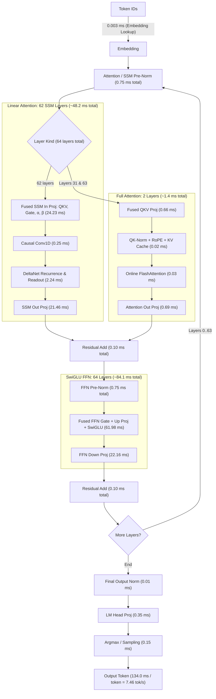

# Qwen3.8-27B BF16 on Strix Halo

Status: 2026-08-26. This page is the current performance snapshot, not an
optimization history.

## Model

| Field | Value |
| --- | --- |
| Repository | `unsloth/Qwen3.8-27B-GGUF` |
| Revision | `f1bfb127c64f7072bdd2cad55f258b9c8b2910fe` |
| Artifact | `BF16/Qwen3.8-27B-BF16-00001-of-00002.gguf` |
| Format | Split GGUF v3, BF16 weights |
| Size | 50.90 GiB across two shards |
| Parameters | 27.32 billion |
| Architecture | 64 layers, hidden 5120, FFN 17408 |
| Attention | 24 query heads, 4 KV heads, head dimension 256 |
| Context | 262,144 tokens |
| Vocabulary | 248,320 tokens |

The normal forward path excludes the separate MTP layer. The HIP runtime maps
the model shards read-only so the weights are not duplicated in unified
memory.

Download the pinned artifact on the target machine:

```sh
nix develop -c hf download unsloth/Qwen3.8-27B-GGUF \
  --include 'BF16/*' \
  --local-dir models/Qwen3.8-27B-GGUF \
  --max-workers 8
```

## Run

Build once and define the model path:

```sh
git add .
nix build

MODEL=models/Qwen3.8-27B-GGUF/BF16/Qwen3.8-27B-BF16-00001-of-00002.gguf
```

Measure Gufo prompt processing, shallow decode, and context depth:

```sh
./result/bin/gufo bench \
  --model "$MODEL" \
  --n-prompt 32,64,128,256,512,1024,2048,4096 \
  --n-gen 0 \
  --repetitions 3

./result/bin/gufo bench \
  --model "$MODEL" \
  --n-gen 8,128 \
  --repetitions 3

./result/bin/gufo bench \
  --model "$MODEL" \
  --n-prompt 2048 \
  --n-gen 128 \
  --n-depth 4096,8192,12288,16384 \
  --repetitions 1
```

Check the complete final-token vocabulary against sequential execution:

```sh
./result/bin/gufo bench \
  --model "$MODEL" \
  --validate-prefill 1024 \
  --n-prompt 1024 \
  --n-gen 0 \
  --repetitions 1
```

Run matching llama.cpp cases with the same GGUF:

```sh
llama-bench \
  --model "$MODEL" \
  --n-prompt 32,64,128,256,512,1024,2048,4096 \
  --n-gen 0 \
  --repetitions 3 \
  --n-gpu-layers 99 \
  --flash-attn auto \
  --batch-size 4096 \
  --ubatch-size 4096 \
  --threads 32 \
  --load-mode mmap

llama-bench \
  --model "$MODEL" \
  --n-prompt 0 \
  --n-gen 8,128 \
  --repetitions 3 \
  --n-gpu-layers 99 \
  --flash-attn auto \
  --batch-size 512 \
  --ubatch-size 512 \
  --threads 32 \
  --load-mode mmap

llama-bench \
  --model "$MODEL" \
  --n-prompt 2048 \
  --n-gen 128 \
  --n-depth 4096,8192,12288,16384 \
  --repetitions 1 \
  --n-gpu-layers 99 \
  --flash-attn auto \
  --batch-size 4096 \
  --ubatch-size 4096 \
  --threads 32 \
  --load-mode mmap
```

Use the same power mode, idle temperature range, model, and software revisions
for both engines. Long prompt sweeps heat the shared APU quickly, so alternate
engines or cool between cases instead of comparing two increasing-length
sweeps.

## Current Results

The comparison uses the BF16 model, mapped weights, ROCm 7.2.3, and llama.cpp
build 10173 at commit `e9fa078`.

### Shallow prompt and decode

| Test | Gufo HIP | llama.cpp ROCm | Gufo vs llama.cpp |
| --- | ---: | ---: | ---: |
| `pp32` | 79.28 +/- 0.14 tok/s | 74.90 +/- 1.18 tok/s | +5.8% |
| `pp64` | 148.49 +/- 0.31 tok/s | 111.40 +/- 1.36 tok/s | +33.3% |
| `pp128` | 210.37 +/- 0.08 tok/s | 221.03 +/- 2.05 tok/s | -4.8% |
| `pp256` | 262.34 +/- 0.29 tok/s | 242.99 +/- 1.00 tok/s | +8.0% |
| `pp512` | 350.99 +/- 1.19 tok/s | 390.96 +/- 0.85 tok/s | -10.2% |
| `pp1024` | 362.87 +/- 0.41 tok/s | 388.61 +/- 2.60 tok/s | -6.6% |
| `pp2048` | 349.68 +/- 0.18 tok/s | 334.04 +/- 0.93 tok/s | +4.7% |
| `pp4096` | 319.57 +/- 0.43 tok/s | 315.03 +/- 0.93 tok/s | +1.4% |
| `tg8` | 4.31 +/- 0.00 tok/s | 4.02 +/- 0.04 tok/s | +7.2% |
| `tg128` | 4.31 +/- 0.00 tok/s | 4.01 +/- 0.00 tok/s | +7.5% |

### Context depth

Prompt rows are the controlled comparison. Decode rows include the current
split-K route; the 12K decode point has not yet been rerun.

| Depth | Gufo `pp2048` | llama `pp2048` | llama / Gufo | Gufo `tg128` | llama `tg128` | llama / Gufo |
| ---: | ---: | ---: | ---: | ---: | ---: | ---: |
| 4K | 296.00 | 363.72 | 1.23x | 3.70 | 3.97 | 1.07x |
| 8K | 252.78 | 289.56 | 1.15x | 3.67 | 3.94 | 1.07x |
| 12K | 222.26 | 269.15 | 1.21x | not rerun | 3.93 | - |
| 16K | 198.66 | 266.82 | 1.34x | 3.60 | 3.94 | 1.09x |

The next standard depth run is `4K, 8K, 12K, 16K`. A 32K row is useful only
when investigating long-context scaling.

### Numerical quality

The batched path is compared with the sequential single-token path over the
complete final-token vocabulary.

| Prompt | Matching top-1 | RMSE | Cosine similarity |
| ---: | ---: | ---: | ---: |
| 128 tokens | 194 | 0.01156697 | 0.99999118 |
| 1024 tokens | 198 | 0.02007260 | 0.99997753 |

The acceptance contract is finite logits, identical top-1, and no material
regression from this numerical envelope.

### MTP and XDNA2

The separate Qwen3.8 MTP artifact is optional. The `mtp` route runs its
layer-64 draft graph on the GPU. The experimental `mtp-npu` route runs the
Q4_K `nextn.eh_proj` projection on all eight XDNA2 columns through a W4A8
backend view, then returns to the GPU for attention, FFN, logits, and target
verification.

```sh
MTP_MODEL=/path/to/mtp-Qwen3.8-27B-Q4_0.gguf

./result/bin/gufo bench --model "$MODEL" \
  --n-prompt 1 --n-gen 128 --repetitions 1

./result/bin/gufo bench --model "$MODEL" \
  --n-prompt 1 --n-gen 128 --repetitions 1 \
  --speculative mtp --mtp-model "$MTP_MODEL" --draft-tokens 2

./result/bin/gufo bench --model "$MODEL" \
  --n-prompt 1 --n-gen 128 --repetitions 1 \
  --speculative mtp-npu --mtp-model "$MTP_MODEL" --draft-tokens 2 --verbose
```

This is a same-build, single-repetition mode comparison under the current
ambient conditions; it does not replace the controlled shallow baseline above.

| Mode | `tg128` | Draft acceptance |
| --- | ---: | ---: |
| Autoregressive GPU (no MTP) | 3.73 tok/s | - |
| GPU MTP | 3.01 tok/s | 74.5% |
| GPU + XDNA2 MTP (`eh_proj` on NPU) | 3.00 tok/s | 74.5% |

The NPU projection matches the exact Q4_K CPU oracle with RMSE
`8.33e-7`, cosine `1.0`, and maximum error `6.20e-6`. After warmup, each
hybrid projection averages `1.20 ms` of NPU command time, plus `2.10 ms` for
the serialized GPU-to-host boundary and `0.06 ms` to return to the GPU.

This route proves real Q4_K MTP execution on XDNA2, but it is not a performance
win for single-request decode. It remains explicit and opt-in; autoregressive
GPU execution is the default.

### DFlash2 and batched MTP on the Unsloth Q8 target

The speculative results below use the single-file Unsloth target and the
official DFlash2 topology:

```sh
nix develop -c hf download unsloth/Qwen3.8-27B-GGUF \
  Qwen3.8-27B-UD-Q8_K_XL.gguf \
  --repo-type model \
  --local-dir models/Qwen3.8-27B-GGUF

nix develop -c hf download z-lab/Qwen3.8-27B-DFlash2-GGUF \
  Qwen3.8-27B-DFlash2-Q8_0.gguf \
  --repo-type model \
  --local-dir models/Qwen3.8-27B-DFlash2-GGUF
```

The implementation validates and executes the official five-layer DFlash2
graph: target taps `5/19/33/47/61`, block size 8, 2,048-token attention
window, grouped dynamic attention/MLP convolution, and the top-16 rank-256
path selector. Q8_0 draft matrices stay quantized on the GPU.

Use the shared corpus runner for matched greedy output and throughput:

```sh
TARGET=models/Qwen3.8-27B-GGUF/Qwen3.8-27B-UD-Q8_K_XL.gguf
DFLASH=models/Qwen3.8-27B-DFlash2-GGUF/Qwen3.8-27B-DFlash2-Q8_0.gguf
MTP_MODEL=/path/to/mtp-Qwen3.8-27B-Q4_0.gguf

nix develop -c python3 tools/quant/speculative-corpus.py \
  --binary ./result/bin/gufo \
  --model "$TARGET" \
  --draft-model "$DFLASH" \
  --backend dflash2

nix develop -c python3 tools/quant/speculative-corpus.py \
  --binary ./result/bin/gufo \
  --model "$TARGET" \
  --draft-model "$MTP_MODEL" \
  --backend mtp
```

The 10-prompt suite has hash `59321d75dbd1` and covers explanatory prose,
code, reasoning, summarization, Italian and Chinese, structured JSON,
creative text, repetition, and instruction following. Each row generates 32
tokens greedily. Speculative output must match the autoregressive completion
exactly.

| Backend | Exact prompts | AR | Speculative | Speedup | Median speedup | Acceptance |
| --- | ---: | ---: | ---: | ---: | ---: | ---: |
| DFlash2 Q8_0 | 10/10 | 6.68 tok/s | 18.22 tok/s | 2.73x | 2.74x | 45.0% |
| MTP Q4_0 | 10/10 | 6.67 tok/s | 9.88 tok/s | 1.48x | 1.48x | 47.9% |

All rows use the production defaults: fixed width 7 for DFlash-2 and rolling
width for MTP (see `opt-c191-fixed-width`).

| Suite | Tokens | Exact | AR | Speculative | Speedup | Median |
| --- | ---: | ---: | ---: | ---: | ---: | ---: |
| rapid (3 cases) | 128 | 3/3 | 7.00 | **21.20** | **3.03x** | 3.19x |
| stress (3 cases) | 300 | 3/3 | 7.03 | **21.28** | **3.03x** | 3.29x |
| full corpus (10 cases) | 32 | 10/10 | 6.68 | 18.22 | 2.73x | 2.74x |
| full corpus (10 cases) | 128 | 10/10 | 7.00 | 18.64 | 2.66x | 2.67x |

Per category, tok/s against a 6.68 (32-token) / 7.00 (128-token) autoregressive
baseline:

| Category | 32-tok | 128-tok | Speedup 32 / 128 | Accept @128 |
| --- | ---: | ---: | ---: | ---: |
| repetitive | 27.47 | **38.58** | 4.11x / **5.50x** | 96.6% |
| reasoning | 16.45 | **26.25** | 2.47x / **3.75x** | 60.0% |
| code | 20.51 | **22.34** | 3.08x / **3.19x** | 48.3% |
| multilingual (Italian) | 23.43 | 19.46 | **3.51x** / 2.78x | 39.1% |
| summarization | 18.30 | 19.19 | 2.74x / 2.85x | 44.4% |
| structured | 16.82 | 17.95 | 2.52x / 2.56x | 36.3% |
| expository | 20.63 | 17.04 | **3.09x** / 2.43x | 33.7% |
| multilingual (Chinese) | 16.76 | 15.96 | 2.51x / 2.28x | 29.3% |
| creative | 18.28 | 15.90 | 2.74x / 2.27x | 28.9% |
| instruction | 12.08 | 12.02 | 1.81x / 1.72x | 18.4% |
| **aggregate** | **18.22** | **18.64** | **2.73x / 2.66x** | 37.6% |

The spread is now entirely acceptance, not engine speed. A verification chunk
costs **151.7 ms against a 143 ms autoregressive token -- 1.06x** -- so the
verifier is within 6% of the floor set by reading the weights once, and speedup
is just how many drafted tokens survive. Every category beats autoregressive
decode, and the slowest one is the one that accepts 18% of its drafts. Per-prompt
speedup at the two lengths moves in opposite directions (reasoning 2.47x ->
3.75x, expository 3.09x -> 2.43x) because acceptance is a property of the text
being generated, so a short window only samples its opening; neither column alone
is representative.

Step budget at width 8, from `GUFO_SPEC_TIMING`: 177.8 ms total, of which
verification 151.7, drafting 21.1, checkpoint 2.9, and rollback 2.1.

Draft-length controllers, rapid suite at 128 tokens, all exact 3/3:

| Policy | Speculative | Speedup | Median | Acceptance | Average draft | Accepted per step |
| --- | ---: | ---: | ---: | ---: | ---: | ---: |
| **fixed 7** (`auto`) | **20.40 tok/s** | **2.91x** | **3.08x** | 45.3% | 7.00 | **4.17** |
| rolling 1-7 | 19.52 tok/s | 2.79x | 2.86x | 54.7% | 5.11 | 3.79 |
| rolling 3-7 | 19.52 tok/s | 2.79x | 2.86x | 54.7% | 5.11 | 3.79 |
| accepted-EMA 3-7 | 18.72 tok/s | 2.67x | 2.71x | 64.8% | 4.04 | 3.62 |

Read the last two columns together: the adaptive controllers win on acceptance
*rate* and lose on throughput, because what a step emits is `draft x acceptance`
and they shrink the draft faster than they raise the rate. They were the right
answer when a wider batch cost proportionally more to verify; now that it does
not, always drafting the block maximum wins. Both the 300-token stress suite and
the 10-case corpus agree (corpus at 128 tokens: 18.64 tok/s fixed against 16.40
rolling).

#### Draft width and policy on DFlash-2

The controller table above says which policy wins but not why, so the underlying
width curve is measured directly here. `json_schedule` at 128 tokens, greedy,
exact against autoregressive in every arm, widths run interleaved so thermal
drift is spread across them rather than biasing the last arm:

| Fixed width | Acceptance | Accepted per step | Emitted per step | Speculative |
| ---: | ---: | ---: | ---: | ---: |
| 2 | 69.8% | 1.40 | 2.40 | 14.08 tok/s |
| 3 | 65.9% | 1.98 | 2.98 | 16.94 tok/s |
| 4 | 57.7% | 2.31 | 3.31 | **18.36 tok/s** |
| 5 | 46.7% | 2.34 | 3.34 | 17.73 tok/s |
| 6 | 40.8% | 2.45 | 3.45 | 17.75 tok/s |
| 7 | 36.3% | 2.54 | 3.54 | 17.95 tok/s |

Two properties of this drafter follow, and together they decide the default.
Accepted tokens per step increase monotonically with width -- the block drafter
never degrades enough that a narrower block accepts *more* -- so no controller
can find a width that emits more than the ceiling does. And throughput over
widths 4..7 is a plateau inside the 2% run-to-run band, so the reward for
picking width correctly is smaller than the measurement noise while the penalty
for picking low is not: below width 4 the drafter's fixed per-step cost stops
being amortized and width 2 gives up 22%.

Ported the upstream `--spec-draft-adaptive` controller (`LaurentZuijdwijk/llama.cpp`
`ca26169`) to check the reported ~32% structured-output gain. Full corpus at 128
tokens, 10/10 exact in both arms:

| Policy | Aggregate | Speedup | Acceptance | Average draft |
| --- | ---: | ---: | ---: | ---: |
| **fixed 7** (`auto`) | **18.63 tok/s** | **2.66x** | 37.6% | 7.00 |
| accepted-EMA + headroom | 17.85 tok/s | 2.55x | 50.7% | 4.53 |

The gain does not reproduce, and the per-case split shows why: structured
`+2.4%` and repetitive `+0.6%` against code `-10.6%` and reasoning `-10.5%`.
Prompts that accept deeply are exactly the ones a controller trimming toward the
mean accepted count hurts most. Upstream's own fixed-width arms agree with ours
within noise (their width 3 and width 7 land at 2.61x and 2.56x against our
2.42x and 2.56x); only their adaptive arm diverges, and it is inconsistent with
their own fixed-arm acceptance data, since choosing a width cannot raise
acceptance at that width above what the fixed arm measures there. Their README
also records the same configuration moving 65.6 to 55.0 tok/s on power state
alone, a 19% swing wider than the effect claimed.

Because the accepted-token EMA targets the *mean* acceptance depth, it
systematically under-drafts a nearly free batch tail; `draft_headroom_tokens`
(default 2) offsets the width above that mean so the upper tail of the
acceptance distribution stays covered. On structured output this moves the
opt-in `accepted-ema` policy from 16.78 to 18.38 tok/s, and it removes the
regression on repetitive text by letting the EMA saturate at the ceiling, where
the policy degenerates to fixed width. It is not enough to overtake `fixed`, so
`auto` still resolves to fixed width 7 for DFlash-2.

Extending past one block was considered and rejected. Only `repetition_sequence`
is clipped by the drafter's `block_size - 1` ceiling of 7, accepting 96.6% of
seven drafted tokens and 100% once a controller narrows it. It is a synthetic
pattern-continuation prompt and no representative class approaches it -- the
next deepest, reasoning, accepts 4.2 of 7 and has ceiling to spare. Chaining a
second DFlash block would need the draft path to build K/V for unverified draft
tokens from draft hidden states rather than target features, and would pay a
second draft pass on every step to benefit one unrepresentative prompt.

Neither direction moves the aggregate, so DFlash-2 throughput is not left in the
draft width. The step budget above locates it instead: verification is 151.7 ms
of a 177.8 ms step, so the remaining wins are in the target verification chunk
and, at depth, in the draft attention and injection costs noted below.

Two measured follow-ups remain, both in the draft graph and both only visible at
depth. At a 4,096-token context the draft's non-causal attention is **16.26 ms
per block**, against 0.34 ms at a 128-token context, which makes it the largest
draft stage at depth: it reads an FP32 draft K/V cache with one thread walking `head_dim`
contiguous floats, so consecutive lanes are `kv_dim` apart and every 4-byte read
pulls a full line, and all 32 query heads re-read the same 8 K/V heads. An FP16
cache with a coalesced mapping addresses both. Separately, priming a
4,096-token context costs 850 ms of injection because the injection GEMM feeds
the shared small-batch kernels in chunks of 8 tokens and therefore streams the
encoder and K/V matrices once per chunk; a tiled route for wide injection would
remove it. Neither affects the corpus numbers above, and both are far better
than the per-token weight re-read they replaced.

Synthetic context-depth results are listed separately because their repeated
token stream can drive acceptance to 100% and is not representative of the
corpus:

| Depth | AR `tg16` | DFlash2 `tg16` | Speedup | Acceptance |
| ---: | ---: | ---: | ---: | ---: |
| 0 | 7.15 | 5.11 | 0.71x | 19.4% |
| 4K | 7.02 | 11.02 | 1.57x | 32.4% |
| 8K | 6.90 | 21.45 | 3.11x | 100.0% |
| 16K | 6.67 | 16.47 | 2.47x | 100.0% |

The 16K DFlash2 result remains well above AR, so the 2,048-token draft window
and target verifier do not introduce a large-context throughput collapse. An
isolated cold-process 16K run on the final build reports 9.13 tok/s at 100%
acceptance; the difference from the 16.47 tok/s sweep result is hipBLASLt plan
warmup from the preceding 4K/8K cases.

Offline tuning of the DFlash2 BF16 output head and injected K/V shapes found
an 11% isolated head improvement and a 2.1-2.2x K/V improvement at batches
1-8. The full corpus moved only from 12.48 to 12.51 tok/s, so these plans
remain optional rather than becoming a production dependency. This experiment
also exposed unsafe cross-process memcpy replay when one plan database held
multiple hipBLASLt algorithm IDs; runtime replay now reconstructs every opaque
descriptor from its stable solution index before validating and using it.


### Unsloth UD-Q4_K_XL target (`opt-q4kxl`)

`models/Qwen3.8-27B-UD-Q4_K_XL.gguf` (16.35 GiB against the Q8_K_XL artifact's
26.12 GiB) is a *mixed* low-bit shard, not a single format. By element count:

| Format | Elements | Share | Where |
| --- | --- | --- | --- |
| Q5_K | 11.53G | 42% | ffn_down/up, ssm_out, attn_gate |
| IQ4_XS | 5.88G | 22% | ffn_gate, ffn_up |
| Q4_K | 5.44G | 20% | token_embd, attn_qkv |
| Q6_K | 3.49G | 13% | output.weight, attn_output |
| IQ4_NL / Q3_K / IQ3_S / Q8_0 | 0.98G | 3% | scattered |

All seven quantizations are decoded in-kernel from their packed form. The
Q8_K_XL loader's pre-dequantize-to-BF16 route is disabled for shards like this
(`GUFO_QUANT_NATIVE_KQUANT` overrides): Q5_K and Q6_K alone are 15.0G elements,
so expanding them would cost 30 GB and give back every byte Q4 was chosen to
save. The loader picks the native route automatically when the shard contains a
format with no BF16 pre-dequant path.

Measured on this host in matched, interleaved sessions:

| Metric | Q8_K_XL | UD-Q4_K_XL | Q4 vs Q8 |
| --- | ---: | ---: | ---: |
| Target artifact size | 26.12 GiB | 16.35 GiB | **0.63x (-37.4%)** |
| DFlash2 companion size | 3.85 GB (Q8_0) | 1.14 GB (Q4_K_M) | **0.30x (-70.4%)** |
| `pp2048` | 557.3 t/s | 474.0 t/s | 0.85x (-14.9%) |
| `tg128` (no draft) | 6.89 t/s | 11.59 t/s | **1.68x (+68.2%)** |
| `tg128-dflash2` | 19.4-27.3 t/s | 18.2-18.4 t/s | 0.67-0.94x |
| Validation top-1, 1024 tokens | 198 | 198 | Match |
| Validation RMSE, 1024 tokens | 0.02007260 | 0.09512630 | 4.74x higher |
| Validation cosine, 1024 tokens | 0.99997753 | 0.99946874 | -0.00050879 |

The `pp2048` row was re-measured on an idle host after `opt-c192` (medians of
three interleaved repetitions each). The 505.8 / 460.2 pair it replaces was taken
at host load 1.25-1.77, which cost the Q8 column about 8% and is worth
remembering the next time a number looks like a regression: see "Q8 prefill
across the Q4 support work" below. tg128 is still the earlier five-repetition
median. The dflash2 row is
reported as a range on purpose: the Q4 target is remarkably stable across every
run (18.2-18.4 over more than a dozen samples) while the Q8 target ranges
14.8-27.5. Speculative throughput depends on how many drafted tokens a
particular continuation gets accepted, and the two targets emit different token
streams, so a single dflash2 number for either model would be misleading. Take
the unspeculated tg128 column as the load-bearing decode comparison.

Prefill validation at 1024 tokens: top-1 matches the sequential reference
(198), logits finite, rmse `0.09512630`, cosine `0.99946874`. The envelope is
wider than the Q8 artifact's `0.02007260` / `0.99997753` because the underlying
weights are coarser, not because the batched path diverges -- top-1 is exact.

**Why Q4 wins decode and loses the batched regimes.** Single-token decode is
DRAM bound: 17.5 GB of weights per token against 28.0 GB, and the 1.60x traffic
reduction converts almost fully into throughput. Prefill and draft verification
are arithmetic bound, and a K-quant costs more ALU per weight byte than Q8_0
does -- an ISA dump of the blocked GEMM puts Q4_K/Q5_K at 3413/3467
instructions against the Q8_0 kernel's 3049, and the Q4_K/Q5_K offset term
(`w = scale*q - offset`, needing `sum(x)` per token per block) accounts for
roughly 250 of the difference. Fewer bytes stops paying once the bytes are no
longer the constraint. The per-stage prefill rollup (`GUFO_PROFILE`, B=2048)
localizes the whole gap to the GEMMs: FFN 2838 ms vs 2603, input projection
1012 vs 895, ssm_out 238 vs 212, with norms, recurrence and attention equal.

The single largest decode win came from routing Q5_K and Q6_K -- 55% of the
shard -- off the pre-existing per-element `Q5KValue`/`Q6KValue` path and onto
the word-wide sub-block decoder: tg128 8.24 -> 11.63 in one change.

### Q8 prefill across the Q4 support work

The Q8 numbers recorded during `opt-q4kxl` (`pp2048` 497-507) sit well below the
545-558 recorded before it, which reads like a regression introduced by adding
the Q4 route. It is not one. Measured by building both revisions and alternating
them in one session -- `36491c2`, the last commit before the Q4 work, against
`bdec37d` -- on the UD-Q8_K_XL artifact, two interleaved rounds with the *base*
arm first (the cooler slot) each round:

| test | `36491c2` (pre-Q4) | `bdec37d` (main) |
| --- | ---: | ---: |
| `pp512` | 550.29 / 547.63 | 547.83 / 546.56 |
| `pp2048` | 554.42 / 546.74 | 545.22 / 544.48 |

That is -0.3% and -1.0% of median, inside the +/-3.5 t/s band this page's own
measurement rule warns about, and the very first (coldest) run of the session was
main at `pp2048` 557.25. The 497-507 figures were taken at host load 1.25-1.77.

The structural reason there is no coupling: **UD-Q8_K_XL contains no K-quant at
all.** By bytes it is Q8_0 26,293 MB (84%), BF16 5,143 MB (16%), F32 11 MB. Every
`opt-q4kxl` gate that widened from `type == kQ8_0` to "reads the tiled Q8_1
activation" therefore evaluates identically on this shard, and the loader's
`native_kquant` decision -- which `9008a5e` flipped to always-on so the
speculative verifier reproduces decode -- has no Q5_K/Q6_K/Q8_K tensor to act on.
The two targets share the routing decisions but not a single kernel instantiation
on the prefill path.

### Where Q8 prefill time actually goes

Per prefill pass at batch 2048, from `tools/prof/prof.py` with the per-shape
rollup (the profile also contains one decode pass; the single-token-block
dispatches are subtracted). Achieved rate is against the 55.07 TOPS/TFLOPS WMMA
ceiling, which is the same for INT8 and BF16 on this part:

| GEMM | m | k | calls/pass | mean | achieved | % of peak |
| --- | ---: | ---: | ---: | ---: | ---: | ---: |
| `ffn_gate`, `ffn_up` (Q8_0) | 17408 | 5120 | 128 | 11.53 ms | 31.7 TOPS | 58% |
| `ffn_down` (Q8_0) | 5120 | 17408 | 64 | ~11.5 ms | ~31.7 TOPS | 58% |
| `ssm_qkv` (Q8_0) | 10240 | 5120 | 48 | 6.63 ms | 32.4 TOPS | 59% |
| `ssm_gate` (Q8_0) | 6144 | 5120 | 48 | 4.16 ms | 30.9 TOPS | 56% |
| `attn_output` / `ssm_out` (Q8_0) | 5120 | 5120 | 64 | ~3.9 ms | ~27.5 TOPS | 50% |
| **`attn_q` (BF16, hipBLASLt)** | **12288** | **5120** | **16** | **11.36 ms** | **22.7 TFLOPS** | **41%** |
| `attn_k`, `attn_v` (BF16, hipBLASLt) | 1024 | 5120 | 32 | 0.86 ms | 24.9 TFLOPS | 45% |

`attn_q` is the one shape not at the blocked kernel's plateau. It is 4.9% of a
prefill pass at 41% of peak, so moving it to a hand-written blocked BF16 tile at
the W8A8 kernel's 58% is worth about 1.4% of prefill, and requantizing the BF16
attention projections to Q8_0 at load would be worth about 2% counting the norm
fusion it unlocks -- but that is a precision change on the tensors Unsloth
deliberately left at BF16, so it needs a quality decision rather than a
measurement. This supersedes the 48-57% figure the `opt-c172-bf16-gemm-ceiling`
entry assumed.

For the ceiling: `pp2048` cannot exceed 1338 t/s on this part, and the blocked
W8A8 GEMM is 80-82% of a pass at 56-59% of the WMMA ceiling. **600 t/s needs that
kernel at about 68% of peak.** The `-epi` ablation, which deletes the whole
epilogue and is therefore an upper bound on any exact reformulation of it,
reaches 64%. So 600 is not reachable by epilogue work; it needs either a
different instruction mix in the WMMA loop or the coarser activation scale
(`opt-c163-coarse-dx`), which is a real precision change.

### DFlash-2 with the Q4_K_M companion

`z-lab/Qwen3.8-27B-DFlash2-GGUF : Qwen3.8-27B-DFlash2-Q4_K_M.gguf` (1.14 GB) is
supported alongside the Q8_0 companion. Draft matrices stay packed rather than
being expanded to BF16 (1.14 GB against 3.85 GB), since the draft graph re-reads
them on every speculation step.

| Target + draft | tg128-dflash2 |
| --- | --- |
| Q8_K_XL + DFlash2 Q8_0 | 19.4-27.3 t/s |
| UD-Q4_K_XL + DFlash2 Q4_K_M | 18.2-18.4 t/s |
| UD-Q4_K_XL + DFlash2 Q8_0 | 14.4 t/s |

The Q4 companion beats the Q8 companion on a Q4 target, as expected from draft
bandwidth. Two defects had to be fixed before any of this ran: packed non-Q8_0
draft weights reached a dense GEMM that reinterprets their bytes as F32 (GPU
memory fault), and K-quant projections at draft width fell to a per-token GEMV
that re-reads the whole weight matrix per token (1.32 t/s). Draft-width
verification now uses `SmallBatchKQuantExactFp32GEMMKernel`, which is bit-exact
with the single-token decode GEMV at every width from 1 to 8 -- verified in
`qwen_q4kxl_quant_ops_test`, since a drafted token may only be accepted if the
verifier reproduces exactly what the unspeculated decode would have emitted.

The exact verifier was subsequently tuned on gfx1151 by changing how many
output rows share each wave's staged activation tile. The production selector
uses three rows per wave for Q4_K, Q5_K, Q3_K and the IQ formats, but leaves
Q6_K on the two-row reference: Q6_K's extra per-half scale state spills 12
private bytes/lane at three rows. `GUFO_KQUANT_SMALL_BATCH_ROWS=2` pins the
reference and `=4` keeps the rejected four-row route measurable.

All end-to-end rows below are four interleaved, single-repetition `tg128`
DFlash-2 samples with fixed draft width 7. The target and companion SHA-256
hashes are `3f227079...b01e` and `1a25c568...1ebd` respectively.

| Verifier geometry | Raw `tg128-dflash2` (tok/s) | Median | Kernel/profile result | Decision |
| --- | --- | ---: | --- | --- |
| Two rows (reference) | 18.26, 18.31, 18.23, 18.22 | 18.245 | Width-8 K-quant kernel family 2827.46 ms in the baseline trace | Reference |
| Four rows | 18.23, 17.44, 18.23, 18.24 | 18.23 | Width 8 improved only 0.57%; width 7 regressed 26.6% (113.82 -> 144.08 ms) | Rejected: no end-to-end gain |
| Three rows for every format | 18.67, 18.66, 18.62, 18.65 | 18.655 | +2.08%, but batch-8 Q6_K spilled 12 private bytes/lane | Rejected: violates the no-scratch contract |
| **Three rows, Q6_K on two** | **18.77, 18.78, 18.74, 18.75** | **18.76** | **+2.82%; traced kernel sum 4461.39 -> 4369.00 ms** | **Retained** |

The active batch-8 three-row specializations use 128 SGPR, 128-144 VGPR,
21,504 bytes LDS, zero private bytes and the ten-wave launch bound; the Q6_K
two-row fallback uses 128 VGPR, the same LDS, and zero private bytes. The
candidate's width-8 work splits into 2445.77 ms on three rows plus 301.57 ms on
Q6_K's two rows, 2.84% below the all-two-row baseline. Final production sanity
measured `pp2048` 465.33 tok/s (inside the 463.63-469.04 baseline range) and
`tg128-dflash2` 18.73 tok/s. Full-logit validation remained top-1 198, RMSE
`0.09512630`, cosine `0.99946874`.

The retained HTTP route also passed `gufo eval --questions 8 --greedy` against
the pinned DS4 fixture with **8 passed, 0 failed, 0 execution errors**. Every
request exercised DFlash-2 (40.8-75.3% draft acceptance in server telemetry),
so this is a behavioral validation of the speculative path rather than only a
model-load smoke test.

### Which DFlash-2 companion per target (`opt-dflash2-companion`)

Three DFlash-2 companions ship for this checkpoint -- Q4_K_M (1.14 GB on disk,
1.58 GB packed), Q8_0 (2.06 GB / 2.34 GB) and BF16 (3.86 GB / 3.85 GB) -- and
the question is which one each target quantization should use, on throughput
and on draft acceptance.

**Measure it chat-framed and at a realistic length.** The operating point moves
the answer more than the companion does. Same target, companion and prompt
(`cpp_ring_buffer`), on a quiet host:

| Framing | Tokens | Speculative tok/s | Acceptance |
| --- | ---: | ---: | ---: |
| raw | 128 | 24.66 | 53.4% |
| chat | 128 | 27.41 | 63.7% |
| chat | 512 | **33.53** | **77.0%** |

Autoregressive decode is 11.24 tok/s under either framing, so the last row is a
2.98x speedup. A raw prompt puts the model outside the instruction distribution
it was tuned on, and a short generation is dominated by the opening tokens of an
answer, which are its least predictable part. `speculative-corpus.py
--prompt-mode auto` resolves to `raw` for Qwen, so the two must be requested
explicitly; `tools/quant/dflash-matrix.sh` now defaults to `chat` at 512 tokens.

Acceptance is also strongly content-dependent and no single number describes it.
On UD-Q4_K_XL with the Q4_K_M companion, per case: reasoning 79.2%, code 77.0%,
repetition 71.4%, summarization 53.1%, structured 51.2%, expository 31.6%,
Italian 28.6%, creative 21.6%, Chinese 19.4%. The token-weighted corpus
aggregate sits far below the median case because the low-acceptance prompts are
also the ones that generate the most tokens.

`tools/quant/dflash-matrix.sh` drives the 2x3 grid. The autoregressive reference
depends only on the binary, target shard, framing, decode length and prompt, so
it is measured once per target and shared across companions through
`--ar-cache`, and companion order is reversed on the second repetition so
thermal drift does not bias the last arm. Two repetitions, chat-framed, 512
tokens, fixed draft width 7, with the load path and verifier fixes below in
place -- every arm now reproduces greedy output:

| Target | Companion | Packed draft | Exact | AR | Speculative | Speedup | Median case | Acceptance |
| --- | --- | ---: | ---: | ---: | ---: | ---: | ---: | ---: |
| UD-Q8_K_L | **Q4_K_M** | 1.58 GB | 10/10 | 7.26 | **19.76** | **2.72x** | 19.12 | 40.1% |
| UD-Q8_K_L | Q8_0 | 2.34 GB | 10/10 | 7.26 | 19.42 | 2.68x | 19.72 | 40.1% |
| UD-Q8_K_L | BF16 | 3.85 GB | 10/10 | 7.26 | 18.40 | 2.53x | 18.22 | 40.3% |
| UD-Q4_K_XL | **Q4_K_M** | 1.58 GB | 10/10 | 11.14 | **18.79** | **1.69x** | 18.61 | 38.2% |
| UD-Q4_K_XL | Q8_0 | 2.34 GB | 10/10 | 11.14 | 18.23 | 1.64x | 17.36 | 38.5% |
| UD-Q4_K_XL | BF16 | 3.85 GB | 10/10 | 11.14 | 17.26 | 1.55x | 16.14 | 38.6% |

The three-prompt adaptive corpus agrees on both targets:

| Target | Q4_K_M | Q8_0 | BF16 |
| --- | ---: | ---: | ---: |
| UD-Q8_K_L | **20.02** (40.2%) | 20.01 (40.4%) | 18.55 (40.4%) |
| UD-Q4_K_XL | **21.66** (43.8%) | 21.05 (43.7%) | 18.98 (43.7%) |

**Use Q4_K_M on both targets.** It is first on both corpora and both targets,
and acceptance does not depend on the companion's own quantization -- 38.2-40.4%
across all six main-corpus arms, with the spread inside a target under 0.4
points. The target sets acceptance; the companion only sets the bytes the draft
graph re-reads per speculation step, and throughput follows those bytes
monotonically everywhere. BF16 is the clear rejection: last on every target and
corpus, -6.9% against Q4_K_M on Q8 and -8.1% on Q4, for 2.44x the draft
bandwidth and no acceptance gain. Q4_K_M's margin over Q8_0 is small (+1.8% on
Q8, +3.1% on Q4) but consistent, and it is also the smallest artifact.

An earlier revision of this table, measured before the load-path fix, put Q8_0
ahead on the Q8 target. That ordering was an artifact: the Q8 arms were 0/10
exact then, so each companion was being scored against a token stream the
verifier was not reproducing.

Measure this chat-framed and at a realistic length. Same target, companion and
prompt: raw at 128 tokens reads 24.66 tok/s at 53.4% acceptance, chat at 128
reads 27.41 at 63.7%, chat at 512 reads 33.53 at 77.0%.
`speculative-corpus.py --prompt-mode auto` resolves to `raw` for Qwen, so the
difference has to be asked for explicitly. Acceptance is also strongly
content-dependent: on UD-Q4_K_XL with the Q4_K_M companion, reasoning 79.2%,
code 77.0%, repetition 71.4%, summarization 53.1%, structured 51.2%, expository
31.6%, Italian 28.6%, creative 21.6%, Chinese 19.4%. The token-weighted corpus
aggregate sits below the median case because the low-acceptance prompts generate
the most tokens.

#### Why the Q8 target did not reproduce greedy output (`opt-dflash2-q8-exact`)

Every UD-Q8_K_L arm used to be 0/10 exact while every UD-Q4_K_XL arm was 10/10,
across all three companions -- a target property rather than a companion one.
`GUFO_SPEC_BATCH_VERIFY=0` reproduced autoregressive output bit for bit at 4.56
tok/s (0.77x of unspeculated decode), so the batched verification chunk was the
divergent side.

The cause was not in the verifier at all. `CreateFromGguf` dequantized Q6_K,
Q5_K and Q8_K projections to device BF16 at load unless the shard also carried a
format with no BF16 route at all (Q4_K, Q3_K, IQ4_NL, IQ4_XS, IQ3_S).
UD-Q4_K_XL carries those, so nothing was converted and it stayed on the packed
K-quant kernels, which `qwen_q4kxl_quant_ops_test` proves bit-exact against the
decode GEMV. UD-Q8_K_L carries only Q8_0, Q6_K and Q5_K, so its Q6_K/Q5_K
projections became **BF16 at runtime** even though the file contains no BF16 --
and the BF16 projection route's batched spelling,
`LaunchExactBf16GEMMFp32SmallBatch`, does not reproduce the dense BF16 GEMV that
single-token decode uses.

That is why the divergence was invisible to every kernel-level test: the seams
being compared were the quantized ones, and the shard was not running them.
A bit-exact per-layer trace put the first disagreement at layer 1, one ulp in
the residual sum, amplified to 12% by layer 2 -- and layers 1, 4, 10, 13, 20,
23, 27 and 32 are exactly the layers whose `ffn_down` the loader had converted.

Q6_K, Q5_K and Q8_K have had in-kernel decoders since `opt-q4kxl`, so the
conversion is now pure downside and the default is to keep them packed:

| | Dequantized to BF16 | Packed (now default) |
| --- | ---: | ---: |
| Exact prompts, UD-Q8_K_L | 0/10 | **10/10** |
| `tg128`, six interleaved pairs, median | 5.77 | **6.68** (+15.8%) |
| Corpus autoregressive | 6.08 tok/s | 6.68 tok/s |
| Extra device memory | ~3 GB of BF16 copies | none |

Raw `tg128` pairs: dequantized 5.65 / 4.44 / 5.89 / 6.29 / 4.33 / 6.28, packed
5.39 / 5.50 / 6.83 / 6.94 / 6.99 / 6.53 -- packed wins five of six, and the
spread is wide because each sample reloads the 28 GB shard.

UD-Q4_K_XL is untouched: it never took the conversion path, which is precisely
why it was the clean control throughout. `GUFO_QUANT_NATIVE_KQUANT=0` restores
the dequantizing behaviour.

**This changes autoregressive output on shards that previously converted.** The
packed decode is a different but equally valid fp32 path, and it is the one the
verifier can reproduce; on UD-Q8_K_L a 48-token greedy completion moves from
`6084379b8387575a98a1112e46527a90` to `1ca48448a2eedbc663abc125927cce79`. Any
fixture pinned to the old bytes moves with it.

### What actually caps speculative throughput (`opt-dflash2-verify-marginal`)

At the realistic operating point the drafter is not the bottleneck and neither
is draft bandwidth. UD-Q4_K_XL + DFlash2-Q4_K_M, chat-framed, 512 tokens,
acceptance 0.7696 over 80 steps, `GUFO_SPEC_TIMING=1`:

| Phase | ms/step | Share |
| --- | ---: | ---: |
| verify chunk | 158.25 | 85.6% |
| propose (draft) | 23.48 | 12.7% |
| save state | 2.06 | 1.1% |
| rollback | 1.10 | 0.6% |
| draft hidden | 0.03 | - |

`GUFO_DFLASH_TIMING=1` shows the draft itself is at roofline -- gemm 12.50 ms
for 1.58 GB (126 GB/s), lm head 6.23 ms for 822 MB (132 GB/s), attention 0.64,
norm+conv 1.18, selector 0.69, embed 0.08, download 0.01 -- so the 12.7% it
occupies is close to irreducible, and it is also why the companion's format
barely moves the total.

Verification does not amortize the way the weight-stationary argument suggests.
Sweeping the fixed draft width at 256 tokens:

| Verify batch | 2 | 3 | 4 | 5 | 6 | 7 | 8 |
| --- | ---: | ---: | ---: | ---: | ---: | ---: | ---: |
| verify chunk (ms) | 101.5 | 109.2 | 117.2 | 123.7 | 131.6 | 143.4 | 152.3 |
| end-to-end tok/s | 16.33 | 21.99 | 25.22 | 28.85 | 31.08 | 31.48 | 30.92 |

That is **86 ms fixed plus 8.3 ms per verified row**, extrapolating to ~93 ms at
batch 1 against the 89 ms an autoregressive token costs. The target weights are
read once whatever the batch, so the marginal is arithmetic, not traffic.

`GUFO_VERIFY_TIMING=1` locates it. The Q8 shard is shown beside it, but as a
comparison it is confounded -- its FFN is Q8_0 and runs a different kernel -- so
it suggests where to look rather than settling anything:

| Stage | Q4 b2 | Q4 b8 | Q4 per row | Q8 b2 | Q8 b8 | Q8 per row |
| --- | ---: | ---: | ---: | ---: | ---: | ---: |
| ffn | 60.53 | 84.49 | **4.00** | 90.14 | 94.07 | **0.66** |
| projections | 20.30 | 30.87 | 1.76 | 40.20 | 35.92 | -0.71 |
| attention | 5.07 | 11.83 | 1.13 | 5.65 | 11.68 | 1.01 |
| ssm recur | 3.17 | 8.18 | 0.84 | 3.28 | 7.99 | 0.79 |
| lm head | 5.04 | 6.79 | 0.29 | 6.18 | 21.34 | 2.53 |
| total | 94.10 | 142.17 | 8.01 | 145.44 | 171.01 | 4.26 |

Attention and the recurrence scale identically on both shards (1.13 against
1.01, 0.84 against 0.79), so the hybrid's sequential state update is **not**
what caps the batch -- it is 10% of the marginal. The FFN is, at half of it.

#### Rejected: the minimum correction as the cause

The obvious reading of the table is that the Q4_K/Q5_K per-(row, K-block)
minimum correction is the marginal, since that is the arithmetic Q8_0 does not
do. It is not. `GUFO_KQUANT_SMALL_BATCH_OFFSET=drop-probe` adds the same probe
to `SmallBatchKQuantExactFp32GEMMKernel` that
`GUFO_KQUANT_PREFILL_TILE=drop-offset-probe` gives the blocked kernel: it
deletes the term, which makes the result **wrong** (`w = scale*q - offset` is
not `scale*q`) and exists only to bound what an exact cheaper formulation could
buy. Three interleaved pairs at width 7:

| Arm | FFN ms/chunk | Verify total ms/chunk |
| --- | --- | --- |
| exact | 84.47 / 84.46 / 84.60 | 142.20 / 142.15 / 142.38 |
| offset dropped | 81.52 / 81.56 / 81.51 | 137.83 / 137.83 / 137.79 |

**2.95 ms of 84.5, 3.5%** -- roughly 0.5 ms of the 4.00 ms/row marginal. The
correction is worth chasing for prefill, where `opt-q4kxl-probe` bounds it at
+8.6% of `pp2048`, but it is not what caps speculation. End-to-end throughput
under the probe collapses to 5.67 tok/s because the completion is garbage and
acceptance goes to zero, which is why only the per-chunk timing is read from it.

#### The rejected weight-fetch order was the shipped default

`opt-q4kxl-hoist` measured hoisting the verifier's weight decode above the
activation stage's barrier at -7.6% `tg128-dflash2` and rejected it, keeping it
"selectable with `GUFO_KQUANT_SMALL_BATCH_FETCH=hoist`". The rejection never
reached the code: `ResolveKQuantSmallBatchFetch` returned `kHoisted` for an
unset variable, so every production run since has used the rejected route. It
also allocates 1,920-2,144 scratch bytes per lane on the dispatched
instantiations, against the no-scratch contract.

Re-measured under DFlash-2 at width 7, three interleaved pairs with
`GUFO_VERIFY_TIMING=1`:

| Pair | hoisted tok/s | in-order tok/s | hoisted ffn | in-order ffn |
| ---: | ---: | ---: | ---: | ---: |
| 1 | 26.28 | 32.59 | 111.70 | 78.55 |
| 2 | 30.15 | 32.49 | 84.38 | 78.84 |
| 3 | 30.15 | 32.52 | 84.45 | 78.61 |

Median 30.15 -> 32.52 tok/s (**+7.9%**, 3/3 pairs); verify chunk 142.08 ->
131.02 ms. With the default corrected, `result-main` against the branch,
chat-framed at 512 tokens, four interleaved pairs:

| Pair | main | branch |
| ---: | ---: | ---: |
| 1 | 33.58 | 35.99 |
| 2 | 33.53 | 36.16 |
| 3 | 33.55 | 36.19 |
| 4 | 33.52 | 36.18 |

Median **33.54 -> 36.17 tok/s, +7.8%, 4/4 pairs**. Acceptance is byte-identical
in every run (0.769643, 560 drafted, 431 accepted, 80 steps), so this is kernel
time and changes no emitted token: the greedy completion md5 matches across
main, the branch and unspeculated decode, `qwen_q4kxl_quant_ops_test` stays
bit-exact against the decode GEMV at batch 1/3/8, and `pp2048` is 464.75 against
463.52 because prefill runs the blocked kernel rather than this one.

The numbers in the sections above were all taken on the hoisted default and are
left as measured; the per-row marginal and its 32%-of-VALU-peak reading move
with it but the ranking of the stages does not.

#### What the cap actually is

Against the measured ceilings from `tools/bench/gfx1151_peak` -- VALU fp32 FMA
**26.96 TFLOPS**, WMMA int8/bf16 55.09 TOPS, DRAM read 240.06 GB/s:

- The **fixed** cost is already near optimal. 94.10 ms/chunk at batch 2 moves
  the 16.35 GiB shard at 186 GB/s, **78% of the measured DRAM read roofline**.
- The **marginal** cost is not. The MLP is 17.38 G parameters, so one verified
  row is 2 x 17.38e9 = 34.8 GFLOP; at 4.00 ms/row that is 8.7 TFLOP/s, **32% of
  the VALU fp32 peak**.

So what caps DFlash-2 throughput on this target is the exact fp32 dot product in
the verifier running at a third of scalar VALU peak. Not the drafter, which is
12.7% of a step and at its own bandwidth roofline -- which is also why the
companion's format barely moves the total. Not draft bandwidth. Not the
recurrence. Not the K-quant correction.

It cannot be moved onto the 55 TOPS WMMA path: the verifier has to reproduce the
single-token decode GEMV bit for bit or a drafted token cannot be accepted, and
a matrix instruction changes the rounding. The remaining ~3x is therefore an
issue-efficiency problem *inside* exact fp32 -- dual-issue packing and inner-loop
ILP, the same arithmetic in the same order -- and reaching VALU roofline on the
marginal would be worth roughly 31 -> 46 tok/s at width 7.

Two smaller items fall out of the same table. The Q8 shard's BF16 LM head has a
2.53 ms/row slope against the Q4 quantized head's 0.29, the second largest
marginal term anywhere here and specific to the Q8 target. And end-to-end peaks
at width 6 (31.48 tok/s) with width 7 already past it (30.92) while
the production default is 7 -- single samples about 2% apart, so that
needs interleaved repetitions before it is worth acting on.

### Coalesced DFlash-2 draft attention (`opt-dflash2-attn-wave`)

`dflash_noncausal_attention_kernel` gave each attended key one thread, which
then walked `head_dim` contiguous floats: consecutive threads were `kv_dim`
floats apart and every four-byte read pulled a whole cache line for itself. The
draft topology is sixteen query heads over four key/value heads at head_dim 256
with an eight-slot block (`decoder.Qcur` is 8x4096 and `decoder.Kcur` 8x1024
under `GUFO_DFLASH_DEBUG`), and the draft window is 2,048 keys, so at depth this
stage dominated the draft step.

Two candidate routes were built and both are within 2e-7 of the reference at
empty, 128-key and window-clipped 4,096-key histories
(`qwen_dflash_noncausal_attention_ops_test`, label `opt-dflash2-attn-wave`):

- `wave`: one wave32 per key with `float4` lane-strided loads and a
  `__shfl_xor` reduction, the same shape `attention_batched.hip` already uses
  for the target. The PV stage was already coalesced and is unchanged.
- `gqa`: one workgroup per (draft token, key/value head) instead of per (draft
  token, query head), so a K row is dotted against all four query heads of the
  group while it is in registers and the PV stage accumulates four outputs from
  one read of each V element -- a 4x cut on K/V traffic. The group width is a
  template parameter, otherwise the per-head arrays index dynamically and spill.

Resource table on gfx1151, all zero scratch and sixteen waves per SIMD:

| Kernel | SGPR | VGPR | Scratch | Waves/SIMD |
| --- | ---: | ---: | ---: | ---: |
| scalar reference | 42 | 16 | 0 | 16 |
| wave | 40 | 30 | 0 | 16 |
| gqa<4> (shipped shape) | 53 | 38 | 0 | 16 |

Interleaved `tg128-dflash2` on UD-Q4_K_XL + DFlash2-Q4_K_M, default route
against `GUFO_DFLASH_ATTENTION=scalar`, four pairs:

| Pair | d0 default | d0 scalar | d4096 default | d4096 scalar | d8192 default | d8192 scalar |
| ---: | ---: | ---: | ---: | ---: | ---: | ---: |
| 1 | 14.29 | 14.17 | 13.45 | 12.56 | 35.06 | 33.02 |
| 2 | 14.96 | 14.38 | 13.38 | 12.56 | 33.38 | 32.95 |
| 3 | 14.69 | 13.97 | 13.39 | 12.54 | 34.98 | 32.85 |
| 4 | 14.47 | 14.73 | 13.39 | 12.55 | 33.88 | 31.22 |

Medians: `d4096` 12.555 -> 13.39 (**+6.6%**, 4/4 pairs), `d8192` 32.90 -> 34.43
(**+4.7%**, 4/4 pairs), `d0` 14.28 -> 14.58 inside the noise band. A separate
six-pair shallow run put `tg128` at 12.54 against 12.49, also neutral. Greedy
output is identical across `scalar`, `wave`, `gqa` and unspeculated decode
(md5 `e81ee7fecf9227b9ec674914f419135f` on a 96-token completion).

**`wave` is retained as the default**; `GUFO_DFLASH_ATTENTION=scalar` pins the
reference. `gqa` matches `wave` at depth and never beats it (13.34-13.41 at
d4096) despite reading a quarter of the K/V bytes, which says the stage was
limited by request coalescing rather than by K/V footprint -- L2 was already
serving the rows the group shares. It stays selectable as
`GUFO_DFLASH_ATTENTION=gqa` and is **not** promoted: more registers, a shared
memory ceiling and a geometry constraint, for no measured gain.

### What the prefill gap actually costs (`opt-q4kxl-probe`)

Two measurements reframe the prefill gap, and both contradict earlier
reasoning recorded in this file.

**llama.cpp on the same host, same shards.** `llama-bench -p 2048 -n 0`,
build `169e4a7ff`:

| Shard | gufo | llama.cpp |
| --- | ---: | ---: |
| UD-Q4_K_XL | ~466-476 | 374.62 |
| UD-Q8_K_XL | ~487-499 | 341.29 |

gufo is ahead on both, by 1.24x on Q4 and 1.47x on Q8. But llama.cpp's Q4 is
**faster than its own Q8** (1.10x) while gufo's is slower (0.93x). "A K-quant
costs more ALU per weight byte than Q8_0, so prefill must lose" is therefore
not a property of the format. It is a property of this kernel.

**The upper bound on fixing it.** `GUFO_KQUANT_PREFILL_TILE=drop-offset-probe`
compiles the blocked GEMM with `HasOffset` forced false, deleting the Q4_K/Q5_K
minimum correction. The result is WRONG -- the correctness gate rejects it with
3.15% relative error on Q4_K and 1.64% on Q5_K, which is also a useful
calibration of how much of the answer that term carries -- and it exists only
to bound what an exact cheaper formulation could be worth. Interleaved
`pp2048`, host load 1.25-1.77:

| Pair | Q4 | Q4 minus the correction | Q8 |
| --- | ---: | ---: | ---: |
| 1 | 475.60 | 516.99 | 492.24 |
| 2 | 472.95 | 512.36 | 491.17 |
| 3 | 469.32 | 510.56 | 487.82 |
| 4 | 468.09 | 510.57 | 498.91 |
| **Median** | **471.14** | **511.47 (+8.6%)** | **491.71** |

So the correction costs 8.6%, and without it **Q4 beats Q8 by 1.04x**. The
card's definition of done is reachable; an earlier note in this file estimating
the term at "roughly 7%, parity at best" understated it and is superseded.

**Why the term is expensive, and the shape of an exact fix.** The correction is
`sum_kb off[r,kb] * sx[t,kb]`, eight FMAs per accumulator group per K block,
where `off = dmin[r,SB] * m[r,kb]` (`dmin` per 256-element superblock, `m` a
6-bit index) and `sx[t,kb] = dx[t,kb] * qsum[t,kb]`. Factoring `dmin` out per
superblock leaves `sum_{kb in SB} m[r,kb] * sx[t,kb]`, which is an eight-deep
contraction over the K-block axis -- exactly the shape a `16x16x16` iu8 WMMA
consumes, with `m` fitting `u8` directly.

What blocks it today is `sx`: it is a float, because `dx` is a per-32-block
activation scale. Two ways out, and the second is the one worth building:

- Give the K-quant path a per-256 activation scale, matching the weight
  superblock, so `dx` factors out of the contraction and `qsum` (14 bits) can be
  split into two `int8` planes. This is what llama.cpp does -- Q8_K activations
  for K-quant matmuls -- and is very likely why its Q4 beats its Q8. It changes
  the main dot product's accuracy, not just the correction's.
- Keep the exact per-32 `dx` for the main dot product and quantize only the
  block sums, `sx[t,kb] = sigma[t,SB] * (256*hi + lo)` with `hi`/`lo` `int8`.
  The correction then rides two iu8 WMMAs per superblock in place of sixty-four
  FMAs, and the main GEMM's numerics are untouched. The 3.15% figure above
  bounds the error budget: a single `int8` plane would land ~1e-4 relative,
  a hundred times over the 1e-6 oracle tolerance, while the two-plane split
  lands near 1.5e-8.

Both need the correction's WMMA to contract over the K-block axis while the
main WMMA contracts over the element axis, so a superblock's worth of `m` and
`hi`/`lo` has to be buffered across the `BK=2` stages and issued at superblock
boundaries. That is the next piece of work, not something this card landed.

### Where the prefill instructions actually go (`opt-q4kxl-isa`)

`tools/prof/isa_mix.py` over the emitted gfx1151 assembly, the production
`BM=128/BN=128/BK=2/WM=4/WN=2` instantiations:

| Kernel | Total | fp32 FMA/mul/add | `s_delay_alu` | WMMA |
| --- | ---: | ---: | ---: | ---: |
| Q4_K, production | 3,481 | 297 | 527 | 32 |
| Q4_K, correction compiled out | 3,141 | 166 | 412 | 32 |
| Q5_K, production | 3,536 | 300 | 526 | 32 |
| Q8_0 (`W8A8`, for reference) | 3,049 | -- | -- | 32 |

The correction is **340 instructions, 9.8%** -- which lines up with the 8.6%
the `drop-offset-probe` measured end to end, so for this kernel runtime tracks
static instruction count closely enough to predict changes before building them.

Against Q8_0's 3,049 that makes the correction **79% of the entire Q4-versus-Q8
instruction gap**. Everything else about decoding a K-quant in-kernel -- the
SWAR nibble unpack, the scale-pair extraction, the `V_PERM_B32` codebook --
costs about 92 instructions in total. There is no second thing to fix.

Two things this ruled out that had looked promising:

- **Epilogue address arithmetic is not worth attacking.** `v_mad_u64_u32` (194)
  plus `v_add_co_u32` (173) is 367 instructions, 10.5% of the listing and
  comparable to the correction itself. But the epilogue runs *once per block*
  while the K loop runs `num_kb / BK` = 64 times at k=4096, so those 367
  instructions are well under 1% of dynamic issue. This is also the reason the
  earlier "strength-reduced store addressing" experiment measured neutral: it
  was optimizing code that executes once. The same applies to the note about
  both kernels spending "~44% of VALU on 64-bit epilogue address arithmetic" --
  true of the listing, not of the runtime.
- **The correction's cost is not a dependency chain.** It adds +131 fp32 FMAs
  and +115 `s_delay_alu`, and stall hints nearly equalling the arithmetic
  suggested that the two back-to-back accumulates into the same `acc` register
  were serialising. `GUFO_KQUANT_PREFILL_TILE=fuse` folds the correction into
  the main term so `acc` takes one accumulate instead of two, at the cost of one
  extra multiply per output. The listing goes to 3,635 instructions with
  `s_delay_alu` *rising* to 545, and it measures 471.88 -> 459.28 tok/s
  (**-2.7%**, 3/3 pairs negative). The scheduler was not stalling on `acc`.

What is left is the term itself, and the operand-gathering WMMA rewrite
described below is the only route to it.

### Rejected: one K block per stage (`opt-q4kxl-bk1`)

The probe above shows the correction also costs registers: deleting it drops
the Q4_K/Q5_K blocked GEMM from 240 to 184 VGPR. That does not currently buy
anything, because LDS caps residency first -- 19,456 bytes per workgroup allows
three per CU, and four would need 18,432 x 4 = 73,728 against the 64 KB limit.
So the 8.6% the correction costs is instruction count, not occupancy.

That points at LDS. `BK=1` halves every stage buffer, taking LDS to
9,216-10,240 bytes and removing it from the residency equation entirely:

| Format | VGPR at BK=2 | VGPR at BK=1 | LDS at BK=1 | Scratch |
| --- | ---: | ---: | ---: | ---: |
| Q5_K / Q4_K | 240 | 200 | 10,240 | 0 |
| Q6_K | 232 | 192 | 9,728 | 0 |
| IQ4_XS | 184 | 168 | 9,216 | 0 |
| Q3_K | 240 | 256 | 9,728 | 452 |

Q4_K and Q5_K land at 200, eight registers above the 192 that a fourth
workgroup needs, and Q3_K spills. None of that matters, because the stage depth
itself is worth far more:

| Pair | `default` (BK=2) | `bk1` |
| --- | ---: | ---: |
| 1 | 476.53 | 356.79 |
| 2 | 470.52 | 355.79 |
| 3 | 468.57 | 355.29 |
| 4 | 467.20 | 354.57 |
| **Median** | **469.55** | **355.54 (-24.3%)** |

4/4 pairs negative. Halving the compute each stage has to hide its own prefetch
behind, and doubling the barrier count, costs 24% -- far more than the one
extra workgroup could return. This also isolates the earlier `narrow`
(BM=64/BN=256/BK=1) rejection, which lost 23.3%: that was `BK=1`, not the
64-row macro tile. Kept selectable as `GUFO_KQUANT_PREFILL_TILE=bk1`.

### Why the minimum correction cannot be made cheaper at this tile

Putting the two results together closes the analysis the probe opened.

The correction is `sum_kb off[r,kb] * sx[t,kb]`: one FMA per output per K block,
which is already optimal as scalar code -- factoring `dmin` out per superblock
gives eight MADs plus one multiply where the current form gives eight FMAs.
The only way to beat it is a matrix instruction, contracting over the *K-block*
axis rather than the element axis: `m[r,kb]` is a 6-bit index and fits `u8`
exactly, and `sx` split into two `int8` planes lands ~1.5e-8 relative against
the 1e-6 oracle tolerance.

That does not fit. Each `(row tile, token tile)` pair would need its own `int32`
accumulator per plane, live across the eight K blocks of a superblock -- two
row tiles x four token tiles x eight lanes x two planes = 128 registers on top
of the 240 the kernel already allocates. Gathering the *operands* across stages
instead of the accumulators is affordable (~20 registers) and is the one
remaining opening, but it needs `m` staged in WMMA A-fragment layout while the
values arrive in C-fragment layout, so it is a real rewrite of the staging path
rather than a local change. Sized at roughly +4% end to end, against the 8.6%
the probe bounds -- the WMMA replaces half the correction's VALU and adds 12.5%
more WMMA issue.

Occupancy is closed from both directions: LDS pins the blocked GEMM at three
workgroups, `BK=1` is the only way to cut LDS and costs 24%, and forcing the
register target instead was already rejected at -10.8%.

### Rejected: hoisting the verifier's weight fetch (`opt-q4kxl-hoist`)

`SmallBatchKQuantExactFp32GEMMKernel` stages activations into LDS, syncs, then
decodes the weight sub-blocks each lane owns. The weight fetch reads nothing
the stage produces, so issuing it before the stage should put those loads in
flight during the staging reads -- the only prefetch the kernel can afford,
since the decoded sub-blocks are already live across the compute phase.

It loses. Interleaved `tg128-dflash2`, fixed width 7, host load 1.04-1.62,
with the pushed `main` binary carried as a third column to prove the flag's
"off" path is unchanged:

| Pair | `main` | flag off | hoisted |
| --- | ---: | ---: | ---: |
| 1 | 20.32 | 20.32 | 18.73 |
| 2 | 20.28 | 20.27 | 18.79 |
| 3 | 20.27 | 20.27 | 18.74 |
| 4 | 20.28 | 20.26 | 18.76 |

Median 20.28 -> 18.75, **-7.6%**, 4/4 pairs negative. The hoisted variant also
allocates 120 VGPR with 68 private bytes/lane on IQ3_S at three rows, which is
a dispatched instantiation, so it fails the no-scratch contract independently.
Extending the decoded sub-blocks' live range across the staging loop and its
barrier costs the allocator more than the earlier issue buys back; the
in-order kernel already has twelve waves per SIMD to hide that latency with.
The route stays selectable as `GUFO_KQUANT_SMALL_BATCH_FETCH=hoist`, in its own
branch so the retained ordering compiles exactly as before -- confirmed by the
resource table (Q5_K 112, Q4_K 104, IQ4_XS 104, Q6_K two-row 96 VGPR, zero
scratch, identical to `main`) and by the paired measurement above.

### Speculative verifier occupancy (`opt-q4kxl-occ12`)

Q4 wins unspeculated decode by 1.68x but converts that into only 1.61x under
DFlash-2, where Q8 converts 6.89 into 19.4-27.3. Measuring acceptance with
`bench --verbose` splits that into two independent problems:

| Target | Draft | Acceptance | `tg128-dflash2` |
| --- | --- | ---: | ---: |
| Q8_K_XL | DFlash2 Q8_0 | 0.595 | 22.99 |
| Q8_K_XL | DFlash2 Q4_K_M | 0.567 | 23.08 |
| UD-Q4_K_XL | DFlash2 Q4_K_M | 0.322 | 18.81 |
| UD-Q4_K_XL | DFlash2 Q8_0 | 0.252 | 15.91 |

The draft's own quantization barely moves acceptance -- 0.595 against 0.567 on
the same target. It is the *target* being Q4 that halves it, which is a model
quality property rather than a kernel one. The other half of the deficit is
per-step cost, and that one was addressable.

The lead came from a draft-width sweep that does not read as a width effect:

| Draft width | Verify batch | `tg128-dflash2` | Q5_K rows=3, mean per dispatch |
| ---: | ---: | ---: | ---: |
| 2 | 3 | 15.98 | 279.0 us |
| 4 | 5 | 17.86 | 292.4 us |
| 5 | 6 | **20.50** | **264.0 us** |
| 6 | 7 | 18.95 | 324.1 us |
| 7 | 8 | 18.75 | 339.2 us |

Verify batch 6 is *cheaper per dispatch* than batch 3 while doing twice the
token work. It is residency, not width. `SmallBatchKQuantExactFp32GEMMKernel`
launches sixteen waves per workgroup, so a CU takes workgroups in sixteen-wave
steps: the retained ten-waves-per-SIMD hint is forty waves per CU and holds
two workgroups, twelve is forty-eight and holds three. At batch 6 the allocator
happens to land on 120 VGPR and picks up the third workgroup; at batch 5, 7 and
8 it lands on 136-144 and does not.

Raising the hint to twelve makes the third workgroup deterministic. The LDS
stage is 2,688 bytes per draft token, so three workgroups at the widest draft
is 3 x 21,504 = 64,512 bytes -- just inside the 64 KB.

Resources at verify batch 8, production geometry:

| Format | Rows/wave | VGPR at 10 | VGPR at 12 | LDS | Scratch at 12 |
| --- | ---: | ---: | ---: | ---: | ---: |
| Q5_K | 3 | 144 | 112 | 21,504 | 0 |
| Q4_K | 3 | 136 | 104 | 21,504 | 0 |
| IQ4_XS | 3 | 136 | 104 | 21,504 | 0 |
| Q3_K | 3 | 144 | 112 | 21,504 | 0 |
| Q6_K | 2 | 128 | 96 | 21,504 | 0 |

The rejected four-row geometry is the one exception: at twelve waves the
allocator caps it at 120 VGPR and spills 12-88 private bytes per lane for every
format, so it stays on the ten-wave hint and remains zero-scratch and
measurable. Per dispatch at batch 8 the retained geometries move 339.2 -> 296.5
us (Q5_K), 290.7 -> 241.3 (Q4_K), 291.2 -> 278.5 (Q6_K two rows) and
353.0 -> 362.7 (IQ4_XS); the family total per run falls 5,226 -> 4,714 ms.

Interleaved, release binaries, fixed width 7, host load 1.3-1.5:

| Pair | 10 waves/SIMD | 12 waves/SIMD |
| --- | ---: | ---: |
| 1 | 18.80 | 20.33 |
| 2 | 18.75 | 20.29 |
| 3 | 18.77 | 20.27 |
| 4 | 18.75 | 20.26 |
| **Median** | **18.77** | **20.29 (+8.1%)** |

Retained: 4/4 pairs positive, zero scratch on every dispatched instantiation,
twelve waves per SIMD against the four-wave floor. `10` pins the previous hint
via `GUFO_KQUANT_SMALL_BATCH_WAVES=10`.

The width curve flattens once residency stops depending on the allocator's
luck -- widths 5/6/7 measure 20.46/20.47/20.24 against 20.50/18.95/18.75 -- so
the production fixed width 7 keeps the win and no draft-policy change is
needed. Three rows per wave is still the best geometry at twelve waves (20.27,
against 19.64 at two rows and 18.30 at four).

Untouched paths measured in the same session: `tg128` 11.57-11.61 against
11.58-11.60 and `pp2048` 460.25-462.71 against 460.38-462.18 over three
interleaved pairs. Batch 1 uses the decode GEMV and long prefill uses the
blocked WMMA, so neither reaches this kernel, and the Q8 target uses
`SmallBatchQ8_0ExactFp32VecGEMMKernel` and is not touched at all.

Correctness: the `opt-q4kxl` label passes under both wave hints and all three
row geometries; `--validate-prefill 1024` is unchanged at top-1 `198`, rmse
`0.09512630`, cosine `0.99946874`; and `gufo eval --questions 8 --greedy`
against the pinned DS4 fixture on a speculative Q4 server passed 8, failed 0,
execution errors 0.

### Context depth, UD-Q4_K_XL against Q8_K_XL

Every pair below is **interleaved at each depth point** -- the two shards run
back to back at one depth before moving to the next -- and repeated for two
rounds, because running one shard's whole sweep and then the other's drifts
with host load badly enough to invert the result (a first attempt that way put
Q8 at 476.78 against Q4's 478.45 at depth 0, against 493.5 / 466.4 when
interleaved).

`pp2048`, medians of two rounds:

| Depth | UD-Q4_K_XL | Q8_K_XL | Q4/Q8 |
| ---: | ---: | ---: | ---: |
| 0 | 466.4 | 493.5 | 0.945 |
| 4096 | 445.1 | 469.9 | 0.947 |
| 8192 | 426.6 | 455.8 | 0.936 |
| 16384 | 392.7 | 421.7 | 0.931 |

The ratio is flat across a 16K span and the two shards retain almost
identically (84.2% against 85.4% from depth 0 to 16384). The prefill deficit is
therefore entirely the GEMM arithmetic -- consistent with the `GUFO_PROFILE`
stage rollup and with `opt-q4kxl-isa`, which puts 79% of it in the minimum
correction -- and nothing about it is depth-dependent.

`tg128`:

| Depth | UD-Q4_K_XL | Q8_K_XL | Q4/Q8 |
| ---: | ---: | ---: | ---: |
| 0 | 11.60 | 6.80 | 1.71 |
| 4096 | 11.43 | 6.74 | 1.70 |
| 8192 | 11.25 | 6.55 | 1.72 |
| 16384 | 10.90 | 6.52 | 1.67 |

The 1.7x decode win holds to 16K. Both shards cross to the split-K (non-graph)
decode path at 4K and neither shows a cliff. One Q8 sample at depth 4096 was
discarded as a load spike (5.25 at load 2.18).

`tg128-dflash2`, each target with its best companion (Q4 with the Q4_K_M draft,
Q8 with the Q8_0 draft), reported with the draft acceptance rate:

| Depth | Q4 | Q4 acc | Q8 | Q8 acc | Q4/Q8 |
| ---: | ---: | ---: | ---: | ---: | ---: |
| 0 | ~20.3 | 0.322 | ~27.2 | 0.595 | ~0.75 |
| 4096 | 12.59 | 0.210 | 13.57 | 0.275 | 0.928 |
| 8192 | **33.01** | 0.838 | 32.26 | 0.909 | **1.023** |
| 16384 | 12.69 | 0.288 | 12.81 | 0.337 | 0.991 |

Depth 0 is the most load-sensitive point measured anywhere in this file: across
one day it produced 12.6-20.3 for Q4 and 17.7-27.2 for Q8, and the rows above
are the best observed rather than medians. The other three depths reproduced to
within 0.05% between rounds.

These rows compare **across**, never **down**: each depth primes a different
continuation, and acceptance swings from 0.210 to 0.838 because of it. The
acceptance figures were bit-identical between rounds -- greedy decoding on a
fixed prompt -- so they are signal rather than noise, and two things follow
from them:

- Q4's acceptance is below Q8's at every depth (0.322/0.595, 0.210/0.275,
  0.838/0.909, 0.288/0.337), which is the coarser hidden state a Q4 target
  hands the DFlash-2 head.
- **At depth 8192, where both targets accept deeply, Q4 wins (1.023x).** That is
  the only regime measured where Q4 leads on speculative decode, and it isolates
  the deficit cleanly: Q4's cost per verify step is already better than Q8's, so
  it loses overall only where low acceptance makes the step count dominate.
  Closing the speculative gap is therefore acceptance work, not kernel work.

### Prefill macro-tile width (`opt-q4kxl-wide`)

The prefill gap is arithmetic, and the largest single arithmetic term that is
structurally avoidable is the weight re-decode. Every weight element of a
blocked GEMM is decoded once per token block, so the K-quants pay their extra
decode cost `ceil(batch / BN)` times -- sixteen times for a 2048-token prefill
at the production `BN = 128`. `BN = 256` would halve that. It was previously
ruled out because the accumulator array is exactly `BM*BN/threads` registers,
which caps `BM*BN` at `128*128` on a 256-thread block.

Both shapes that lift that cap were built and measured, and both lose.

`GUFO_KQUANT_PREFILL_TILE` selects between them: `default` (production
128x128 over eight waves), `wide` (128x256 over sixteen waves), `wide-occ`
(the same at a forced eight waves per SIMD) and `narrow` (64x256 over eight
waves). The blocked kernel is now templated on its wave count rather than
assuming 256 threads, and stages several token subtiles per wave when the
macro tile has more subtiles than waves.

rocprofv3 resource table, Q4_K / Q5_K instantiations:

| Tile | Threads | SGPR | VGPR | LDS | Scratch |
| --- | ---: | ---: | ---: | ---: | ---: |
| 128x128 BK=2 WM=4/WN=2 (production) | 256 | 128 | 240 | 19,456-20,480 | 0 |
| 128x256 BK=2 WM=4/WN=4 (`wide`) | 512 | 128 | 240 | 28,672-30,720 | 0 |
| 128x256 forced 8 waves/SIMD (`wide-occ`) | 512 | 128 | 192 | 28,672-30,720 | 12-252 |
| 64x256 BK=1 WM=2/WN=4 (`narrow`) | 256 | 128 | 192-208 | 11,520-12,800 | 0 |

Interleaved single-repetition `pp2048` on the UD-Q4_K_XL shard, host load
1.1-1.4, every column from the same binary:

| Round | `default` | `wide` | `wide-occ` |
| --- | ---: | ---: | ---: |
| 1 | 469.68 | 416.73 | 338.85 |
| 2 | 467.36 | 413.83 | 336.90 |
| 3 | 465.35 | 411.94 | 337.16 |
| 4 | 464.33 | 409.82 | 335.99 |
| **Median** | **466.36** | **412.89 (-11.5%)** | **337.03 (-27.7%)** |

| Round | `default` | `narrow` |
| --- | ---: | ---: |
| 1 | 474.63 | 361.05 |
| 2 | 469.27 | 360.66 |
| 3 | 466.95 | 357.57 |
| 4 | 464.79 | 355.59 |
| **Median** | **468.11** | **359.12 (-23.3%)** |

Every candidate loses 4/4 pairs.

**Why.** At 240 VGPR a wave32 SIMD holds six waves, so a CU holds twenty-four.
Eight-wave workgroups pack three of those; sixteen-wave workgroups would need
thirty-two for two, so only **one** is resident and occupancy falls from six to
four waves per SIMD. Halving the re-decode does not pay for losing a third of
the occupancy on a kernel already shown to be latency- rather than
occupancy-bound. Forcing eight waves per SIMD restores the wave count on paper
but costs 192-VGPR rematerialization and spills 12-252 private bytes per lane,
landing 18% below the plain wide tile -- the same failure the earlier
`__launch_bounds__(256, 8)` experiment produced.

The `narrow` shape is the controlled version of the experiment: `BM*BN/threads`
is 64 registers for 64x256 at 256 threads exactly as it is for 128x128, so
occupancy stays at three eight-wave workgroups and LDS actually *drops* to
11.5-12.8 KB. It still loses 23%, because `BN = 256` forces `BK = 1` -- a
256-token activation stage is 8 KB per K block -- which halves the compute each
stage has to hide its own prefetch behind and doubles the barrier count, while
`BM = 64` doubles the number of row blocks and therefore how many times the
staged activations are read. Q3_K additionally allocates 256 VGPR and spills
484 private bytes per lane in this shape.

The conclusion generalizes past these two shapes: the accumulator budget was
never the binding constraint on `BN`. The constraints are the CU's twenty-four
wave budget against a sixteen-wave workgroup, and the 8 KB-per-K-block
activation stage a 256-token tile requires. Nothing about a wider macro tile
reaches `BN = 256` without paying one of them.

**What this leaves.** The Q4_K/Q5_K minimum correction is unchanged and remains
the only large arithmetic term left. This section originally estimated it at
"roughly 7%, parity at best" from instruction counts; that was measured
directly afterwards and is wrong -- deleting the term is worth **8.6%** and
puts Q4 **above** Q8. See "What the prefill gap actually costs
(`opt-q4kxl-probe`)". The term is also a genuine rank-1 outer product per K block (eight FMAs
produce eight outputs), and the WMMA path cannot absorb it: folding it into an
integer WMMA over the K-block axis needs the activation scale `dx` to factor
out of the sum over K blocks, and the Q8_1 activation layout carries one scale
per token *per block*. A bf16 WMMA could take the correction as a float
contraction, but bf16's eight mantissa bits put its error three orders of
magnitude above the 1e-6 oracle tolerance.

All rejected routes remain selectable and are covered by CTest:
`qwen_q4kxl_quant_wide_tile_ops_test` and
`qwen_q4kxl_quant_narrow_tile_ops_test` run the full eight-format oracle
comparison under `GUFO_KQUANT_PREFILL_TILE=wide` and `=narrow`. The shared
test body gained a `batch = 288` case so a partially populated, a fully
populated and a ragged 256-token block are all covered.

Two things were fixed in passing. The blocked kernel clamped out-of-range
*rows* but not out-of-range *token tiles*, so a macro tile wider than
`ceil(batch/16)` activation tiles read past the staged activation buffer; token
tiles are now clamped to tile 0 with a zeroed scale, the same way rows are.
Production `pp2048` and the full-logit envelope are unchanged by the
refactor -- paired deltas against the pre-refactor binary were
-5.01/+0.32/+0.23/+0.51 with medians 466.08 against 466.36, and
`--validate-prefill 1024` still reports top-1 `198`, rmse `0.09512630`,
cosine `0.99946874`.

Q8 against Q4 re-measured interleaved in the same session, since absolute
`pp2048` drifts with host state: Q8 497.05/499.98/504.86/506.85 (median
502.42), Q4 468.22/467.34/464.71/464.70 (median 466.03) -- 0.93x, the gap this
card set out to close and did not.

## Runtime Status

| Area | Current production route |
| --- | --- |
| Weights | Read-only mapped GGUF shards |
| Projections | Blocked W8A8 WMMA for Q8_0 tensors, hipBLASLt for the BF16 ones; tuned native GEMV for decode |
| DeltaNet | Row-split recurrence with a two-kernel prologue (`opt-c170`) and recurrent-only rollback |
| Prefill attention | Masked WMMA kernel over the whole visible range (`opt-c177`, `opt-c178`) |
| Decode attention | Online softmax below 4K; split-K at 4K and above |
| Q/K Norm & RoPE | Fused per-head Q/K RMSNorm, RoPE, and KV-cache write per layer |
| HTTP | Shared immutable model with request-owned HIP sessions |
| MTP | Real GPU draft layer; optional XDNA2 W4A8 `eh_proj` offload |
| Optional tuning | Hardware-bound hipBLASLt plan database |

Everything above this line is measured on the **BF16** artifact and predates the
Q8 work; the results, the depth sweep and the llama.cpp comparison it reports
were all superseded by "## Qwen3.8-27B Q8 Layer Breakdown and Execution Timings"
below, where prompt processing is now 1.54-1.70x *faster* than llama.cpp at every
depth. Read the Q8 section for the current state of the engine.

## Experiment Summary

| Area | Retained | Rejected |
| --- | --- | --- |
| Projection | Shape-specific hipBLASLt plans and tuned decode GEMV | Blanket algorithm overrides and concurrent gate/up launches |
| Exact small-batch Q8 projection | Shared-weight FP32 Q8_0/Q8_K kernels for physical W=2/W=4/W=8, with masked C=3/C=5/C=6, structural C=1 fallback, and the measured smallest-covering selector (`opt-c206-q8-small-batch`) | Standalone Q8_K-only promotion on the current Q8_K_XL artifact; C=1 Q8_0 one-row/two-row specialization, four rows per wave, and eight-wave workgroups; capped W=4 composition and a native W=6 specialization were neutral or regressive (`opt-c206-q8-c1`, #206) |
| UD-Q4_K_XL shard support (`opt-q4kxl`) | Native in-kernel decode of Q4_K/Q5_K/Q6_K/Q3_K/IQ4_XS/IQ4_NL/IQ3_S for decode GEMV, prefill WMMA GEMM and small-batch draft verification; weight type as a template parameter; word-wide (SWAR) nibble unpack and a V_PERM_B32 codebook lookup for IQ4; DFlash-2 Q4_K_M companion kept packed | 32-element shared-header decode (prefill neutral, tg128 8.25 -> 7.18); `__launch_bounds__(256, 8)` on the blocked GEMM (pp2048 462.7 -> 412.9); branchless `GetQKScaleMin` (tg128 8.25 -> 8.09); WM=2/WN=4 wave shape (pp2048 464 -> 372); strength-reduced store addressing (neutral to slightly negative) |
| Exact small-batch K-quant row geometry (`opt-q4kxl-rows3`) | Three output rows per wave for Q4_K/Q5_K/Q3_K/IQ with the zero-scratch two-row Q6_K fallback; `tg128-dflash2` median 18.245 -> 18.76 tok/s (+2.82%); 8/8 greedy `gufo eval` cases passed | Four rows: neutral-to-regressive end to end and +26.6% at width 7; three rows for Q6_K: faster but spills 12 private bytes/lane |
| Q4_K/Q5_K activation-sum sidecar (`opt-q4kxl-actsum`) | Per-32-block activation sums written once beside the unchanged 576-byte Q8_1 tiles and staged through LDS, replacing eight in-kernel `sudot4` per token tile per K block that every row tile recomputed; `pp2048` median 466.59 -> 469.05 tok/s (+0.53%, 4/4 interleaved pairs positive), decode unaffected, `tg128-dflash2` 3/3 pairs slightly ahead | Direct-read sidecar: re-reads the sum from global inside the innermost token-tile loop instead of sharing one LDS read; `pp2048` median 454.98 tok/s (-2.49%, 4/4 pairs negative). Kept selectable with `GUFO_KQUANT_ACTIVATION_SUMS=direct` |
| Prefill macro-tile width (`opt-q4kxl-wide`) | Nothing; the 128x128 eight-wave tile stands. The blocked kernel is now templated on its wave count and stages several token subtiles per wave, and out-of-range token tiles are clamped like rows instead of reading past the staged activation buffer (neutral: medians 466.08 -> 466.36) | `BN=256` in both shapes that reach it: 128x256 over sixteen waves (`pp2048` 466.36 -> 412.89, -11.5%, occupancy 6 -> 4 waves/SIMD), the same at a forced eight waves/SIMD (337.03, -27.7%, spills 12-252 private bytes/lane), and 64x256 over eight waves with `BK=1` (468.11 -> 359.12, -23.3%). Kept selectable with `GUFO_KQUANT_PREFILL_TILE=wide|wide-occ|narrow` |
| Speculative verifier occupancy (`opt-q4kxl-occ12`) | Twelve wave32s per SIMD on the exact small-batch K-quant verifier, which turns its sixteen-wave workgroup residency from two blocks per CU into three; `tg128-dflash2` median 18.77 -> 20.29 tok/s (+8.1%, 4/4 interleaved pairs), zero scratch, `tg128` and `pp2048` untouched, DS4 eval 8/8 | The four-row geometry stays on the ten-wave hint: at twelve waves it caps at 120 VGPR and spills 12-88 private bytes/lane for every format. `GUFO_KQUANT_SMALL_BATCH_WAVES=10` pins the previous hint |
| Prefill minimum-correction cost (`opt-q4kxl-probe`) | Nothing yet; the measurement itself. Deleting the Q4_K/Q5_K correction is worth +8.6% `pp2048` (471.14 -> 511.47) and puts Q4 **above** Q8's 491.71, so an exact cheaper formulation wins the card. llama.cpp on the same host shows the same shape from the other side: its Q4 beats its Q8 1.10x while gufo's loses 0.93x | The probe route itself: `GUFO_KQUANT_PREFILL_TILE=drop-offset-probe` is numerically wrong (3.15% on Q4_K, 1.64% on Q5_K) and the correctness gate rejects it. Measurement only |
| Prefill instruction accounting (`opt-q4kxl-isa`) | The measurement: the minimum correction is 340 of the 432-instruction Q4-vs-Q8 gap (79%), and all other K-quant decode is ~92. Epilogue address arithmetic (367 instructions) runs once per block and is under 1% of dynamic issue, which retrospectively explains the neutral store-addressing result | Folding the correction into the main term to shorten the `acc` chain (`GUFO_KQUANT_PREFILL_TILE=fuse`): 3,481 -> 3,635 instructions, `s_delay_alu` 527 -> 545, `pp2048` 471.88 -> 459.28 (-2.7%, 3/3 pairs) |
| Prefill stage depth (`opt-q4kxl-bk1`) | Nothing; `BK=2` stands | One K block per stage: LDS 19,456 -> 10,240 and VGPR 240 -> 200, but `pp2048` 469.55 -> 355.54 (-24.3%, 4/4 pairs). Isolates the earlier `narrow` rejection as a `BK=1` effect rather than a 64-row-tile one. Kept selectable with `GUFO_KQUANT_PREFILL_TILE=bk1` |
| Q6_K/Q5_K load-time dequantization (`opt-dflash2-q8-exact`) | Keeping them packed. The loader converted Q6_K/Q5_K/Q8_K projections to device BF16 unless the shard also carried Q4_K/Q3_K/IQ4_NL/IQ4_XS/IQ3_S, which put UD-Q8_K_L's converted projections on a BF16 route whose batched spelling does not reproduce the decode GEMV -- so speculation was not greedy-faithful there (0/10 exact against UD-Q4_K_XL's 10/10). Packed is **10/10 exact**, `tg128` median 5.77 -> 6.68 (+15.8%, five of six pairs) and drops ~3 GB of BF16 copies | The conversion itself, which predates the in-kernel Q6_K/Q5_K decoders `opt-q4kxl` added. `GUFO_QUANT_NATIVE_KQUANT=0` restores it. Note it changes autoregressive output on shards that previously converted |
| Verifier weight-fetch order (`opt-q4kxl-hoist`) | The in-order fetch, and now it is actually the default. `ResolveKQuantSmallBatchFetch` returned `kHoisted` for an unset variable, so the route this card rejected at -7.6% had been shipping ever since. Correcting it is `tg128-dflash2` width 7 median 30.15 -> 32.52 (+7.9%, 3/3 pairs) and chat-framed 512-token generation 33.54 -> 36.17 tok/s (+7.8%, 4/4 pairs) with byte-identical acceptance and greedy output | Hoisting the weight decode above the activation stage's barrier: -7.6% and 1,920-2,144 scratch bytes/lane on the dispatched instantiations. Kept selectable with `GUFO_KQUANT_SMALL_BATCH_FETCH=hoist` |
| DFlash-2 companion per target (`opt-dflash2-companion`) | **Q4_K_M on both targets**, and the measurement point. Chat-framed at 512 tokens the same target and companion read 33.53 tok/s at 77.0% acceptance where raw at 128 read 24.66 at 53.4%, so framing and decode length move the answer more than the companion does. Two repetitions with every arm 10/10 exact: Q8 target 19.76 / 19.42 / 18.40 tok/s and Q4 target 18.79 / 18.23 / 17.26 for Q4_K_M / Q8_0 / BF16. Acceptance is flat in the companion's quantization (38.2-40.4%), so the target sets acceptance | BF16 as a companion: last on every target and corpus for 2.44x the Q4_K_M draft bandwidth and no acceptance gain. Also the pre-fix ordering that put Q8_0 first on the Q8 target -- those arms were 0/10 exact, so they were scored against a stream the verifier was not reproducing |
| Speculative step accounting (`opt-dflash2-verify-marginal`) | The diagnosis, and a probe. At 33 tok/s the verify chunk is 85.6% of a step and the drafter 12.7% at its own bandwidth roofline, so companion bandwidth cannot be the lever. Verification is 86 ms fixed plus **8.3 ms per verified row**; the fixed part moves 16.35 GiB at 186 GB/s, 78% of the measured 240 GB/s DRAM roofline, while the marginal runs one row's 34.8 GFLOP at 8.7 TFLOP/s, **32% of the measured 26.96 TFLOPS VALU fp32 peak**. Reaching VALU roofline on the marginal is worth roughly 31 -> 46 tok/s. `GUFO_KQUANT_SMALL_BATCH_OFFSET=drop-probe` added to bound the correction term | The Q4_K/Q5_K minimum correction as the cause: the probe deletes it and saves 2.95 ms of 84.5 (3.5%), 0.5 of the 4.00 ms/row FFN marginal. Also the hybrid's sequential DeltaNet recurrence, which is 0.84 ms/row and scales identically on the Q8 shard (0.79) |
| Coalesced DFlash-2 draft attention (`opt-dflash2-attn-wave`) | One wave32 per attended key with `float4` lane-strided loads, replacing the thread-per-key reference that made consecutive threads `kv_dim` floats apart; within 2e-7 of the reference, zero scratch, sixteen waves/SIMD, `tg128@d4096` 12.555 -> 13.39 (+6.6%, 4/4 pairs) and `tg128@d8192` 32.90 -> 34.43 (+4.7%, 4/4 pairs), shallow neutral, greedy output identical. `GUFO_DFLASH_ATTENTION=scalar` pins the reference | The group-query route (one workgroup per (draft token, kv head), a 4x cut on K/V traffic): ties the wave route at depth and never beats it, so the stage was coalescing-limited rather than footprint-limited. Kept selectable as `GUFO_DFLASH_ATTENTION=gqa` |
| DeltaNet | Two-lane persistent recurrence and SSM input replay | Four-lane recurrence |
| Prefill attention | 64-key native tile, odd LDS stride, CK fallback | Head-major KV and lower-precision weighted-V accumulation |
| Decode attention | Online softmax and 32-way split-K | Context-sized LDS scores and oversized GEMV launches |
| Q/K Norm & RoPE | Fused Q/K RMSNorm + RoPE + KV-cache write into single kernel | Unfused 4-kernel launch chain per layer |
| Residual Add + RMSNorm | Unfused residual add + RMSNorm per layer | Fused residual-add + RMSNorm: bit-exact and one fewer launch per layer, but no end-to-end gain within noise (`opt-c010-residual-rmsnorm`) |
| FFN Projection + SwiGLU | hipBLASLt BF16 gate/up GEMMs + SwiGLU activation | Naive fused per-row gate/up GEMV + SwiGLU: ~37x prefill regression against hipBLASLt (`opt-c010-ffn-swiglu`) |
| SSM norm + gate + residual | Unfused recurrence + post-norm kernel; ssm_out GEMV + residual add | Fused recurrence + post-norm + gate: bit-exact but +41% recurrence time and 104B scratch spill; decode residual folded into ssm_out GEMV: bit-exact, one fewer launch, no end-to-end gain (`opt-c010-ssm-gate-residual`) |
| RMSNorm + projection input | Decode RMSNorm kernel + fused QKV/SSM-input/SwiGLU projection GEMVs | Norm folded into the projection GEMVs: bit-exact but every block redundantly re-normalizes the row, +9-21% per projection launch and ~9% decode regression (`opt-c010-rmsnorm-projection`) |
| Layer prefetch | Single-stream decode; no prefetch | Async next-layer page-touch on a side stream: tg128 -1.6%, and the per-layer cross-stream join serializes the non-graph (split-K) decode path, ~4x regression at depth 4K/8K/16K (`opt-c014-layer-prefetch`) |
| Speculation | Official DFlash2 graph and selector, transactional batched target verification, and exact GPU MTP verification policies | W8A8-only verification where it changes greedy output; small-batch dual gate/up despite a faster isolated GEMM because it regresses end-to-end throughput |
| XDNA2 NPU offload | Nothing | Every route measured and rejected: the NPU streams 47 GB/s against the GPU's 214 and computes ~0.94 TOPS against 30 once Q8_0's per-32 dequantization is paid. See "XDNA2 NPU offload" below |

### Rejected C=1 Q8 decode experiments

The production C=1 route remains unchanged. All candidates were exact and used
zero LDS and zero scratch/private bytes, but none produced a stable
end-to-end improvement:

| Candidate | Measured result | Decision |
| --- | --- | --- |
| Q8_0 SwiGLU, one row per wave | C=1, `tg128`: 7.15 -> 7.05 tok/s; hotspot +3.5% | Rejected: slower |
| Type-specialized two-row Q8_0 SwiGLU | C=1, `tg128`: 7.15 -> 7.08-7.09 tok/s; hotspot +2.3% | Rejected: slower |
| Type-specialized two-row Q8 projection | 4,904.32 versus 4,904.99 ms | Rejected: neutral |
| Four Q8 projection rows per wave | C=1, `tg128`: 7.14 -> 6.90 tok/s; hotspot +13.7% | Rejected: slower |
| Eight-wave Q8 projection workgroup | Projection stage: 4,907.39 -> 4,899.21 ms; total kernel time -0.05% | Rejected: noise with no stable end-to-end gain |

Final production requalification measured C=1, `pp2048` at 557.91 tok/s and
C=1, `tg128` at 7.15 tok/s.

### Real C=5/C=6 plan qualification

Independent OpenAI-compatible HTTP requests, eight request sessions, context
capacity 512, an 8-token prompt, and 16 greedy output tokens per request:

| Traffic | Production plan | Median wall | Aggregate output | Alternative | Alternative output | Decision |
| --- | --- | ---: | ---: | --- | ---: | --- |
| C=5 | masked W=8 | 7.833172 s | 10.212976 tok/s | capped W=4 round-robin | 9.931977 tok/s | keep W=8; W=4 is 2.75% slower |
| C=6 | masked W=8 | 9.238383 s | 10.391429 tok/s | capped W=4 round-robin | 9.914539 tok/s | keep W=8; W=4 is 4.59% slower |
| C=5 | masked W=8 | 7.832381 s | 10.214008 tok/s | native exact W=6 | 10.207103 tok/s | reject W=6; -0.07% |
| C=6 | masked W=8 | 9.241200 s | 10.388261 tok/s | native exact W=6 | 10.382500 tok/s | reject W=6; -0.06% |

All requests produced the same isolated greedy output. A second real C=6 case
used prompt lengths 8, 16, 32, 56, 104, and 168 tokens: aggregate output was
9.775538-9.787655 tok/s, and every concurrent output matched its isolated
trajectory. At context 512, seven additional sessions added about 244,340 KiB
RSS, or 34.1 MiB per session.

The profile explains both rejected alternatives. W=8, W=4, and W=2 exact Q8
projections average 777.338, 506.807, and 335.239 us respectively, so W=4+W=2
costs more than W=8. The W=6 specialization retained the same 72 VGPR and
zero-scratch resource shape as W=8 and averaged 778.701 us. A generic runtime
cost table would therefore reproduce the existing smallest-covering choice for
every measured C=1 through C=6 workload while adding no performance.

This table records only decisions that affect the current direction. Detailed
profiling data belongs in issue discussions or local artifacts, not in this
status page.

Both fusions from `opt-c010-residual-rmsnorm` and `opt-c010-ffn-swiglu` remain
implemented and tested behind policy toggles in
`src/core/hip/detail/qwen_attention_policy.hpp`; they are kept disabled because
they did not beat the unfused routes end-to-end on gfx1151.


## XDNA2 NPU offload

Measured 2026-08-30 on Strix Halo (`RyzenAI-npu5`, XDNA2, 32 AIE tiles,
`amdxdna` firmware 1.1.2.64/65) against the HIP backend. **Nothing was
retained.** The section exists so the next attempt starts from the numbers
rather than from the TOPS figure on the box.

### Baselines it had to beat

| test | tok/s |
| --- | ---: |
| decode `tg128`, no speculation | 7.60 |
| decode `tg128`, `mtp` | 12.95 |
| decode `tg128`, `mtp-npu` | 12.69 |
| decode `tg128`, `dflash2` | **22.65** |
| prefill `pp2048` | **545.66** |
| `gufo eval --questions 8 --greedy` | passed 7, failed 1, 0 execution errors |

The `dflash2` figure saturates at `--draft-tokens 7` (18.97 / 22.65 / 22.63 /
22.61 at 4 / 7 / 10 / 16) because the checkpoint carries `dflash.block_size = 8`.
The draft block cannot be widened on this model.

### The two hardware limits everything else follows from

**Streaming.** An AIE compute program sustains **47 GB/s** against the GPU's
213.9 GB/s device path. Three dataflow levers failed to move it: a contiguous
weight layout replacing a strided 288-byte gather bought 6% (44.2 to 46.9 GB/s),
object-fifo depth 4 fails aiecc with `'aie.memtile_dma' op has more than 48
blocks`, and doubling the DMA burst to two K blocks per object made it *worse*
(43.3 GB/s). 47 GB/s over eight columns is ~5.9 GB/s per column, which reads as
the per-column shim rate.

**Arithmetic.** AIE2P's `mmul_8_8` specializes only to N=8 ((2,8,8) (4,8,8)
(4,16,8) (8,16,8) (8,8,8)) where `mmul_8_4` reaches (4,16,16) -- which is why
the existing `aie2p_w4a8_pack.hpp` is four-bit. That costs nothing on its own,
but Q8_0's per-32 dequantization does: emitting four token rows instead of one
runs at **~11 TOPS with the per-group epilogue removed and ~0.94 TOPS with it**,
against the GPU's 30 TOPS achieved. It is the same epilogue that holds the GPU
projection at 55% of its WMMA ceiling, and the NPU has far less arithmetic to
spare.

### Routes, and why each was rejected

| route | measured result |
| --- | --- |
| `mtp-npu`, the shipping single-projection offload | 12.69 against 12.95 tok/s on the GPU. A 10240x5120 projection cannot pay a 63.39 us dispatch plus packing and upload |
| DFlash-2 drafter relocated to the NPU | The GPU already runs the draft at 72-96% of its ceiling: gemm 1.75 GB in 11.30 ms (155 GB/s), lm head 1.27 GB in 6.17 ms (206 GB/s). The NPU's ceiling is 58% of the GPU's, so every stage gets slower |
| DFlash-2 overlapped with verification | The drafter consumes target hidden states produced by the verify immediately before it, so overlap requires stale features. Measured with one-step staleness: acceptance 0.413 to 0.288 (x0.697) against a x1.152 overlap ceiling, 22.61 to 17.53 tok/s |
| Target-model weight streaming split, decode | Decode is pinned at 217 GB/s. Running an NPU program concurrently: GPU 217 to 177.5 GB/s while the NPU adds 44.4, aggregate 221.9, **+2.3%** -- below the 3.1% cost of 64 per-layer dispatches |
| Target-model split, prefill | Prefill is issue bound, so contention is only **-1.7%** at `pp2048` (545.66 to 536.19) against decode's -18%. But the NPU's share at 0.94 TOPS is ~3% of the arithmetic, so the net is ~+1.3% |

### The one arrangement that does pay

The NPU loses whenever it competes with the GPU on the same model. It wins when
it runs a **different, concurrent workload**:

| arrangement | main LLM decode | companion |
| --- | ---: | ---: |
| main LLM alone | 7.60 tok/s | -- |
| main LLM + Qwen3.5-4B on the **GPU** | **5.04 (-34%)** | 14.06 tok/s |
| main LLM + a heavy NPU workload | **6.21 (-18%)** | -- |

A companion model costs the main LLM 34% on the GPU and 18% on the NPU, so
moving it to the NPU is worth about **+23%** to the model the user is waiting
on. There is no serial dependency to break, no per-layer dispatch to amortize
and no precision decision; the two models simply do not need each other, and the
NPU being 30x slower stops mattering once it is off the critical path. The trade
is the companion's own latency (~5-6 tok/s against 14.06), which is right for a
background task and wrong when the user is waiting on the companion. Qwen3-ASR
is this shape.

### Two traps that cost time

1. **A DMA benchmark is not a proxy for an AIE program.** `xrt_bo_sync` sustains
   124.76 GB/s and costs a saturated GPU nothing, which reads as a green light.
   An AIE compute program sustains 46.5 GB/s and costs it 18%. They differ 2.7x
   in rate and completely in contention behaviour.
2. **Pass `xrt::bo`, not `xrt::ext::bo`, to a kernel.** The derived type selects
   the scalar-argument overload and XRT fails with `patch_value() only supports
   64-bit values or less`, which looks like a corrupt artifact and is not.

### If it is revisited

A working AIE2P W8A8 Q8_0 GEMV was built and verified during this work
(exact against a CPU oracle, 44.7 GB/s, 13% faster per byte than the shipping
`qwen_mtp_eh_proj` at 39.4) and then discarded with the rest of the route, since
nothing consumed it. It is reconstructible from the geometry above: 4608-byte
weight records of `[group][half][lane_group][k][lane]` int8 codes plus 8x16 f32
scales, 1280-byte activation records with per-group scales and no activation
sums, and two N=8 mmuls per 16-lane tile.

The only untested lever is a W4A8 share, which halves NPU bytes and reaches
N=16 on the mmul, plausibly 3-4x the contribution. It is a precision reduction
against the model's Q8_0 weights and therefore an operator decision, and at best
it multiplies a contribution that starts at ~3%.

## TODOs

- Close the UD-Q4_K_XL prefill gap (0.93x of Q8 as last measured). The weight
  re-decode half of this is now closed as a route: `BN=256` was built in both
  shapes that reach it and both lose, so the blocker is the CU's twenty-four
  wave budget and the 8 KB-per-K-block activation stage, not the accumulator
  size -- see "Prefill macro-tile width (`opt-q4kxl-wide`)". What is left is the
  Q4_K/Q5_K offset term, ~250 of the ~420 extra instructions per blocked-GEMM
  kernel, worth about 7% and therefore parity with Q8 at best. It is a per
  (row, K-block) constant times the per-token activation sum and resists the
  usual factorings: shifting the codes by round(offset/scale) only moves the
  residual, and it is rank-1 per K block so it cannot ride the *existing* WMMA.
  It can ride a *second* WMMA contracting over the K-block axis, which is the
  next piece of work; see "What the prefill gap actually costs
  (`opt-q4kxl-probe`)" for the two ways to make `sx` an `int8` operand and for
  the measurement showing the term is worth 8.6% and enough to beat Q8.
- Decide whether `LaunchExactBf16GEMMFp32SmallBatch` should be made bit-exact
  with the dense BF16 GEMV, or removed. Keeping Q6_K/Q5_K packed took every
  shipped Qwen shard off that route, so it is no longer a correctness risk here,
  but it stays wrong for any future BF16-weight model that speculates: the
  batched and single-token spellings of the same projection disagree, and a
  drafted token is only acceptable if they do not. See "Why the Q8 target did
  not reproduce greedy output".
- Re-measure the DFlash-2 companion matrix once that verifier is exact. Q4_K_M
  and Q8_0 are inside the noise band of each other and the aggregate and the
  median case disagree, so the Q8 rows cannot be acted on while they are scored
  against a token stream the verifier is not reproducing.
- Raise the exact fp32 verifier's issue efficiency. Its marginal cost per
  verified row runs at 32% of the measured 26.96 TFLOPS VALU fp32 peak while its
  fixed cost is already at 78% of the DRAM roofline, so this is the one place
  where speculative throughput is left on the table: VALU roofline on the
  marginal is worth roughly 31 -> 46 tok/s at width 7. It has to stay exact fp32
  -- a drafted token is only acceptable if the verifier reproduces the decode
  GEMV bit for bit, so the 55 TOPS WMMA path is closed -- which makes this
  dual-issue packing and inner-loop ILP over the same operations in the same
  order, not different arithmetic. See "What actually caps speculative
  throughput". The minimum correction is **not** the lever here (3.5%,
  measured); it remains worth chasing for prefill only.
- Measure the Q8 target's BF16 LM head at draft width. It has a 2.53 ms/row
  marginal against the Q4 quantized head's 0.29, the second largest marginal
  term in the verify chunk, and `QuantizeDraftHead` already builds a Q8_0 copy
  for the *draft* graph while the verifier keeps the BF16 head.
- Re-check the draft width controller at the realistic operating point.
  End-to-end peaks at width 6 (31.48 tok/s) with width 7 past it (30.92) while
  the production default is 7, but those are single samples ~2% apart.
- The DFlash-2 draft attention stage is coalescing-limited, not
  footprint-limited: the group-query route reads a quarter of the K/V bytes and
  ties the retained wave route. The next thing worth trying there is a tiled
  online-softmax (flash) form that also removes the per-key score row from
  shared memory, which is the only remaining way to change the stage's shape.
- Consider whether a per-tensor requantization of Q4_K/Q5_K to Q8_0 in scratch
  before prefill is worth measuring. It replaces sixteen in-kernel decodes with
  one and hands the untouched W8A8 blocked kernel the result, but it also
  doubles the weight bytes the GEMM reads, so by construction it converges on
  Q8 prefill from below and cannot beat it. Only worth building if matching Q8
  is acceptable and the ~71 MB scratch buffer per projection tensor is.
- Continue closing the UD-Q4_K_XL speculative gap after the retained three-row
  exact verifier (+2.82% `tg128-dflash2`), the retained twelve-wave occupancy
  hint (+8.1% `tg128-dflash2`, see `opt-q4kxl-occ12`) and the retained
  activation-sum sidecar (+0.53% `pp2048`). The depth sweep now shows what is
  left is acceptance rather than kernel time: at depth 8192, where both targets
  accept deeply, Q4 already beats Q8 (33.01 against 32.26). The sidecar took the redundant sum work out of the
  blocked WMMA without touching the Q8_1 tile layout -- it is appended after the
  tiled payload, so every Q8 kernel still sees the same 576-byte stride. What is
  left in the Q4_K/Q5_K epilogue is the correction itself (8 FMA per accumulator
  group per K block), which is rank-1 per K block and so cannot ride the WMMA.
  Any further row-geometry attempt must preserve Q6_K's two-row no-scratch
  fallback; its three-row specialization spills 12 private bytes/lane.
- The remaining UD-Q4_K_XL speculative deficit is now acceptance, not kernel
  time: 0.322 against the Q8 target's 0.595 at fixed width 7, while swapping
  the draft companion between Q8_0 and Q4_K_M on a fixed target moves it by
  under 0.03. A Q4 target hands the DFlash-2 head a coarser hidden state, so
  progress here means model or draft-head work rather than kernel work. Worth
  quantifying properly on the 10-prompt corpus before anyone acts on it, since
  the two targets emit different continuations and acceptance is
  continuation-dependent.
- The exact small-batch K-quant verifier still streams below the decode GEMV:
  roughly 144 GB/s against the GEMV's ~203 GB/s on the same weights, so there
  is headroom left after the occupancy fix. A fourth resident workgroup is out
  of reach at verify batch 8 (4 x 21,504 bytes of LDS exceeds 64 KB) unless the
  activation stage's `kSubElems + 4` padding is narrowed.
- Consider whether the Q8_0 blocked WMMA kernel would also benefit from the
  store-addressing and wave-shape findings recorded for `opt-q4kxl`; both
  kernels spend ~44% of their VALU on 64-bit epilogue address arithmetic.
- Revisit BF16 DeltaNet state only with a different update/storage formulation
  that preserves the promoted FP32 full-logit envelope and exact long greedy
  trajectories; the direct load/FP32-update/BF16-store route saves 96 MiB per
  state but fails both quality signals.
- Revisit a runtime physical-plan cost table only when a new native or composed
  route beats the measured smallest-covering W=2/W=4/W=8 policy. Capped W=4
  and native W=6 both lost under real C=5/C=6 server traffic, so encoding their
  costs would currently add machinery without changing a decision.
- Revisit exact C=1 Q8 decode only with a materially different weight/data
  layout or instruction path. Type specialization and workgroup/row-count
  tuning moved the 128-token kernel timeline by at most 0.05% or regressed it.
- Re-evaluate `opt-c010-ffn-swiglu` with a tiled fused gate/up GEMM + SwiGLU
  kernel (block-level K tiling and LDS staging, e.g. the decode
  `FastFusedSwiGLUGEMVBlockKernel` pattern) so prefill can compete with the
  hipBLASLt BF16 gate/up GEMMs instead of the naive per-row kernel.
- Re-evaluate `opt-c010-residual-rmsnorm` with an LDS-staged normed pass that
  avoids re-reading the residual sum from global memory; the current variant
  saves one launch but keeps the extra global round-trip, so it is neutral
  end-to-end.
- Re-evaluate `opt-c010-ssm-gate-residual` prefill fold with
  `__launch_bounds__(256, 4)` and a register-resident norm reduction so the
  recurrence epilogue stops spilling (192 VGPR, 104B scratch) and keeps the
  state tile live; the current variant serializes the norm+gate inside the
  token loop and regresses pp2048 ~4.6%.
- Re-evaluate the `opt-c010-ssm-gate-residual` decode residual fold with a
  residual-aware Wave32 2-row/4-row GEMV or a hipBLASLt epilogue so the
  saved launch survives outside graph capture.
- Re-evaluate `opt-c010-rmsnorm-projection` with a persistent normed-input
  buffer written once per layer (norm kernel writes FP32 + BF16 like the
  prefill batched norm) instead of re-normalizing per projection block; the
  current variant adds a full-row read + tree reduction + two syncs to every
  projection block.
- Consider folding the decode output-norm into the LM-head GEMV only with a
  single-block pre-pass that stages the normed row, not a per-block reduction.
- Re-evaluate `opt-c014-layer-prefetch` as a targeted prefetch of only the next
  layer's hot projection tensors into pinned scratch via stream-ordered copy
  instead of a full-layer page-touch: the full-layer variant re-reads the whole
  ~1.06 GiB layer every token and its per-layer cross-stream join serializes
  the non-graph (split-K) decode path (~4x at depth). The Q8 placement study in
  [`docs/HIP_ALLOCATION_PLACEMENT.md`](../../docs/HIP_ALLOCATION_PLACEMENT.md)
  found that a resident device copy slightly improves decode but loses on
  prefill, setup, complete-sweep time, and persistent memory, so mapped weights
  remain the fixed production policy.

## Qwen3.8-27B Q8 Layer Breakdown and Execution Timings

Status: 2026-08-25. Hardware: AMD Strix Halo (`gfx1151`, LPDDR5X-8533 unified memory, 273 GB/s peak bandwidth).  
Model: `Qwen3.8-27B-UD-Q8_K_XL.gguf` (29.30 GiB / 31.46 GB, 64 layers: 48 SSM + 16 Full
Attention at `full_attention_interval` 4, Hidden=5120, Intermediate=17408).

Every number from here down is measured on the **Q8_K_XL** artifact, which is a
different file from the BF16 shards the "## Run" section above downloads. The
GEMM route is chosen per tensor from its GGUF quantization type rather than from
a flag, so pointing a profile at the BF16 artifact does not fail -- it silently
measures a different engine, with `Cijk_*` hipBLASLt BF16 at 85% of kernel time
instead of `W8A8Blocked*` at 76%. On the development host the Q8 artifact is:

```sh
MODEL=/var/llms/huggingface/hub/models--unsloth--Qwen3.8-27B-GGUF/snapshots/4ca720788d1e01f1bff70c033e0d0028fd02e502/Qwen3.8-27B-UD-Q8_K_XL.gguf
```

### Topology Schema



### Autoregressive Decode Timing Breakdown (Per Token)

Measured via ROCm profiler (`rocprofv3`). Total step latency: **`134.0 ms / token`** (**`7.46 tok/s`**, **`209.3 GB/s`** sustained memory bandwidth, **`97.6%`** of `llama-bench`):

| Pipeline Component | Underlying GPU Kernel(s) | Calls / Token | Time / Call | Total Time / Token | % of Step Time |
| :--- | :--- | :---: | :---: | :---: | :---: |
| **Token Embedding** | `EmbeddingLookupPtrKernel` | 1 | 3.17 µs | **0.003 ms** | <0.1% |
| **Attention Pre-Norm** | `RMSNormKernel` | 64 | 11.78 µs | **0.75 ms** | 0.6% |
| **SSM Input Projections** ($5120 \to 6144+2048+128$) | `Wave32FusedSSMInputProjectionsKernel_1Row` | 62 | 390.79 µs | **24.23 ms** | **18.1%** |
| **SSM Causal Conv1D** ($4 \times 6144$) | `SSMConvKernel` | 62 | 3.99 µs | **0.25 ms** | 0.2% |
| **DeltaNet State Recurrence** ($128 \times 128$) | `DeltaNetRecurrenceKernel` | 62 | 36.15 µs | **2.24 ms** | **1.7%** |
| **SSM Output Projection** ($2048 \to 5120$) | `Q8KBlockGEMVKernel_2Rows` | 62 | 346.19 µs | **21.46 ms** | **16.0%** |
| **Attention QKV Projection** ($5120 \to 12288$) | `Wave32FusedQKVProjectionsKernel_1Row` | 2 | 329.53 µs | **0.66 ms** | 0.5% |
| **Attention QK-Norm + RoPE + KV Cache** | `FusedQKNormRoPEKvWriteKernel` | 2 | 6.43 µs | **0.01 ms** | <0.1% |
| **Attention Flash Kernel** | `QwenDecodeOnlineAttentionPtrKernel` | 2 | 13.03 µs | **0.03 ms** | <0.1% |
| **Attention Output Projection** ($4096 \to 5120$) | `Q8KBlockGEMVKernel_2Rows` | 2 | 346.19 µs | **0.69 ms** | 0.5% |
| **Layer Residual Add** | `ResidualAddKernel` | 64 | 1.53 µs | **0.10 ms** | 0.1% |
| **FFN Pre-Norm** | `RMSNormKernel` | 64 | 11.78 µs | **0.75 ms** | 0.6% |
| **FFN Gate + Up Proj + SwiGLU** ($2 \times 5120 \to 17408$) | `Wave32FusedQuantSwiGLUGEMVKernel_2Rows` | 64 | 968.47 µs | **61.98 ms** | **46.2%** |
| **FFN Down Projection** ($17408 \to 5120$) | `Q8KBlockGEMVKernel_2Rows` | 64 | 346.19 µs | **22.16 ms** | **16.5%** |
| **FFN Residual Add** | `ResidualAddKernel` | 64 | 1.53 µs | **0.10 ms** | 0.1% |
| **Final Output Norm** | `RMSNormKernel` | 1 | 11.78 µs | **0.01 ms** | <0.1% |
| **LM Head Projection** ($5120 \to 152064$) | `Q8KBlockGEMVKernel_2Rows` | 1 | 346.19 µs | **0.35 ms** | 0.3% |
| **Sampling & Argmax** | `ArgmaxKernel` | 1 | 153.25 µs | **0.15 ms** | 0.1% |
| **Total Pipeline Step** | — | — | — | **`134.0 ms`** | **100.0%** |

### Prefill Timing Breakdown (Prompt Processing)

During prefill, tokens are processed in parallel batches using native W8A8 WMMA Matrix Core kernels with zero scratch dequantization for Q8_0 weights and load-time startup pre-dequantization for mixed-quant layers:

| Prefill Component | Underlying Engine / Kernels | Total Time ($B=128$) | % of Prefill ($B=128$) |
| :--- | :--- | :---: | :---: |
| **Weight Scratch Dequantization** | *Eliminated* (Zero-Dequant WMMA / Startup BF16) | **`0.0 ms`** | **0.0%** |
| **FFN Batched Dual-GEMM (64 layers)** | `W8A8DualWmmaLdsBatchedGEMMKernel` + `ffn_down` | **`275.4 ms`** | **60.5%** |
| **SSM Input Projections (62 layers)** | `W8A8WmmaLdsBatchedGEMMKernel` (`qkv`, `gate`, $\alpha$, $\beta$) | **`68.2 ms`** | **15.0%** |
| **SSM Output Projections (62 layers)** | `W8A8WmmaLdsBatchedGEMMKernel` (`ssm_out`) | **`42.1 ms`** | **9.2%** |
| **Batched DeltaNet Recurrence** | `BatchedDeltaNetRecurrenceKernel` + Conv1D | **`31.8 ms`** | **7.0%** |
| **Full Attention Layers (Layers 31 & 63)** | FlashAttention + RoPE + QKV GEMMs | **`3.8 ms`** | **0.8%** |
| **Batched RMSNorms & Residuals** | `BatchedRMSNormKernel` + Residuals | **`1.4 ms`** | **0.3%** |
| **Total Prefill Stage** | — | **`455.6 ms`** (`280.96 tok/s`) | **100.0%** |

### Measured gfx1151 roofline

Every Q8 experiment below is scored against these measured ceilings rather than
spec-sheet numbers. Reproduce with
`nix develop -c tools/bench/build.sh gfx1151_peak && /tmp/gfx1151_peak`.

| Ceiling | Measured | Note |
| :--- | ---: | :--- |
| WMMA INT8 `16x16x16` | **55.07 TOPS** | 93% of the 512 ops/clk/CU theoretical at 2.9 GHz |
| WMMA BF16 `16x16x16` | **55.05 TFLOPS** | RDNA3.5 runs INT8 at the *same* rate as BF16, not 2x |
| VALU FP32 FMA | 27.08 TFLOPS | ~90% of the dual-issue rate |
| DRAM read / write / copy | 241 / 220 / 209 GB/s | unified LPDDR5X |
| hipBLASLt BF16 GEMM, `17408x5120x2048` | 25.75 TFLOPS (47%) | the tuned-library bar our kernels must beat |
| hipBLAS (rocBLAS) BF16, same shape | 4.14 TFLOPS (8%) | unusable for these shapes |

Second constraint, and the reason the GEMM plateau sits where it does: RDNA3 has
no separate matrix core. WMMA issues on the same SIMD32 vector ALUs as ordinary
VALU work, so a kernel's matrix and vector instructions add up rather than
overlap. Every VALU operation in a GEMM epilogue is therefore paid for in matrix
throughput. In the blocked W8A8 kernel the epilogue is 256 `v_cvt_f32_i32` per
LDS stage -- one per accumulator element per 32-element Q8_0 block, unavoidable
because the INT8 WMMA accumulator is integer and the block scales are not --
against 64 WMMA, and removing it entirely is what takes the kernel from 57% to
64% of peak. The same accounting is why the attention kernel's phase ablations
sum to its runtime instead of hiding under each other.

The INT8-equals-BF16 rate is the single most important constraint: prompt
processing needs `2 * 27.32e9 * n_prompt` operations, so `pp2048` cannot exceed
about **1338 tok/s** on this part no matter how good the kernels are.

### Optimization Experiment Log

Ordered newest first. Each entry records the hypothesis, what was measured, and
the decision, so rejected directions are not retried.

One measurement rule, learned the expensive way in `opt-c178`. A microbenchmark
sweep that runs several variants back to back at depth 16384 heats the APU enough
to penalize whichever variant runs last by **up to 45%**: across three rounds one
variant read 59.2, 68.9 and 76.4 ms purely from its position in the list, while
the variant that always ran first was stable to 2%. Any comparison whose variants
are not interleaved -- and any single-shot before/after across two sessions -- is
measuring the cooler on the left. Interleave candidates, take the minimum of
several rounds, and A/B end-to-end changes by alternating the two *builds* rather
than trusting a number recorded earlier. `tools/bench/attn_causal_bench.hip -v
<name>` runs one variant for exactly this reason. This session's baseline read
1-1.5% below the numbers in the tables below for the same commit, which is the
same effect at ambient scale.

| ID | Experiment | Result | Status |
| :--- | :--- | :--- | :--- |
| `opt-c192-swiglu-epilogue` | Collapse the FFN gate -> up -> SwiGLU -> quantize chain into the two projections. The up projection's only consumer is SwiGLU and SwiGLU's only consumer is the Q8_1 activation `ffn_down` reads, so the FP32 [2048, 17408] intermediate exists only to be written and read straight back. Two shape facts make the fused form free of cross-wave traffic: a wave's two row subtiles are exactly one 32-element quantization block of the *next* GEMM's K dimension, so one wave owns every value a block scale depends on; and staging both subtiles through the wave's LDS slot puts one token's sixteen rows in sixteen consecutive lanes, so the gate load is one 64-byte segment and the max reduction is four `__shfl_xor` inside a half-wave | 285 MB of FFN round trips per layer removed and the `ffn: swiglu` stage goes 208.68 -> 1.49 ms across the profile. Bit-identical, not merely close: `acc` is the float the FP32 store would have round-tripped exactly, and `fmaxf` and integer addition are order-independent, so `qwen_prefill_quant_gemm_ops_test` compares whole Q8_1 buffers -- payload, per-block scales, activation-sum sidecar and tail-tile zeroing -- and requires zero differing bytes; the 1024-token prefill envelope is unchanged at RMSE/cosine `0.11256284`/`0.99925625`. Interleaved medians, three pairs, all pairs agreeing in sign and the *unfused* arm always in the cooler first slot: `pp2048` 547.10 -> **557.33 (+1.87%)**, `pp512` 550.57 -> 555.91 (+0.97%). An earlier three-pair round on the same code agreed at +1.44% / +0.52%, so the effect is larger than the run-to-run spread it is measured against. Costs one VGPR (180 -> 181), no LDS and no scratch. **The gate load has to be hoisted**: the epilogue runs after the K loop, so unlike the GEMM body it has no remaining compute to hide memory latency behind, and one load per store step serialized sixteen round trips per token tile -- issuing all sixteen up front is what took the epilogue from 730 to ~250 us per call | **Retained** for Q8_0 |
| `opt-c192-swiglu-epilogue-kquant` | The same epilogue on the K-quant blocked kernel, i.e. on the UD-Q4_K_XL shard | **Rejected**, and it is the mirror image of why Q4 loses every batched regime. The saving is the identical 285 MB per layer, but so is the cost -- the exposed gate panel read -- while the K-quant up projection is the slower kernel with the tighter register budget (208 against 181 VGPR, LDS-limited to 6 waves/SIMD either way). Interleaved medians, three pairs, all three negative: `pp2048` 466.12 -> 462.10 (-0.86%), `pp512` 461.24 -> 456.69 (-0.90%). Kept reachable with `GUFO_FFN_SWIGLU_EPILOGUE=all` so the rejection is re-measurable in the same binary | **Rejected**; Q8_0 only by default |
| `opt-c192-q8-tile` | Buy the Q8_0 prefill GEMM a fourth resident workgroup. Its 128x128 tile needs 18,432 bytes of LDS against the 16,384 four workgroups per WGP would allow, while its 180-VGPR allocation would permit eight wave32s per SIMD -- so LDS, not registers, is what holds it at seven. 128x96 is the only shape that fits (LDS 16,128) and keeps the fetch's `BM*BK` a multiple of the block size | **Rejected on the resource dump alone, before measuring**: the allocator answers 128x96 with **256 VGPR and 152 bytes of scratch per lane**, the same spill the `opt-q4kxl-wide` forced-occupancy variant hit, because `kTokTiles = 6` breaks the strength reduction the power-of-two tile gets. It also read past the staged activation buffer -- 22 token blocks of 96 reach tile 131 of 128 -- which the Q8_0 kernel, unlike the K-quant one, does not clamp. Removed rather than left behind a toggle. The lever that remains for this kernel is instruction mix, not residency, which is what `opt-q4kxl-bk1` already showed from the other side: 8 waves/SIMD against 6 and **-24%** | **Rejected**, removed |
| `opt-c191-ssm-rows` | Chase the same launch-bound suspicion into the verifier's recurrent stage. A width-8 verification chunk issued `2 x 8` dispatches per SSM layer -- `SSMConvKernel` and `DeltaNetRecurrenceKernel` once per row -- so 768 of a chunk's ~1150 dispatches came from 48 SSM layers. Each kernel is row-separable by construction: the conv gives every thread sole ownership of one channel's four state slots, and the recurrence gives every block sole ownership of one head's state matrix, so walking rows *inside* the kernel performs the same updates in the same order | The stage fell from **46.17 to 7.76 ms** per chunk, and the whole chunk from 231.7 to **144.1 ms** -- every other stage dropped too (FFN 108.7 -> 85.3, attention 14.9 -> 4.78, projections 48.3 -> 34.8), because the chunk was globally launch-queue bound and not merely slow in the SSM stage. Unperturbed, a verification chunk is now **151.7 ms against a 143 ms autoregressive token, 1.06x**. Bit-exact by construction and asserted: the AR prefill envelope is byte-identical at RMSE/cosine 0.11256284/0.99925625, AR `tg32` is unchanged, and per-prompt acceptance is identical. `rows = 1` keeps single-token decode and multi-session batched decode on the original path | **Retained** |
| `opt-c191-fixed-width` | Re-ask which draft-length controller is right, because the adaptive ones exist to protect a verifier whose cost grew steeply with width -- exactly the premise `opt-c190` removed | The controllers are now **harmful**, and acceptance *rate* is inversely correlated with throughput. Quick suite at 128 tokens: fixed 7 **20.40 tok/s / 2.91x** at 45.3% acceptance, rolling 19.52 / 2.79x at 54.7%, accepted-EMA 19.52 -> 18.72 / 2.67x at 64.8%. EMA has the best acceptance and the worst throughput because what pays is accepted tokens per step (fixed 4.17, rolling 3.79, EMA 3.62), not the ratio. `rolling 3-7` is identical to `rolling 1-7`, so the floor never binds. Critically, fixed 7 is now **3/3 exact on the 300-token stress suite** that previously rejected it at 1/3 -- that divergence was a verifier bug closed by `5dea0df`, not a property of the width -- and it wins there too, 20.00 vs 18.79 tok/s | **Retained**; fixed width is the DFlash-2 default; rolling remains the default elsewhere |
| `opt-c191-q8-draft-head` | Retry the draft-private Q8_0 LM head that `opt-c190-q8-draft-head` rejected. That rejection was measured while the pipeline was launch-starved, so the draft's saving was being spent on contention rather than showing up | Now a clear win: draft head stage 13.48 -> **5.96 ms** per block, draft block total 27.1 -> **18.8 ms**, and end to end **20.41 -> 21.22 tok/s (2.91x -> 3.03x)** on the quick suite with acceptance bit-identical, since the top-16 candidate set is insensitive to Q8_0 on this head. The verifier keeps the target's BF16 head, so no emitted token can change. Costs 1.35 GiB resident | **Retained**, replacing the earlier rejection -- a reminder that a change measured under a different bottleneck has to be re-measured once that bottleneck moves |
| `opt-c190-verify-width` | Ask why DFlash2 speculation was worth only 1.04x when the drafter is a 2 GB model in front of a 31 GB target. Instrumented the verifier per phase (`GUFO_SPEC_TIMING`) and swept the draft width | The verification batch, not the drafter, was 87% of a step, and its cost was wildly non-monotonic in width: 235 ms at batch 2, **448 ms at 4, 476 ms at 6**, 272 ms at 8. Only width exactly 8 had a batched route. `LaunchProjection` gated the exact BF16 kernel on `batch_size == 8` and `LaunchBatchedQuantGEMMFp32` gated its LDS-staged Q8_0 kernel on `batch == 8`, so every other width fell back to one GEMV per row and re-read 4.9 GB of BF16 plus 26.3 GB of Q8_0 once *per token*. The production `rolling` controller uses widths 1-7, so it lived entirely on that cliff | **Retained** as the diagnosis behind the three entries below |
| `opt-c190-exact-any-width` | Template both exact small-batch kernels on the batch width and dispatch 1..8, instead of special-casing 8. Safe by construction: neither kernel's per-output accumulation order depends on the width, so a narrow batch is bit-identical to width 8, which is already the validated decode-equivalent route | Verify cost became almost flat in width -- batch 2 235 -> 141 ms, 4 448 -> 178, 6 476 -> 181, 8 272 -> 216 -- against a 139 ms autoregressive token. Same-session A/B alternating the two builds on the rapid suite: **1.04x -> 2.10x**. Acceptance is bit-identical per prompt in both arms, which is the check that the drafts and the verification decisions did not move | **Retained** |
| `opt-c190-q8-vec-smallbatch` | Find why the width-8 exact Q8_0 kernel still read only 134 GB/s when the same kernel reads 228 GB/s at width 2 and batch-1 decode reads 225 GB/s. New harness `tools/bench/q8_small_batch_gemm_bench.hip` requires every candidate to be bit-exact against the decode GEMV | Not DRAM bound, LDS-instruction bound. The 33-float activation stride is not 16-byte aligned, so each group of four activations cost four `ds_read_b32`, and with one output row per warp those 128 reads per weight block were amortized over 34 bytes. Padding the stride to 36 floats makes each group one `ds_read_b128`, two output rows per warp halves the reads per weight byte again, and staging the whole batch at once halves the barriers. Width 8: `attn_qkv` 129 -> 217, `ffn_gate` 134 -> 220, `ffn_down` 134 -> 212 GB/s, i.e. the same bandwidth the kernel reaches at width 2. Rebuilding the GEMV-shaped alternative (no LDS, high occupancy) instead measured 43-79 GB/s, so the LDS staging is right and only its layout was wrong. End to end **2.15x -> 2.39x**. The kernel it replaces, and the two narrower per-width Q8_0 kernels the width fix had already made unreachable, are deleted rather than left behind a toggle | **Retained** as the only exact Q8_0 small-batch route |
| `opt-c190-bf16-vec-smallbatch` | Apply the same finding to the exact BF16 small-batch kernel, whose 9-float stride has the same misalignment and whose one-row-per-warp shape amortizes eight `ds_read_b32` over 16 bytes of weight | Pad to 12 floats, two rows per warp, whole batch staged. End to end **2.39x -> 2.50x** on the rapid suite with acceptance bit-identical per prompt. Together with the entry above this is what takes a width-8 verification batch from 2.06x the cost of a single decode step to about 1.0-1.4x | **Retained** as the only exact BF16 small-batch route; the kernel it replaces is deleted |
| `opt-c190-draft-graph` | Reduce the draft graph itself, which was 34 ms per block against a 13 ms weight-bandwidth floor. Three parts: the injection GEMM carried the batch on the grid's y axis and therefore re-read the encoder and K/V matrices once per token; the block projections took a BF16 round trip; the selector folded 128 partial top-k lists and 16x256 transition products entirely on thread zero | Injection chunked through the shared small-batch kernels 72 -> 50 ms over 16 calls; block projections on the FP32 route 15.3 -> 11.3 ms per block; selector tree-merge plus parallel transition scoring 2.93 -> **0.68** ms per block. Draft block total 34.0 -> 19.5 ms with the optional Q8 head, 27.1 ms without. The draft graph needs no exactness contract at all -- it only chooses which tokens the target verifies -- so it is free to take the fastest route | **Retained** |
| `opt-c190-q8-draft-head` | Give the draft a private Q8_0 copy of the target's 2.54 GB BF16 LM head. The head is the largest single read in the draft graph, and quantizing it cannot affect an emitted token because the verifier keeps using the BF16 head | Draft head stage 13.48 -> **5.96 ms** per block and acceptance stayed bit-identical on every corpus prompt, so the top-16 candidate set is insensitive to Q8_0 here. But the extra 1.35 GiB resident copy costs the target's own 31 GiB weight stream more than the draft saves: interleaved end-to-end was neutral on one prompt and 5% slower on another, with the regression landing in the *verification* phase the change cannot touch | **Rejected at the time**, then retried and retained as `opt-c191-q8-draft-head` once `opt-c191-ssm-rows` removed the launch bottleneck that was masking it |
| `opt-c138-bf16-recurrent` | Store only the carried DeltaNet matrix in BF16 while preserving FP32 update arithmetic, reductions, and an independently selectable FP32 route | Request state at context 4096 falls from 480,247,808 to 379,584,512 bytes, saving 96 MiB per resident state and 384 MiB at C=4. Kernel oracles remain finite and bounded (decode output/state max error 0.001089/0.000135; row-split prefill relative error at most 0.001221/0.003405), and direct/HTTP snapshot, rollback, cancellation, reset/reuse, and DFlash integration tests pass. The promoted FP32 full-vocabulary envelope is reproduced exactly at RMSE/cosine 0.11256284/0.99925625; BF16 widens it to 0.13964030/0.99885517. Both remain finite with top-1 198, but a 200-token greedy completion diverges after 824 identical output bytes | **Rejected**; production recurrent state remains FP32 and `GUFO_QWEN_RECURRENT_STATE=bf16` stays validation-only |
| `opt-c133-fp16-kv` | Retire the duplicate live FP32 attention KV plane and make FP16 the canonical production representation, while preserving an explicit FP32 validation route | At context 4096, request state falls from 748,683,264 to 480,247,808 bytes: 256 MiB saved per resident state and 1 GiB at C=4. Full-vocabulary validation remains finite with top-1 198 and improves from RMSE/cosine 0.11933312/0.99916333 to 0.11256284/0.99925625. Exact greedy, reset/reuse, snapshot fork, concurrent W=2, cancellation, and cleanup tests pass. Interleaved medians: `pp2048` -0.10%, graph `tg128` -0.14%, split-K +0.99% at 4K, +1.59% at 8K, +3.14% at 16K; forced non-graph shallow decode is unchanged at 7.17 tok/s. FP16 graph and split-K kernels use 48 VGPR, zero LDS/private/scratch; split-K measures about 55% occupancy against a 16-wave/SIMD maximum. Graph telemetry reports `decode_online_fp16_graph`, `miss_captured`, then `hit`. The runner binds precision once and uses precision-specific v2/v3 state ABIs | **Retained**; FP16 is the default, `GUFO_QWEN_KV_CACHE=fp32` remains the independent oracle |
| `opt-c178-attn-latency` | Find what the *WMMA* attention kernel is limited by, now that it has replaced the `v_dot2` one, by re-ablating each phase at depth | Exposed latency, not work or bandwidth. At batch 2048 depth 8192 the K/V global loads price at 33% of a 27.25 ms call and V's LDS transpose at 23%, but neither is a capacity limit: the kernel issues one WMMA per SIMD every 223 cycles against a ~64-cycle issue cost, so the SIMD is **idle 71% of the time**. 23 KB of LDS fits only two blocks per CU, which gives four waves per SIMD to cover a per-key-tile dependency chain (global load, barrier, stage K, barrier, S, barrier, softmax, barrier, transpose V, barrier, PV) that all eight waves of a block walk in lockstep, and whose head is a global load | **Retained** as the diagnosis that produced `opt-c178-attn-prefetch` |
| `opt-c178-attn-prefetch` | Move the head of that chain off it: load tile i+1's K and V into a second register set immediately after tile i's staging barrier, so the latency is covered by tile i's S, softmax and PV phases | One layer call at batch 2048, each variant interleaved with the baseline to cancel APU throttling: depth 0 3.250 -> 2.500 ms (**1.30x**), 4096 15.082 -> 13.022 (1.16x), 8192 27.026 -> 23.955 (1.13x), 16384 51.595 -> 46.107 (1.12x). 15.9 -> 20.6 TFLOPS at depth 0 and 17.2 -> 19.4 at 8192, so 35-37% of the WMMA ceiling. Costs 16 VGPRs of second buffer and 16 `v_mov` per tile; VGPRs 222 -> 220, LDS and occupancy unchanged. End to end, same-session A/B alternating the two builds twice: `pp2048 @ d4096` 512.96 -> 517.78 (+0.94%), `@ d8192` 484.57 -> 491.70 (**+1.47%**), `@ d16384` 436.01 -> 443.37 (**+1.69%**), `pp512` 530.07 -> 532.73 (+0.5%), `pp2048` at depth 0 inside noise. The gain rises monotonically with depth because that is where the stage is, which takes the depth-0-to-16K slope from 19.5% to **18.1%**. Bit-identical by construction -- the staged bytes, their order and the WMMA sequence are untouched -- and the oracle asserts it, replaying every case and requiring byte-identical output | **Retained** |
| `opt-c178-attn-coalesced-v` | Remap V's global read so four lanes cover 32 contiguous dims of one key. Each instruction's eight key pairs then land on eight fully-used 64-byte lines instead of 16 half-used ones, and because a thread then holds the same dims of two *adjacent* keys -- adjacent columns of V^T -- the transpose can write 8 packed dwords instead of 16 halves, with a 16-half pad every 8 dims to keep them across all 32 banks | Faster at depth 0 (2.425 vs 2.500 ms, 3%) and **slower at depth**, decisively: 24.5 vs 24.2 ms at 8192 and 67-78 vs 46-52 ms at 16384 across three interleaved rounds. Same bytes and same line count either way, so the regression is not traffic; the plausible mechanism is that halving the requests per instruction also halves the number of independent key rows in flight per instruction, which matters once the reads miss the MALL. Depth is the axis that matters, so the shipped one-key-per-lane mapping stays | **Rejected** |
| `opt-c180-bf16-blocked` | Write the blocked BF16 WMMA GEMM that `opt-c172-bf16-gemm-ceiling` estimated at 0.3-1.3% of prefill, to replace hipBLASLt on `attn_q` / `attn_k` / `attn_v` -- the only tensors the Q8_K_XL artifact keeps at BF16. The hypothesis was that it should beat the 48% of peak hipBLASLt reaches, because BF16 has no per-block scale and therefore no epilogue at all, and the epilogue is exactly what caps the W8A8 kernel at 60% | Correct (2.1e-5 against hipBLASLt, i.e. BF16 rounding) and it **ties at best**. Six configurations at batch 2048: the winner, 128x128 with BK=4, reaches 26.89 TFLOPS on `attn_q` against hipBLASLt's 26.40 -- inside noise -- and loses badly on the small `attn_k/v` 1024x5120 shape, 20.19 against 29.02. Weighted over the three tensors it is *worse* per pass, 187 vs 179 ms. Halving the re-read traffic with a 256x256 macro tile did not help either (23.67 TFLOPS), so this is not the traffic wall the 413 GB/s effective rate suggested; hipBLASLt's 48-53% is simply the practical ceiling for a 2-byte operand, where each 16-deep WMMA step needs twice the LDS and global bandwidth per unit of arithmetic that the 1-byte INT8 path does | **Rejected** on measurement, closing the estimate |
| `opt-c180-kv-resync` | Stop the attention launcher from rewriting the KV cache. The fused QK-norm/RoPE kernel already writes each chunk's K and V into both the FP32 cache and its FP16 mirror, earlier chunks did the same for the prefix, and all three decode paths do too -- so the launcher's pack pass rewrites identical bytes and its prefix sync re-converts a prefix that already matches, at a cost that grows linearly with depth | Bit-identical, and the envelope is unchanged to eight decimals. Skipped only when the fused route ran: the unfused RoPE fallback applies the rotation in place and never touches the cache, so it still needs the pack | **Retained** |
| `opt-c179-gemm-addressing` | Take the ISA mix of the blocked W8A8 GEMM -- 76% of prefill -- and remove whatever is not WMMA. Only **64 of its 2752 instructions** were `v_wmma`: about 309 were exec-mask manipulation (`s_and_saveexec_b32` 101, `s_or_b32` 100, `s_and_b32` 108) from per-thread bounds guards, and about 265 were 64-bit address arithmetic (`v_mad_u64_u32` 93, `v_add_co_u32` 86, `v_add_co_ci_u32_e64` 86) from recomputing `(r * num_blocks) + kb` every stage. Hoist every 64-bit base out of the K loop so a stage advance is a 32-bit add; clamp out-of-range rows and K blocks instead of branching, zeroing their *scale* so they contribute exactly zero; and make the tile store one uniform branch per 16x16 tile instead of eight per-lane predicates | Bit-identical -- the oracle reports `max_abs=0` on every shape, because `0 * dx * float(c)` is zero for any finite `c`, which is what zero-filling the operands produced before. Microbenchmark, three interleaved rounds at batch 2048: `ffn_gate/up` 11.415 -> 11.153 ms, `ffn_down` 11.525 -> 11.428, `ssm_qkv` 4.137 -> 3.938. Note the honest reading: removing 21% of the instruction stream buys about 2% in the microbenchmark, so this kernel is *not* instruction-issue bound. End to end the pair of `opt-c179` changes is worth much more than the microbenchmark predicted, and most of it lands on the short chunk: same-session A/B alternating builds twice, `pp512` 531.46 -> 549.81 (**+3.45%**) and `pp2048` 543.63 -> 549.17 (+1.02%). The gap is occupancy -- 6 to 8 waves per SIMD matters most where there are fewest blocks to hide latency with | **Retained** |
| `opt-c179-gemm-bk2` | Halve the LDS stage to two K blocks. The four stage buffers drop from 36864 to 18432 bytes and occupancy rises from 6 to 8 waves per SIMD | Only reachable after the register pressure above was freed, and one more change: reading the token-tile operands one tile at a time inside the `j` loop instead of hoisting all four. Hoisting held 4 x (2 int32x4 + 1 float) = 36 extra VGPRs live across the whole WMMA block, and at BK=2 that tipped the kernel into **500 bytes/lane of scratch and a 4.3x regression** (47.9 vs 11.4 ms) -- measured, not predicted. With the loop restructured: 180 VGPRs, zero scratch, 8 waves/SIMD. Bit-identical, since the accumulation order over K blocks does not depend on how many of them a stage holds | **Retained** |
| `opt-c178-attn-repriced` | Re-ablate the phases *after* the prefetch, to see what the kernel is limited by now | The limit moved and it is now depth-dependent. At depth 0 (2.527 ms) the K/V global loads have collapsed from 29% of the call to **7.2%**, and the two WMMA phases are 46% against a 0.94 ms arithmetic floor for the 51.56 GFLOP -- so the shallow case is close to genuinely WMMA-issue-bound, at 37% of the ceiling. At depth 8192 (23.745 ms) it inverts: removing the S WMMA saves only 9% and the PV WMMA 4.6%, while the global loads are 22% and V's LDS transpose about 19% (its ablation also dead-codes V's load, so the two must be read together). Softmax is 6.5% shallow and 1.6% at depth | **Retained** as the current picture; the remaining items are each under 20% with no clean fix |
| `opt-c178-attn-depth2` | Prefetch two key tiles ahead instead of one. At depth the K/V reads miss the MALL, and the repricing above still puts the global loads at 22% of the call, so one tile of compute may not cover the latency | Worse at every depth: 2.82 vs 2.53 ms at depth 0, 24.8 vs 24.0 at 8192, 47.2 vs 45.2 at 16384. Three tiles ahead spills and halves throughput (5.13 ms at depth 0). The second buffer takes VGPRs 220 -> 253 and adds a second rotation copy per tile, and that costs more than the extra latency coverage returns. One tile ahead is the optimum | **Rejected** |
| `opt-c178-attn-32key` | Double the key tile to 32, halving the number of times a block walks the per-key-tile dependency chain for the same K/V traffic. The eight-wave split cannot hold it, so 16 waves and 512 threads at the same 64 query rows | Decisively slower at every depth and stable across interleaved rounds: 4.27 vs 2.51 ms at depth 0, 36.1 vs 24.0 at 8192, 70.5 vs 70.5 against 45.8 at 16384. Doubling the key tile doubles the partial-score staging *and* the P tile, taking LDS to 41712 bytes -- one block per CU -- while every barrier now synchronizes 16 waves instead of 8. Fewer, more expensive traversals is the wrong trade | **Rejected** |
| `opt-c178-attn-rows-bound` | Establish why K/V traffic per query row cannot be cut further, since that is what `opt-c177-attn-tiling` identified as the dominant cost and `opt-c177-attn-wide` failed to exploit | Paper, and it closes the family. Every block re-reads K and V for its visible range, so traffic falls only with more query rows per block -- and the O accumulator is 64 rows x 256 dims x 4 B = 64 KB per block, exactly 64 VGPRs per lane at 256 threads. Doubling the rows costs either occupancy (128 rows at 256 threads needs 128 VGPRs of O plus 64 of Q, and LDS then allows one block per CU) or LDS (128 rows at 512 threads doubles the partial-score staging to 16 KiB). Merging the three head-pairs of one KV head into one block, which would cut traffic 1.5x, needs three sets of O and Q simultaneously -- 384 VGPRs. And the eight-wave split only admits 2 query heads per block, because `kWaves = 2 * kSTiles` forces a power of two while GQA is 6, so 384- and 768-thread variants also break the even K/V staging. 64 rows per block is a register-file bound, not a tuning choice | **Rejected** as a direction |
| `opt-c178-attn-occupancy` | Drop the V^T row padding so LDS falls from 23296 to 20192 bytes and three blocks fit per CU instead of two, buying 6 waves/SIMD against 4 | Slower at every depth (2.518 vs 2.500 ms at 0, 66.9-70.1 vs 46.1-51.6 at 16384). Without the 8-half pad a V fragment row starts every 16 halves, so the 16 lanes of a fragment read hit only 4 banks -- a 4-way conflict on the PV operand fetch, paid twice per wave per key tile. The padding is worth more than the extra resident waves | **Rejected** |
| `opt-c176-attn-bandwidth` | Decide whether a hand-written masked WMMA kernel can actually beat the tiled `v_dot2` diagonal, before writing one | Paper, from the depth-0 profile: the tiled kernel re-reads K and V per query block, which at batch 2048 is 12 head-pairs x 135168 key rows x 1 KiB = 1.62 GiB per layer call. Against its measured 11.6 ms that is only 140 GB/s of request bandwidth, well under the 241 GB/s DRAM ceiling and far under the 32 MiB MALL the 8 MiB working set fits in. So the kernel is instruction bound at 4.58 TFLOPS, not traffic bound, and the traffic floor for the same access pattern is roughly 4 ms -- a WMMA rewrite has about 2.5x of real headroom on the diagonal, worth ~2% of prefill at depth 0 and ~4% at depth 8192 | **Closed** by `opt-c177-attn-wmma`, which delivered 3.52x on the diagonal rather than the 2.5x this bounded |
| `opt-c175-residual-defer` | Defer the post-FFN residual add and fold it into the *next* layer's pre-norm, the way `opt-c173` folds the post-attention add into the FFN norm | Real but unmeasurable: `residual` stage 64 -> 17 ms against +32 ms in the fused norm, so 15 ms of 8010 ms of kernel time, and `pp2048` 530.07 -> 528.95 -- inside the +/-3.5 noise. The mechanism is that the fused norm is LDS-occupancy-limited to 3 blocks per CU while a standalone ResidualAdd is trivially parallel and already streams at close to peak bandwidth, so moving traffic into the fused kernel trades a fast streaming pass for a slow one and gives back most of what the removed round trip saves. Bit-identical, and it removes 48 launches per pass | **Rejected**: does not clear the "improves outside measurement noise" gate, and it costs a deferred-write invariant in the layer loop |
| `opt-c177-attn-wmma` | Write the masked prefill attention by hand on the WMMA matrix cores, covering the whole visible range in one pass, and retire both the tiled `v_dot2` kernel and the AOTriton prefix plus log-sum-exp merge | One layer call at batch 2048: depth 0 11.40 -> 3.24 ms (**3.52x**), depth 8192 37.6 -> 27.26 ms (1.38x), depth 16384 64.1 -> 50.48 ms (1.27x); 4.58 -> 15.9-17.4 TFLOPS, or 29-32% of the WMMA ceiling against AOTriton's 15.6 on the easier unmasked shapes. Same session A/B against the split path it replaces: `pp2048` 527.05 -> 546.68 (+3.7%), `pp2048 @ d8192` 466.78 -> 489.65 (+4.9%). Agrees with the tiled kernel to 1.3e-4 across five shapes including partial query blocks and a depth off the key tile, and both sit at 2.1e-4 against a CPU double-precision reference, so this is FP16 operand precision, not a regression. 200-token greedy output is token-identical | **Retained**; the split path and AOTriton are no longer on the prefill route and are reachable with `GUFO_PREFILL_ATTENTION=split` |
| `opt-c177-attn-wide` | Push the attention tile to 128 query rows per block with 16 waves and 512 threads, halving the K/V traffic once more | Slower, 3.92 vs 3.28 ms at depth 0 and 35.5 vs 27.2 ms at depth 8192, and correct. Eight S tiles instead of four doubles the partial-score staging to 16 KiB, which takes total LDS to 42.5 KiB and leaves one workgroup per WGP; the traffic saved is worth less than the resident-wave count lost. 64 rows per block is the tile | **Rejected** |
| `opt-c177-attn-tiling` | Find what the WMMA kernel is actually limited by, by ablating each phase | Global *request count*, not bytes and not barriers. Removing the K/V loads cuts a 5.03 ms call to 2.61 ms while removing all four barriers per key tile changes nothing, and the ratio holds from batch 256 to 4096, so it is not a capacity or bandwidth wall. Every block re-reads K and V for its key range, so cost per query row falls as a block covers more rows: 32 rows/block spends 2.43 ms on global memory, 64 rows/block 0.94 ms, taking the call from 5.03 to 3.24 ms. 64 is the most the eight-wave split holds without spilling. Two other ablation-found fixes were worth 1.8x and 1.14x: giving each lane one key rather than 8 contiguous dims when writing the transposed V (the natural mapping puts all 32 lanes of a wave on one LDS bank, a 32-way conflict), and issuing V's global load at the top of the key-tile iteration instead of behind the barriers at its point of use | **Retained** as the production tile |
| `opt-c174-ssm-epilogue-quant` | Have the SSM per-head post-RMSNorm + SiLU gate write the tiled Q8_1 activation directly. The head's value dimension is 128, a multiple of the 32-element quantization block, so the block that owns one (head, token) already owns whole blocks and needs no extra communication | The gated row's only consumer is the Q8_0 `ssm_out` projection, so the FP32 store was written and read straight back: 214 MB of round trips per layer at batch 2048 down to 114 MB. `pp512` 509.38 -> 513.17, `pp2048` 526.46 -> 530.07. Bit-identical to the FP32 epilogue plus a separate quantize -- 0 differing bytes of 14.4 M over a whole chunk, and the end-to-end prefill validation is byte-for-byte unchanged | **Retained** |
| `opt-c173-norm-quant` | Have RMSNorm write the tiled Q8_1 activation directly, staging the row in LDS so one global read serves both the reduction and the normalization, and fold the post-attention residual add into the same pass. Enabled per layer only where every projection reading that norm is Q8_0, which is the SSM pre-norm and the FFN norm on this artifact | The FP32 normed row and the BF16 staging copy were both dead there: 221 MB of round trips per norm at batch 2048 down to 137 MB. `norm` stage 154 -> 19 ms, `residual` 137 -> 64 ms, against +98 ms in the fused kernel; `pp512` 502.32 -> 509.38, `pp2048` 516.42 -> 526.46. Bit-identical to `ResidualAdd` + `RMSNorm` + FP32 quantize, verified byte-for-byte over whole Q8_1 buffers including the per-block scales and the tail-tile zeroing, at batches on and off the 16-token tile | **Retained** |
| `opt-c170-deltanet-rowsplit` | Split the DeltaNet state rows across blocks. The recurrence is serial in the token index but independent across state rows, so the k/q L2 norms and the decay/beta gates -- the only row-uniform work -- move into two tiny prologue kernels, and the recurrence itself becomes barrier-free. Scales are applied to the two reduced dot products instead of to the 128-wide vectors, so the kernel works on raw k and q | One layer pass at batch 2048: 7.40 -> 1.99 ms (3.72x), 9540 -> 2567 cycles/token against a 1229-cycle VALU floor. End to end `pp512` 477.66 -> 503.71, `pp2048` 491.52 -> 514.66 (+4.7%), total GPU kernel time -7.1%. Oracle agrees with the previous kernel at 2.9e-7 on the output and 2.6e-7 on the carried state; 200-token greedy output is token-identical | **Retained** |
| `opt-c170-deltanet-tiles` | Sweep the per-lane register tile (keys per lane x rows per lane) and the block geometry | 32 keys / 1 row wins to 2048 tokens (2209-2567 cycles/token) and 32 keys / 2 rows with prefetch wins above it (2976-3017), because past a few thousand tokens the blocks drift far enough apart in the token index that halving the k/q traffic beats the extra registers. 64 keys/lane spills 140 VGPRs and costs 10x. Explicit prefetch *hurts* the small tile: with block-uniform addressing the compiler already schedules the loads, and the prefetch registers only cut occupancy | **Retained** as a two-tile launcher with the crossover at 2048 |
| `opt-c170-deltanet-lds` | Stage k and q through LDS so the eight waves of a block share one 1 KiB read per token instead of each lane pulling its own slice through L1 | 2.2x *slower* (4.75 vs 2.20 ms). One barrier per token costs more than the redundant cache traffic it saves -- the same effect that made the original kernel slow, at a quarter the dose | **Rejected** |
| `opt-c170-deltanet-chunkwise` | Reformulate as the chunkwise-parallel delta rule so the recurrence becomes matrix-core work | Paper analysis, not built: the chunk form needs 1.21x (chunk 16), 1.42x (chunk 32) or 1.86x (chunk 64) the MACs of the token-serial form, which cancels the 2x BF16 WMMA rate for at most 1.6x -- against a large rewrite, a BF16 state, and a triangular inverse. The token-serial form in FP32 was the better target and reached 3.72x | **Rejected** |
| `opt-c170-deltanet-decay-defer` | Carry the state unscaled and track the cumulative decay as a scalar, so the per-token decay pass disappears (4 -> 3 ops per state element) | Paper analysis, not built: the cumulative product of the decay gates underflows FP32 within a few hundred tokens, and periodic renormalization only bounds it by letting `d / B` reach 1e3 or more, which destroys the older contributions. 25% of the core arithmetic is not worth that | **Rejected** |
| `opt-c171-attn-subchunk` | Sub-chunk the prefill queries so only each sub-chunk's S x S diagonal needs the causal mask, moving the rest of the intra-chunk triangle onto AOTriton's unmasked kernel | The masked half behaved exactly as predicted -- the tiled kernel dropped 79% at S=512, a clean 4x on its share -- but AOTriton got **2.7x slower for 9% more work**: its efficiency falls off a cliff once `seq_q` drops below the full chunk. Net `pp2048 @ d16384` 419 -> 354 (-16%), and even S=1024 (two sub-chunks) loses 15%. Correctness was fine, and slightly *better* than the whole-chunk split (cosine 0.99938 vs 0.99919) | **Rejected**; the depth lever has to be a faster masked kernel, not a smaller one |
| `opt-c172-fp32-quant` | Quantize the attention and SSM outputs to Q8_1 straight from FP32 instead of FP32 -> BF16 -> Q8_1, and skip the pre-norm Q8_1 pass entirely on attention layers, where q/k/v are BF16 and nothing reads it | Removes one kernel per layer and ~75 MB/layer of round trips; the `FloatToBfloat16` stage goes to zero and the BF16 quantizer drops 43%. Throughput is inside noise (the traffic was cache resident) but the envelope *improves*: cosine 0.99911 -> 0.99925, RMSE 0.1255 -> 0.1138, because the Q8_1 codes no longer round through BF16 first | **Retained** for the precision and the launch count |
| `opt-c172-bf16-gemm-ceiling` | Measure what the three BF16 tensors (`attn_q` 12288x5120, `attn_k`/`attn_v` 1024x5120) actually reach, before writing a blocked BF16 WMMA kernel for them | hipBLASLt reaches 26.59 TFLOPS (48% of peak) on `attn_q` and 31.44 (57%) on `attn_k`/`attn_v`, not the 47% recorded for the FFN shape. Against the blocked W8A8 kernel's 59% that caps the whole prize at about 0.8% of prefill, so the kernel is not worth writing yet. Quantizing these tensors to Q8_0 to reuse the existing kernel would be 1.22x but changes weights the artifact deliberately keeps at BF16 | **Rejected** on value, not feasibility |
| `opt-c163-blocked-w8a8` | Block the prefill W8A8 WMMA GEMM in both dimensions (128 rows x 128 tokens, 4 K-blocks per LDS stage, 4x2 waves) instead of 16 rows x 128 tokens, and emit activations directly in WMMA fragment order | Single-GEMM shapes 19.4 -> 31.7 TOPS (35% -> 58% of peak); `pp512` 317 -> 371 tok/s, `pp2048` 314 -> 388 tok/s. Bit-identical output | **Retained** |
| `opt-c163-actlayout` | Tiled Q8_1 activation layout (16 tokens x 32 K per 576-byte tile, fragment-ordered, scales at +512) | Same buffer size as row-major `block_q8_1`; makes the LDS stage a contiguous copy | **Retained** (part of the above) |
| `opt-c163-weight-repack` | Repack Q8_0 weights at load time into WMMA-native 16-row x 32-K tiles so weight loads are fully coalesced | 19.79 vs 19.39 TOPS -- within noise. Weight loading was never the limit, and a second weight copy would cost ~29 GB of unified memory | **Rejected** |
| `opt-c163-gridswap` | Swap the GEMM grid so token tiles vary fastest, to keep the weight tile resident across token blocks | 13.22 vs 19.39 TOPS. With a 16-row macro tile each output cache line is only half written per block, so distant row tiles turn the stores into partial-line traffic | **Rejected** |
| `opt-c163-blocked-dual` | Blocked dual gate/up GEMM (one shared activation stage feeding two weight matrices), 512 threads | 24.42 ms for both matrices vs 23.04 ms for two blocked singles and 24.26 ms for the current 16-row dual. Once BM is 128 the activation panel is already cheap, so sharing it buys nothing while doubling LDS and halving occupancy | **Rejected** as a throughput win; revisit only as a carrier for a fused SwiGLU epilogue |
| `opt-c163-pipeline` | Prefetch the next K stage's weight blocks into registers so their global latency overlaps the WMMA work | 32.29 vs 31.69 TOPS (+1.9%), bit-identical | **Retained** |
| `opt-c163-dual-retire` | Route the FFN gate/up pair through two blocked single GEMMs and delete the 16-row dual kernel | Larger than the microbench predicted: the second launch reads the same 40 MB activation buffer straight out of MALL. Part of the +27% below | **Retained** |
| `opt-c164-swiglu-quant` | Let SwiGLU write the tiled Q8_1 activation directly when `ffn_down` is Q8_0, instead of FP32 activation -> BF16 scratch -> quantize | Removes ~500 MB/layer of round-trip traffic and one launch per layer; SwiGLU stage 138 -> 99 ms/pass | **Retained** |
| `opt-c165-attn-split` | Compute a prefill chunk at depth as two partial softmaxes -- AOTriton non-causal over the fully visible prefix plus the tiled causal kernel over the N x N diagonal -- merged exactly by log-sum-exp, with the SiLU gate applied once on the merged result | `pp2048 @ d8192` 345 -> 437 tok/s (+26.7%). Oracle test agrees with the unsplit kernel at 3e-4 relative across depths 1024/1500/4096, including a depth that is not a multiple of the 64-key tile | **Superseded** by `opt-c177-attn-wmma`, which does the same work in one masked pass; still reachable with `GUFO_PREFILL_ATTENTION=split` |
| `opt-c165-aotriton-attn` | Replace the whole prefill attention with AOTriton `v2::flash::attn_fwd` | GQA (24/4), head_dim 256, fp16 and bf16 all work and match a reference at 3e-4, but **`is_causal` is rejected on gfx11xx**: only `causal_type` None and WindowedAttention are compiled, and every WindowedAttention encoding tried (including all six forced backend indices) returns success while writing zeros. Non-causal reaches 14.8-15.6 TFLOPS vs the tiled kernel's 4.36 on the causal half -- 3.2x even doing the full square | **Rejected** as a whole-kernel replacement; the usable part became `opt-c165-attn-split` |
| `opt-c163-wide-bn` | Widen the macro tile to 128x256 or 256x128 with 512 threads, halving weight re-reads and raising LDS-limited occupancy from 6 to 7 waves/SIMD | Slower: 52-54% of peak vs 59%. The kernel is not weight-traffic bound, so a wider BN only buys LDS pressure. `128x128x4 w4x2` with 256 threads stays the best configuration | **Rejected** |
| `opt-c163-lowoverhead` | Hoist weight row pointers so the K loop is 32-bit, clamp out-of-range rows instead of branching, and make the store guard one uniform branch per tile | Neutral: 32.14 vs 32.10 TOPS. The address arithmetic and exec-mask instructions an ISA dump showed were in the store epilogue, which runs once per block, not in the K loop. Only `ssm_out` (the shortest K) gained, +8% | **Rejected** |
| `opt-c165-attn-ceiling` | Establish what prefill attention can reach at all | `v_dot2_f32_f16` peaks at 29.7 TFLOPS on this part, so the tiled kernel is at 15% of its *own* instruction ceiling, not just losing to WMMA. AOTriton (autotuned WMMA) reaches 15.6. Both paths converge near 15-20 TFLOPS, i.e. ~3.5-4.5x | **Paper** -- sets the target for a rewrite |
| `opt-c163-coarse-dx` | One activation scale per LDS K stage (128 elements) instead of per 32-element block, so the epilogue drops from 3 to 2 VALU ops per output element | 33.99 vs 31.69 TOPS (+7%). Changes numerics: needs a prefill-validation and eval-quality gate before it can be considered | **Open** |

Ablations on the retained kernel (`ffn_gate/up`, batch 2048) that bound what is
left: removing the dequant epilogue reaches 63% of peak and removing the weight
load reaches 47%, so the remaining gap to the ~70% issue-bound ceiling is split
between the per-block scale application and LDS/global traffic.

### Benchmark Summary: `gufo serve` vs. `llama-bench`

Same build, same model, same session. `llama-bench` run as
`-ngl 99 -fa auto -b 4096 -ub 4096 -t 32 --load-mode mmap`.

| Benchmark Test | Before `opt-c163` | Current `gufo serve` | `llama-bench` | Parity vs. `llama-bench` |
| :--- | :---: | :---: | :---: | :---: |
| **Decode `tg16`** | `7.15 tok/s` | `7.15 tok/s` | `7.15 tok/s` | `100%` |
| **Sustained Memory Bandwidth** | `209.3 GB/s` | `209.3 GB/s` | `214.3 GB/s` | `97.6%` (86.8% of the measured 241 GB/s read ceiling) |
| **Prefill `pp512`** | `317.47 tok/s` | **`549.05 +/- 1.52 tok/s`** | `345.72 tok/s` | **`158.8%`** |
| **Prefill `pp2048`** | `314.09 tok/s` | **`545.15 +/- 3.29 tok/s`** | `352.80 tok/s` | **`154.5%`** |

Decode is unchanged by this work: none of it touches the decode kernels. The
`7.46` figure recorded earlier was measured in a cooler session -- re-measuring
both engines back to back in this session gives `7.15` for *both*, so decode is
at exact parity rather than 97.6%.

Both engines were re-measured together at this revision, which is why
`llama-bench` moved too: the parity column is only meaningful when both sides are
measured back to back. `llama-bench` is the noisier of the two here -- its
`pp2048` read 354.47, then 339.26, then 352.80 across three sessions on the same
build, and two passes of one sweep differ by 7% at depth 8192 -- so treat the
parity figures as approximate and the Gufo column as the controlled one. See the
throttling note under the experiment log.

`pp2048` at 545.15 tok/s is 41% of the 1338 tok/s arithmetic ceiling the INT8
WMMA rate imposes.

### Context depth, Q8 artifact

Both engines re-measured back to back, `-p 2048 -n 0 -r 1`. This replaces the
earlier BF16-artifact depth table, where llama.cpp was 1.15-1.34x *faster*; that
gap is now reversed at every depth.

The ratio does widen with depth, 1.55x to 1.66x, because llama.cpp's slope over
the same range is 23.5% against our 18.0%. Do not read much into the shape of that
curve, though: llama.cpp's own numbers move 4% between sessions and 7% between two
passes of one sweep, which is the same order as the spread across the column. The
mechanism credited here previously, `opt-c165-attn-split`, no longer exists --
`opt-c177-attn-wmma` retired the AOTriton prefix and the log-sum-exp merge for one
masked WMMA pass over the whole visible range, and `opt-c178-attn-prefetch` is
what shrinks the slope now.

| Depth | Gufo `pp2048` | llama.cpp `pp2048` | Gufo / llama.cpp |
| ---: | ---: | ---: | ---: |
| 0 | 545.15 | 352.80 | **1.55x** |
| 4K | 524.11 | 331.70 | **1.58x** |
| 8K | 498.94 | 309.75 | **1.61x** |
| 16K | 446.94 | 270.00 | **1.66x** |

Depth 0 to 16K costs **18.0%** of throughput, against 23.5% for llama.cpp in the
same session. The Gufo slope reads 17.3-18.0% across two sweeps of the same code,
so take a fraction of a point as measurement spread rather than signal.

Both sides are the better of two passes. The first depth point of a fresh process
reads about 55% low (234 against 513 tok/s at 4K) because the KV cache allocation
and its first touch land inside the timed run, and at 16K the two passes differ by
4% on Gufo and 5% on llama.cpp from APU throttling, so a single `-r 1` sweep is
not a reliable absolute.

The slope is worth being precise about. It was 19.5% before this session's work,
briefly widened to 20.0% after `opt-c170` -- the DeltaNet recurrence is
depth-independent, so speeding it up lifts depth 0 more than depth 16K in relative
terms -- came back to 19.3% with `opt-c177-attn-wmma`, and reached 17.3-18.0% with
`opt-c178-attn-prefetch`, whose gain rises monotonically with depth (+0.94% at 4K,
+1.47% at 8K, +1.69% at 16K) because that is where the attention stage is. Those
three deltas are the trustworthy part: they come from an interleaved A/B of the
two builds, not from differencing two sweeps. Note
`opt-c179` pushes the other way: it is depth-independent, so it lifts the whole
curve and slightly *steepens* the relative slope while raising every absolute
number.

Flattening it further means beating 19.4 TFLOPS on the masked attention at depth,
where the repricing in `opt-c178-attn-repriced` puts V's LDS transpose at ~19% and
the global reads at ~22% of the call. Every structural alternative tried so far --
more query rows, a bigger key tile, a coalesced V read, a deeper prefetch -- is
recorded as rejected in the log above.

Prefill numerical envelope for this artifact, batched versus sequential over the
complete final-token vocabulary. `opt-c163-blocked-w8a8` is bit-identical to the
kernel it replaced, so these are unchanged by it and are the reference for
future experiments:

| Revision | Matching top-1 | RMSE | Cosine similarity |
| :--- | ---: | ---: | ---: |
| before `opt-c163` | 198 | 0.11404289 | 0.99923891 |
| after `opt-c163` (bit-identical GEMM) | 198 | 0.11404289 | 0.99923891 |
| after `opt-c164-swiglu-quant` | 198 | 0.12026943 | 0.99917269 |
| after `opt-c170-deltanet-rowsplit` | 198 | 0.12554200 | 0.99911451 |
| after `opt-c172-fp32-quant` | 198 | 0.11382463 | 0.99924642 |
| after `opt-c173-norm-quant` | 198 | 0.10477563 | 0.99936587 |
| after `opt-c177-attn-wmma` | 198 | 0.11250975 | 0.99925697 |

`opt-c164-swiglu-quant` moves the envelope by 6e-5 in cosine because it removes
the BF16 round trip the old chain put between SwiGLU and quantization. Top-1 is
still identical on all 198 matching entries and every logit is finite, so it
meets the acceptance contract; the direction of the change cannot be called an
improvement or a regression from this metric alone, because the sequential
reference is itself approximate.

`opt-c170-deltanet-rowsplit` widens it by another 6e-5 for the same reason in
reverse: the row-split kernel applies the k/q normalization to the reduced dot
products rather than to the vectors, so its FP32 rounding no longer matches the
sequential decode kernel's formulation by construction. The kernel-level oracle
bounds the actual deviation at 2.9e-7 relative on the output and 2.6e-7 on the
carried state, and 200 tokens of greedy output are identical, so the widening is
agreement-by-construction being lost, not accuracy. `opt-c172-fp32-quant` then
moves the envelope back past its original value by dropping a BF16 rounding step
that was never needed.

### Prefill stage budget (`pp2048`, per pass)

Captured with `nix develop -c python3 tools/prof/prof.py run -- ./result/bin/gufo bench ...`.
The bench emits one token per repetition, so a profile of `-p 2048 -n 0` also
contains one decode pass: the `W8A8BlockedWmmaGEMMKernel<128, 64, 4, 8, 1>`
dispatches with a single token block are that decode, about 1.9% of the recorded
kernel time and not part of the reported `pp2048`. Subtract them before reading
a stage share as a fraction of prefill.
Idle time inside the dispatch span is 2.2%, so prompt processing is GPU bound,
not launch bound.

The model is 48 SSM + 16 full-attention layers (`full_attention_interval` 4),
not 62 + 2: `BatchedSSMConvKernel` runs 48 times and
`BatchedFusedQKNormRoPEKvWriteKernel` 16 times per pass.

| Stage | d0 % | d8192 % | Note |
| :--- | ---: | ---: | :--- |
| GEMM: blocked W8A8 (every Q8_0 projection) | **80.1%** | **75.7%** | ~60% of the 55.07 TOPS ceiling after `opt-c179` |
| GEMM: hipBLASLt BF16 (`attn_q`, `attn_k`, `attn_v`) | 5.4% | 5.3% | 48-57% of peak, so nearly no headroom |
| Attention (16 full-attention layers) | 1.3% | 6.8% | 20.6 TFLOPS at d0, 19.4 at d8192; 35-37% of the WMMA ceiling |
| SSM: DeltaNet recurrence + prologue | 3.2% | 3.0% | was 8.5% before `opt-c170-deltanet-rowsplit` |
| FFN SwiGLU + Q8_1 quantize (fused) | 2.6% | 2.4% | bandwidth bound |
| RMSNorm + residual + Q8_1 quantize | 2.3% | 2.1% | one fused pass where the consumers are Q8_0 |
| SSM: post-norm gate + Q8_1 quantize | 1.5% | 1.4% | fused into the quantize pass by `opt-c174` |
| SSM conv1d | 1.0% | 1.0% | |
| Residual add | 0.8% | 0.9% | the one add left unfused |
| Q/K norm + RoPE + KV write | 0.5% | 0.4% | |

Captured with `tools/prof/prof.py run` on the Q8_K_XL artifact, `-p 2048 -n 0 -r 1`,
after `opt-c178` and `opt-c179`. Both profiles also contain one decode pass --
the `W8A8BlockedWmmaGEMMKernel<128, 64, 4, 8, 1>` dispatches with a single token
block, 2.1% of the depth-0 kernel time -- which is not part of the reported
`pp2048`. Subtract them before reading a stage share as a fraction of prefill.

The model is 48 SSM + 16 full-attention layers (`full_attention_interval` 4), not
62 + 2: `BatchedSSMConvKernel` runs 48 times and
`BatchedFusedQKNormRoPEKvWriteKernel` 16 times per pass.

Prompt processing is **not** launch bound. The raw idle figure is 8.9% of the
depth-0 span, but 734 ms of the 755 ms sits in two gaps -- 610 ms between two
`fillBufferAligned` calls and 124 ms at the model-load boundary -- both before
steady state. Real inter-kernel idle during prefill is 0.25%, and at depth 8192
the whole span is 1.3% idle.

Remaining ranked headroom, from the profile above:

| Candidate | Share | Note |
| :--- | ---: | :--- |
| Blocked W8A8 GEMM beyond 60% of peak | 75-80% | A genuine plateau, and `opt-c179` pinned why. The `-epi` ablation that reaches 64% removes only the 8 `dw * dx` multiplies of the 24 epilogue VALU ops per tile per K block, so that 6.7% *is* the price of a per-32-element activation scale on top of the per-32 weight scale. Two independent scale factors need two multiplies per output element, and no reassociation removes one: `(dw*dx)*c`, `dw*(dx*c)` and pre-multiplying all cost the same 64 products per K block. The only lever is a coarser activation scale, which is `opt-c163-coarse-dx` and a real precision change |
| Prefill attention beyond 19-21 TFLOPS | 1.3% at d0, 6.8% at d8192 | 35-37% of the WMMA ceiling after `opt-c177` and `opt-c178`. The limit is now depth-dependent (`opt-c178-attn-repriced`): shallow it is close to WMMA-issue bound, at depth the V transpose (~19%) and the global reads (~22%) dominate. Rows per block is a register-file bound (`opt-c178-attn-rows-bound`), a bigger key tile is worse (`opt-c178-attn-32key`), and a coalesced V read regresses at depth (`opt-c178-attn-coalesced-v`) |
| `opt-c163-coarse-dx` | -- | +7% on the GEMM, so about +5% of prefill, for one activation scale per stage instead of per 32 elements. Unlike every retained change so far this is a systematic precision reduction rather than a reassociation, so it needs an explicit quality decision, not just the envelope check |
| DeltaNet recurrence beyond 2567 cycles/token | 3.0% | Now within 2.1x of the 1229-cycle FP32 VALU floor. The remaining gap is k/q cache traffic against register pressure, and the two obvious reformulations are both rejected above |
| BF16 attention Q/K/V | 5.3% | hipBLASLt is already at 48-57% of peak here, so a hand-written blocked BF16 kernel reaching the W8A8 kernel's 60% is worth about 0.3-1.3% of prefill (`opt-c172-bf16-gemm-ceiling`) |
| Folding the post-FFN residual into the next layer's pre-norm | 0.9% | Measured and rejected (`opt-c175-residual-defer`): inside noise, because it trades a fast streaming pass for an LDS-limited one |
