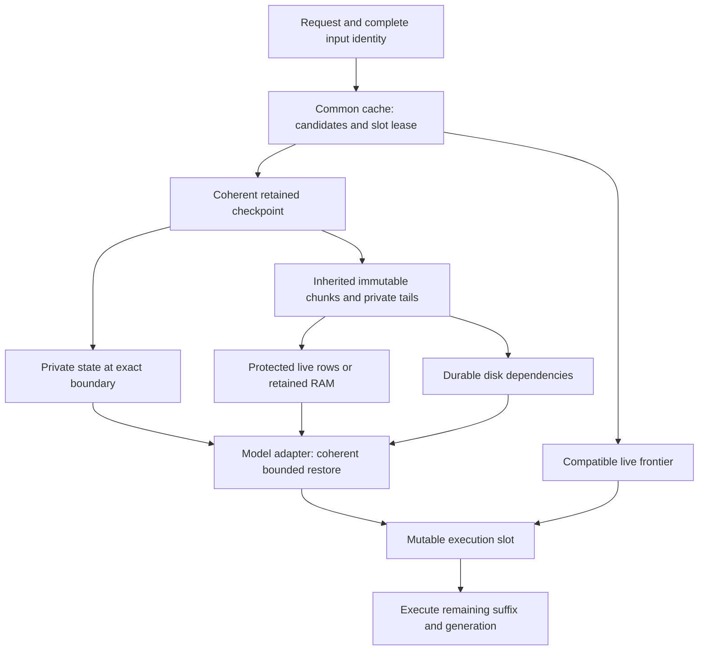

# RFC: continuation cache redesign

Status: draft for discussion. Updated 2026-10-08. Implementation has not started.

This is the single, self-contained review document for the cache redesign.
The original research documents, scripts and measurement inputs are preserved
in pinned archives; retrieval and replay instructions are included below. Measurements of the existing cache, simulations
of proposed behavior and estimates are distinguished throughout.

Contents:

- [Context](#context) and [problem statement](#problem-statement).
- [Goals](#goals-and-non-goals) and [glossary](#glossary).
- [Current system](#how-the-system-is-designed-now).
- [Evaluated solutions](#evaluated-solutions), including the detailed hybrid
  proposal, conversation examples and comparison table.
- [Success criteria](#success-criteria-and-evaluation) and [risks](#risks).
- [Delivery roadmap](#delivery-roadmap), followed by the detailed
  [implementation plan](#implementation-plan).
- [Instrumentation](#instrumentation).
- [Rollout](#compatibility-and-rollout) and [decisions](#open-questions).
- [Evidence appendix](#evidence-appendix) and [references](#references).
- [Archived evidence and replay instructions](#archived-evidence-and-reproducibility).

## Context

Gufo serves models locally on a Linux AMD Strix Halo machine. Conversations
often grow over many turns: a coding agent reads files, calls tools and starts
subagents; other users may continue unrelated conversations at the same time.
Reprocessing the full history on every turn can dominate response time.

The continuation cache retains model state so a later request can resume work
already performed. Useful history may belong to a live conversation, an earlier
edit point, a parent agent, or a conversation resumed after a server restart.
The intended workload includes up to eight concurrent requests and more logical
conversations than execution slots.

This RFC evaluates how to retain and reuse that work across all Gufo model
families. The priority order is response latency, RAM usage, then disk capacity
and write volume. The implementation should arrive through independently
testable PRs that deliver useful behavior while keeping reviews manageable.

## Problem statement

The system needs to reuse compatible computation reliably as conversations
grow, branch, change execution slots and survive restarts. Retention must stay
within explicit resource limits without causing incorrect model state or
unbounded interference with other requests.

The existing system encounters several difficulties:

- Retaining many positions in a long history can consume substantial memory
  and disk capacity. Different models incur different capture costs.
- Useful state can be overlooked when available prefixes differ between RAM
  and disk. That causes avoidable prefill work and delayed responses.
- Transfer-buffer limits can prevent deep checkpoints from being persisted or
  restored, even when the configured disk capacity is sufficient.
- Branches, subagents and independent conversations compete for retention.
  A busy workload must preserve useful long histories while allowing peers
  to progress.
- Model state is more than attention KV. Recurrent, speculative and multimodal
  state introduce correctness requirements at specific positions.
- Existing measurements do not establish that a proposed replacement meets
  latency and resource requirements at eight concurrent requests.

These problems require an explicit correctness contract, measurable acceptance
criteria and a design whose costs can be inspected. They do not by themselves
determine a particular storage representation.

## Goals and non-goals

Goals:

- Minimize request latency, including contention and queueing at concurrency
  greater than one, while preserving efficient long-horizon continuation.
- Cover every existing model family through explicit capabilities and model
  modules. All continuation-capable models are in the delivery scope.
- Preserve exact saved-state restoration and existing numerical-quality
  requirements, including speculative execution.
- Support edits, branches, slot rotation, bounded eviction and restart reuse.
- Bound retained RAM, transfer staging, persistence queues and disk usage.
- Make cache decisions and their costs observable and regression-testable.

Non-goals for the initial implementation:

- Distributed caching or multiple server processes sharing one cache directory.
- Reading or migrating files from the old cache format.
- Replacing inference scheduling, sampling or model kernels as part of building
  the new cache package.
- Guaranteeing identical sampled output between a fresh computation and a
  restored prefix computed with a different floating-point execution shape.
- Forcing image/video denoising into an autoregressive continuation interface.

Paged live KV and disk compaction remain separately evaluated extensions.

## Glossary

| Term | Meaning |
| --- | --- |
| Prefill | Execute the prompt tokens needed before generation can continue. |
| KV | Attention key/value rows retained from prior tokens. |
| Conversation | A logical history; it can outlive or move between execution slots. |
| Execution slot | A leased mutable model state in which a request executes. |
| Live frontier | The exact state currently reached in a slot, including executed generated tokens. |
| Checkpoint | A coherent, immutable saved boundary that can be restored. |
| Fixed/private state | State copied for a checkpoint rather than shared as append-only rows; its size depends on the model and configuration. |
| Chunk | An immutable range of shareable rows, initially targeting 2,048 tokens where the model layout permits. |
| Tail | A checkpoint's partial range that does not fill a chunk. |
| Lineage/provenance | The computation that produced particular state bytes and the inheritance of those bytes through restores. |
| Spill | Preserve borrowed rows before their live storage is overwritten. |
| Reservation | Budget capacity committed before a future allocation or transfer needs it. |
| Pin | A lifetime guarantee that prevents storage from being reclaimed while an operation uses it. |
| Compatibility identity | Model, state layout and execution configuration required for safe reuse. |
| Input identity | Tokens and relevant non-token inputs, such as images, for the reused boundary. |
| Manifest | A disk record describing a checkpoint and its required component files. |
| TTFT | Time to first token, including queueing, cache work and remaining prefill. |
| C | Concurrent requests; qualification includes C=1, 2, 4 and 8. |

## How the system is designed now

The research baseline is main `b39c530e`. The central lookup limitation also
remains in the inspected main revision `dea22cee`. Existing measurements belong
to their recorded baseline and settings; implementation qualification must
record a fresh matched baseline. See [Current design](https://github.com/gufo-org/gufo/blob/b9ca6b4e18abe50d4d446f5460823b7bcb4cdb33/docs/cache-redesign/current-design.md) for
the original source inventory and [Experiments](https://github.com/gufo-org/gufo/blob/b9ca6b4e18abe50d4d446f5460823b7bcb4cdb33/docs/cache-redesign/experiments.md) for evidence.

### Serving, slots and opaque snapshots

Serving schedules inference. `ContinuationCache` leases execution state,
matches compatible token prefixes and retains checkpoint records.
`TextModelRunner` supplies model-specific capture, restore and persistence.
The disk store currently depends on that runner interface.

A checkpoint is opaque to common policy and restores as a whole. A recurrent
model cannot restore a checkpoint at position 10,000 and simply truncate its
state to position 6,000. A saved coherent boundary at or before the desired
position is required, followed by any remaining prefill.

Live state and retained snapshots are distinct. The live frontier can include
generated tokens beyond the prompt checkpoint. Preserving that frontier avoids
recomputing generated history when a parent conversation branches.

### RAM retention

The cache has a record limit of 128 and a byte budget. Capture candidates
include stable boundaries, complete prompts, selected 2,048-token grid points
and learned shared-prefix boundaries. Eviction uses priority ranks, then LRU
within a rank; admission may refuse a checkpoint under byte pressure.

In the research baseline, the stable boundary excludes the generation suffix;
up to four intermediate grid captures are selected. Learned divergence points
require at least a 512-token improvement over already reusable history. Removal
ranks are retry 0, history 1, covered continuation 2, and branch point/last
copy 3. The record limit does not grant permission to exceed the byte budget.

Physical behavior differs by model:

- Qwen 27B snapshots own copies of their state, including attention KV and
  recurrent buffers. Deep captures therefore copy large payloads.
- Flash-Next already copies private mutable state while borrowing append-only
  rows from a live slot. Before overwrite, needed rows are preserved into
  backing blocks shared by affected checkpoints. Admission nevertheless
  charges the full logical payload per checkpoint.
- Other model families have their own layouts and capabilities. Their complete
  inventories must be checked against the implementation base.

### Disk retention and lookup

The disk tier stores one complete, checksummed payload per checkpoint, with
tokens and compatibility metadata. Files are published atomically and evicted
individually. The current design allows several processes to share a directory.

Disk is consulted only when there is no RAM hit. A short RAM hit can therefore
hide a much longer usable disk checkpoint. Writes and restores also encounter
whole-payload staging limits. Streaming writes alone would not solve the
corresponding restore limit.

The user-facing disk options are `--cache-disk DIR`, `--cache-disk-bytes` and
`--cache-disk-staging-bytes`; RAM has `--cache-ram-bytes`. Disk uses a prefix
tree per persistence identity. Ordinary writes less than 2,048 tokens past a
stored boundary are skipped, with exceptions for learned shared prefixes.
Restoring beyond a stable boundary requires an eligible fallback at or before
that boundary under the current contract. The redesign must preserve that
correctness requirement rather than simply maximizing token count.

At the recorded baseline, disk eviction was global LRU. PR #409 proposed
removing covered intermediates first while protecting learned shared-prefix
entries. That policy proposal is distinct from chunk ownership and was not
part of the measured baseline.

Historical issues also recorded repeated 4.1 GB Flash-Next files around 145k
tokens, retry captures refused under pressure causing 5–7 tokens of repeated
prefill, and disk-write/capture overlap raising 27B capture latency from about
20 ms to 57–230 ms. These configuration-specific observations motivated the
later experiments; they are not universal latency constants.

### Evidence of the current limitations

| Observation | Evidence and scope |
| --- | --- |
| A short RAM hit hid a longer disk checkpoint, causing 22,558 tokens of repeated prefill | Measured E2 W2 workflow; see E3 in [Experiments](https://github.com/gufo-org/gufo/blob/b9ca6b4e18abe50d4d446f5460823b7bcb4cdb33/docs/cache-redesign/experiments.md). |
| Qwen 27B captured approximately 10 GB at 149k tokens, taking 235–265 ms per checkpoint in the recorded run | Measured; configuration-specific. |
| Automatic staging prevented deep checkpoints from reaching disk | Measured in long-agent traces; the approximate 75k boundary depends on model, configuration and queued work. |
| Flash-Next already shares some physical RAM despite full-payload admission charges | Existing implementation and measurements; a full-copy comparison overstates its additional physical RAM savings. |
| Proposed designs improve several retention and persistence outcomes | Simulated E8 revision 2; proposed implementation performance remains unmeasured. |

## Evaluated solutions

### Hybrid approach — recommended

The proposal separates mutable execution state, shared immutable rows and
private state at saved boundaries. One common package owns policy and storage;
model modules supply coherent state and device operations.

#### Three kinds of state

| Object | Contents | Lifetime and ownership |
| --- | --- | --- |
| Execution slot | Mutable live KV, recurrent state, positions and other model execution state | Leased to one executing request; allocations belong to the model adapter. |
| Immutable chunk | A shareable range of append-only rows from one computation | Shared by checkpoints that actually inherited those bytes; retained in RAM, disk, or both. |
| Checkpoint | Exact boundary, compatibility/input identity, private state, chunk references and partial tails | Immutable after capture completes; eligible for lookup only while all required components can be supplied. |

A conversation does not own a slot permanently. Eight execution slots can
serve many more logical conversations over time, within the model's feasible slot count. Conversely, adding more
checkpoint records does not create more execution capacity. The initial
checkpoint limit remains bounded; slot count and retention limits are separate.

For an attention-only layout, most retained payload consists of append-only
rows. For a hybrid recurrent model, a checkpoint also owns the complete
recurrent state at its boundary. Mutable rings, convolution history, kept
hidden rows and speculative state must be handled according to their actual
semantics, rather than assumed to be ordinary KV.



#### Why recurrent state needs exact checkpoints

Consider a model that alternates attention and recurrent layers. Each recurrent
layer updates its state from hidden activations produced by all preceding
layers for the current token. Attention KV records only selected key/value
projections; it does not preserve all those hidden activations.

Therefore, attention KV through position 12,000 does not let the cache derive
the recurrent state at position 6,000 or reconstruct it at position 12,000.
The cache needs a saved recurrent boundary and must execute any gap after it.
Saving every layer's missing activations would introduce a different, much
larger representation and is outside this proposal.

Example: an edit first changes token 6,000. If coherent checkpoints exist at
4,096 and 8,192, only the earlier one can serve this edit. The request restores
4,096 tokens and executes the unchanged gap followed by the changed suffix.
It cannot use the recurrent state from 8,192 merely because some earlier KV
rows still match.

#### Component descriptors and model modules

Each adapter describes every required component of a coherent checkpoint:

- Stable component ID, layout version, element representation and byte size.
- Kind: append-only shareable rows, or checkpoint-private mutable state.
- Valid logical range, physical range and exact component position.
- Opaque storage handle and bounded transfer operations.
- Completion and lifetime requirements, including device synchronization.
- Model compatibility and boundary-specific non-token input identity.

The common package must not infer every component length from the prompt
length. Target KV and draft KV can end at different positions. Pooled indexer
rows advance in blocks; a raw indexer ring can overwrite earlier entries.
Each has its own valid range and preservation rules.

An illustrative Flash-Next inventory is:

| Component | Proposed treatment | Position rule |
| --- | --- | --- |
| Target attention KV | Share append-only committed ranges | Target execution position. |
| MTP draft KV | Share only ranges the adapter certifies immutable | Draft position, independently validated. |
| Pooled indexer rows | Share completed immutable blocks | Number of completed pooled blocks. |
| Raw indexer ring | Save private chronological contents and metadata | Current ring window and cursor. |
| GDN state and convolution history | Save private state | Exact checkpoint boundary. |
| Kept hidden rows, residuals and execution metadata | Save whatever the numerical contract requires | Component-specific boundary. |
| Sampling or speculative bookkeeping | Preserve model-owned continuation state; initialize request-owned policy through serving | Explicit ownership and position contract. |

This table is a starting inventory, not a substitute for auditing each mode.
Qwen's adapter must include DeltaNet, convolution and actual MTP/DFlash state
where present. DeepSeek's adapter must inventory compressed pools, windows,
indexers and mutable compressor state. Audio and multimodal modes require
their own complete identity and state inventories.

Every existing model family must be accounted for. A family with a supported
continuation operation receives the appropriate module and qualification.
A family whose computation has no reusable autoregressive continuation state
declares that capability explicitly and retains its normal execution behavior.
The common package must not pretend that a diffusion denoising trajectory is a
token-prefix continuation. Additional reusable state for such models would
need an appropriate separately specified contract.

#### Capture and borrowing

At a coherent boundary, capture copies checkpoint-private state. Shareable
rows may remain borrowed from protected live storage instead of being copied
immediately. Already retained chunks are referenced directly.

Borrowing is an ownership contract, not an unchecked pointer. The source slot
must preserve every referenced range before any operation overwrites it.
That includes rewind, reset, slot reassignment, destruction and speculative
rollback. A checkpoint becomes visible to readers only after its private state
and all component descriptions are coherent and ready.

Partial tails are private to the checkpoint's lineage and boundary. They may
also borrow protected rows initially. Their eventual backing storage counts
against reservations. The design does not charge only recurrent state and
then forget the tail or outstanding spill obligation.

Capture failure skips retention and allows inference to continue when the
live state remains valid. A device failure that invalidates execution follows
the normal request failure path; it cannot be hidden as a harmless cache miss.

#### Sharing and provenance

Two checkpoints can share rows if they descend from the same computation of
those rows. This occurs when they are captured from one live execution or when
one request restores an existing checkpoint and continues from it.

Equal tokens alone are insufficient. Independent prefills can differ in
floating-point execution shape, producing different state bytes. Pairing a
recurrent checkpoint from one computation with KV from another could create
a state that never existed.

The initial design therefore shares inherited bytes, rather than merging
independent cold computations by token hash. Optional byte deduplication would
require verified byte identity plus compatible component metadata; hashing
large device payloads has a cost and is not needed for the first version.

Model/weights identity, state ABI, precision, tokenizer/template, context
policy and relevant adapters or speculative configuration constrain reuse.
Images and other non-token inputs must participate in identity at the affected
boundary. Two prompts containing the same image placeholder tokens but
different images must not falsely hit after those inputs enter the computation.

#### Budget accounting and preservation before mutation

The retained RAM charge is the sum of unique retained chunks, checkpoint-private
state and tails, metadata, and reserved backing for still-borrowed rows.
Transfer staging and queued jobs are separately bounded and included in the
overall resource ledger. An allocation must have one physical charge even if
many checkpoints reference it.

Borrowed rows cannot count as free. If a slot lends 6 GiB of rows to several
checkpoints, resetting it may require 6 GiB of preservation. A spill reservation
must have physical backing with pages already committed, rather than only a
promise to allocate later. Reserve that backing before accepting the retention
obligation. The ledger distinguishes free committed backing, assigned spill
reservations and materialized chunks, while charging each physical allocation
once. Assigning a reservation to its chunk does not allocate or double-charge it.

The review's ROCm 7.2 allocation measurements report about 25 GB/s of page
commit throughput, around 4.5 ms per 111 MB, while the allocation blocks other
HIP calls. Committing 6 GiB on reassignment could therefore cost approximately
258 ms before copying any rows. This estimate exposes a latency hazard; it is
not a measured reassignment result. The copy adds its own cost.

Create and commit backing within the feasible memory envelope during model
initialization or an explicit inference-quiescent period. Reuse released backing.
Do not refill a pool opportunistically while peers execute: [PR #445](https://github.com/gufo-org/gufo/pull/445)
records an approximately 8 ms decode stall from background spare-block refill.
If committed capacity is insufficient, retire eligible retention or decline the
capture rather than silently introducing a request-path page-commit allocation.

#### Idle spill and independent transfer streams

While a slot is idle, background preservation materializes referenced borrowed
rows into the committed backing. Prefer a slot whose outstanding preservation
has completed when assigning an unrelated request. Record the residual spill
wait when reassignment arrives earlier; idle time cannot be assumed available.

An idle-spill worker pins the source ranges and their slot generation, transfers
bounded pieces and publishes completed backing under the same mutation guard.
The scheduler and cache coordinate that guard before a slot becomes executable
again. Cancellation or a request arriving mid-spill must not overwrite a pinned
source or publish a partially copied chunk. Already preserved ranges remain
usable; required remaining ranges are completed or their eligible retention is
retired before mutation. A slot becoming idle must not force an unbounded eager
copy of every possible checkpoint.

Every in-flight transfer leases its own pooled stream and completion event;
concurrent transfers must not queue behind an unrelated bulk copy on one shared
stream. PR #445 records a 1,656-token prefill delayed about 24% by that pattern.
Streams return to the pool only after completion. This prevents avoidable FIFO
serialization, but does not eliminate device bandwidth contention.

Qualify idle spill, zero-idle reassignment and reassignment during a copy. The
replacement conversation B's end-to-end TTFT and already decoding peers'
per-token latency must pass the existing per-request/phase 5% and 3 ms gates
against matched baseline controls. Report page-commit, residual-spill and stream
wait separately; an average throughput improvement cannot hide those regressions.

Before mutation:

1. The adapter identifies the ranges that will become invalid.
2. The cache determines which readers and retained checkpoints still need them.
3. Required backing is reserved and the rows are preserved, or eligible
   checkpoints are retired before mutation proceeds.
4. Outstanding transfers and reader pins complete before protected storage
   can be overwritten or released.

This sequence must be transactional with respect to mutation. An allocation
failure cannot leave published checkpoints pointing into overwritten storage.
If a pin prevents reclamation, the affected operation waits or chooses another
safe destination; it must not silently violate the pin to stay within budget.

Live slot allocations remain a separate resource claim. On Strix Halo, host
and device allocations consume the same physical memory capacity, so the
server must report the combined total without double-counting borrowed views.

#### Lookup, slot selection and restore

One prefix index represents compatible checkpoints across RAM and disk.
Availability belongs to each component: its bytes may be resident, durable,
or both. A partial manifest with missing required state is not a usable hit.

Lookup identifies the deepest coherent compatible boundary. It also exposes
the available live frontier, shorter resident candidates and transfer costs.
An exact compatible live continuation should preserve its cheap path. A short
RAM hit must no longer hide a much deeper disk candidate.

Latency is the first priority. A longer disk prefix is valuable when the
avoided prefill exceeds its restore cost. Initial behavior should be explicit
and deterministic, with the longest usable prefix as the default retained
candidate; any policy that chooses a shorter boundary for lower estimated
latency must be measured, tested and logged with its reason. It must not rely
on the old blanket rule that every RAM hit wins.

Restore pins the chosen state, leases a destination and preserves that
destination's outstanding borrowed rows before overwrite. The adapter loads
all required components and validates their positions. The slot becomes
executable only after completion. Cancellation or partial failure invalidates
the destination before reuse; an earlier valid checkpoint or cold prefill can
then be attempted.

In the initial implementation, restoring into a different slot still copies
the full required prefix into contiguous live storage. Shared retained chunks
save retention and capture work; they do not make cross-slot restore zero-copy.

#### Checkpoint selection and eviction

Start with bounded records, existing priority ranks and a 2,048-token grid
where compatible with the layout. Candidate boundaries include stable prompt
boundaries, learned shared prefixes, useful message/edit boundaries and recent
grid points. Persisting every possible boundary is unnecessary and can itself
increase response latency, fixed-state memory and writes.

A recurrent checkpoint requires stopping execution at its exact boundary.
Message boundaries, learned prefixes and grid points can split a prefill pass,
shrink kernel batches and add capture/transfer synchronization. The density
cost includes those effects alongside private bytes and expected reuse.
Prefer candidates aligned with planned prefill passes; coalesce nearby optional
boundaries. Do not change an exact required boundary by rounding its tokens.

The current baseline skips grid points within 128 tokens of the prompt end
because they split the final pass beside an already planned complete-prompt
checkpoint. The new policy must retain the measured benefit of avoiding such
redundant splits, with adapter-specific pass alignment rather than assuming
that a 2,048-token storage chunk is always an efficient compute boundary.

For the 6,000-token subagent example, capturing exact private state can require
a pass ending at 6,000. It is worthwhile only if predicted/observed follower
reuse pays for the extra split and synchronization. Otherwise the subagent
continues from the earlier coherent checkpoint and the optional learned capture
is skipped. Instrument pass count, pass sizes, synchronization and marginal
capture cost, and test both aligned and unaligned candidates.

Retention value depends on future saved work and actual resource cost. A useful
initial policy favors shared branch points and last useful continuations,
while dropping retries and covered history according to existing ranks.
Any change to admission ceilings or eviction priority is reviewed separately
from the storage representation so its effect can be measured.

Evicting a checkpoint releases its private state and references. A shared chunk
is freed only after its last checkpoint reference, reader pin and persistence
pin disappear. Evicting one child must not destroy its parent's reusable rows.
RAM eviction may leave a durable disk checkpoint; disk eviction updates the
index and removes bytes only when safe.

#### Disk representation and bounded transfers

A checkpoint manifest records tokens, identities, component positions,
checksums, chunk references and private-state/tail locations. Full chunks are
written once while referenced in the disk tier. Each new boundary writes its
private state, tails and any new chunks; it does not rewrite every earlier row.

Both writes and restores stream in bounded buffers. Queue admission reserves
metadata, immutable-source lifetimes and transfer capacity. A checkpoint larger
than staging must still be transferable. No serialization fallback may build
the entire payload in a host buffer.

The persistence worker is bounded. Under pressure, redundant or low-value
jobs may be skipped or coalesced safely; queue depth and pinned bytes must not
grow without limit. Optional writes yield to latency-sensitive model work.
Device-copy and storage interference must be measured under concurrency,
including peers already decoding.

#### Publication, crash recovery and format upgrades

The initial version gives one server process exclusive ownership of a cache
directory. A process lock enforces that rule; eight concurrent requests within
that process follow the feasible model/mode capacity matrix. A second process receives a clear directory
ownership error or uses another directory.

Publication order is:

1. Write missing chunks and private payloads to temporary files.
2. Verify checksums and make dependency files durable, including their directory
   entries, before publishing anything that references them.
3. Write and fsync the manifest, atomically rename it into the published
   namespace, and make that rename durable.
4. Mark the checkpoint durable in the index and release writer reservations.

A queued or in-flight write is not durable. Graceful shutdown can drain the
bounded queue; abrupt termination preserves only published checkpoints.
Startup reads and validates bounded manifests, identities and declared lengths,
then checks referenced file existence and sizes. It does not scan/checksum the
complete payload of every chunk. The current `IndexExistingFiles` path reads
and verifies entire images; carrying that behavior into the new store could
spend tens of seconds scanning tens of GB before accepting a request.

Index entries discovered this way are structurally available but have unverified
payloads. During bounded streaming restore, verify each dependency's checksum
and private-state/tail payload. Bytes may be copied into an invalid destination
incrementally, but that slot becomes executable only after every required
checksum and component-position check passes. A failed check invalidates the
destination and affected dependency references before any fallback executes.
Once-verified immutable dependencies may cache verification for their protected
file identity; replacement or mutation invalidates that result.

Corrupt/incomplete entries are excluded when detected. Orphan reclamation follows
complete manifest-reference discovery and runs outside the serving-critical
startup path. Readers pin dependencies so concurrent eviction cannot remove a
file in use. Gate time to readiness separately from first restored-request TTFT,
and assert that startup payload reads stay bounded by metadata, not total cache
payload size; a restart benefit cannot be claimed by ignoring index-build time.

Old-format compatibility is not required. The store recognizes its format
version and rebuilds incompatible legacy cache entries as requests arrive.
Cleanup is confined to files recognized as Gufo-managed cache files in the
configured directory; it does not recursively delete unrelated contents.
Unknown future formats are not interpreted as the current format.

Use a versioned namespace so rollback can cold-start safely. No offline
migration is required. The temporary capacity needed for writes and cleanup
must still fit the disk budget; rebuilding must not leave an unbounded legacy
archive beside the new store.

#### Correctness contract

Capture/restore must reproduce the exact coherent model-owned state saved at
the boundary: required bytes, positions, valid ranges and execution metadata.
Derived transient buffers may be reconstructed only under an explicit model
contract that preserves the required numerical behavior.

This is distinct from requiring a fresh prefill with different batch shapes to
produce identical bytes or sampled strings. Existing quality requirements
remain strict. Tests cover restored state, next-step numerical behavior and
actual speculative rollback; token-prefix equality cannot replace those checks.

#### Worked examples: a conversation through time

The following sequence uses logical conversations A, B and C. Token counts
are illustrative; intervals use `[start, end)`. Each checkpoint denotes a
coherent boundary, not just a token count. Chunk size is 2,048 in these examples.

**1. A starts and grows in the same slot.**

| Time | Conversation event | Slot and cache effect |
| --- | --- | --- |
| t0 | A: “Inspect this repository and explain its architecture.” The formatted prompt ends at 10,240 tokens. | Slot 1 prefills the prompt. Capture A10 saves private state and describes five full chunks. Those rows can stay borrowed with reserved spill capacity. |
| t1 | The assistant executes tools and generates another 512 tokens. | Slot 1 reaches a live frontier of 10,752. A10 remains a distinct frozen prompt checkpoint. |
| t2 | A appends tool results and asks for an implementation. The next prompt extends the exact executed history. | Reuse the compatible live frontier. Execute only the new suffix; do not restore A10 unnecessarily. |
| t3 | A reaches a prompt boundary of 12,288. | A12 references the same first five chunks and a sixth chunk. Its private state is a new full copy at 12,288. |

The logical distinction at t1 matters: the retained prompt checkpoint does
not automatically include every generated token. If another request needs
that executed frontier, freeze a coherent checkpoint before it is mutated.
Feeding those generated tokens through a new prefill is not necessarily the
same numerical history as continuing the actual execution.

**2. B replaces A; A later resumes in another slot.**

B is unrelated and needs slot 1 while A is idle. Before B overwrites the
borrowed ranges, the cache preserves A's needed rows into backing chunks.
A10 and A12 both reference the common first five chunks. Preservation does
not create five separate copies for each checkpoint.

A later returns while slot 1 is busy. Slot 2 restores A12: six chunks plus
private state, followed by prefill of A's new suffix. The retained prefix exists
once in the pool, but slot 2 receives its own live copy. This improves retained
capacity without removing the transfer cost or slot 2's live allocation.

**3. C is a subagent with a shorter shared prefix.**

C receives A's system prompt and tool definitions through token 6,000, then
asks: “Check the error handling independently.” Assume the nearest compatible
earlier checkpoint is at 4,096.

1. C restores the first two chunks and private state at 4,096 into slot 3.
2. C prefills the unchanged gap of 1,904 tokens to reach 6,000.
3. The cache captures C6, with inherited chunks `[0, 4096)`, a private tail
   `[4096, 6000)`, and private state at exactly 6,000.
4. C then executes its task-specific suffix.
5. A later subagent with the same compatible 6,000-token prefix restores C6
   directly and executes only its own suffix.

A's third full chunk covers `[4096, 6144)`, extending past the divergence.
The initial design does not treat that entire chunk as reusable by C. The
partial tail stays private. Model-specific components may have additional
alignment constraints; their descriptors, rather than this simple token
arithmetic, govern what can actually be shared.

**4. Several subagents start simultaneously.**

Suppose seven subagents arrive before C6 has been captured. They cannot all hit
a checkpoint that does not yet exist. Some may reuse 4,096 and independently
compute the gap; independent new rows retain distinct provenance.

The cache may coordinate access to an already pending shared-prefix capture,
but waiting for it must not impose a long global stall. Whether bounded waiting
beats duplicate prefill is a measured latency decision. The first release must
be correct for both outcomes and report duplicate work. It does not promise
perfect deduplication of simultaneous cold starts.

**5. The parent returns after its children.**

A reaches 24,576 tokens and launches children that inherit this boundary.
Their retained prefix chunks are shared; each child adds private state and
its own suffix. When A takes another turn, its own live frontier or A24 remains
eligible independently of the children.

Under tight RAM, A24 might survive only on disk. A shorter resident checkpoint
at 4,096 must not hide it. The index exposes both candidates, and restore can
recover A's deeper compatible state. Whether that wins latency depends on disk
read cost versus executing the avoided 20,480-token gap.

In the recorded current-system W2 failure, a short RAM hit hid a deeper disk
entry and caused 22,558 tokens of repeated prefill. The proposed lookup fixes
that blind spot; shared retention additionally reduces pressure on the parent
checkpoint. These are distinct improvements and should have distinct tests.

**6. A user edits an earlier message.**

A's history is now 30,000 tokens, but the user edits a message beginning at
18,500. A checkpoint at 24,576 is too late. A retained coherent checkpoint at
18,432 can restore the unchanged prefix, leaving a 68-token gap before the edit.

After the edit, new suffix rows have new provenance. Older checkpoints can
remain useful for the old branch, subject to budget. There is no permission
to splice the old recurrent state into the edited branch merely because some
later text happens to be identical.

**7. Eight slots are active within a feasible model/context envelope.**

| Slot | Workload | Cache requirement |
| --- | --- | --- |
| 1 | A: long coding-agent continuation | Preserve its cheap live path and useful deep checkpoints. |
| 2 | B: unrelated chat | Bound admission and lookup overhead on a short request. |
| 3–5 | C, D, E: children of A | Share inherited retained rows and preserve independent mutable state. |
| 6 | F: another long independent conversation | Allow useful retention without assuming overlap with A. |
| 7 | G: conversation resumed after restart | Stream restore without monopolizing cache metadata locks. |
| 8 | H: short request while peers decode | Measure its TTFT and effects on peers' inter-token latency. |

If another subagent arrives, the serving scheduler queues it until a compatible
slot is available. The cache retains history; it does not create a ninth slot.
Slow disk I/O for G must not hold a global metadata lock across the transfer.
Shared device-copy bandwidth can still affect peers, so bounded transfer size
alone is insufficient evidence of good concurrency latency.

For admitted C=8 configurations, qualification includes this mixed workload
alongside homogeneous chats
and long-agent runs. Aggregate throughput must not conceal one starving user
or a parent that loses all useful continuation points.

**8. Independent histories have little overlap.**

Eight unrelated long conversations cannot share their different prefixes.
The design still avoids storing every earlier row again for each checkpoint
within each conversation, and it bounds transfers. However, the sum of eight
distinct live histories remains large. Benefits depend on checkpoint count and
actual shared computation, not the number of users alone.

For the measured 27B layout, 100,000 tokens at 65,536 bytes/token consume about
6.10 GiB of attention KV. Eight live copies require about 48.83 GiB for that
component alone, before weights, recurrent/draft state, scratch space and
retained-cache obligations. This is an estimate from the measured size model,
not proof that eight such requests fit the target machine.

**9. Budget pressure evicts a child checkpoint.**

A24, C24 and D24 reference the same inherited chunks. Evicting C24 frees its
private state and C-only suffix storage. The common prefix stays because A24
and D24 still reference it. If D is restoring, its pins also keep required
storage alive even if its cache record is concurrently retired.

If a new capture cannot reserve its private state and eventual spill, it is
skipped. The live request can continue safely. The event includes the requested
bytes, admission reason and protected resources so refusals can be diagnosed.

**10. The server restarts at long context.**

A reaches a durable checkpoint at 100,352. A later capture at 102,400 is still
queued when the process terminates abruptly. On restart, the index discovers
100,352 and restores its complete state. It cannot claim 102,400 as a hit.
Remaining history is prefilled from the last valid durable boundary.

Unlike a whole-file staging requirement, bounded streaming permits restoration
even when the checkpoint's total payload exceeds the transfer-buffer budget.
Actual restart benefit depends on which checkpoints completed publication,
not merely which capture calls succeeded.

**11. A shared chunk is missing or corrupt.**

Several manifests reference chunk X. If X fails validation, each checkpoint
requiring X is unavailable unless another verified copy can provide it. An
earlier complete checkpoint or a cold prefill remains a correctness fallback.
The index must not restore valid private state alongside an incomplete prefix.
This larger corruption blast radius is a cost of sharing compared with fully
self-contained files.

**12. An image changes while the text looks identical.**

Two requests both ask “Describe this image,” but attach different images. The
prefix before image computation may be reusable. The boundary after the image
requires its supplemental input identity to match. Token placeholders alone
do not establish compatibility. This rule belongs in functional tests as well
as adapter identity construction.

#### Expected resource savings and their limits

For one linear history, let `F` be private bytes per checkpoint, `R` shareable
bytes per token, and `p_i` the saved positions. A full-copy representation costs
approximately:

```text
full snapshots = sum(F + R * p_i)
shared storage = checkpoint_count * F + R * max(p_i) + private_tails
```

The shared estimate excludes metadata, transfer scratch, live allocations,
alignment and temporary publication space. Branches add their genuinely new
rows and private partial tails. Independent lineages must be counted separately.

Using the measured 27B DFlash2 constants (`F = 243,700,000 bytes`,
`R = 65,536 bytes/token`), retain eight aligned checkpoints at 86,016,
88,064, 90,112, 92,160, 94,208, 96,256, 98,304 and 100,352:

| Representation | Estimated retained payload |
| --- | ---: |
| Eight complete copies | 47.32 GiB |
| One shared prefix plus eight private-state copies | 7.94 GiB |
| Payload reduction for these same retained boundaries | 83.2% |

This is an arithmetic estimate, applicable to retained RAM for a full-copy
model and to deduplicated disk payload. It is not an end-to-end memory
measurement. Flash-Next already shares some physical RAM, so this comparison
does not establish an equivalent additional RAM saving for that model.

Private state remains substantial: the recorded Flash-Next MTP layout has
about 113.8 MiB of fixed state, and 27B DFlash2 about 232.4 MiB. Many dense
checkpoints can still consume GiB even with perfect row sharing. Chunk size
and density must be chosen together rather than declaring checkpoints cheap
without a bound.

The recorded chunk-file microbenchmark added roughly 13% read/write overhead
relative to a large file. Optional disk compaction could reduce file overhead,
but introduces extra writes and temporary capacity. It remains disabled until
measured restore latency justifies it. Published simulation write volumes
exclude compaction.

### llama.cpp-like approach

The relevant pattern combines reuse within a live slot, small context
checkpoints for state that cannot simply be truncated, and a host prompt cache
for displaced slot state. The inspected source at `41abbfd59` maintains
checkpoint spacing and a bounded checkpoint list. Its host cache allocates
complete target/draft state plus context checkpoints, removes contained older
prompts and evicts oldest entries when capacity is needed.
See [slot/checkpoint implementation](https://github.com/ggml-org/llama.cpp/blob/41abbfd59/tools/server/server-context.cpp)
and [host prompt cache](https://github.com/ggml-org/llama.cpp/blob/41abbfd59/tools/server/server-task.cpp).

Applied to Gufo, this would keep efficient same-slot continuation and cheap
recurrent rollback points while retaining whole state when a conversation
leaves its slot. Automatic persistent shared storage would be additional work.

Advantages:

- Fits a local serving model and preserves a simple live-slot fast path.
- Avoids repeatedly copying full attention history for every in-slot rollback
  boundary.
- Can be delivered with less allocator/kernel change than paged serving.

Disadvantages for the intended workload:

- Moving conversations between slots still requires complete retained state
  and transfers; multiple displaced histories can consume substantial RAM.
- Host-cache supersession needs care for Gufo's useful older branch points.
- Automatic restart persistence and cross-checkpoint disk sharing remain to
  be designed.

This is a strong source of ideas for live-state handling, but alone does not
address all retention and persistence requirements of the eight-request workload.

### SGLang-like approach

SGLang organizes prefix KV in a radix tree. Hybrid-model checkpointing treats
recurrent state as saved boundaries rather than reconstructible token rows.
Its component-based unified tree validates a candidate boundary against all
required components. HiCache extends reuse through device, host and configured
storage tiers. See [hybrid-model caching](https://pytorch.org/blog/hybrid-models-meet-sglang-more-than-full-attention/),
[unified radix cache](https://www.lmsys.org/blog/2026-08-11-unified-radix-cache)
and [HiCache design](https://docs.sglang.io/docs/advanced_features/hicache_design).

A Gufo adaptation would make shared tree storage more directly responsible
for request KV, with coherent recurrent checkpoints and tier transfers attached
to the tree. This is more ambitious than initially restoring shared retained
chunks into today's contiguous slots.

Advantages:

- Shared-prefix structure naturally represents parents, children and many
  request histories.
- Component validation makes the difference between traversal depth and a
  genuinely reusable hybrid-model boundary explicit.
- The architecture provides useful precedents for tiered storage and
  independently reclaimable recurrent checkpoints.

Disadvantages for Gufo:

- Directly adopting paged/shared live state requires allocator and execution
  integration across model families, beyond retaining immutable checkpoints.
- Multi-tier policies and component relationships add implementation and
  review complexity.
- Published upstream throughput or latency results do not qualify Gufo's
  kernels, unified-memory hardware or eight-request workloads.

The recommended design adopts shared-prefix and component-validation ideas,
with a narrower initial execution integration. SGLang's full architecture is
a useful longer-term comparison if live-slot duplication becomes the main limit.

### vLLM-like approach

vLLM automatic prefix caching uses reusable blocks keyed by prefix-related
hashes, with reference counts for requests using those blocks. Its hybrid
manager coordinates different state groups and requires a boundary supported
by the required groups. The versioned cache configuration distinguishes Mamba
`all` and `align` strategies with model-dependent support.
See [prefix caching, v0.22.1](https://docs.vllm.ai/en/v0.22.1/design/prefix_caching/),
[cache configuration, v0.22.1](https://docs.vllm.ai/en/v0.22.1/api/vllm/config/cache/)
and [hybrid manager design](https://docs.vllm.ai/en/stable/design/hybrid_kv_cache_manager/).

Applied to Gufo, this would introduce block-managed live KV and corresponding
attention access, plus a checkpoint policy for hybrid state. Persistence would
need its own store or integration; block prefix caching alone does not define
Gufo's restart semantics.

Advantages:

- Direct sharing of live prefix blocks can reduce duplication among active
  requests, the main memory limitation left by the initial hybrid proposal.
- Block allocation and reference counting are well suited to concurrent
  request lifecycles.
- Multiple required state groups are handled explicitly.

Disadvantages for Gufo:

- Requires significant integration with model allocators and attention kernels.
- Recurrent state sizes and block alignment can constrain reuse granularity
  or introduce padding; the best policy depends on the actual layout.
- Supported combinations of recurrent caching, speculative modes and storage
  must be verified per model/version.

Upstream documentation evolves. The research's specific model/block-size
examples are not universal constraints. This RFC evaluates the architectural
pattern rather than promising compatibility with a particular upstream backend.

### Keep the current design

Keep the existing opaque snapshots and independent disk files unchanged.
This alternative requires no redesign implementation and preserves today's
model-specific capture/restore paths and per-file corruption isolation.

Its costs and defects remain: full-copy layouts retain/copy large prefixes
per boundary, disk payloads repeat shared history, whole-payload staging limits
deep persistence/restores, and shorter RAM hits can hide deeper disk entries.
Useful dense boundaries remain expensive and separate live-slot allocations
still limit concurrency. This option provides the comparison baseline; work to
improve the current cache is outside this RFC's implementation scope.

### Other approaches considered in the research

**KV-only diffs.** Persist only new rows after each boundary. This omits required
recurrent/private state for Gufo's hybrid models and cannot restore a coherent
checkpoint. Adding exact private state and safe shared ownership turns it into
the recommended hybrid representation.

**A chain of complete deltas and periodic keyframes.** Each delta carries new
rows and complete end-state. It can work, but eviction and recovery become
coupled to chains. Immutable chunk references make dependencies explicit and
allow branches to share a common prefix. Disk compaction may later create
larger extents without introducing GPU-generated full-copy keyframes.

**Chunked KV with paged live execution.** This is the more ambitious direction
represented by the SGLang/vLLM-like options. It addresses live duplication as
well as retained storage. It remains a separately qualified extension rather
than a prerequisite for building the new common package.

**External stores such as LMCache, and local engines such as ds4.** They are
additional integration references, rather than a sixth complete Gufo design.
An external store still needs coherent recurrent state, complete compatibility
identity and safe ownership. Importing a backend does not remove those adapter
requirements. See [LMCache hybrid-model support](https://docs.lmcache.ai/mp/hybrid_models.html)
and [ds4](https://github.com/antirez/ds4). This RFC makes no unverified claim
about their measured performance on Gufo.

### Comparison table

The columns describe architectural adaptations to Gufo, not a benchmark ranking
of upstream products. Green means a good architectural fit for the row; yellow
means conditional support, additional work or a tradeoff; red means the scoped
approach leaves a material requirement unresolved. Colors express design
assessment, not implementation qualification. Short reasons accompany each.

| Feature / decision point | Hybrid, recommended | llama.cpp-like | SGLang-like | vLLM-like | Current |
| --- | --- | --- | --- | --- | --- |
| Same-slot long continuation | 🟢 Preserve live frontier | 🟢 Natural slot reuse | 🟢 Reuse live path | 🟢 Reuse live blocks | 🟢 Existing fast path |
| Cheap additional retained boundaries | 🟢 Copy private state, share rows | 🟢 Cheap in-slot checkpoints | 🟢 Shared rows + checkpoints | 🟡 Hybrid state policy/alignment matters | 🟡 Flash shares; 27B still copies |
| Shared retained prefixes across branches | 🟢 Inherited chunks | 🟡 Whole displaced slot states | 🟢 Shared radix paths | 🟢 Shared blocks | 🟡 Model-specific RAM sharing; full disk copies |
| Independent long histories | 🟡 Distinct rows still cost memory | 🟡 Whole histories still retained | 🟡 Distinct rows still cost memory | 🟡 Distinct rows still cost memory | 🔴 Many complete retained copies |
| Live memory across eight related requests | 🟡 Separate live slot copies initially | 🟡 Depends on live allocator adaptation | 🟢 Shared live prefix design | 🟢 Shared live block design | 🟡 Separate slot allocations |
| Cross-slot restore without full-prefix copying | 🔴 Initial contiguous restore copies rows | 🟡 Depends on live allocator adaptation | 🟢 With shared paged execution | 🟢 With block-managed execution | 🔴 Full restore path |
| Automatic restart retention with shared disk payload | 🟢 Specified manifest store | 🔴 Additional automatic disk design needed | 🟡 Storage backend and state support required | 🟡 Additional persistence integration required | 🔴 Persistence exists, but payload duplicated |
| Bounded deep writes and restores | 🟢 Required in both directions | 🟡 Must add bounded persistence | 🟡 Depends on tier/backend integration | 🟡 Depends on storage integration | 🔴 Current whole-payload staging limit |
| Exact recurrent boundary restoration | 🟢 Explicit component contract | 🟢 Exact saved checkpoints | 🟢 Required component boundary | 🟡 Model/mode capability verified | 🟢 Existing coherent snapshots |
| Incremental delivery through Gufo PRs | 🟢 Package, backing, RAM, disk, adapters | 🟢 Smaller execution changes | 🟡 Wider allocator/execution changes | 🟡 Wider allocator/kernel changes | 🟢 Existing implementation |
| Disk corruption isolation | 🟡 Shared dependency affects many entries | 🟡 Depends on added disk design | 🟡 Shared-tier dependency handling | 🟡 Shared-store dependency handling | 🟢 Independent complete files |
| Evidence for admitted per-model concurrency workloads | 🟡 Qualification required | 🟡 Qualification required | 🟡 Qualification required | 🟡 Qualification required | 🟡 Capacity matrix and matched controls required |

The hybrid is recommended because it addresses repeated retained payload and
deep persistence while preserving current execution paths for incremental
delivery. Its largest unresolved resource limitation is separate live-slot
memory. If measurements show that this prevents the intended workload, paged
live state must be prioritized rather than declaring the first release sufficient.

## Success criteria and evaluation

Correctness is a requirement, not a weighted optimization. After correctness,
evaluate tradeoffs in the agreed order: latency, RAM, disk space and write volume.
Lower write volume is not sufficient justification for a request-latency
regression. Similarly, adding dense checkpoints should demonstrate useful
latency improvement against the RAM they retain.

### Acceptance contract

| Area | Required evidence |
| --- | --- |
| Correctness | Exact coherent restored state; compatible inputs only; correct target/draft positions; existing numerical-quality checks pass. |
| Reuse | Expected prefill and restored-token work is asserted per request, including edits, forks, rotation and restart. |
| Latency | Matched request/phase timings, including TTFT, capture, restore and affected decoding; preserve repository gates of 5% and 3 ms. |
| Reassignment / peer progress | Replacement B's TTFT and decoding peers' per-token latency pass matched 5% and 3 ms gates for idle, zero-idle and mid-spill reassignment; allocation and copy waits are attributed separately. |
| RAM | Peak total physical allocation and retained unique bytes/reservations stay bounded; distinguish live state, weights and scratch. |
| Disk / restart | Referenced, temporary and orphan bytes are accounted for; readiness time and first-restored-request TTFT are gated separately; startup reads metadata only and restore validates payloads before execution. |
| Failure handling | Cancellation, allocation/transfer failure, corrupted data and crashes release resources and prevent partial-state execution. |
| Model coverage | Every family/mode has capabilities, a frozen feasible capacity row and a qualification record; infeasible C/context combinations are excluded explicitly. |

Use C=1, 2, 4 and 8 only where the per-model capacity matrix admits that
configuration. Cover one long coding agent, parent/subagent forks, independent
chats, mixed short/long arrivals, more histories than slots, edits, tight budgets
and deep restarts. Include histories around 100k–150k where feasible and shorter
contexts at higher concurrency. Model support does not imply eight simultaneous
long histories fit that model on this machine.

### Per-model capacity matrix — required before implementation

During preparation, freeze the planning matrix for each model artifact,
precision, draft mode, configured context, active request depth and concurrency
before implementation. Measure or
validate weights/sidecars, live-state allocation, scratch, committed backing,
private checkpoints, staging and headroom together. Admission must stay inside
the resulting envelope. An unknown row is an unmet planning prerequisite,
rather than an implicit promise to run every C/context combination.

The current evidence supplies starting points, not new-cache qualification:

| Model / mode | Observed starting envelope | C=8 / long-context constraint | Required planning result before implementation |
| --- | --- | --- | --- |
| Flash-Next UD-Q4_K_XL + Q8_0 MTP | Historical C=2 server configured at 260k context; one history reached about 149k. C=4 traces used a 131,072-token configured context. | Approximately 114 GB of weights on 125 GiB visible memory leaves a narrow working margin. Eight long live histories are excluded; retained sharing cannot make them fit. | Freeze C=1/2 long-horizon and feasible higher-C short/mixed depths with committed spill backing included. Configured context alone does not prove all slots can reach it together. |
| Flash-Next AR | Payload probes exist; speculative state differs from MTP. | MTP's concurrency envelope cannot be copied unchanged; long C=8 remains unqualified. | Measure a separate AR live/scratch/backing envelope and state the admitted C/depth combinations. |
| Qwen 27B UD-Q8_K_XL + Q8_0 DFlash2 | Historical C=2 server configured at 256k; one history reached about 149k. C=4 traces used 131,072 configured context. | Eight 100k histories need about 48.83 GiB of attention KV alone; weights, draft state, committed backing and scratch are additional. | Freeze feasible C/depth/budget combinations; C=8 is admitted only after the full memory sum and matched workload fit. |
| Qwen 27B Q8 AR and Q4 AR/DFlash2 | AR size probes exist; Q4 and draft combinations are separate functional profiles. | Precision/mode changes weights and resource claims; no universal C=8 allowance. | Establish artifact-specific envelopes; do not infer qualification from the Q8 DFlash trace. |
| DeepSeek V4 Flash AR/DSpark | No matched continuation-capacity campaign in this research. | Unqualified; compressed KV alone does not prove feasibility. | Inventory and measure each supported mode; freeze its supported C/context matrix. |
| Qwen ASR and TTS | Separate execution/capability contracts; no continuation-capacity result here. | Do not apply the text C=8 gate blindly. | Declare applicable continuation operations, concurrent capacity and workload-specific input/history limits. |
| Qwen Image and MiniMax H3 | Image/video generation uses different execution state. | Autoregressive continuation gates apply only to capabilities actually exposed. | Record supported/unsupported continuation capabilities and their own feasible execution envelopes. |

An unqualified capacity row cannot be admitted until its planning result exists.
Long-horizon and concurrent personas get separate admitted rows; a short C=8
result cannot replace the long-agent requirement, and infeasible long C=8 is
documented rather than treated as a failing cache optimization. Changes to model
artifacts, allocation policy or committed capacity require revalidating the row.

### Client history transformations

Qualification includes thinking-on conversations whose clients omit
`reasoning_content` from later history, beside clients such as Pi that replay
reasoning. It also includes a bridge that rewrites the last user message when
copying it into history, with unrelated short requests filling RAM between turns.
These shapes exercise stable-boundary checkpoints and frozen generated
frontiers, not merely append-only exact prompt growth.

Use `cache-growth` for omitted/replayed reasoning and select `cache-bridge`
explicitly: it is not included in `all`. Reproduce the shapes from
[#336](https://github.com/gufo-org/gufo/issues/336) and
[#462](https://github.com/gufo-org/gufo/issues/462), asserting compatible restored
boundaries, suffix work, uncached-control correctness and per-request latency.
Run them with new-cache slot rotation, memory pressure, branches and restart.
No fixes to the current cache are proposed as part of those scenarios.

Compare equivalent retained boundaries and workload histories for resource
claims. Also run fixed-budget comparisons to measure how improved capacity
changes useful reuse. These answer different questions and should be reported
separately. Count private tails and fixed state, not just deduplicated KV.

Correctness runs on the candidate. Main supplies matched timing controls for
affected histories and suspected regressions, with the same toolchain, model
artifacts, harness, settings and cache history. Do not average regressions away
across requests. Investigate noisy cases with affected alternating controls;
keep inconclusive evidence visibly unqualified and do not widen tolerances.

### What the research establishes

- Measured checkpoint size constants, capture/restore costs and repeated work
  demonstrate concrete problems in the current system.
- E8 revision 2 models actual request timing, capture/admission sequences,
  durable publication and computation lineage. Simulated current reuse matched
  recorded reuse within approximately 0.4% in 11 of 12 runs; one 27B workload
  differed by about 1.3%.
- Simulations at C=2/C=4 attribute some reuse gains to deeper candidate lookup
  and bounded persistence. Other hybrid gains concern capture cost, retained
  capacity, write volume and denser useful boundaries. No legacy-cache repair
  work is included in the delivery plan.
- Simulator admission/removal behavior is imperfect, and elapsed-time estimates
  are not performance qualification. One recorded 1.67 GB disk write stalled
  for 782 seconds; its cause remains unexplained.
- There is no implemented-hybrid or matched C=8 qualification result yet.

These limits belong in the final standalone RFC. Predicted savings should
be replaced or complemented by retained implementation measurements as deliveries
complete, without changing the meaning of historical evidence.

## Risks

| Risk | Consequence | Mitigation and required check |
| --- | --- | --- |
| Borrowed rows mutate through an unaudited executor path | Silent corruption of previously captured state | Enforce mutation guards; audit rewind/reset/fork/destruction/speculative rollback; test each path. |
| Sharing based on equal tokens instead of inherited bytes | Incoherent recurrent/KV combinations | Provenance ownership in the common package; independent-prefill negative tests. |
| Reservation or unique-byte accounting errors | OOM during slot reuse, budget overshoot or leaked capacity | A deterministic resource ledger and transactional fault-injection tests. |
| Incomplete model inventory | Missing draft, ring, compressor or recurrent state | Model-owned component inventory and numerical restore tests for each mode. |
| A global lock spans I/O or device work | One slow request stalls all slots | Pin under short metadata locks; execute work outside them; peer-progress tests and lock-wait metrics. |
| Background copies contend with inference | Higher TTFT or inter-token latency at C>1 | Bound/coalesce optional work; measure active-request interference; prioritize latency. |
| Dense checkpoints retain large private state | RAM growth erases sharing gains | Bound density and records; measure marginal latency value against private bytes. |
| Too few checkpoints survive | Earlier edits and subagents re-prefill large gaps | Protect useful shared boundaries; test fixed-budget histories and report checkpoint gaps. |
| Separate live KV prevents a requested C/context combination fitting | OOM or an impossible qualification gate | Freeze per-model envelopes before implementation; qualify admitted rows and exclude infeasible rows; separately evaluate live paging if needed. |
| Shared disk dependency is corrupt | Multiple checkpoints become unusable | Checksums, dependency validation, reverse dependency invalidation and earlier-boundary fallback. |
| Manifest publication is incorrectly ordered | Crash exposes entries with missing dependencies | Dependency durability before manifest publication; crash injection at every stage. |
| Version upgrade or rollback mishandles cache files | Startup failure or stale-state reuse | Explicit versions, managed-file cleanup, cold rebuild and rollback tests. |
| Model-specific exceptions creep into common policy | Review complexity and fragile ownership | Dependency boundary checks; opaque descriptors and model-local transfer/layout code. |
| New eviction policy is bundled with storage changes | Unclear cause of latency/reuse differences | Separate policy PRs and retained per-request evidence. |
| Simulated benefits are treated as measured gains | Premature release or misleading claims | Label evidence; gate each delivery on actual candidate qualification. |

Cached state may contain information derived from prompts. Retain the current
owner-only file permissions, avoid logging prompt contents, and respect any
existing input isolation identity. Broader tenant isolation is a separately
specified requirement if Gufo's deployment model changes.

The initial directory-ownership restriction changes today's multi-process
behavior. Document it clearly. It simplifies crash/GC correctness but does not
limit concurrent requests within the owning server.

## Instrumentation

Instrumentation is part of the design from the first implementation PR. It
should explain why a request performed work, what resources remained pinned, and which
background operation interfered with a peer. It must not require logging
prompt text or turning on expensive payload inspection.

| Area | Events / measurements |
| --- | --- |
| Lookup | Live/RAM/disk candidates, deepest compatible boundary, selected boundary, identity rejection and selection reason. |
| Request work | Prompt tokens, restored tokens, executed prefill tokens, checkpoint gap, source/destination slot and actual model/speculative mode. |
| Capture / density | Boundary type, component bytes, committed backing/reservation, pass sizes/count, forced splits, synchronization and admission/skip reason. |
| Spill | Idle versus foreground work, source generation, affected rows, committed backing, residual reassignment wait, unique bytes and copy time. |
| Restore | Pin/lease wait, disk bytes read, device bytes copied, component loading time, failure/cancellation and cold fallback. |
| Memory / allocation | Free/in-use committed pool pages, assigned reservations, private state/tails, staging, queued pins, live allocations, commit/HIP-call blocking time and peak physical total. |
| Persistence | Jobs admitted/coalesced/skipped, queue age/depth, physical bytes written, fsync/publication time and time from capture to durability. |
| Eviction / GC | Checkpoint ID, rank/reason, references removed, unique bytes actually freed, protected pins and orphan cleanup. |
| Concurrency | Slot/lock/stream wait, independent stream leases, transfer interference, B's reassignment TTFT and each peer's token latency during spill/copy work. |
| Recovery | Metadata-only index bytes/time to readiness, unverified/verified dependencies, streaming checksum time, corruption, first-restore TTFT and fallback. |

Assign bounded internal identifiers to checkpoints, chunks, slots and lineages
for trace correlation. Use bounded aggregate metric labels; arbitrary lineage
or request IDs belong in traces/events rather than unbounded metric dimensions.

Record every removal and admission outcome needed to reproduce retention
decisions. Existing research could not fully calibrate eviction because some
removals were not logged. A replay should be able to distinguish physical
sharing, accounting changes and a policy that simply retained different state.

Instrumentation overhead itself is qualified. Expensive detailed traces can
be diagnostic, while normal counters and phase timings remain affordable.

## Implementation plan

### Delivery roadmap

We are implementing the cache shown on the website: conversations use execution
slots, related checkpoints share immutable prefix chunks, each checkpoint keeps
its own model-specific state, and reusable history can live in RAM or on disk.
The delivery plan builds that behavior in three usable increments, after
preparation. It does not include improvements to the current cache.

The sequence is: **agree on tests and capacity → reuse conversations in RAM →
reuse them after restart → complete and qualify all models**. These are delivery
milestones, not four PRs. Each milestone can contain several small PRs; the
checklists below describe their technical work.

#### Preparation: agree on what we will test and what fits

**What we produce:** functional tests describing the expected cache behavior,
a reproducible baseline, and a table of supported model/concurrency/context
combinations. There is no new user-facing cache behavior in this step.

For example, specify a test in which conversation A grows, a subagent branches
from A, and conversation B takes A's execution slot. The test says which tokens
must be reused when A returns, what memory can be shared, and how much work the
other requests may wait for. Write these expectations before implementing them.
Also specify restart, cancellation, edited-history and corrupted-file outcomes;
those tests become executable as the corresponding components arrive.

Measure today's cache as a comparison baseline, without changing it. Record
the model artifacts, toolchain, settings and workload history so later latency
and resource comparisons are meaningful. Freeze feasible capacity rows before
implementation: eight requests with shorter histories may fit where eight long
histories do not. Preserve a separate long-agent workload.

Use isolated allocator, transfer and persistence probes to investigate known
stall risks, including the historical 782-second write. Record unresolved causes
and the checks the new path must pass; remeasure the implemented path before
qualifying it. This investigation is not a prerequisite to designing every
storage detail, nor a project to repair the existing cache.

**Ready to proceed when:** expected reuse and failure outcomes are specified,
the capacity matrix and comparison environment are recorded, and the latency,
memory and disk checks are explicit. A missing implementation is an expected
reason for a new behavioral test to fail; it is not a passing qualification.

#### RAM delivery: resume conversations across execution slots

**What users gain:** A can leave its execution slot, B can use that slot, and A
can later resume from retained RAM state. A parent and its subagents can reuse
their inherited prefix without storing a complete copy for every checkpoint.
This is the first usable increment of the proposed cache.

Build the common package and plug in a real model adapter. The common package
owns slots, shared chunks, checkpoint lookup, memory budgets and transfer
lifetimes; the adapter knows the model's exact state. Include precommitted spill
backing, preservation while a slot is idle, independent transfer streams and
safe handling of requests arriving during a copy. Choose checkpoint boundaries
using measured reuse benefit, private-state cost and prefill pass overhead.

Start with one representative model/mode and integrate it into serving within
this delivery, so success is demonstrated by real requests. Other adapters can
progress independently once the contracts stabilize. Convert each mode only
after its tests pass; models awaiting conversion retain their existing behavior.
Persistence through the new disk format arrives in the next delivery. Within
converted modes, retained reuse in this increment is limited to RAM and the
current server lifetime.

**Ready to ship for a converted mode when:** continuation, edits, forks,
more-conversations-than-slots, cancellation and tight-budget tests pass through
the real server; restored state passes numerical checks; shared memory stays
bounded; and replacing A with B passes B's response-start and other sessions'
token-latency checks. A fake-adapter unit test alone cannot satisfy this gate.

#### Disk delivery: resume retained conversations after restart

**What users gain:** useful checkpoints can survive RAM eviction and server
restart. If A has a short checkpoint in RAM and a longer usable one on disk,
lookup considers both. Shared prefixes are also stored once on disk.

Add the versioned disk store to the same package and lookup index. Write missing
shared chunks plus private state, publish a checkpoint only after its dependencies
are durable, and restore through bounded buffers. At startup, read manifests and
file sizes; verify payload checksums during restore before the slot can execute.
Rebuild incompatible old cache files rather than migrating them.

**Ready to ship when:** real restart and deeper-disk-reuse scenarios pass, a
100k+ checkpoint larger than the transfer buffer round-trips where capacity
permits, and crash/corruption/cancellation tests never expose partial state.
Measure startup readiness, the first restored request, disk bytes, write volume
and interference with active sessions separately.

#### Full rollout: deliver every supported model and workload

**What users gain:** the redesign is available for every supported continuation
mode, with explicit limits for each model. Both long coding-agent sessions and
concurrent independent or mixed sessions are qualified. Eight concurrent requests
are supported in the model/context combinations that fit.

Finish the remaining model adapters and run the complete affected qualification
matrix. Include clients that omit reasoning from later history, clients that
replay it, bridges that rewrite the final user message, and actual agent/tool
workflows. Publish measured latency and resource results and document cold cache
rebuilds after upgrade. Each model can roll out once its own checks pass; this
milestone closes the all-model scope rather than delaying all integration until
the end.

**Complete when:** every model/mode has a capability record, a justified capacity
envelope and the required correctness, reuse, latency and resource evidence.
Unsupported operations and infeasible capacity combinations are explicit. The
qualified replacement becomes the default; no permanent alternate cache policy
is required.

Live-KV paging and disk compaction remain separate follow-up decisions. Bring
paging forward if measurements show it is necessary for an agreed workload;
neither feature is required merely to reproduce the website's retained-cache
design.

### TDD and behavioral contracts first

For every behavior change, first write a functional scenario specifying the
observable result. Show that it fails for the missing behavior, implement the
smallest coherent change, then retain the scenario as regression coverage.
Tests assert correctness, expected reused/prefilled work, bounded resources
and safe failure outcomes. They do not merely mirror private implementation
details or assert that a particular helper was called.

Use a small deterministic fake adapter for common-package tests. It exposes
append-only rows, mutable recurrent state, distinct draft positions and explicit
completion signals. This allows controlled slot churn, transfer ordering,
allocation failures and crash points without model weights or GPU timing noise.

Model-local tests then establish that real descriptors and transfers preserve
the actual state. Functional HTTP tests in `tests/functional/` exercise user
histories on affected models/modes. A fake adapter cannot qualify numerical
fidelity or contention on Strix Halo.

Required functional scenarios include:

| Scenario written before implementation | Required outcome |
| --- | --- |
| Continue one conversation and retry unchanged input | Reuse the correct live/saved boundary and expected suffix work. |
| Freeze a generated frontier before a branch | Children inherit actual executed state rather than an unrelated prefill reconstruction. |
| Drop reasoning or rewrite the final user message in history | Stable-boundary and frozen-frontier reuse stays correct under rotation, pressure and restart; compare suffix work and uncached controls. |
| Edit/shorten history before a recurrent checkpoint | Restore an earlier coherent boundary; never truncate private recurrent state. |
| Rotate more histories than slots | Preserve borrowed rows before overwrite and restore into another slot correctly. |
| Share inherited prefixes; cold-prefill identical tokens separately | Share inherited chunks; preserve distinct independent provenance. |
| Short RAM prefix beside longer disk prefix | Expose and select the deeper usable candidate under the defined policy. |
| Checkpoint larger than staging | Persist and restore through bounded buffers. |
| Tight byte and record budgets | Refuse/evict safely; keep ledger bounded and release last-reference storage. |
| Restore while another request evicts | Pins protect dependencies until completion. |
| Cancel during slot wait, spill, capture, write or restore | Release reservations/leases/pins and invalidate partial execution state. |
| Fail allocation or transfer before mutation | Published checkpoints stay valid; no overwrite before preservation. |
| Reassign a slot before/during/after idle spill | Use precommitted backing, guard source generation and give each transfer an independent stream; gate B's TTFT and each decoding peer's token latency. |
| Add an unaligned optional checkpoint near the prefill tail | Measure extra passes/synchronization; skip capture when its reuse benefit does not justify the pass split. |
| Crash before/after dependency and manifest durability | Restart exposes only complete durable checkpoints. |
| Missing/corrupt shared file | Reject affected checkpoints and use a valid fallback. |
| Restart with a large payload corpus | Startup reads bounded metadata and sizes; readiness and first-restore TTFT are measured separately; checksum failure prevents execution. |
| Old-format cache directory | Rebuild safely without migration or deleting unrelated files. |
| Changed image or other supplemental input | Reuse only boundaries whose complete input identity matches. |
| Mixed workload at each admitted concurrency | Keep peers progressing and preserve separate long-horizon cases; run eight requests only where the frozen model/mode envelope admits them. |

### Two-layer code structure

The common package is a CMake library under `src/cache/`. The model loader or
runner constructs its matching adapter and passes it to the package. “Plug in”
means an explicit interface and registration; dynamic library loading is not
required.

```text
src/cache/
  public contracts: descriptors, capabilities, leases, completions
  prefix lookup and checkpoint policy
  shared storage, provenance, pins and resource accounting
  bounded transfer queue and versioned disk store
  events, counters and recovery

src/models/<family>/cache_adapter.*
  component inventories and compatibility identity
  execution-state creation/reset/destruction
  coherent capture/restore and model/device transfers
  model-specific numerical and position validation

tests/functional/
  request-level continuation, branch, rotation and restart scenarios

model-local tests/
  component layout, exact state and numerical contracts
```

| Common package owns | Model module owns | Serving owns |
| --- | --- | --- |
| Slot leases and retention policy | Concrete model allocations and valid state boundaries | Request scheduling, batching and inference progression |
| Prefix index and compatible candidate selection | Complete compatibility/input descriptor | Prompt construction and request configuration |
| Chunk ownership, provenance and reservations | State layout and bounded device operations | Sampling policy and response delivery |
| Disk manifests, checksums, publication and recovery | Private-state encoding/decoding and validation | API cancellation and error propagation |
| Cache events and resource ledger | Model-specific numerical tests | End-to-end latency and functional integration |

Common code must not depend on HTTP, `TextModelRunner`, model names or model
headers. Reusable device transfer primitives can stay in `src/core/hip/`.
Model-specific tensors and mutation rules stay with the model. Use explicit serving/adapter seams for the new package; keep the current
cache unchanged as a baseline until the qualified replacement is integrated.
The delivered product has one active continuation cache, not competing policies.

### Reviewable PR boundaries

Separate the common package, model adapters, serving integration and disk store
into small, testable PRs. Within the RAM delivery, build the independent package
first, add preservation and shared state, then integrate a qualified adapter into
serving. Avoid combining a new storage format, kernel paging and an eviction
policy in one review. Model adapters can progress in parallel once their common
contracts stabilize.

Every PR names the behavior it adds and the models/modes it affects. Tests arrive
with that behavior or in an immediately preceding contract PR. A package that
passes fake-adapter tests is useful engineering progress; a delivery is ready
only when its real-request checks pass. The existing cache remains a comparison
baseline and the implementation for modes awaiting conversion; this plan does
not change its policy.

### Baseline, checks and completion records

Before implementation, pin the base revision, toolchain, weights and sidecars,
model/mode, harness revision, context/resource settings and prior cache history.
Audit every supported component and mutation path against that base. Historical
research revision numbers do not substitute for a current baseline.

The following engineering checklists support the delivery roadmap above. They
retain the detailed tasks for implementers; readers can assess the plan from
the roadmap without following every allocation or storage detail. All items
are planned; none represents completed cache implementation.

#### Preparation checklist

- [ ] Freeze the per-model feasible capacity matrix before implementation;
  include committed backing and separately admitted long/concurrent personas.
- [ ] Record a reproducible implementation base and matched benchmark environment.
- [ ] Inventory every current family/mode and its supported continuation,
  snapshot, fork and persistence capabilities.
- [ ] Specify slot-lease, completion, checkpoint, reservation and pin lifetimes,
  including cancellation, shutdown and allocation/transfer failure.
- [ ] Write functional contracts and fake-adapter failure scenarios first.
- [ ] Establish instrumentation sufficient to replay every admission/removal.
- [ ] Characterize page commits, independent-stream copies and proposed-store
  persistence using isolated probes under the admitted concurrent workloads.
  Investigate whether the
  historical 782 s write-stall mechanism can recur in the proposed allocation,
  transfer or writer paths. Record allocator/global-HIP wait, stream wait,
  serialization, metadata-lock wait, filesystem and fsync time separately.
  Resolve reproducible candidate stalls or keep the affected qualification
  blocked; an unexplained baseline outlier is not evidence that the new path
  provides bounded peer progress. This task does not patch the current cache.

#### RAM delivery checklist

**Common package:**

- [ ] Build the independent CMake package with the agreed public contracts.
- [ ] Implement fake-adapter scenarios before lifecycle/policy behavior.
- [ ] Enforce no HTTP, serving-runner or model-header dependencies.
- [ ] Define serving/adapter integration seams without changing current-cache policy.
- [ ] Qualify cancellation, completion, failure and resource-ledger contracts.

**Preserving state before a slot is reused:**

- [ ] Back admitted spill obligations with pages committed during initialization
  or verified inference-quiescent periods; reuse released allocations.
- [ ] Implement bounded idle-slot spill, source-generation guards and safe
  handling of a new request arriving mid-copy.
- [ ] Lease one independent pooled stream per in-flight transfer.
- [ ] Gate B's TTFT and peers' per-token latency for idle, zero-idle and mid-spill
  reassignment; record allocation/page-commit, copy and synchronization waits.
- [ ] Decline retention or retire eligible references safely when committed
  capacity is unavailable; never allocate bulk spill backing secretly on admission.

**Shared checkpoints and model adapters:**

- [ ] Inventory shape/precision, valid ranges, backing owners and every mutation
  path for each family/mode before adapting it.
- [ ] Implement explicit component positions, immutable chunk ownership,
  inherited provenance, private tails and reader pins.
- [ ] Make admission and preservation transactional; convert reserved bytes
  into owned backing without double charging.
- [ ] Guard ordinary execution and speculative rollback as well as cache-triggered
  reset/rewind/restore/reassignment/destruction.
- [ ] Publish only coherent captures; restore all required components together
  and invalidate partial destinations before reuse.
- [ ] Implement density with measured pass-split/synchronization costs; prefer
  aligned candidates, skip redundant near-tail grid splits and preserve exact
  boundaries where their reuse benefit justifies the additional pass.
- [ ] Qualify numerical/component round trips and measured savings for equivalent
  retained histories on each migrated mode.
- [ ] Integrate at least one qualified real model/mode into serving and run
  continuation, edited-history, fork, rotation, pressure and cancellation
  scenarios through HTTP before declaring the RAM delivery usable.
- [ ] State the RAM-only lifetime limit and the active converted model/mode set;
  preserve existing behavior for modes awaiting conversion.

#### Disk delivery checklist

- [ ] Version manifests, component layouts and format namespaces; rebuild
  recognized incompatible legacy contents without parsing them as new state.
- [ ] Track component availability through one compatible-prefix index.
- [ ] Build the startup index from bounded manifests and dependency sizes;
  verify payload checksums lazily during streaming restore before execution.
  Gate readiness time and the first restored request separately.
- [ ] Persist missing chunks, private state and tails with dependency durability
  before manifest publication, including directory durability.
- [ ] Protect writers/readers with pins; bound queues, staging and cleanup.
- [ ] Enforce exclusive directory ownership and implement reference-based
  retirement, corruption rejection, orphan recovery and budget eviction.
- [ ] Inject crashes at publication stages and test concurrent restore/eviction,
  missing dependencies, write failure, shutdown and cancellation.
- [ ] Qualify a 100k+ checkpoint round trip exceeding staging; report peak
  staging, durable frontier, physical bytes, writes and restore latency.
- [ ] Keep compaction off pending a separately measured proposal.

#### Full rollout checklist

- [ ] Deliver every supported continuation layout through the applicable
  contract; explain explicitly any unsupported capability.
- [ ] Qualify all admitted model-specific C/depth rows; use C=8 where feasible
  and retain separate long-agent and concurrent/mixed acceptance cases.
- [ ] Run thinking-on reasoning-dropping/replaying clients and `cache-bridge`
  explicitly with pressure, rotation and restart on affected profiles.
- [ ] Replay affected agent sessions, inspecting actual tool results and drafts.
- [ ] Retain numerical-quality and standard speed results plus matched affected
  per-request/phase timing controls; fix confirmed regressions.
- [ ] Publish observed resource/latency results and residual limits; update
  user-facing options, events and upgrade behavior to match implemented code.

Existing suite mappings make these outcomes concrete:

| Workflow | Existing suites / necessary extensions |
| --- | --- |
| Live continuation / retry | `cache-growth`, `cache-depth`, `long-context`. |
| Dropped reasoning / rewritten history | `cache-growth`, explicitly selected `cache-bridge` (outside `all`), frozen-frontier/stable-boundary scenarios. |
| Edits / shortened histories | `cache-edits`, `cache-depth`. |
| Shared-prefix children / independent provenance | `cache-shared-prefix`, `cache-concurrency`, component ownership tests. |
| More histories than slots / pressure | `cache-rotation`, `cache-depth`, reservation/failure tests. |
| Speculative positions / numerical behavior | `state-edges`, model-local snapshot and quality tests. |
| Supplemental image identity | `cache` and affected multimodal suites where supported. |
| Deep RAM/disk selection and restart | `cache`, disk-spacing coverage, bounded-transfer and crash-injection extensions. |
| Cancellation / peer progress | CPU runner/store tests, `cache-concurrency`, fault-injection extensions. |

During iteration, use the smallest affected CPU/model targets. Continuation
changes require the affected `cache` and `long-context` functional coverage.
Shared behavior changes require all relevant text profiles; model-specific
changes require the affected modes, including actual draft execution. Missing
models or skipped suites are not quality passes.

Retain numerical-quality checks and the standard speed benchmark. For reported
coding-agent workflows, replay the affected histories with
`tests/functional/pi_agent.py`, retain sessions and inspect actual tool results.
Follow repository formatting and build checks before C++ commits. Documentation
drafting itself does not require GPU model runs.

Each PR records the concrete behavior change, invariants affected, commands,
environment, artifact locations, per-request outcomes and known limitations.
A delivery completes only when its real-request acceptance checks pass.
Simulations and partial suites do not mark implementation complete. Fix confirmed
regressions before release; keep noisy evidence visibly inconclusive until resolved.

## Compatibility and rollout

Build and qualify the new common package independently first. Introduce each model
adapter only after its state and functional contracts pass. Preserve the live
fast path throughout rollout. Cache admission failures are recoverable misses
when execution remains valid; partially restored state never executes.

At the new disk-store transition, communicate that existing cache contents
will be rebuilt and directories become single-process-owned. Requests remain
supported, but the first post-upgrade requests may pay cold prefill. This is an
accepted consequence of dropping old-format compatibility.

Record format and adapter ABI versions independently of model display names.
Rollback either uses its own compatible namespace or starts cold; it must never
read incompatible new payloads. There is no permanent alternate implementation
switch required for normal inference; migration stages are implementation
steps whose final behavior becomes the default after qualification.

## Open questions

### Agreed decisions

| Decision | Agreed direction |
| --- | --- |
| Model scope | All model families accounted for; all supported continuation modes delivered. |
| Delivery | Small, testable PRs delivering RAM reuse, disk/restart reuse and full model coverage. |
| Workloads | Long-horizon coding/agent histories and C>1 independent/mixed workloads; up to eight requests within per-model feasible capacity envelopes. |
| Optimization order | Latency first, RAM second, disk capacity and write volume third. |
| Correctness | Exact coherent saved-state restoration plus existing numerical-quality requirements. |
| Old disk files | No migration or backward compatibility required; safe managed-file rebuild. |
| Directory ownership | One server process per directory initially; concurrent requests within it supported. |
| Documentation | This RFC is the only retained cache-redesign file; research tools and inputs are archived. |

### Engineering decisions to resolve before dependent implementation

- Complete component inventories and valid positions for every supported mode.
  Resolve before its adapter implementation; do not block unrelated common-package work.
- Concrete adapter API, completion signals and mutation guards. Resolve before
  common ownership behavior is implemented.
- Chunk geometry for nonstandard/pool-compressed layouts, and tail accounting.
  Start from 2,048-token examples, then validate each descriptor.
- Initial density and admission policy within each feasible matrix row. Include
  prefill pass efficiency, synchronization and committed backing in the marginal
  cost while preserving long-horizon cases.
- Whether a cost-aware shorter restore should override the deepest available
  checkpoint. Define measured thresholds and observable fallback behavior
  before enabling such a policy.
- Freeze the per-model capacity matrix during preparation, before
  implementation begins. Resolve unqualified rows before starting dependent work;
  revise frozen envelopes only with recorded resource evidence.
- Whether measured live-memory/cross-slot copying costs make paged KV necessary
  to achieve the intended product workload.
- Whether chunk-file overhead warrants compaction, including its extra writes,
  temporary space and crash recovery contract.

These are explicit review points. They do not reopen the agreed scope or require
choosing every engineering detail before writing the first functional tests.

## Evidence appendix

This appendix retains the measurement context, detailed cost model and reference
results inside the RFC. Executable research tools and original inputs remain
retrievable from pinned archives rather than being maintained in this branch.

### Measurement environment and size model

The October 7 research used main `b39c530e`, AMD Strix Halo `gfx1151` with
125 GiB visible unified memory, and a 931 GB NVMe behind dm-crypt. Its recorded
release-preset build used the pinned Nix HIP toolchain and GCC wrapper 15.3.0.
The agent harness was `pi` 0.99.2. These details constrain reproducibility;
they are not specifications of every supported deployment.

Recorded model configurations were Flash-Next UD-Q4_K_XL with a shared Q8_0
MTP sidecar, and Qwen 27B UD-Q8_K_XL with a Q8_0 DFlash2 sidecar. Size probes
also covered non-speculative modes. Rounded fitted constants were:

| Recorded configuration | Fixed payload | Marginal payload per token |
| --- | ---: | ---: |
| Flash-Next AR | 113.5 MiB | 25.35 decimal KB |
| Flash-Next MTP | 113.8 MiB | 27.46 decimal KB |
| Qwen 27B AR | Approximately 152 MiB | 64 KiB |
| Qwen 27B DFlash2 | Approximately 232 MiB | 64 KiB |

These describe the tested snapshot payloads, not all live memory. Layout,
precision, context settings and sidecars can change them. Component-aware
accounting must measure actual bytes rather than hard-code this table.

### Workloads and simulation interpretation

The research workloads were a long coding-agent conversation (W1), parent and
subagent branches (W2), multiple independent chats (W3), and reuse surrounding
restart/shared-prefix behavior (W4). Additional W2/W3 runs used C=4. Restart
simulations distinguished graceful queue drain from abrupt loss of unpublished
writes.

The following representative E8 revision 2 values are total prefill time across
each trace. The existing-system measurement is separate from every simulated
column. They are neither measured hybrid timings nor complete request latency.

| Trace | Measured existing prefill | Simulated existing | Simulated hybrid | Simulated hybrid + dense boundaries |
| --- | ---: | ---: | ---: | ---: |
| Flash-Next W1 | 130 s | 137 s | 137 s | 137 s |
| Flash-Next W2 | 85 s | 88 s | 72 s | 71 s |
| Flash-Next W3 C=4 | 159 s | 157 s | 157 s | 157 s |
| 27B W1 | 589 s | 596 s | 596 s | 596 s |
| 27B W2 | 293 s | 293 s | 236 s | 233 s |
| 27B W4 | 403 s | 430 s | 394 s | 376 s |
| 27B W3 C=4 | 478 s | 497 s | 497 s | 497 s |

These values show that candidate selection contributes much of the predicted
W2 benefit: the new index exposes a deeper usable disk checkpoint.
Shared storage can still reduce capture/write costs when prefill totals do
not change. W1's efficient live continuation already reuses most history;
its expected benefit is not a promise to eliminate more prefill.

For the long 27B trace, simulated graceful restarts at about 104.5k and 148.5k
tokens restored roughly 75k tokens with current staging behavior, versus
104.4k and 133.8k with the hybrid policy. The deeper surviving position reflects
publication, budgets and checkpoint policy; it is not automatically the latest
executed token. The corresponding extra prefill in the current simulation was
about 29k and 59k tokens.

### Reference stability and archive provenance

Upstream alternatives were checked against official documentation and the
referenced llama.cpp source revision on October 8. Versioned vLLM links are
pinned where available; the stable design and SGLang documentation are mutable
references, so future implementation decisions must re-check their relevant
contracts. Architectural inference about adapting them to Gufo is identified
as such in the alternatives, rather than presented as an upstream guarantee.

The last supporting-document/script snapshot is
`b9ca6b4e18abe50d4d446f5460823b7bcb4cdb33`. The complete original results,
including large token arrays and logs, are preserved at
`a32fc43bcb9ec66264f166b5162d93a9223557d5`. Both snapshots are retrievable
through the replay procedure below. They preserve historical discussions and
superseded analyses without requiring duplicate files in this branch.

### Detailed recorded measurements and reference simulation

The following tables preserve the measured E1–E4 results, microbenchmarks and
C=4 measurements. E8 revision 2 is the reference simulation. Earlier E5/E7
outputs remain archived for historical comparison and are superseded for
current design evaluation. The labels and original configurations matter:
these are historical results, not qualification of an implemented hybrid.

The original E3 ideal-prefix estimates rescale re-tokenized trace positions;
they are not the same metric as the later exact server-work accounting.
Differences between those columns and particular source/log examples must
not be silently treated as conflicting measurements of the same quantity.

#### E1. Snapshot size model (2026-10-07)

Disk `payload_bytes` against checkpoint tokens, main-equivalent build,
`--sessions 1`. Every configuration fits fixed + per-token exactly (largest
residual under 0.01%) **(measured)**:

| Configuration | Fixed | Per token | At 100k tokens |
| --- | ---: | ---: | ---: |
| Flash-Next, AR, `--context 260000` | 113.5 MiB | 25.35 KB | 2.65 GB |
| Flash-Next, AR, `--context 32768` | 113.5 MiB | 25.35 KB | 2.65 GB |
| Flash-Next, MTP, `--context 260000` | 113.8 MiB | 27.46 KB | 2.87 GB |
| 27B, AR, `--context 256000` | 152.4 MiB | 65.54 KB (64 KiB) | 6.71 GB |
| 27B, AR, `--context 32768` | 152.4 MiB | 65.54 KB | 6.71 GB |
| 27B, DFlash2, `--context 256000` | 232.4 MiB | 65.54 KB | 6.80 GB |

- **Context size doesn't matter.** Checkpoint size depends only on the token
  position, not on `--context`.
- **Speculative drafting adds state.** MTP adds 2.1 KB per token; DFlash2 adds
  80 MiB of fixed state.
- **27B is hybrid too.** It has a 152 MiB fixed part, but its per-token cost
  is 2.6× Flash-Next's, so sharing KV would save proportionally more on 27B.
- **Automatic RAM budgets are small.** With one session loaded they were
  12.9–17.5 GB for Flash-Next and 33–34 GB for 27B. At 100k tokens that is
  about 4–6 Flash-Next checkpoints or 5 for 27B.
- **Deep checkpoints don't reach disk.** The automatic staging limit (3.4 GiB
  with Flash-Next loaded) is below one Flash-Next checkpoint at 131k tokens,
  and two 27B checkpoints at 64k exceed even 6 GiB. Today's defaults skip
  persisting those deep checkpoints (`reason=staging_capacity`).
- **The RAM cache can refuse the newest checkpoint.** At 127k tokens it
  refused the prompt checkpoint (`reason=byte_capacity`, 3.34 GB against a
  14.6 GB budget), because the request's own earlier checkpoints already
  filled the budget.

Scripts: `e1_snapshot_size.py`, `run_e1.sh`, `fit_e1.py`.

#### E2. Workload traces (2026-10-07)

Production-like servers (the llama-swap command lines plus the disk tier):
- Flash-Next: MTP, `--sessions 2`, `--context 260000`.
- 27B: Q8_K_XL, DFlash2, `--sessions 2`, `--context 256000`.

Common settings: automatic RAM and staging budgets, a 16 GiB disk budget, and
`--trace`. W1 is a real Pi session grown through tool results by
`tests/functional/agent_long.py` (thinking `low`). W2–W4 are synthetic
(`workloads.py`, thinking off, real model replies).

Automatic budgets the servers chose **(measured)**:

| Model | RAM cache budget | Staging budget | Fits at 100k tokens |
| --- | ---: | ---: | --- |
| Flash-Next (2 sessions) | 8.9–9.2 GB | 2.23–2.31 GB | 3 checkpoints in RAM; nothing past ~75k tokens reaches disk |
| 27B (2 sessions) | 23.0–23.3 GB | 5.74–5.84 GB | 3 checkpoints in RAM; nothing past ~75k tokens reaches disk |

#### E3. Missed reuse

"Ideal" is the longest prefix each prompt shares with any earlier prompt plus
its output. Prompts were re-tokenized from the trace with the model's own
vocabulary. Re-tokenized text is a few tokens shorter than the server's count,
so positions are rescaled per request. Gaps under 256 tokens are ignored: they
are the re-rendered assistant reply, not a capacity issue.

| Workload | Requests | Ideal reuse | Actual reuse | Largest misses |
| --- | ---: | ---: | ---: | --- |
| fn W1 agent to 149k | 36 | 95.4% | 95.4% | none |
| fn W2 subagents | 36 | 89.1% | 85.7% | parent after forks: 20.6k tokens, ~17 s |
| fn W3 multi-user | 60 | 87.9% | 87.6% | 1 request, 991 tokens |
| fn W4 restart | 33 | 89.7% | 88.5% | subagent after restart, 6.6k tokens; agent restore 3.7k short |
| 27B W1 agent to 149k | 36 | 95.4% | 95.4% | none |
| 27B W2 subagents | 36 | 89.0% | 85.6% | parent after forks: 20.4k tokens, ~60 s |
| 27B W3 multi-user | 60 | 89.3% | 88.8% | 2 small requests |
| 27B W4 restart | 33 | 89.7% | 87.7% | agent after restart: 13.1k tokens, ~37 s; subagent 6.6k tokens, ~22 s |

Causes found **(measured, from logs and source)**:

1. **Disk is ignored after any RAM hit.** It is consulted only when RAM has no
   hit at all (`src/cli/serve/text_model_runner.cpp:1877`). In W2 the
   parent's turn after its forks matched only the 4,661-token system prompt in
   RAM while disk held its 24,599-token checkpoint, so 22,558 tokens were
   re-prefilled.
2. **The RAM cache refuses new checkpoints when full.** An incoming checkpoint
   may only evict entries of equal or lower rank (`MaxRemovalPriority`,
   `src/cli/serve/continuation_cache.cpp:32`, used at `:759`). Refusals
   (`event=snapshot action=skipped reason=byte_capacity`) per run: 19–42.
3. **Deep checkpoints never reach disk.** A full file larger than the
   automatic staging budget is skipped (`reason=staging_capacity`): 71 skips
   in fn W1 and 85 in 27B W1. The deepest persisted checkpoint stops at about
   75k tokens for both models.
4. **No checkpoint at a shared boundary after a restart.** Disk holds prompt
   boundaries but not grid checkpoints, so a new subagent sharing a 6.6k-token
   system prompt reused nothing.

#### E4. Overhead of the current design

From the server logs (`analyze_e4.py`) **(measured)**:

| Run | Live captures | Capture time, total / max | Disk writes | Written | Staging skips | RAM refusals |
| --- | ---: | --- | ---: | ---: | ---: | ---: |
| fn W1 | 35 | 1.1 s / 158 ms | 6 | 7.1 GB | 71 | 39 |
| fn W2 | 13 | 0.5 s / 110 ms | 25 | 16.3 GB | 8 | 22 |
| fn W3 | 18 | 0.9 s / 246 ms | 24 | 13.7 GB | 9 | 41 |
| fn W4 | 23 | 0.8 s / 117 ms | 26 | 23.2 GB | 29 | 27 |
| 27B W1 | 35 | 5.9 s / 399 ms | 6 | 16.5 GB | 85 | 39 |
| 27B W2 | 8 | 2.6 s / 611 ms | 25 | 37.9 GB | 3 | 19 |
| 27B W3 | 24 | 5.8 s / 634 ms | 25 | 31.7 GB | 7 | 42 |
| 27B W4 | 25 | 7.3 s / 635 ms | 31 | 70.9 GB | 16 | 31 |

- **27B copies its whole state per capture.** At 149k tokens a 10.0 GB
  capture took 235–265 ms, every turn.
- **Flash-Next captures are cheaper** because KV is borrowed (#445).


#### Micro-benchmarks (2026-10-07)

These back the [cost model](https://github.com/gufo-org/gufo/blob/b9ca6b4e18abe50d4d446f5460823b7bcb4cdb33/docs/cache-redesign/cost-model.md) **(measured)**:

- **GPU copies** ([copybench.hip](https://github.com/gufo-org/gufo/blob/b9ca6b4e18abe50d4d446f5460823b7bcb4cdb33/docs/cache-redesign/scripts/copybench.hip), 56 MiB–10 GiB):
  device to device 104–110 GB/s; pinned host either way about 85 GB/s;
  pageable 61–83 GB/s. A 10 GiB device copy takes 103 ms. The real 27B capture
  of the same 10 GB took 235 ms.
- **Disk** ([diskbench.py](https://github.com/gufo-org/gufo/blob/b9ca6b4e18abe50d4d446f5460823b7bcb4cdb33/docs/cache-redesign/scripts/diskbench.py), NVMe under dm-crypt):
  - write + fsync 0.58–0.60 GB/s at every size from 56 MiB to 4 GiB;
  - cold read 0.97–1.15 GB/s;
  - 72 files of 56 MiB versus one 4.2 GB file: write 8.0 s vs 7.1 s, cold
    read 4.18 s vs 3.69 s (+13% each).
- **Fixed-state captures already exist.** Flash-Next captures 2.2–5.4 ms at
  1.8k–149k tokens, because its KV is borrowed (#445). 27B captures 13.7 ms at
  1.8k tokens, where its snapshot (0.36 GB) is mostly fixed state.
- **Prefill model** ([fit_prefill.py](https://github.com/gufo-org/gufo/blob/b9ca6b4e18abe50d4d446f5460823b7bcb4cdb33/docs/cache-redesign/scripts/fit_prefill.py)), fitted on 150
  requests per model. Median error 9.8% (Flash-Next) and 3.9% (27B).
- **Restoring from chunks** ([chunkcopy.hip](https://github.com/gufo-org/gufo/blob/b9ca6b4e18abe50d4d446f5460823b7bcb4cdb33/docs/cache-redesign/scripts/chunkcopy.hip)): 8 GiB
  moved as many device copies on one stream, in scattered order.

  | Piece size | GB/s |
  | ---: | ---: |
  | One 8 GiB copy | 103 |
  | 64 MiB | 109 |
  | 4 MiB | 106 |
  | 1 MiB | 88 |
  | 256 KiB | 56 |
  | 64 KiB | 23 |

  A 2,048-token chunk split per attention layer and K/V is estimated at about
  1–4 MiB per piece for these models, so assembling a session from chunks
  keeps device-copy bandwidth.
- **Physical vs accounted RAM** (W1 logs):
  - Flash-Next accounted 7.1–8.9 GB of retained checkpoints, while available
    memory fell only 4–6 GB including the live session. Borrowed KV is
    physically shared, which supports unique-bytes accounting.
  - 27B accounted 16.5–22.3 GB for a 14–20 GB fall, consistent with real full
    copies.


#### E6. Today's system at concurrency 4

The production-like servers were rerun with `--sessions 4`, a 131,072-token
context and four parallel clients ([run_e6.sh](https://github.com/gufo-org/gufo/blob/b9ca6b4e18abe50d4d446f5460823b7bcb4cdb33/docs/cache-redesign/scripts/run_e6.sh)). Workloads:
W3 with 10 users and 100 requests, and W2 with four workers.

| Run | RAM budget | Staging | Ideal reuse | Actual reuse | RAM refusals | Disk written | Disk write time |
| --- | ---: | ---: | ---: | ---: | ---: | ---: | ---: |
| 27B W3, concurrency 4 | 20.2 GB | 5.05 GB | 86.7% | 86.1% | 92 | 33.7 GB | 903 s |
| 27B W2, concurrency 4 | 20.1 GB | 5.03 GB | 89.2% | 89.0% | 22 | 36.1 GB | 97 s |
| Flash-Next W3, concurrency 4 | 8.5 GB | 2.12 GB | 87.5% | 87.1% | 77 | 16.2 GB | 31 s |
| Flash-Next W2, concurrency 4 | 9.0 GB | 2.25 GB | 89.0% | 88.9% | 27 | 14.5 GB | 29 s |


#### E8. Simulator replaying production behaviour (simulated, revision 2)

Two reviews pointed out where E5/E7 departed from production.
[simulate_e8.py](https://github.com/gufo-org/gufo/blob/b9ca6b4e18abe50d4d446f5460823b7bcb4cdb33/docs/cache-redesign/scripts/simulate_e8.py) revision 2 models:

- **Concurrency:** requests replay as events at their real times. Each starts
  when its generation started (trace timestamp), captures when its prefill
  ends (received + time to first token) and finishes at received + duration.
  Live frontiers belong to sessions and are lost when another conversation
  takes the session.
- **The capture sequence of `text_model_runner.cpp`:**
  - on a cache hit, a frozen copy of the reused frontier (continuation);
  - the stable boundary (continuation);
  - the complete prompt as a retry copy;
  - grid points as history, learned divergence points as branch points.

  Only these prompt-path snapshots are committed. Prompt plus output stays as
  the live frontier, not as a retained snapshot (revision 1 got this wrong).
- **Admission:** a new checkpoint may evict only entries at or below its rank
  ceiling (`MaxRemovalPriority`: retry 0, history 1, continuation and branch
  point 3), lowest rank first. The entry being restored from is protected, and
  RemovalPriority's retry, history, covered-continuation and branch-point
  ranks apply.
- **Disk:** one serial writer at 0.44 GB/s. Spacing and staging are checked
  when the writer reaches a job, and an entry becomes restorable only when its
  write completes. A restart is graceful (the queue drains, as on SIGTERM) or,
  with `--abrupt`, drops queued and in-flight writes. Revision 1 published
  entries when their write started.
- **Lineage-aware chunks:** a request inherits its restore source's chunks
  only for the rows it restored; rows it computed form new chunks.
  Independent computations of equal tokens are never deduplicated.

[summarize_e8.py](https://github.com/gufo-org/gufo/blob/b9ca6b4e18abe50d4d446f5460823b7bcb4cdb33/docs/cache-redesign/scripts/summarize_e8.py) produces the source tables. The RFC retains current-versus-hybrid
columns; the archived legacy-improvement variant is outside the new design's
implementation scope and is omitted here.

| Run | Measured prefill | Today | Hybrid | Hybrid + dense | Reuse, simulated today vs actual | Requests within 64 tokens | Refusals: server / simulated |
| --- | ---: | ---: | ---: | ---: | ---: | ---: | ---: |
| Flash-Next W1 | 130 s | 137 s | 137 s | 137 s | +0.0% | 36/36 | 39 / 64 |
| Flash-Next W2 | 85 s | 88 s | 72 s | 71 s | -0.1% | 35/36 | 22 / 26 |
| Flash-Next W3 | 108 s | 108 s | 107 s | 107 s | -0.1% | 58/60 | 41 / 47 |
| Flash-Next W4 | 108 s | 100 s | 100 s | 95 s | +0.4% | 28/33 | 27 / 26 |
| Flash-Next W2-C4 | 72 s | 72 s | 72 s | 70 s | -0.2% | 34/36 | 27 / 24 |
| Flash-Next W3-C4 | 159 s | 157 s | 157 s | 157 s | -0.1% | 99/100 | 77 / 81 |
| 27B W1 | 589 s | 596 s | 596 s | 596 s | +0.0% | 36/36 | 39 / 64 |
| 27B W2 | 293 s | 293 s | 236 s | 233 s | -0.0% | 32/36 | 19 / 21 |
| 27B W3 | 352 s | 347 s | 347 s | 347 s | +0.1% | 56/60 | 42 / 48 |
| 27B W4 | 403 s | 430 s | 394 s | 376 s | -1.3% | 27/33 | 31 / 26 |
| 27B W2-C4 | 230 s | 231 s | 231 s | 227 s | -0.2% | 28/36 | 22 / 25 |
| 27B W3-C4 | 478 s | 497 s | 497 s | 497 s | -0.1% | 97/100 | 92 / 97 |

| Model | Restart before request | Shutdown | Today | Hybrid | Restored after restart: today / hybrid |
| --- | ---: | --- | ---: | ---: | --- |
| Flash-Next | 12 | graceful | 137 s | 137 s | 60,560 / 60,560 |
| Flash-Next | 12 | abrupt | 137 s | 137 s | 60,560 / 60,560 |
| Flash-Next | 20 | graceful | 161 s | 137 s | 75,275 / 104,810 |
| Flash-Next | 20 | abrupt | 161 s | 137 s | 75,275 / 104,810 |
| Flash-Next | 28 | graceful | 185 s | 137 s | 75,275 / 134,388 |
| Flash-Next | 28 | abrupt | 185 s | 137 s | 75,275 / 134,388 |
| 27B | 12 | graceful | 597 s | 597 s | 60,396 / 60,396 |
| 27B | 12 | abrupt | 649 s | 597 s | 45,676 / 60,396 |
| 27B | 20 | graceful | 718 s | 597 s | 75,026 / 104,386 |
| 27B | 20 | abrupt | 718 s | 597 s | 75,026 / 104,386 |
| 27B | 28 | graceful | 855 s | 597 s | 75,026 / 133,842 |
| 27B | 28 | abrupt | 855 s | 597 s | 75,026 / 133,842 |

| Run | Disk written: server | Today (sim) | Hybrid | Hybrid + dense |
| --- | ---: | ---: | ---: | ---: |
| Flash-Next W1 | 7.1 GB | 7.0 GB | 5.7 GB | 5.7 GB |
| Flash-Next W2 | 16.3 GB | 16.6 GB | 5.3 GB | 5.7 GB |
| Flash-Next W3 | 13.7 GB | 13.5 GB | 6.3 GB | 6.3 GB |
| Flash-Next W4 | 23.2 GB | 26.7 GB | 7.1 GB | 6.8 GB |
| Flash-Next W2-C4 | 14.5 GB | 15.6 GB | 5.4 GB | 5.8 GB |
| Flash-Next W3-C4 | 16.2 GB | 15.9 GB | 8.7 GB | 8.7 GB |
| 27B W1 | 16.5 GB | 16.5 GB | 13.2 GB | 13.2 GB |
| 27B W2 | 37.9 GB | 38.4 GB | 12.0 GB | 13.0 GB |
| 27B W3 | 31.7 GB | 31.5 GB | 13.5 GB | 13.4 GB |
| 27B W4 | 70.9 GB | 71.4 GB | 17.2 GB | 16.0 GB |
| 27B W2-C4 | 36.1 GB | 36.6 GB | 11.6 GB | 12.6 GB |
| 27B W3-C4 | 33.7 GB | 33.6 GB | 20.1 GB | 20.0 GB |

Reading E8:

- **Fidelity.**
  - Actual reuse is reproduced within 0.4% on 11 of 12 runs (27B W4 −1.3%),
    with 28–36 of 36 and 97–99 of 100 requests within 64 tokens.
  - Prefill time within 0–7%, disk writes within about 15%.
  - RAM refusals match on 10 of 12 runs; the W1 runs over-count (64 vs 39).
  - The set of retained checkpoints cannot be verified, because the server
    logs removals only when the entry limit forces them.
- **The new design's modeled benefit** includes the deeper W2 restore,
  durable checkpoints at depth, more retained branch points and reduced writes.
  Dense boundaries also improved modeled W4 prefill to 376 s on 27B and 95 s
  on Flash-Next. These estimates omit the newly explicit allocation/idle-spill,
  prefill-pass-split and startup contracts, which require implementation evidence.
- **Disk writes:** the hybrid simulation writes approximately 1.7–4.2 times less
  than the existing cache in multi-conversation traces. Existing W1 writes are
  already low because deep writes were skipped, so write totals must be read
  together with the durable frontier and retained boundaries.

### Detailed historical cost model

The following model is derived from measured constants on the research host.
Every proposed-hybrid timing, retained-capacity count, compaction estimate and
endurance illustration is a prediction, not an implementation measurement.
Counts assume one linear lineage and the original modeled checkpoint policy;
actual private tails, alignment, reader pins and temporary storage must be
included in candidate accounting. This is retained for comparison and replay,
not a source of hard-coded production defaults.

### Measured constants

| Constant | Value | Source | Plausibility check |
| --- | --- | --- | --- |
| Checkpoint size, Flash-Next (MTP) | 113.8 MiB + 27.46 KB/token | E1 disk payloads, exact fit | #275's production logs give the same slope |
| Checkpoint size, 27B (DFlash2) | 232.4 MiB + 64 KiB/token | E1 disk payloads, exact fit | — |
| Device copy (device to device) | 104–110 GB/s | [copybench.hip](https://github.com/gufo-org/gufo/blob/b9ca6b4e18abe50d4d446f5460823b7bcb4cdb33/docs/cache-redesign/scripts/copybench.hip) | Real RAM restores: 27B 33k tokens (2.4 GB) in 25 ms, 96 GB/s |
| Host copy (pinned, either way) | ~85 GB/s; pageable 61–83 GB/s | copybench.hip | — |
| Capture of fixed state only | Flash-Next 2–5 ms at any depth | E2 W1 `live_checkpoint` | Flash-Next already captures only fixed state today (#445): 2.2–5.4 ms from 1.8k to 149k tokens |
| Capture, 27B full copy | 14 ms at 0.36 GB, 235 ms at 10 GB (≈ 67 ms + 17 ms/GB, r² 0.51) | E2 W1 `live_checkpoint`, one agent, no concurrency | Its fixed state is 0.24 GB, so a fixed-state-only 27B capture is ~10–15 ms, matching the 1.8k-token captures |
| RAM held by checkpoints | Flash-Next: physical well below accounted; 27B: physical ≈ accounted | E2 W1 logs: `retained_bytes` vs `host_available_mib` | Flash-Next accounted 7.1–8.9 GB while available memory fell only 4–6 GB including the live session; 27B accounted 16.5–22.3 GB for a 14–20 GB fall. Counting unique bytes matches what the hardware holds |
| Disk write + fsync, raw | 0.58–0.60 GB/s at every size | [diskbench.py](https://github.com/gufo-org/gufo/blob/b9ca6b4e18abe50d4d446f5460823b7bcb4cdb33/docs/cache-redesign/scripts/diskbench.py) | — |
| Disk write in gufo | 0.44 GB/s (serialize + checksum + write + fsync) | E2 `write_ms` against `file_bytes`, about 170 writes | Per-write medians 0.36 GB/s (27B) and 0.52 GB/s (Flash-Next). One unexplained outlier at concurrency 4: 1.67 GB in 782 s |
| Disk cold read | 1.1 GB/s; 1.4–1.5 GB/s when partly cached | diskbench.py; E2 disk restores | Real restores: 55.5k-token 27B file in 2.5 s |
| Assembling a session from chunks in memory | 106 GB/s for 4 MiB pieces, 88 GB/s for 1 MiB, vs 103 GB/s for one copy | [chunkcopy.hip](https://github.com/gufo-org/gufo/blob/b9ca6b4e18abe50d4d446f5460823b7bcb4cdb33/docs/cache-redesign/scripts/chunkcopy.hip), 8 GiB as many device copies | Per-layer pieces of a 2,048-token chunk are an estimated 1–4 MiB |
| Chunk files instead of one file | +13% write time, +13% cold-read time (72 × 56 MiB vs 4 GiB) | diskbench.py | Compaction may reduce it; qualification required |
| Prefill N tokens on D cached | Flash-Next 0.36 s + 0.79 ms/token + small depth term; 27B 0.52 s + 2.66 ms/token + 16.5 ns × N × (D + N/2) | [fit_prefill.py](https://github.com/gufo-org/gufo/blob/b9ca6b4e18abe50d4d446f5460823b7bcb4cdb33/docs/cache-redesign/scripts/fit_prefill.py), 150 requests each; median error 9.8% and 3.9% | Simulated prefill time matches measured within 3–8% (E7) |

`cache_snapshot_ms` in `usage.gufo` is not used as a capture cost. It is
measured from capture start to when the capture is joined
(`src/cli/serve/text_model_runner.cpp:913`), so it includes overlapped wall
time. Its medians (0.3–0.5 s per request on Flash-Next, about 1 s on 27B) are
an upper bound, not time on the critical path.

### Per-operation costs

RAM and staging budgets are the automatic values chosen with two sessions:
9.2 GB and 2.3 GB for Flash-Next, 23 GB and 5.75 GB for 27B. "Persist" for the
hybrid means one 2,048-token step: fixed state plus 2,048 tokens of KV.

#### Flash-Next (MTP)

| Operation | Depth | Today | Hybrid |
| --- | ---: | ---: | ---: |
| Checkpoint bytes | 32k | 1.00 GB | 119 MB + shared KV |
| Capture (on the request path) | 32k | 3 ms | ~3 ms |
| Persist one checkpoint | 32k | 2.3 s | 399 ms |
| Restore from RAM | 32k | 10 ms | 10 ms |
| Restore from disk (cold) | 32k | 907 ms | 1.0 s |
| Prefill instead (cold) | 32k | 25.8 s | 25.8 s |
| Checkpoints of this conversation in the RAM budget | 32k | 9 | 56 |
| Checkpoint bytes | 100k | 2.87 GB | 119 MB + shared KV |
| Capture (on the request path) | 100k | 3 ms | ~3 ms |
| Persist one checkpoint | 100k | 6.5 s (skipped: > staging) | 399 ms |
| Restore from RAM | 100k | 29 ms | 29 ms |
| Restore from disk (cold) | 100k | 2.6 s | 2.9 s |
| Prefill instead (cold) | 100k | 80.4 s | 80.4 s |
| Checkpoints of this conversation in the RAM budget | 100k | 3 | 43 |
| Checkpoint bytes | 149k | 4.21 GB | 119 MB + shared KV |
| Capture (on the request path) | 149k | 3 ms | ~3 ms |
| Persist one checkpoint | 149k | 9.6 s (skipped: > staging) | 399 ms |
| Restore from RAM | 149k | 42 ms | 42 ms |
| Restore from disk (cold) | 149k | 3.8 s | 4.3 s |
| Prefill instead (cold) | 149k | 2.0 min | 2.0 min |
| Checkpoints of this conversation in the RAM budget | 149k | 2 | 34 |

#### 27B (DFlash2)

| Operation | Depth | Today | Hybrid |
| --- | ---: | ---: | ---: |
| Checkpoint bytes | 32k | 2.34 GB | 244 MB + shared KV |
| Capture (on the request path) | 32k | 106 ms | ~14 ms |
| Persist one checkpoint | 32k | 5.3 s | 859 ms |
| Restore from RAM | 32k | 23 ms | 23 ms |
| Restore from disk (cold) | 32k | 2.1 s | 2.4 s |
| Prefill instead (cold) | 32k | 94.0 s | 94.0 s |
| Checkpoints of this conversation in the RAM budget | 32k | 9 | 67 |
| Checkpoint bytes | 100k | 6.80 GB | 244 MB + shared KV |
| Capture (on the request path) | 100k | 181 ms | ~14 ms |
| Persist one checkpoint | 100k | 15.4 s (skipped: > staging) | 859 ms |
| Restore from RAM | 100k | 68 ms | 68 ms |
| Restore from disk (cold) | 100k | 6.2 s | 7.0 s |
| Prefill instead (cold) | 100k | 5.8 min | 5.8 min |
| Checkpoints of this conversation in the RAM budget | 100k | 3 | 52 |
| Checkpoint bytes | 149k | 10.01 GB | 244 MB + shared KV |
| Capture (on the request path) | 149k | 236 ms | ~14 ms |
| Persist one checkpoint | 149k | 22.7 s (skipped: > staging) | 859 ms |
| Restore from RAM | 149k | 100 ms | 100 ms |
| Restore from disk (cold) | 149k | 9.1 s | 10.3 s |
| Prefill instead (cold) | 149k | 9.7 min | 9.7 min |
| Checkpoints of this conversation in the RAM budget | 149k | 2 | 42 |

"Prefill instead (cold)" extrapolates the fitted model to a cold prompt. The
earlier measurements in [KV-CACHE.md](https://github.com/gufo-org/gufo/blob/b9ca6b4e18abe50d4d446f5460823b7bcb4cdb33/docs/KV-CACHE.md) were 280 s for 101,545
27B tokens (a different configuration) and 184 s for 203,047 Flash-Next tokens,
so these numbers are within about 25% and directionally right.

### Background costs

**Compaction** (hybrid only) rewrites a lineage's chunk files into one file.
It reads and writes the KV bytes once, at 1.1 GB/s and 0.59 GB/s:

| Conversation | KV bytes | Compaction I/O |
| --- | ---: | ---: |
| Flash-Next at 149k tokens | 4.1 GB | ~11 s, in the background |
| 27B at 149k tokens | 9.8 GB | ~25 s, in the background |

**Disk writes per long agent session** (the W1 runs to 149k tokens, from E8 revision 2; compaction not included):

| Model | Today | Hybrid |
| --- | ---: | ---: |
| Flash-Next | 7.0 GB, with deep writes skipped | 5.7 GB |
| 27B | 16.5 GB, with deep writes skipped | 13.2 GB |

### Reading the tables

1. **Restore costs the same in both designs.** It is bound by bytes, and the
   hybrid reads the same bytes, approximately 13% slower in the recorded chunk-file microbenchmark;
   compaction benefits remain unqualified. Restoring from disk is 28–64× cheaper than prefilling.
2. **In these two measured layouts, capture savings primarily concern 27B.** Flash-Next already borrows KV, so the
   hybrid changes nothing there. On 27B it saves about 90–220 ms per
   checkpoint at 32–149k tokens, on the request path.
3. **Persisting is where today's design breaks.** A deep full checkpoint takes
   6–23 s to write and does not fit the automatic staging budget, so it is
   skipped. The hybrid writes 0.4–0.9 s per 2,048-token step.
4. **RAM capacity:**
   - today the budget holds 2–3 checkpoints of one long conversation;
   - the hybrid holds 34–52, which is what makes dense checkpoints
     (message boundaries, a shared system prompt) affordable.


## Archived evidence and reproducibility

The active cache-redesign directory contains this RFC only. Research code and
data are preserved together through two pinned snapshots:

| Snapshot | Contents | Retrieval |
| --- | --- | --- |
| `b9ca6b4e18abe50d4d446f5460823b7bcb4cdb33` | Last supporting documents, 24 script/document files, 14 small measurement/fit inputs, run metadata and the original-data checksum manifest | [Browse](https://github.com/gufo-org/gufo/tree/b9ca6b4e18abe50d4d446f5460823b7bcb4cdb33/docs/cache-redesign), [download](https://github.com/gufo-org/gufo/archive/b9ca6b4e18abe50d4d446f5460823b7bcb4cdb33.tar.gz). |
| `a32fc43bcb9ec66264f166b5162d93a9223557d5` | All 133 original result files: token arrays, per-request metadata, server logs, measured fits and generated outputs | [Browse results](https://github.com/gufo-org/gufo/tree/a32fc43bcb9ec66264f166b5162d93a9223557d5/docs/cache-redesign/results), [download](https://github.com/gufo-org/gufo/archive/a32fc43bcb9ec66264f166b5162d93a9223557d5.tar.gz). |

Keeping scripts/data out of the active tree does not rewrite these published
commits. Both commits are retained by the published non-release tag
[`research/cache-redesign-2026-10-08`](https://github.com/gufo-org/gufo/tree/research/cache-redesign-2026-10-08),
which points to `b9ca6b4e18abe50d4d446f5460823b7bcb4cdb33`;
`a32fc43bcb9ec66264f166b5162d93a9223557d5` is its ancestor. This reachable
ref keeps the SHA-pinned browse/download/API links independent of squash
merging or deleting `fedeizzo/cache-redesign`. Preserve this research tag; do
not move or delete it without migrating the evidence and updating this RFC.
The archives provide provenance for historical measurements; they are not
matching performance controls for later cache implementations.

### Recover and verify the research outside the checkout

The commands below use authenticated `gh`, GNU tar and `sha256sum`. They extract
only the research scripts and results into a fresh temporary directory. Run
them from a Gufo checkout; the application source is not modified.

```sh
export GUFO_REPO=$(git rev-parse --show-toplevel)
export CACHE_EXP_DIR=$(mktemp -d)

gh auth status
gh api repos/gufo-org/gufo/git/ref/tags/research/cache-redesign-2026-10-08 \
  --jq .object.sha
gh api repos/gufo-org/gufo/tarball/b9ca6b4e18abe50d4d446f5460823b7bcb4cdb33 \
  > "$CACHE_EXP_DIR/research-tools.tar.gz"
gh api repos/gufo-org/gufo/tarball/a32fc43bcb9ec66264f166b5162d93a9223557d5 \
  > "$CACHE_EXP_DIR/research-results.tar.gz"

tar -xzf "$CACHE_EXP_DIR/research-tools.tar.gz" -C "$CACHE_EXP_DIR" \
  --strip-components=3 --wildcards \
  '*/docs/cache-redesign/scripts/*' '*/docs/cache-redesign/results/*'
tar -xzf "$CACHE_EXP_DIR/research-results.tar.gz" -C "$CACHE_EXP_DIR" \
  --strip-components=3 --wildcards '*/docs/cache-redesign/results/*'

cd "$CACHE_EXP_DIR"
sha256sum --quiet --check results/archive.sha256
```

The check covers all 133 original result files before any analysis regenerates
outputs. The last scripts and retained inputs were compared byte for byte with
the recovered archive during RFC consolidation. Recovered datasets and new
outputs stay outside the checkout.

### Replay existing summaries and regenerate simulations

The cost model, overhead analysis and E8 summary use Python's standard library.
They can read existing archived outputs without GPU access or model weights:

```sh
python3 scripts/cost_model.py
python3 scripts/analyze_e4.py
python3 scripts/summarize_e8.py
```

These three commands were successfully replayed during consolidation. The E8
summary exactly matched archived `results/e8_summary.md`. This verifies archival
retrieval and summary reproduction, not a new hybrid implementation or a fresh
simulation of every trace.

The archived summary includes an older legacy-improvement variant. Its values
remain available as history; this RFC's tables project the existing/hybrid
columns and the implementation plan does not propose that legacy work.

Re-running token analysis, fitting and simulation requires the recorded Python
3.13 environment with NumPy (the research used 2.4.4). W1's functional driver
also needs `jsonschema`. With those dependencies available:

```sh
python3 scripts/analyze_e3.py fn w2
python3 scripts/simulate_e8.py fn w2
python3 scripts/simulate_e8.py q27 w1 --restart-at 20 --abrupt
python3 scripts/fit_prefill.py
PYTHON=python3 scripts/run_e8.sh
python3 scripts/summarize_e8.py
python3 scripts/cost_model.py
```

Use models `fn` and `q27`; workloads are `w1`–`w4`, `w2-c4` and `w3-c4`.
Pass `--sessions 4` when replaying C=4 workloads individually. E8 revision 2
is the reference. Archived E5/E7 code/results remain useful for understanding
how the simulator changed, but do not override the later reference results.

### Rerun measurements against an explicitly selected binary

Actual measurements require Strix Halo, the model/sidecar files and a Gufo
production binary. They start servers and reset their own experimental cache
directories. Keep the experiment directory separate from a serving cache and
stop conflicting model servers before invoking measurement drivers.

| Variable | Meaning |
| --- | --- |
| `CACHE_EXP_DIR` | External root containing `scripts/`, `results/` and experimental `cache/`. |
| `GUFO_REPO` | Explicit source checkout used for corpora and functional drivers. |
| `GUFO_BIN` | Explicit candidate or baseline production binary; default is `$CACHE_EXP_DIR/bin/gufo`. |
| `LLAMA_TOKENIZE` | Explicit compatible llama.cpp tokenizer executable. |
| `FN_MODEL`, `FN_MTP`, `Q27_MODEL`, `Q27_DFLASH` | Actual model and speculative sidecar files. |
| `PYTHON` | Interpreter used by shell drivers; default `python3`. |

The archived defaults contain paths from the original host. Override them
explicitly when measuring elsewhere. For a historical rerun, match the recorded
source/toolchain/harness and artifact identities; for implementation qualification,
record new matched controls instead of calling old results a current baseline.

| Measurement / analysis | Archived tool | Notes |
| --- | --- | --- |
| E1 payload sizes | `run_e1.sh`, `e1_snapshot_size.py`, `fit_e1.py` | Raises disk staging to 6 GiB so deeper samples can be written. |
| E2 workload traces | `run_e2.sh`, `w1_agent.py`, `workloads.py`, `serverctl.py` | W1 uses `tests/functional/agent_long.py`; W2–W4 use synthetic histories with real replies. |
| Trace tokenization and E3 misses | `tokenize_traces.py`, `analyze_e3.py` | Builds `requests.npz` from rendered trace records and model vocabulary. |
| E4 measured overhead | `analyze_e4.py` | Reads server logs and records totals used in summary comparisons. |
| E6 concurrency | `run_e6.sh` | Four sessions/clients and a 131,072-token context. |
| E8 reference | `simulate_e8.py`, `run_e8.sh`, `summarize_e8.py` | Concurrent events, real capture/admission sequence, durable publication and provenance. |
| GPU copy microbenchmarks | `copybench.hip`, `chunkcopy.hip` | Build through `nix develop -c tools/bench/build.sh <recovered-source-file>`. |
| Disk microbenchmark | `diskbench.py` | Can write up to 8.4 GB in the experiment cache directory. |
| Prefill/cost fitting | `fit_prefill.py`, `cost_model.py` | Fits are inputs to predictions, not production defaults. |

Drivers check free disk space before GPU runs, with a 30 GB minimum in the
recorded tools. An experimental cache can reach its 16 GiB configured budget.
Do not run GPU sweeps merely to edit or review this document.

The archived run metadata records source `b39c530e` (tree-identical to
`7f6ea6e1`), binary SHA-256
`152383473e166d13271e61a38125925f3a8ce2b385b3c4ec82658e452cff7e73`, tokenizer
build 11382 and Qwen model snapshot
`4ca720788d1e01f1bff70c033e0d0028fd02e502`. Use the complete archived
[metadata](https://github.com/gufo-org/gufo/blob/b9ca6b4e18abe50d4d446f5460823b7bcb4cdb33/docs/cache-redesign/results/metadata.json)
and actual artifact fingerprints for matching controls.

### Consolidation record and historical decisions

| Former file / directory | Information retained here or in the pinned archive |
| --- | --- |
| `current-design.md` | Current-system mechanics, limitations and source baseline are in the RFC; precise historical source locations remain archived. |
| `hybrid-design.md` | Ownership, components, transfers, publication and worked examples are incorporated; earlier approximate examples remain archived. |
| `cache-package.md` | Common/model boundary, lifecycle contracts, capabilities and migration are incorporated. |
| `implementation-PLAN.MD` | Detailed delivery tasks, acceptance gates and existing suite mappings are incorporated with the expanded all-model scope. |
| `experiments.md` | Recorded E1–E4 and C=4 measurements, microbenchmarks and full E8 reference tables are incorporated; superseded E5/E7 tables remain archived. |
| `cost-model.md` | Full constants, per-operation estimates and background costs are incorporated with prediction caveats. |
| `options.md`, `external-engines.md` | All architectural alternatives and central tradeoffs are incorporated; version-specific historical tuning/defaults remain archived. |
| `decision-brief.md` | Findings and hybrid recommendation are incorporated; earlier legacy-fix proposals remain archived and are excluded from implementation scope. |
| `README.md` | Important discussion history is summarized below; the complete dated log remains archived. |
| `scripts/`, `results/` | Exact archived tools, inputs, outputs, checksums and recovery/replay instructions remain available through the two snapshots above. |

Research began on October 7 with Flash-Next and 27B as the measurement scope;
DeepSeek was not measured in that round. The implementation scope subsequently
expanded to all model families. Earlier suggestions that paging/component
infrastructure was unnecessary merely because Gufo has few slots are superseded
by this RFC's explicit C=8 capacity qualification and adapter architecture.

Issue [#275](https://github.com/gufo-org/gufo/issues/275) motivated investigating
one long conversation consuming disk capacity. PR
[#409](https://github.com/gufo-org/gufo/pull/409) proposed covered-intermediate
eviction; at the October 8 review its merge was on hold. The historical plan
also declined eager K=2 supersession, per-conversation byte caps and a checkpoint
interval flag. Those are discussion records, not requirements preventing
separately justified policy changes under this RFC.

The October 8 reviews added provenance-safe sharing, spill reservations,
streaming in both directions, complete component positions, crash ordering,
pins, exclusive directory ownership and the two-layer package. Compaction was
deferred and E8 revised to model actual concurrency and durable publication.
Old scope, acceptance proposals and external-engine defaults are preserved
as history rather than silently presented as current decisions.

## References

- [Current design](https://github.com/gufo-org/gufo/blob/b9ca6b4e18abe50d4d446f5460823b7bcb4cdb33/docs/cache-redesign/current-design.md).
- [Hybrid design research](https://github.com/gufo-org/gufo/blob/b9ca6b4e18abe50d4d446f5460823b7bcb4cdb33/docs/cache-redesign/hybrid-design.md).
- [Cache package and model adapters](https://github.com/gufo-org/gufo/blob/b9ca6b4e18abe50d4d446f5460823b7bcb4cdb33/docs/cache-redesign/cache-package.md).
- [Implementation checklist](https://github.com/gufo-org/gufo/blob/b9ca6b4e18abe50d4d446f5460823b7bcb4cdb33/docs/cache-redesign/implementation-PLAN.MD).
- [Experiments and evidence](https://github.com/gufo-org/gufo/blob/b9ca6b4e18abe50d4d446f5460823b7bcb4cdb33/docs/cache-redesign/experiments.md), especially E8 revision 2.
- [Cost model](https://github.com/gufo-org/gufo/blob/b9ca6b4e18abe50d4d446f5460823b7bcb4cdb33/docs/cache-redesign/cost-model.md).
- [Evaluated options](https://github.com/gufo-org/gufo/blob/b9ca6b4e18abe50d4d446f5460823b7bcb4cdb33/docs/cache-redesign/options.md).
- [Other engines](https://github.com/gufo-org/gufo/blob/b9ca6b4e18abe50d4d446f5460823b7bcb4cdb33/docs/cache-redesign/external-engines.md).
