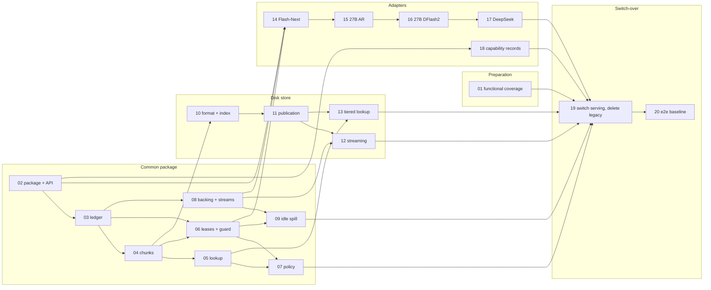

# Cache redesign implementation cards

Status: draft for review. Revised 2026-10-09 after the first review. Card 01's
functional coverage is combined into one PR. Cards 02–06's common contracts,
fake adapter, ledger, checkpoints, prefix lookup and slot protection are implemented; the
cache redesign is not wired in.

These cards split the [RFC implementation plan](../RFC.md#implementation-plan)
into isolated steps. Each PR card is meant to become one pull request, or a
short series when its size says "split". Decision cards record choices that
shape the PR cards; they produce no code.

## How to review

- Each card has the same sections, so you can skim them side by side.
- Leave comments under **Review notes** at the bottom of a card, or inline as a
  blockquote next to the line you mean:

  ```markdown
  > **Review:** this should also cover speculative rollback.
  ```

- Change a card's status line when it is agreed or dropped.

## Status values

`proposed` (written or revised, not reviewed) · `agreed` · `in progress` ·
`done` (implemented and checked) · `merged` · `dropped`.

## Sizes

Changed lines, excluding generated files: **S** ≤ 300 · **M** 300–1,000 ·
**L** > 1,000 (split candidate). Evidence-only cards are marked **evidence**.

## Decisions

| Card | Decision | Status |
| --- | --- | --- |
| [D1](d1-transition.md) | One cache at a time; a single switch-over at the end | agreed |
| [D2](d2-first-mode.md) | Adapter order: Flash-Next, Qwen 27B AR, Qwen 27B DFlash2, DeepSeek | agreed |
| [D3](d3-step-baselines.md) | Step baselines per card instead of upfront targets | agreed |
| [D4](d4-options-and-budgets.md) | Options and budgets | agreed |

## PR cards

| Card | Title | Milestone | Depends on | Size | Status |
| --- | --- | --- | --- | --- | --- |
| [01](01-functional-coverage.md) | Functional coverage for real cache workloads | Preparation | — | L (combined) | done |
| [02](02-package-and-adapter-api.md) | `src/cache/` package, adapter API and fake adapter | Common package | — | L (contracts + fake) | done |
| [03](03-resource-ledger.md) | Resource ledger and reservations | Common package | 02 | M | done |
| [04](04-chunks-and-checkpoints.md) | Chunks, checkpoints and provenance | Common package | 03 | M–L | done |
| [05](05-prefix-index-and-lookup.md) | Prefix index and lookup | Common package | 04 | M | done |
| [06](06-slot-leases-and-mutation.md) | Slot leases and the mutation guard | Common package | 03, 04 | L | done |
| [07](07-retention-policy.md) | Retention policy port | Common package | 05, 06 | M | agreed |
| [08](08-committed-backing-and-streams.md) | Committed backing pool and transfer streams | Common package | 03, D4 | M | done |
| [09](09-idle-spill.md) | Idle spill and reassignment | Common package | 06, 08 | L | done |
| [10](10-disk-format-and-index.md) | Disk format, directory lock and startup index | Disk store | 04, D4 | M | agreed |
| [11](11-publication-and-crash-safety.md) | Crash-safe publication and orphan recovery | Disk store | 10 | M | agreed |
| [12](12-streamed-transfers.md) | Bounded streaming writes and restores | Disk store | 08, 11 | L | agreed |
| [13](13-tiered-lookup-and-eviction.md) | RAM + disk lookup and reference eviction | Disk store | 05, 11 | M | agreed |
| [14](14-flash-next-adapter.md) | Flash-Next MTP and AR adapter | Adapters | 02, 06, 08 | L | proposed |
| [15](15-qwen27b-ar-adapter.md) | Qwen 27B AR adapter | Adapters | 02, 06, 08 | L | proposed |
| [16](16-qwen27b-dflash2.md) | Qwen 27B DFlash2 draft state | Adapters | 15 | M | proposed |
| [17](17-deepseek-adapter.md) | DeepSeek V4 Flash adapter | Adapters | 02, 06, 08 | L | proposed |
| [18](18-non-continuation-records.md) | Capability records for non-continuation models | Adapters | 02 | S | agreed |
| [19](19-switch-over.md) | Switch serving to the new cache | Switch-over | 01, 07, 09, 12–18 | L (stack) | proposed |
| [20](20-e2e-baseline-and-qualification.md) | End-to-end baseline and qualification | After switch-over | 19 | evidence | proposed |

Cards 02–19 change no runtime behavior until card 19 wires them in and deletes
the legacy cache (D1).

## Dependency graph



The arrows between adapters show the D2 order, not a technical dependency;
only 16 needs 15. Parallel lanes once 02 lands: the common package (03 → 07),
device primitives (08 → 09), the disk store (10 → 13, after 04) and the
adapters (after 06 and 08).

## Rules every PR card inherits

These come from the RFC, `AGENTS.md` and the review decisions; cards do not
repeat them.

- **Step baseline (D3):** each card records what it measured when it lands. It
  is a reference point for card 20, not a target. Keep important measurements,
  their environment, commands and limitations in a **Results** section in the
  relevant card. Do not add standalone measurement JSON files to the repository.
- **Starting points, not file lists:** cards name types and areas to start
  from. The implementer chooses which files change.
- **The current cache is untouched** until card 19 deletes it. Improvements to
  the current cache are separate work, outside this initiative.
- **Where PRs land:** cards 01–18 merge into `main` as ordinary PRs. They change
  no runtime behavior, and running their tests in `main`'s CI catches breakage
  from ongoing model work early. Only card 19 lives on a short-lived branch, as
  a stack of PRs merged together (D1). There is no long-lived integration
  branch: the code involved changes too often on `main`, and CI only runs on
  PRs to `main`.
- **No cost while inactive:** anything that touches a production path before
  card 19, such as the adapters' guard calls, must do nothing until the new
  cache is attached. The model's standard speed benchmark shows it.
- **References:** cards list papers, projects and documents to consider during
  implementation. Before reusing code from a project, check its license, and
  add it to `THIRD_PARTY_NOTICES.md` when required. That file already lists
  adapted code and acknowledged optimization references, and
  `tools/ci/check-dependencies.py` validates it. Ideas taken from a paper are
  cited in the PR description and, where it helps, in a code comment.
- Conventional Commit title; run `tools/ci/check-format.py` before C++ commits.
- Tests arrive with the behavior, or in the PR immediately before it.
- Each PR description records: the behavior added, invariants touched,
  commands, environment, artifact locations, per-request outcomes and known
  limits ([RFC](../RFC.md#baseline-checks-and-completion-records)).
- A missing-model skip is not a pass. A fake-adapter test cannot qualify
  numerics or contention.
- The functional `cache` suite leaves an 8 GiB disk directory per run. Delete
  it after each run and check `df -h /` before the next one.
