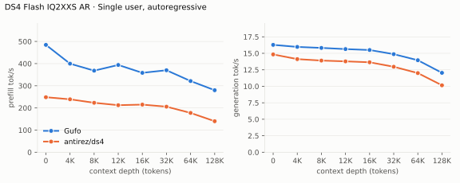
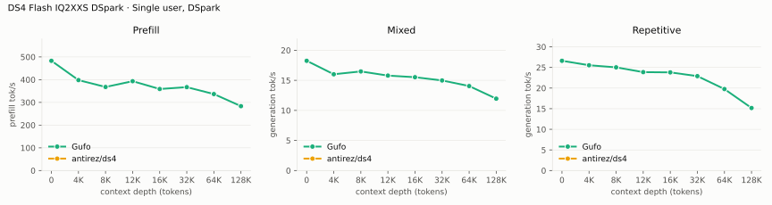
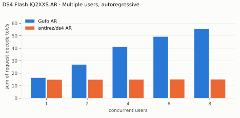
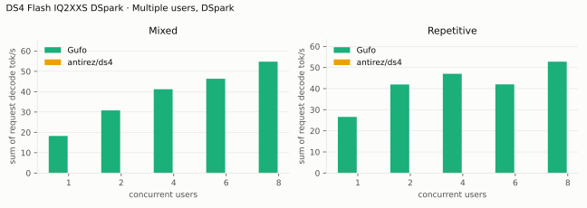
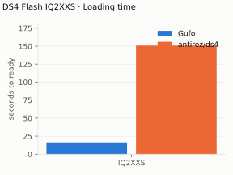
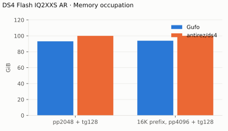

# DeepSeek V4 Flash benchmarks

AMD Strix Halo `gfx1151`, 128 GB unified memory. Antirez Flash 0731 mixed
`IQ2XXS` target, DSpark support sidecar. Greedy, thinking off.
Reference: antirez/ds4 `0aaea5a2` (ROCm).

Measured 2026-09-23–24. One warmed sample per point. Positive gain favors Gufo.
[Quality and measurement details](QUALITY.md#benchmark-method).

## Single user, autoregressive

Approximately pp2048 / tg128; depth is the cached prefix in tokens.

<!-- bench:single-ar -->
| DS4 Flash IQ2XXS AR Depth (tokens) | Gufo pp (tok/s) | antirez/ds4 pp (tok/s) | Gain | Gufo tg (tok/s) | antirez/ds4 tg (tok/s) | Gain |
| ---: | ---: | ---: | ---: | ---: | ---: | ---: |
| 0 | 484.62 | 248.41 | +95.1% | 16.28 | 14.83 | +9.8% |
| 4,096 | 399.75 | 238.93 | +67.3% | 15.97 | 14.12 | +13.1% |
| 8,192 | 368.17 | 223.24 | +64.9% | 15.82 | 13.90 | +13.8% |
| 12,288 | 393.95 | 212.41 | +85.5% | 15.64 | 13.78 | +13.5% |
| 16,384 | 358.41 | 214.97 | +66.7% | 15.50 | 13.64 | +13.6% |
| 32,768 | 370.10 | 205.70 | +79.9% | 14.87 | 12.96 | +14.7% |
| 65,536 | 321.28 | 177.43 | +81.1% | 13.95 | 12.00 | +16.2% |
| 131,072 | 279.95 | 140.04 | +99.9% | 12.04 | 10.15 | +18.6% |
<!-- /bench -->

## Single user, DSpark

pp is the highest measured rate per engine and depth across mixed/repetitive
text.
Antirez DSpark is N/A: its matched C1 control changes greedy output versus AR.

<!-- bench:single-dspark -->
| DS4 Flash IQ2XXS DSpark Depth (tokens) | Gufo pp (tok/s) | antirez/ds4 pp (tok/s) | Gain pp | Gufo tg mixed (tok/s) | antirez/ds4 tg mixed (tok/s) | Gain mixed | Gufo tg repetitive (tok/s) | antirez/ds4 tg repetitive (tok/s) | Gain repetitive |
| ---: | ---: | ---: | ---: | ---: | ---: | ---: | ---: | ---: | ---: |
| 0 | 483.11 | N/A | N/A | 18.25 | N/A | N/A | 26.62 | N/A | N/A |
| 4,096 | 398.06 | N/A | N/A | 16.01 | N/A | N/A | 25.54 | N/A | N/A |
| 8,192 | 367.84 | N/A | N/A | 16.48 | N/A | N/A | 25.03 | N/A | N/A |
| 12,288 | 393.32 | N/A | N/A | 15.79 | N/A | N/A | 23.87 | N/A | N/A |
| 16,384 | 358.90 | N/A | N/A | 15.52 | N/A | N/A | 23.81 | N/A | N/A |
| 32,768 | 367.12 | N/A | N/A | 14.98 | N/A | N/A | 22.90 | N/A | N/A |
| 65,536 | 336.67 | N/A | N/A | 14.05 | N/A | N/A | 19.76 | N/A | N/A |
| 131,072 | 283.45 | N/A | N/A | 11.95 | N/A | N/A | 15.17 | N/A | N/A |
<!-- /bench -->

## Multiple users, autoregressive

Same pp2048 prose prompt as single-user d0, tg128, context 4096 per user.
All sessions prefilled before timed decoding; throughput sums individual rates.

<!-- bench:multi-ar -->
| DS4 Flash IQ2XXS AR Users | Gufo AR (tok/s) | antirez/ds4 AR (tok/s) | Gain |
| ---: | ---: | ---: | ---: |
| 1 | 16.27 | 14.81 | +9.9% |
| 2 | 26.88 | 14.81 | +81.5% |
| 4 | 41.09 | 14.89 | +176.0% |
| 6 | 49.21 | 15.01 | +227.8% |
| 8 | 55.47 | 14.99 | +270.0% |
<!-- /bench -->

## Multiple users, DSpark

Same pp2048 mixed/repetitive prompts as single-user d0, tg128, context 4096
per user. All sessions prefilled before timed decoding; rates sum individual
request decode rates. C1 cross-checks the single-user table.
N/A: Antirez C1 DSpark fails the AR-equivalence control; ROCm batching disables
DSpark at C>1. Gufo DSpark is not faster than AR in the largest cohorts here.

<!-- bench:multi-dspark -->
| DS4 Flash IQ2XXS DSpark Users | Gufo mixed (tok/s) | antirez/ds4 mixed (tok/s) | Gain | Gufo repetitive (tok/s) | antirez/ds4 repetitive (tok/s) | Gain |
| ---: | ---: | ---: | ---: | ---: | ---: | ---: |
| 1 | 18.24 | N/A | N/A | 26.59 | N/A | N/A |
| 2 | 30.80 | N/A | N/A | 41.97 | N/A | N/A |
| 4 | 41.20 | N/A | N/A | 47.04 | N/A | N/A |
| 6 | 46.35 | N/A | N/A | 42.04 | N/A | N/A |
| 8 | 54.74 | N/A | N/A | 52.77 | N/A | N/A |
<!-- /bench -->

## Loading time

C1, context capacity 262144, DSpark. Cold target/sidecar files to HTTP readiness.

<!-- bench:loading -->
| DS4 Flash IQ2XXS Target | Gufo ready (s) | antirez/ds4 ready (s) | Gain |
| --- | ---: | ---: | ---: |
| IQ2XXS | 16.41 | 150.87 | +819.4% |
<!-- /bench -->

## Memory occupation

C1, context capacity 262144, AR. Peak memory reported by HIP.

<!-- bench:memory -->
| DS4 Flash IQ2XXS AR Workload | Gufo GiB | antirez/ds4 GiB | Gain |
| --- | ---: | ---: | ---: |
| pp2048 + tg128 | 93.09 | 99.96 | +7.4% |
| 16K prefix, pp4096 + tg128 | 93.88 | 100.01 | +6.5% |
<!-- /bench -->

