# Gemma 4 26B-A4B benchmarks

AMD Strix Halo `gfx1151`, 128 GB unified memory. Unsloth
`gemma-4-26B-A4B-it` UD-Q4_K_XL, UD-Q6_K_XL and UD-Q8_K_XL targets with the
Unsloth Q8_0 `gemma4-assistant` MTP drafter. The UD-Q8_K_XL tables are a
reduced grid (depths to 32K, up to two users). Gufo drafts up to 15 tokens
under its calibrated length control, verifying the drafter's runner-up beside
each draft; llama.cpp drafts up to four. Gufo columns measured October 7,
2026; llama.cpp columns September 28–30. HTTP, greedy,
thinking off. llama.cpp is the repository's pinned `b11069` (ROCm) reference.
Positive gain favors Gufo. **TODO** means unmeasured.
[Quality and measurement details](QUALITY.md#benchmark-method) · [Model identities](artifacts/model-identities.json)

## Single user, autoregressive

Approximately pp2048 / tg128; depth is the cached prefix in tokens.

<!-- bench:single-ar-q4 -->
| Gemma 4 26B-A4B UD-Q4_K_XL AR Depth (tokens) | Gufo pp (tok/s) | llama.cpp pp (tok/s) | Gain | Gufo tg (tok/s) | llama.cpp tg (tok/s) | Gain |
| ---: | ---: | ---: | ---: | ---: | ---: | ---: |
| 0 | 3991.15 | 1684.76 | +136.9% | 53.23 | 43.96 | +21.1% |
| 4,096 | 3484.24 | 1404.62 | +148.1% | 52.64 | 43.26 | +21.7% |
| 8,192 | 3194.56 | 1251.89 | +155.2% | 52.33 | 42.58 | +22.9% |
| 12,288 | 2752.32 | 1115.27 | +146.8% | 51.72 | 41.94 | +23.3% |
| 16,384 | 2597.17 | 1022.60 | +154.0% | 50.19 | 41.42 | +21.2% |
| 32,768 | 2133.21 | 746.17 | +185.9% | 48.14 | 38.57 | +24.8% |
| 65,536 | 1420.48 | 472.56 | +200.6% | 44.37 | 35.12 | +26.3% |
| 131,072 | 855.94 | 281.37 | +204.2% | 37.97 | 29.42 | +29.1% |
<!-- /bench -->

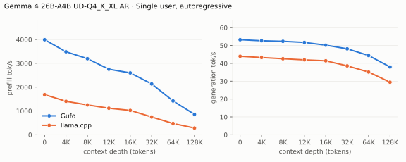

---

<!-- bench:single-ar-q6 -->
| Gemma 4 26B-A4B UD-Q6_K_XL AR Depth (tokens) | Gufo pp (tok/s) | llama.cpp pp (tok/s) | Gain | Gufo tg (tok/s) | llama.cpp tg (tok/s) | Gain |
| ---: | ---: | ---: | ---: | ---: | ---: | ---: |
| 0 | 3783.33 | 1425.52 | +165.4% | 48.85 | 40.94 | +19.3% |
| 4,096 | 3341.97 | 1215.03 | +175.1% | 48.30 | 40.33 | +19.8% |
| 8,192 | 3089.45 | 1103.41 | +180.0% | 48.07 | 39.75 | +20.9% |
| 12,288 | 2668.45 | 996.77 | +167.7% | 47.47 | 39.19 | +21.1% |
| 16,384 | 2458.71 | 918.82 | +167.6% | 46.22 | 38.75 | +19.3% |
| 32,768 | 2000.60 | 679.89 | +194.3% | 44.40 | 36.64 | +21.2% |
| 65,536 | 1336.60 | 447.13 | +198.9% | 41.10 | 33.19 | +23.8% |
| 131,072 | 843.76 | 268.45 | +214.3% | 35.63 | 27.98 | +27.3% |
<!-- /bench -->

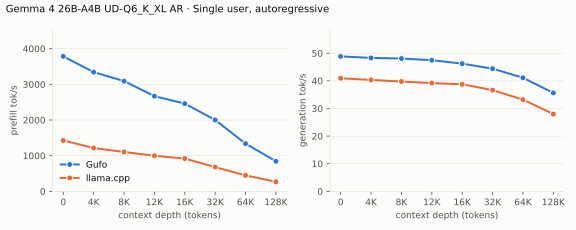

---

<!-- bench:single-ar-q8 -->
| Gemma 4 26B-A4B UD-Q8_K_XL AR Depth (tokens) | Gufo pp (tok/s) | llama.cpp pp (tok/s) | Gain | Gufo tg (tok/s) | llama.cpp tg (tok/s) | Gain |
| ---: | ---: | ---: | ---: | ---: | ---: | ---: |
| 0 | 3760.40 | 1392.01 | +170.1% | 45.90 | 38.69 | +18.6% |
| 4,096 | 3324.04 | 1212.07 | +174.2% | 45.42 | 38.17 | +19.0% |
| 16,384 | 2445.69 | 907.60 | +169.5% | 43.64 | 36.66 | +19.0% |
| 32,768 | 2037.18 | 680.43 | +199.4% | 42.00 | 34.84 | +20.6% |
<!-- /bench -->

## Single user, MTP

pp is the highest measured rate per engine and depth across mixed/repetitive
text. Greedy texts differ between the engines, so accepted drafts per cycle
differ per depth (artifacts). Over the same HTTP path Gufo's AR decodes at
50.7 (Q4), 47.0 (Q6) and 45.7 (Q8) tok/s at d0.

<!-- bench:single-mtp-q4 -->
| Gemma 4 26B-A4B UD-Q4_K_XL MTP Depth (tokens) | Gufo pp (tok/s) | llama.cpp pp (tok/s) | Gain pp | Gufo tg mixed (tok/s) | llama.cpp tg mixed (tok/s) | Gain mixed | Gufo tg repetitive (tok/s) | llama.cpp tg repetitive (tok/s) | Gain repetitive |
| ---: | ---: | ---: | ---: | ---: | ---: | ---: | ---: | ---: | ---: |
| 0 | 3945.16 | 1630.60 | +141.9% | 79.75 | 57.61 | +38.4% | 253.72 | 62.06 | +308.8% |
| 4,096 | 3450.40 | 1351.13 | +155.4% | 84.33 | 58.64 | +43.8% | 214.73 | 65.36 | +228.5% |
| 8,192 | 3209.27 | 1199.20 | +167.6% | 78.90 | 56.85 | +38.8% | 272.17 | 39.35 | +591.7% |
| 12,288 | 2711.03 | 1051.25 | +157.9% | 80.41 | 56.72 | +41.8% | 227.58 | 45.61 | +399.0% |
| 16,384 | 2610.37 | 957.77 | +172.5% | 64.98 | 49.12 | +32.3% | 194.91 | 57.46 | +239.2% |
| 32,768 | 2050.42 | 704.89 | +190.9% | 66.43 | 39.98 | +66.2% | 202.59 | 61.27 | +230.7% |
| 65,536 | 1360.10 | 461.26 | +194.9% | 69.71 | 31.41 | +121.9% | 159.40 | 32.73 | +387.0% |
| 131,072 | 854.66 | 276.99 | +208.6% | 47.68 | 20.98 | +127.3% | 117.33 | 22.16 | +429.5% |
<!-- /bench -->

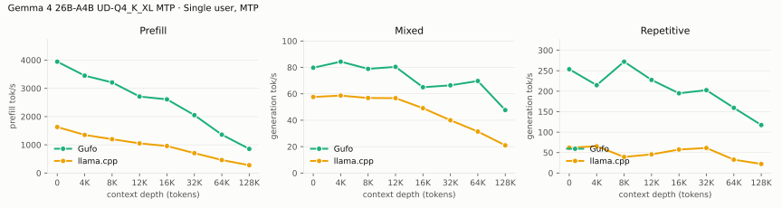

---

<!-- bench:single-mtp-q6 -->
| Gemma 4 26B-A4B UD-Q6_K_XL MTP Depth (tokens) | Gufo pp (tok/s) | llama.cpp pp (tok/s) | Gain pp | Gufo tg mixed (tok/s) | llama.cpp tg mixed (tok/s) | Gain mixed | Gufo tg repetitive (tok/s) | llama.cpp tg repetitive (tok/s) | Gain repetitive |
| ---: | ---: | ---: | ---: | ---: | ---: | ---: | ---: | ---: | ---: |
| 0 | 3775.07 | 1393.42 | +170.9% | 70.26 | 54.03 | +30.0% | 250.90 | 58.75 | +327.1% |
| 4,096 | 3336.65 | 1183.58 | +181.9% | 70.45 | 54.17 | +30.1% | 199.06 | 63.89 | +211.6% |
| 8,192 | 3107.58 | 1043.91 | +197.7% | 77.39 | 50.06 | +54.6% | 251.51 | 39.41 | +538.2% |
| 12,288 | 2661.05 | 943.21 | +182.1% | 75.44 | 54.67 | +38.0% | 212.08 | 58.98 | +259.6% |
| 16,384 | 2570.84 | 864.65 | +197.3% | 73.60 | 45.14 | +63.0% | 182.46 | 52.93 | +244.7% |
| 32,768 | 2010.40 | 651.38 | +208.6% | 60.83 | 37.61 | +61.7% | 207.42 | 60.24 | +244.3% |
| 65,536 | 1334.49 | 435.03 | +206.8% | 57.28 | 33.29 | +72.1% | 153.26 | 31.08 | +393.1% |
| 131,072 | 843.32 | 265.20 | +218.0% | 45.22 | 22.62 | +99.9% | 112.54 | 15.26 | +637.5% |
<!-- /bench -->

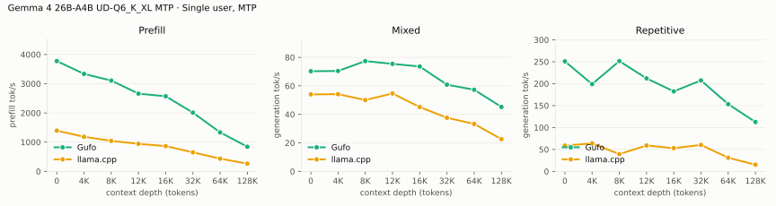

---

<!-- bench:single-mtp-q8 -->
| Gemma 4 26B-A4B UD-Q8_K_XL MTP Depth (tokens) | Gufo pp (tok/s) | llama.cpp pp (tok/s) | Gain pp | Gufo tg mixed (tok/s) | llama.cpp tg mixed (tok/s) | Gain mixed | Gufo tg repetitive (tok/s) | llama.cpp tg repetitive (tok/s) | Gain repetitive |
| ---: | ---: | ---: | ---: | ---: | ---: | ---: | ---: | ---: | ---: |
| 0 | 3758.25 | 1376.85 | +173.0% | 70.61 | 47.09 | +49.9% | 241.18 | 54.45 | +342.9% |
| 4,096 | 3323.72 | 1175.04 | +182.9% | 68.78 | 49.15 | +39.9% | 196.93 | 58.39 | +237.3% |
| 16,384 | 2633.27 | 885.18 | +197.5% | 67.64 | 47.25 | +43.2% | 185.67 | 54.67 | +239.6% |
| 32,768 | 2021.88 | 659.89 | +206.4% | 61.88 | 34.99 | +76.9% | 190.66 | 58.45 | +226.2% |
<!-- /bench -->

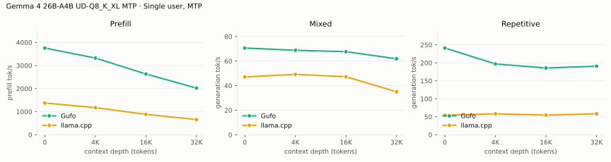

## Single user, sampled MTP

Temperature 1, top-k 64, top-p 0.95, repeat penalty 1.05; a story-writing turn
after the cached prefix. Mean of five requests with seeds 1–5. Seed 3's prompt
is 2051 tokens; a prefill chunk past 2048 tokens runs about 5% slower, which
widens Gufo's prefill spread.

<!-- bench:single-mtp-sampled-q4 -->
| Gemma 4 26B-A4B UD-Q4_K_XL MTP Depth (tokens) | Gufo pp (tok/s) | llama.cpp pp (tok/s) | Gain | Gufo tg (tok/s) | llama.cpp tg (tok/s) | Gain |
| ---: | ---: | ---: | ---: | ---: | ---: | ---: |
| 0 | 3844.86 ± 166.59 | 1580.72 ± 16.34 | +143.2% | 71.79 ± 1.18 | 51.02 ± 3.74 | +40.7% |
<!-- /bench -->

---

<!-- bench:single-mtp-sampled-q6 -->
| Gemma 4 26B-A4B UD-Q6_K_XL MTP Depth (tokens) | Gufo pp (tok/s) | llama.cpp pp (tok/s) | Gain | Gufo tg (tok/s) | llama.cpp tg (tok/s) | Gain |
| ---: | ---: | ---: | ---: | ---: | ---: | ---: |
| 0 | 3695.17 ± 163.47 | 1360.32 ± 10.89 | +171.6% | 63.76 ± 6.04 | 45.05 ± 2.29 | +41.5% |
<!-- /bench -->

---

<!-- bench:single-mtp-sampled-q8 -->
| Gemma 4 26B-A4B UD-Q8_K_XL MTP Depth (tokens) | Gufo pp (tok/s) | llama.cpp pp (tok/s) | Gain | Gufo tg (tok/s) | llama.cpp tg (tok/s) | Gain |
| ---: | ---: | ---: | ---: | ---: | ---: | ---: |
| 0 | 3666.51 ± 168.85 | 1364.58 ± 5.04 | +168.7% | 63.72 ± 6.12 | 39.46 ± 3.53 | +61.5% |
<!-- /bench -->

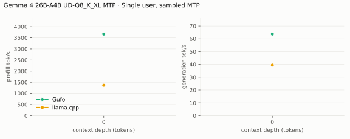

## Multiple users, autoregressive

Same pp2048 prose prompt as single-user d0, tg128, context 4096 per user.
All sessions prefilled before timed decoding; throughput sums individual rates.

<!-- bench:multi-ar-q4 -->
| Gemma 4 26B-A4B UD-Q4_K_XL AR Users | Gufo AR (tok/s) | llama.cpp AR (tok/s) | Gain |
| ---: | ---: | ---: | ---: |
| 1 | 53.18 | 43.99 | +20.9% |
| 2 | 92.59 | 71.85 | +28.9% |
| 4 | 150.42 | 106.17 | +41.7% |
| 6 | 182.57 | 129.53 | +40.9% |
| 8 | 213.20 | 146.37 | +45.7% |
<!-- /bench -->

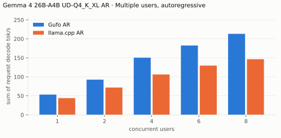

---

<!-- bench:multi-ar-q6 -->
| Gemma 4 26B-A4B UD-Q6_K_XL AR Users | Gufo AR (tok/s) | llama.cpp AR (tok/s) | Gain |
| ---: | ---: | ---: | ---: |
| 1 | 48.79 | 40.76 | +19.7% |
| 2 | 80.39 | 66.71 | +20.5% |
| 4 | 135.95 | 95.56 | +42.3% |
| 6 | 171.28 | 122.78 | +39.5% |
| 8 | 207.33 | 133.78 | +55.0% |
<!-- /bench -->

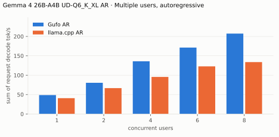

---

<!-- bench:multi-ar-q8 -->
| Gemma 4 26B-A4B UD-Q8_K_XL AR Users | Gufo AR (tok/s) | llama.cpp AR (tok/s) | Gain |
| ---: | ---: | ---: | ---: |
| 1 | 45.87 | 38.46 | +19.3% |
| 2 | 82.38 | 59.11 | +39.4% |
<!-- /bench -->

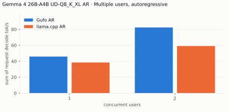

## Multiple users, MTP

Same pp2048 mixed/repetitive prompts as single-user d0, tg128. C1 directly
cross-checks that row. All sessions prefilled before timed decoding. Gufo
prices each session's drafts against the whole batched forward, so at C8 it
decodes about as fast as batched AR; UD-Q6_K_XL mixed text at C4 still trails
Gufo's own AR (126 vs 143 tok/s, one sample).

<!-- bench:multi-mtp-q4 -->
| Gemma 4 26B-A4B UD-Q4_K_XL MTP Users | Gufo mixed (tok/s) | llama.cpp mixed (tok/s) | Gain | Gufo repetitive (tok/s) | llama.cpp repetitive (tok/s) | Gain |
| ---: | ---: | ---: | ---: | ---: | ---: | ---: |
| 1 | 79.34 | 56.96 | +39.3% | 261.41 | 61.64 | +324.1% |
| 2 | 135.71 | 89.93 | +50.9% | 309.66 | 102.28 | +202.8% |
| 4 | 183.33 | 126.24 | +45.2% | 308.49 | 140.44 | +119.7% |
| 6 | 193.66 | 160.35 | +20.8% | 335.79 | 171.28 | +96.0% |
| 8 | 221.50 | 184.92 | +19.8% | 281.73 | 196.02 | +43.7% |
<!-- /bench -->

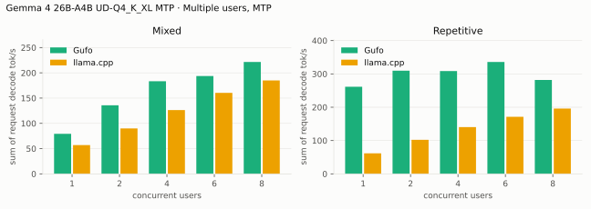

---

<!-- bench:multi-mtp-q6 -->
| Gemma 4 26B-A4B UD-Q6_K_XL MTP Users | Gufo mixed (tok/s) | llama.cpp mixed (tok/s) | Gain | Gufo repetitive (tok/s) | llama.cpp repetitive (tok/s) | Gain |
| ---: | ---: | ---: | ---: | ---: | ---: | ---: |
| 1 | 71.08 | 51.22 | +38.8% | 254.22 | 57.94 | +338.8% |
| 2 | 121.97 | 81.47 | +49.7% | 272.10 | 90.28 | +201.4% |
| 4 | 154.06 | 113.95 | +35.2% | 294.78 | 131.20 | +124.7% |
| 6 | 179.99 | 152.44 | +18.1% | 318.01 | 167.68 | +89.7% |
| 8 | 200.28 | 170.86 | +17.2% | 272.76 | 197.08 | +38.4% |
<!-- /bench -->

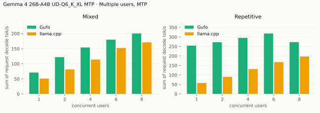

---

<!-- bench:multi-mtp-q8 -->
| Gemma 4 26B-A4B UD-Q8_K_XL MTP Users | Gufo mixed (tok/s) | llama.cpp mixed (tok/s) | Gain | Gufo repetitive (tok/s) | llama.cpp repetitive (tok/s) | Gain |
| ---: | ---: | ---: | ---: | ---: | ---: | ---: |
| 1 | 71.59 | 47.59 | +50.4% | 239.28 | 52.22 | +358.2% |
| 2 | 120.62 | 75.70 | +59.3% | 269.80 | 88.95 | +203.3% |
<!-- /bench -->

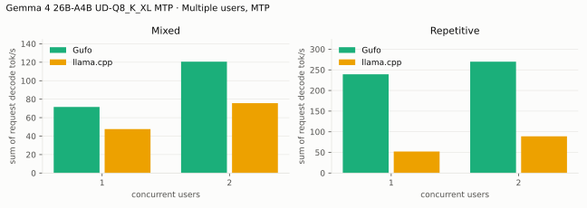

## Image requests

UD-Q4_K_XL, single user, AR, context 16384, the method of the
[31B image requests](../gemma-4-31b/BENCHMARKS.md#image-requests): the same
four images pre-resized to multiples of 48, Gufo at `--image-tokens 280` or
`1120`, llama.cpp b11069 with `-b 2048 -ub 2048` and its default token range.
Cold: a fresh nonce precedes the image; follow-up: the next user turn,
reusing the image prefix. Median of three warmed requests, 64 output tokens,
greedy ([Gufo 280](artifacts/image-q4-gufo-280.json),
[Gufo 1120](artifacts/image-q4-gufo-1120.json),
[llama.cpp](artifacts/image-q4-reference.json); `tools/gemma4/image_bench.py`).

| Image | Budget | Prompt tokens | Gufo cold TTFT (s) | llama.cpp cold TTFT (s) | Gain | Gufo follow-up TTFT (s) | llama.cpp follow-up TTFT (s) | Gain | Gufo tg (tok/s) | llama.cpp tg (tok/s) | Gain |
| --- | ---: | ---: | ---: | ---: | ---: | ---: | ---: | ---: | ---: | ---: | ---: |
| Chart 624×960 | 280 | 312 | 0.36 | 0.74 | +105.7% | 0.10 | 0.22 | +110.2% | 53.11 | 44.66 | +18.9% |
| Logo 768×768 | 280 | 309 | 0.36 | 0.74 | +108.2% | 0.10 | 0.22 | +119.0% | 53.12 | 43.12 | +23.2% |
| Chart 1296×1968 | 1120 | 1159 | 1.63 | 4.49 | +175.9% | 0.15 | 0.37 | +148.8% | 51.50 | 38.09 | +35.2% |
| Logo 1584×1584 | 1120 | 1142 | 1.63 | 4.39 | +169.9% | 0.16 | 0.39 | +138.7% | 51.53 | 36.98 | +39.4% |

Gain is llama.cpp time over Gufo time minus one (decode: Gufo over
llama.cpp). The vision encoder is the 31B's (162 ms for 260 soft tokens,
1,147 ms for 1,107); most of a cold 1,120-token request is the encoder.

## Loading time

C1, context capacity 262144, MTP. Cold model files to HTTP readiness.

<!-- bench:loading -->
| Gemma 4 26B-A4B Target | Gufo ready (s) | llama.cpp ready (s) | Gain |
| --- | ---: | ---: | ---: |
| UD-Q4_K_XL | 3.80 | 5.63 | +48.2% |
| UD-Q6_K_XL | 4.91 | 6.84 | +39.3% |
| UD-Q8_K_XL | 5.67 | 7.65 | +34.9% |
<!-- /bench -->

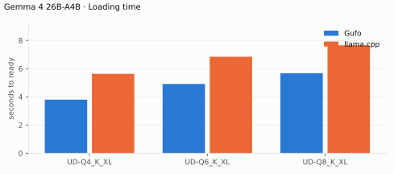

## Memory occupation

Context capacity 133121, autoregressive. llama.cpp preallocates its KV
cache, so its footprint does not grow with the prefix. Gufo's figure includes
its prompt cache snapshots (see the
[31B](../gemma-4-31b/BENCHMARKS.md#memory-occupation)); llama.cpp runs with
`--cache-ram 0`.

<!-- bench:memory-q4 -->
| Gemma 4 26B-A4B UD-Q4_K_XL AR Workload | Gufo GiB | llama.cpp GiB | Gain |
| --- | ---: | ---: | ---: |
| pp2048 + tg128 | 22.66 | 23.64 | +4.3% |
| 16K prefix, pp4096 + tg128 | 24.32 | 24.18 | -0.6% |
<!-- /bench -->

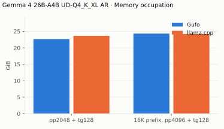

---

<!-- bench:memory-q6 -->
| Gemma 4 26B-A4B UD-Q6_K_XL AR Workload | Gufo GiB | llama.cpp GiB | Gain |
| --- | ---: | ---: | ---: |
| pp2048 + tg128 | 28.51 | 29.49 | +3.4% |
| 16K prefix, pp4096 + tg128 | 30.16 | 30.03 | -0.4% |
<!-- /bench -->

---

<!-- bench:memory-q8 -->
| Gemma 4 26B-A4B UD-Q8_K_XL AR Workload | Gufo GiB | llama.cpp GiB | Gain |
| --- | ---: | ---: | ---: |
| pp2048 + tg128 | 32.57 | 33.59 | +3.1% |
| 16K prefix, pp4096 + tg128 | 34.23 | 34.14 | -0.3% |
<!-- /bench -->

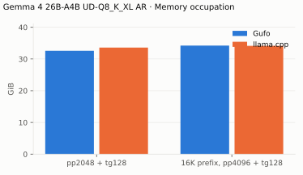
