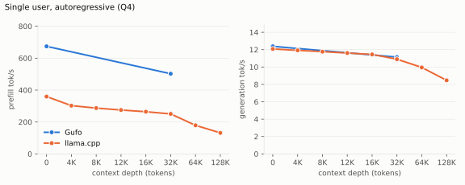
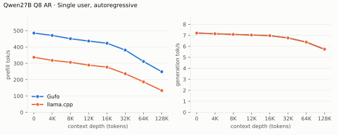
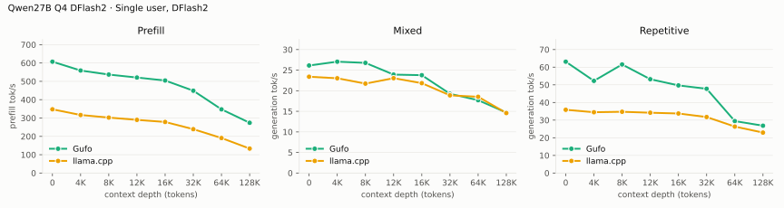
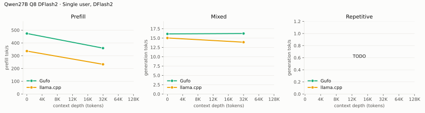
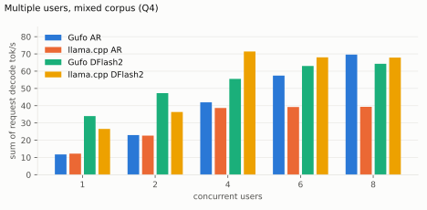
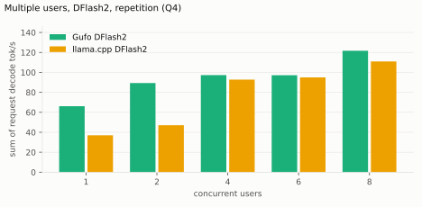
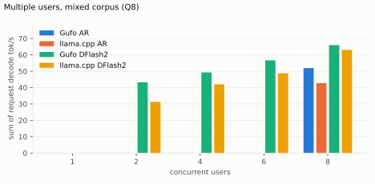
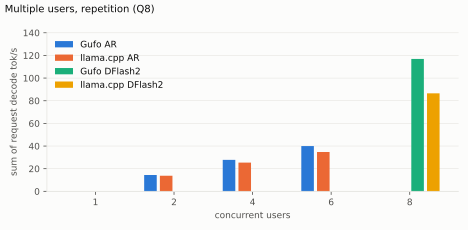
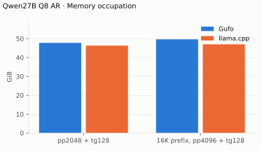
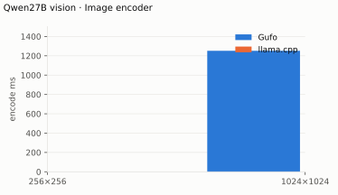

# Qwen3.8 27B on Gufo

| | |
| --- | --- |
| Host | Linux x86-64, AMD `gfx1151`, 128 GB unified memory |
| Gufo | `nix build` at revision `1589ed79` (dirty tree), binary SHA-256 `73590c9c12fb…` |
| Targets | `unsloth/Qwen3.8-27B-GGUF` snapshot `4ca72078`: **UD-Q4_K_XL** (16.35 GiB) and **UD-Q8_K_L** (26.12 GiB; the snapshot ships Q8_K_L, not the Q8_K_XL named in earlier revisions of this card) |
| Speculative | DFlash2 draft **Q4_K_M** with the **adaptive** controller; Q8_0 and BF16 drafts supported, their depth comparison is **TODO** |
| Reference | llama.cpp `llama-server` release `b11069` (`0.4.1-dev (build 11069)`), ROCm gfx1151, `LLAMA_HIP_UMA=ON`, from `flake.nix`, same GGUF files and same draft through `--spec-type draft-dflash` |
| Method | HTTP on both servers, same prompts and timed scope, greedy, thinking off, one sample per point, fresh server per table and concurrency level; `tools/bench/model-bench.py`, 2026-09-21/22. Every artifact records its server command |
| Gain | Gufo over llama.cpp, positive when Gufo is better |
| Quality gate | `tools/qwen27b/check.py fast` passed (8/8) on the same build before the refresh |
| Identities | [`artifacts/model-identities.json`](artifacts/model-identities.json) |
| Layout | [benchmark-model skill](../../../.agents/skills/benchmark-model/SKILL.md) |

PNG/JPEG image input uses the matching BF16 projector with AR or DFlash2;
native MTP is CLI-only. [Image usage and quality checks](README.md#images).
Unmeasured points are **TODO**; the reason is stated next to each table.

## Current focused controls

**2026-09-22**, Q4_K_XL C1, pp2048/tg128, greedy. Context capacity is 36864
through d32K and 133760 at d64K. Depth is the nominal cached prefix.
All three complete 128-token outputs match between AR and adaptive Q4_K_M
DFlash2. One release sample per point; the DFlash2 d32K control was repeated
to resolve PP variation. The matching control retains PP; both samples are
recorded, and small timing differences remain provisional.
Counts, output hashes and binary identities:
[AR](artifacts/q4-ar-c1-focused.json),
[DFlash2](artifacts/q4-dflash2-c1-focused.json),
[paired-controller and C1 controls](artifacts/q4-c2-focused.json).
The full comparison tables below remain the September 21 sweep.

| Mode | Depth | pp tok/s | tg tok/s | Draft acceptance |
| --- | ---: | ---: | ---: | ---: |
| AR | 0 | 665.99 | 11.97 | — |
| AR | 32,768 | 503.55 | 10.77 | — |
| AR | 65,536 | 413.81 | 9.82 | — |
| DFlash2 | 0 | 610.18 | 30.05 | 47.3% |
| DFlash2 | 32,768 | 473.11 | 21.38 | 44.1% |
| DFlash2 | 65,536 | 394.63 | 17.03 | 44.5% |

Fresh pinned llama.cpp d0 controls reach **12.01 tok/s AR** and **27.16 tok/s
DFlash2**, with PP **359.53/344.56 tok/s**, respectively. At d64K its
DFlash2 reaches **19.52 tok/s TG** and **196.58 tok/s PP** with the same
request messages as Gufo. Its greedy d0 AR/DFlash2 outputs differ; see
[evaluation](EVALUATION.md).

The separate tg128 word-repetition check reaches **68.51 tok/s** at d0
and **41.40 tok/s** at d64K, both with
**100% draft acceptance**. It adds
38/41 prompt tokens, respectively; it is not a pp2048 workload.

**C2**, sum of the two individual request decode rates. Fresh servers,
context 4096, 30–53 prompt tokens, tg128, one warmup and one measured round.
Every output matches C1 AR; no prompt-cache hits. Adaptive uses measured
Q4 pair costs for greedy requests.
[Measurements and focused profile](artifacts/q4-c2-focused.json).

| Workload | AR tok/s | DFlash2 tok/s | Draft acceptance |
| --- | ---: | ---: | ---: |
| Word repetition | 23.26 | 103.35 | 100% |
| Pangram / train problem | 23.27 | 69.79 | 68.1% |
| Italian / Chinese explanations | TODO | 41.11 | 45.0% |

At **d32K**, C2 DFlash2 reaches **32.55 tok/s** on the pp2048/tg128
continuation, with **58.3% acceptance**. Each request reuses 32,552 cached
tokens and prefills 2,011 new tokens; both complete outputs match C1 AR.
Context capacity 36864, one measured pair.

## Loading and continuation

The cold-file-cache loading table is **not measured**: the refresh host has
no privileged page-cache drop (`echo 3 > /proc/sys/vm/drop_caches`, no
`sudo`/`doas`), so the driver skipped the table on both targets and the
earlier hand-measured Gufo cells were retired rather than kept next to an
unmeasured reference. Rerun with `--drop-caches "<privileged command>"` on a
host that has one.

<!-- bench:loading -->
| Target | Gufo ready | llama.cpp ready | Gain |
| --- | ---: | ---: | ---: |
| Q4 | TODO | TODO | TODO |
| Q8 | TODO | TODO | TODO |
<!-- /bench -->

Warm-cache readiness during this refresh (not a cold measurement): Gufo
reported `load_completed` after 0.65 s (Q4, context 35456) and 1.23 s (Q4,
context 262144) once the GGUF was in the page cache. A 626-token Q4+DFlash2
prompt snapshot occupies **216 MiB**, independent of unused context
capacity; cancel/continue reused 661 tokens and prefilled 61 new tokens,
restoring the prompt snapshot in **3.13 ms** (2026-09-21 hand controls, not
a long-conversation latency distribution).

## Single user, autoregressive

Standard sweep: **pp2048 / tg128**, C1, greedy. Cells are tok/s from the
servers' own `timings`; depth is a cached conversation prefix (a prior user
turn of about `d` tokens answered with one token), and the timed request
continues that conversation with a new ~2048-token user turn. Synthetic
paragraph text (1.167 tokens/word, 12-token template overhead); the driver
accepted a point only when `cache_n` was within 0.5% of `d` and `prompt_n`
within 0.5% of 2048 (actual counts per sample are in the artifacts).
Context capacity 35456 on both servers for the 0–32K rows and 133760 for
the 64K and 128K rows (measured 2026-09-21 in a later pass with the same
method); one warmed sample per point.
Artifacts: `artifacts/single-ar-{q4,q8}-{gufo,reference}.json`.

<!-- bench:single-ar-q4 -->
| Depth | Gufo pp | llama.cpp pp | Gain | Gufo tg | llama.cpp tg | Gain |
| ---: | ---: | ---: | ---: | ---: | ---: | ---: |
| 0 | 633.08 | 326.21 | +94.1% | 9.68 | 12.09 | -19.9% |
| 4,096 | 583.61 | 302.46 | +93.0% | 11.70 | 11.92 | -1.8% |
| 8,192 | 553.05 | 287.14 | +92.6% | 11.32 | 11.77 | -3.8% |
| 12,288 | 489.85 | 275.09 | +78.1% | 11.24 | 11.61 | -3.2% |
| 16,384 | 459.05 | 264.36 | +73.6% | 11.03 | 11.45 | -3.7% |
| 32,768 | 415.94 | 228.96 | +81.7% | 10.33 | 10.91 | -5.3% |
| 65,536 | 376.89 | 179.00 | +110.6% | 9.26 | 9.95 | -6.9% |
| 131,072 | 267.41 | 131.74 | +103.0% | 7.38 | 8.47 | -12.9% |
<!-- /bench -->



<!-- bench:single-ar-q8 -->
| Depth | Gufo pp | llama.cpp pp | Gain | Gufo tg | llama.cpp tg | Gain |
| ---: | ---: | ---: | ---: | ---: | ---: | ---: |
| 0 | 679.77 | 317.30 | +114.2% | 6.62 | 8.01 | -17.4% |
| 4,096 | 632.28 | 297.17 | +112.8% | 7.42 | 7.93 | -6.4% |
| 8,192 | 606.46 | 284.36 | +113.3% | 7.34 | 7.86 | -6.6% |
| 12,288 | 533.89 | 273.43 | +95.3% | 7.27 | 7.79 | -6.7% |
| 16,384 | 507.32 | 262.89 | +93.0% | 7.19 | 7.73 | -7.0% |
| 32,768 | 442.06 | 226.12 | +95.5% | 6.90 | 7.48 | -7.8% |
| 65,536 | 361.73 | 179.05 | +102.0% | 6.37 | 7.01 | -9.1% |
| 131,072 | 261.72 | 131.10 | +99.6% | 5.43 | 6.24 | -13.0% |
<!-- /bench -->



The September 21 shallow decode deficit came from serial attention below 4K.
The current Q4 AR controls above use parallel attention from 128 tokens and
shared KV loads from 512 tokens. A full comparative refresh is **TODO**.

## Single user, DFlash2

**pp2048 / tg128**, C1, greedy, Q4_K_M draft, adaptive controller, same
prompts, depths and context capacity as the autoregressive table, one warmed
sample per point. llama.cpp `b11069` runs the same draft through
`--spec-type draft-dflash --spec-draft-model <draft> --spec-draft-ngl 999`
with its default draft parameters, so the reference column is a real DFlash2
comparison. `accepted/step` is the mean number of accepted draft tokens per
verification step (`draft_n_accepted / (predicted_n − draft_n_accepted)`);
tokens per step is this plus one, so it is proportional to the speculative
speedup and, unlike an acceptance rate, does not reward a controller for
proposing less. The measured turn asks for a detailed summary and a story,
so the generated text is ordinary prose; the repetitive workload has its own
table. The 64K and 128K rows were measured at context 133760.
Artifacts: `artifacts/single-dflash2-{q4,q8}-{gufo,reference}.json`.

<!-- bench:single-dflash2-q4 -->
| Depth | Gufo pp | llama.cpp pp | Gain | Gufo tg | llama.cpp tg | Gain | Gufo accepted/step | llama.cpp accepted/step |
| ---: | ---: | ---: | ---: | ---: | ---: | ---: | ---: | ---: |
| 0 | 596.64 | 317.38 | +88.0% | 21.97 | 23.41 | -6.2% | 1.72 | 1.51 |
| 4,096 | 555.70 | 298.19 | +86.4% | 25.48 | 23.03 | +10.6% | 1.91 | 1.51 |
| 8,192 | 537.88 | 284.44 | +89.1% | 24.18 | 21.76 | +11.1% | 1.98 | 1.42 |
| 12,288 | 521.47 | 272.58 | +91.3% | 21.46 | 22.66 | -5.3% | 1.72 | 1.61 |
| 16,384 | 499.96 | 260.16 | +92.2% | 20.34 | 21.87 | -7.0% | 1.72 | 1.51 |
| 32,768 | 440.44 | 224.69 | +96.0% | 15.10 | 18.77 | -19.6% | 1.51 | 1.29 |
| 65,536 | 338.23 | 177.90 | +90.1% | 8.84 | 18.32 | -51.7% | 2.05 | 1.51 |
| 131,072 | 258.41 | 126.64 | +104.1% | 4.38 | 14.16 | -69.1% | 2.12 | 1.37 |
<!-- /bench -->



Repetitive workload (**TODO**, pending the 27B DFlash2 changes in progress):
same prefixes and depths, the measured turn asks the model to repeat the
passage word for word, so the output is fully predictable — the single-user
analogue of the `repetition` corpus below.

<!-- bench:single-dflash2-repetition-q4 -->
| Depth | Gufo pp | llama.cpp pp | Gain | Gufo tg | llama.cpp tg | Gain | Gufo accepted/step | llama.cpp accepted/step |
| ---: | ---: | ---: | ---: | ---: | ---: | ---: | ---: | ---: |
| 0 | TODO | TODO | TODO | TODO | TODO | TODO | TODO | TODO |
| 4,096 | TODO | TODO | TODO | TODO | TODO | TODO | TODO | TODO |
| 8,192 | TODO | TODO | TODO | TODO | TODO | TODO | TODO | TODO |
| 12,288 | TODO | TODO | TODO | TODO | TODO | TODO | TODO | TODO |
| 16,384 | TODO | TODO | TODO | TODO | TODO | TODO | TODO | TODO |
| 32,768 | TODO | TODO | TODO | TODO | TODO | TODO | TODO | TODO |
| 65,536 | TODO | TODO | TODO | TODO | TODO | TODO | TODO | TODO |
| 131,072 | TODO | TODO | TODO | TODO | TODO | TODO | TODO | TODO |
<!-- /bench -->

<!-- bench:single-dflash2-q8 -->
| Depth | Gufo pp | llama.cpp pp | Gain | Gufo tg | llama.cpp tg | Gain | Gufo accepted/step | llama.cpp accepted/step |
| ---: | ---: | ---: | ---: | ---: | ---: | ---: | ---: | ---: |
| 0 | 558.66 | 302.75 | +84.5% | 15.29 | 17.21 | -11.2% | 1.56 | 1.51 |
| 4,096 | 534.82 | 279.73 | +91.2% | 16.78 | 17.72 | -5.3% | 1.67 | 1.61 |
| 8,192 | 511.24 | 268.09 | +90.7% | 13.40 | 17.51 | -23.5% | 1.21 | 1.61 |
| 12,288 | 504.53 | 258.92 | +94.9% | 14.93 | 14.84 | +0.6% | 1.61 | 1.25 |
| 16,384 | 486.49 | 251.53 | +93.4% | 13.88 | 15.79 | -12.1% | 1.51 | 1.42 |
| 32,768 | 428.83 | 216.95 | +97.7% | 11.04 | 18.26 | -39.5% | 1.46 | 1.91 |
| 65,536 | 333.39 | 172.91 | +92.8% | 6.32 | 14.20 | -55.5% | 1.91 | 1.46 |
| 131,072 | 256.23 | 123.84 | +106.9% | 2.98 | 12.74 | -76.6% | 1.61 | 1.56 |
<!-- /bench -->




<!-- bench:single-dflash2-repetition-q8 -->
| Depth | Gufo pp | llama.cpp pp | Gain | Gufo tg | llama.cpp tg | Gain | Gufo accepted/step | llama.cpp accepted/step |
| ---: | ---: | ---: | ---: | ---: | ---: | ---: | ---: | ---: |
| 0 | TODO | TODO | TODO | TODO | TODO | TODO | TODO | TODO |
| 4,096 | TODO | TODO | TODO | TODO | TODO | TODO | TODO | TODO |
| 8,192 | TODO | TODO | TODO | TODO | TODO | TODO | TODO | TODO |
| 12,288 | TODO | TODO | TODO | TODO | TODO | TODO | TODO | TODO |
| 16,384 | TODO | TODO | TODO | TODO | TODO | TODO | TODO | TODO |
| 32,768 | TODO | TODO | TODO | TODO | TODO | TODO | TODO | TODO |
| 65,536 | TODO | TODO | TODO | TODO | TODO | TODO | TODO | TODO |
| 131,072 | TODO | TODO | TODO | TODO | TODO | TODO | TODO | TODO |
<!-- /bench -->

Thinking workload (**TODO**, pending the 27B DFlash2 changes in progress):
thinking left on, the measured turn asks a question that requires reasoning,
so the timed tokens are chain-of-thought rather than prose.

<!-- bench:single-dflash2-thinking-q4 -->
| Depth | Gufo pp | llama.cpp pp | Gain | Gufo tg | llama.cpp tg | Gain | Gufo accepted/step | llama.cpp accepted/step |
| ---: | ---: | ---: | ---: | ---: | ---: | ---: | ---: | ---: |
| 0 | TODO | TODO | TODO | TODO | TODO | TODO | TODO | TODO |
| 4,096 | TODO | TODO | TODO | TODO | TODO | TODO | TODO | TODO |
| 8,192 | TODO | TODO | TODO | TODO | TODO | TODO | TODO | TODO |
| 12,288 | TODO | TODO | TODO | TODO | TODO | TODO | TODO | TODO |
| 16,384 | TODO | TODO | TODO | TODO | TODO | TODO | TODO | TODO |
| 32,768 | TODO | TODO | TODO | TODO | TODO | TODO | TODO | TODO |
| 65,536 | TODO | TODO | TODO | TODO | TODO | TODO | TODO | TODO |
| 131,072 | TODO | TODO | TODO | TODO | TODO | TODO | TODO | TODO |
<!-- /bench -->

<!-- bench:single-dflash2-thinking-q8 -->
| Depth | Gufo pp | llama.cpp pp | Gain | Gufo tg | llama.cpp tg | Gain | Gufo accepted/step | llama.cpp accepted/step |
| ---: | ---: | ---: | ---: | ---: | ---: | ---: | ---: | ---: |
| 0 | TODO | TODO | TODO | TODO | TODO | TODO | TODO | TODO |
| 4,096 | TODO | TODO | TODO | TODO | TODO | TODO | TODO | TODO |
| 8,192 | TODO | TODO | TODO | TODO | TODO | TODO | TODO | TODO |
| 12,288 | TODO | TODO | TODO | TODO | TODO | TODO | TODO | TODO |
| 16,384 | TODO | TODO | TODO | TODO | TODO | TODO | TODO | TODO |
| 32,768 | TODO | TODO | TODO | TODO | TODO | TODO | TODO | TODO |
| 65,536 | TODO | TODO | TODO | TODO | TODO | TODO | TODO | TODO |
| 131,072 | TODO | TODO | TODO | TODO | TODO | TODO | TODO | TODO |
<!-- /bench -->

On generic prose Gufo accepts **more draft tokens per step than llama.cpp**
at every depth (Q4 1.5–2.1 vs 1.3–1.6; Q8 1.4–1.9 vs 1.2–1.5), yet its
DFlash2 decode is only within ±11% of llama.cpp up to 16K, falls behind by
20% at 32K and collapses beyond: 8.8 / 4.4 tok/s (Q4) and 6.3 / 3.0 tok/s
(Q8) at 64K / 128K, **slower than Gufo AR at the same depth** (9.3 / 7.4 and
6.4 / 5.4), while llama.cpp DFlash2 holds 18.3 / 14.2 and 15.4 / 12.9. With
draft quality equal or better, the loss is entirely in the per-step cost of
verification at depth. Greedy DFlash2 output matches AR token IDs (verified
by the concurrency `Exact` checks below at C1).

Draft-precision control, **2026-09-16**: cached `prose_tides`, **tg64**,
adaptive, greedy C1, one warmed release sample per draft. Generation tok/s:

| Draft | Q4 target | Q8 target |
| --- | ---: | ---: |
| Q4_K_M | **23.51** | **15.61** |
| Q8_0 | 22.66 | 15.33 |
| BF16 | 21.96 | 14.11 |

Full depth comparison across all three drafts and MTP performance: **TODO**.
[Prompts, artifact identities and quality checks](EVALUATION.md).

## Multiple users

Aggregate delivered output tok/s (`aggregate.output_tokens_per_second.overall`):
total output tokens divided by the sum of measured request-group spans.
Context capacity 4096 per user (Gufo `--sessions C --context 4096`, llama.cpp
`-np C -c 4096·C`), greedy, thinking off, **128 output tokens**, one warmup
round, one measured repetition, fresh server per concurrency level. Workloads
come from the [speculative corpus](artifacts/speculative-corpus.json):
`repetition` runs `repetition_word` on every user; `mixed` cycles through the
nine distinct corpus cases. DFlash2 uses the Q4_K_M draft on both servers
(Gufo adaptive controller; llama.cpp `draft-dflash` defaults). `Exact` counts
llama.cpp AR completions whose hash matches the Gufo AR C1 reference; every
Gufo AR and Gufo DFlash2 completion at C2–C8 matched that reference.
Artifacts: `artifacts/multi-{mixed,repetition}-{q4,q8}-{gufo-ar,gufo-dflash2,reference,reference-dflash2}.json`.

Prompt-cache mismatch ([#245](https://github.com/gufo-org/gufo/issues/245)):
the driver sends `cache_prompt=false`, which llama-server honours (0 cache
hits) but Gufo ignores, so Gufo reused its
prompt snapshot for repeated prompts (all `repetition` requests; 14 of 16
`mixed` requests at C8). The prompts are 30–53 tokens, so the skipped
prefill is about 0.2 s of a 15–19 s request (≈1–2% of the Gufo AR span);
llama.cpp's C8 prefill of the same prompts takes 1.4–1.5 s per request. The
`summary_gpu` case stops at EOS after 34–38 tokens on both servers; all other
completions reach 128 tokens.

<!-- bench:multi-mixed-q4 -->
| Users | Gufo AR | llama.cpp AR | Gain | Gufo DFlash2 | llama.cpp DFlash2 | Gain | Exact |
| ---: | ---: | ---: | ---: | ---: | ---: | ---: | ---: |
| 1 | 11.50 | 11.81 | -2.6% | 29.05 | 23.80 | +22.1% | 3/9 |
| 2 | 20.45 | 19.96 | +2.5% | 34.77 | 29.39 | +18.3% | 5/10 |
| 4 | 37.10 | 33.50 | +10.7% | 41.98 | 49.91 | -15.9% | 8/12 |
| 6 | 50.37 | 32.75 | +53.8% | 44.18 | 46.45 | -4.9% | 8/12 |
| 8 | 61.40 | 32.21 | +90.6% | 47.61 | 43.88 | +8.5% | 11/16 |
<!-- /bench -->



<!-- bench:multi-repetition-q4 -->
| Users | Gufo AR | llama.cpp AR | Gain | Gufo DFlash2 | llama.cpp DFlash2 | Gain | Exact |
| ---: | ---: | ---: | ---: | ---: | ---: | ---: | ---: |
| 1 | 11.84 | 11.78 | +0.5% | 65.98 | 33.04 | +99.7% | 1/1 |
| 2 | 23.02 | 21.40 | +7.6% | 89.12 | 42.46 | +109.9% | 2/2 |
| 4 | 41.93 | 35.92 | +16.7% | 97.04 | 79.15 | +22.6% | 4/4 |
| 6 | 56.88 | 41.76 | +36.2% | 96.94 | 81.90 | +18.4% | 6/6 |
| 8 | 67.84 | 42.95 | +58.0% | 101.14 | 93.84 | +7.8% | 8/8 |
<!-- /bench -->



Q4 at C8, request latency median / p95: Gufo AR 15.0 / 15.2 s, Gufo DFlash2
14.6 / 19.4 s, llama.cpp AR 28.9 / 28.9 s, llama.cpp DFlash2 17.4 / 21.4 s
(mixed); Gufo AR 15.3 s, Gufo DFlash2 10.4 s, llama.cpp AR 23.8 s, llama.cpp
DFlash2 10.9 s (repetition, all requests identical). Accepted draft tokens
per step at C8: Gufo DFlash2 2.5 on mixed and 6.1 on repetition, llama.cpp
DFlash2 1.9 and 2.9 (`render` prints them per artifact). The mixed `Exact` counts show
that llama.cpp's greedy text diverges from Gufo's in most distinct cases
(3 of 9 identical at C1), so those throughputs compare equal token budgets,
not identical outputs. Gufo AR scales to 1.9× llama.cpp at C8; Gufo DFlash2
leads llama.cpp DFlash2 at C1–C2 and C8 but not at C4–C6 on the mixed
corpus, and above C4 delivers less than Gufo AR, so the **100 tok/s at C2 /
150 tok/s at C4** targets remain unmet on mixed prompts (repetition reaches
88 / 95 tok/s).

<!-- bench:multi-mixed-q8 -->
| Users | Gufo AR | llama.cpp AR | Gain | Gufo DFlash2 | llama.cpp DFlash2 | Gain | Exact |
| ---: | ---: | ---: | ---: | ---: | ---: | ---: | ---: |
| 1 | 7.40 | 7.86 | -5.9% | 22.17 | 17.66 | +25.5% | 4/9 |
| 2 | 14.02 | 13.75 | +2.0% | 29.33 | 26.25 | +11.7% | 6/10 |
| 4 | 26.68 | 24.70 | +8.0% | 33.03 | 41.61 | -20.6% | 4/12 |
| 6 | 37.64 | 26.23 | +43.5% | 34.87 | 37.50 | -7.0% | 3/12 |
| 8 | 47.70 | 30.90 | +54.4% | 37.06 | 39.35 | -5.8% | 4/16 |
<!-- /bench -->



<!-- bench:multi-repetition-q8 -->
| Users | Gufo AR | llama.cpp AR | Gain | Gufo DFlash2 | llama.cpp DFlash2 | Gain | Exact |
| ---: | ---: | ---: | ---: | ---: | ---: | ---: | ---: |
| 1 | 7.50 | 7.85 | -4.5% | 53.65 | 24.62 | +117.9% | 1/1 |
| 2 | 15.66 | 14.82 | +5.7% | 79.44 | 40.95 | +94.0% | 2/2 |
| 4 | 29.82 | 26.46 | +12.7% | 85.72 | 66.94 | +28.1% | 4/4 |
| 6 | 42.19 | 35.07 | +20.3% | 88.62 | 69.40 | +27.7% | 6/6 |
| 8 | 53.19 | 40.65 | +30.8% | 90.30 | 80.57 | +12.1% | 8/8 |
<!-- /bench -->



Q8 at C8, request latency median / p95: Gufo AR 19.2 / 19.4 s, Gufo DFlash2
18.3 / 25.2 s, llama.cpp AR 24.9 / 35.5 s, llama.cpp DFlash2 17.0 / 23.6 s
(mixed); Gufo AR 19.3 s, Gufo DFlash2 11.3 s, llama.cpp AR 25.2 s, llama.cpp
DFlash2 12.7 s (repetition). Accepted draft tokens per step at C8: Gufo
DFlash2 2.4 on mixed and 6.5 on repetition, llama.cpp DFlash2 1.8 and 2.9. Q8 follows the Q4
pattern with lower absolute rates: Gufo AR leads from C2, Gufo DFlash2 trails
llama.cpp DFlash2 at C4–C8 on mixed prompts.

Earlier tg64 short-generation controls (2026-09-15/16, `prose_tides` and a
24-request mixed corpus) and the 2026-09-16 one-process-per-sweep tables
remain in Git history; they used different workloads or server lifecycles
and are not comparable with the tables above. Physical widths, output hashes
and acceptance counts are checked at every concurrency; C1 controls must
retain their performance. Controller and verification details:
[evaluation](EVALUATION.md).

## Memory

Peak device-global HIP memory in use (`hipMemGetInfo` total − free, the
counter Gufo's loader logs as `gpu_device_used_mib`), sampled every 250 ms by
the driver while the request ran; idle baseline 2.38 GiB before either server
started. C1, context capacity 262144 on both servers, both autoregressive, no
draft and no projector loaded. llama.cpp preallocates its whole KV cache at
`-c`, so its footprint changes little with the prefix; Gufo's grows with the
retained prompt state. Gufo's loader reported 38208 (Q4) and 48209 (Q8) MiB
at readiness, which the sampled peaks reproduce.
Artifacts: `artifacts/memory-{q4,q8}-{gufo,reference}.json`.

<!-- bench:memory-q4 -->
| Workload | Gufo GiB | llama.cpp GiB | Gain |
| --- | ---: | ---: | ---: |
| pp2048 + tg128 | 37.99 | 36.72 | -3.3% |
| 16K prefix, pp4096 + tg128 | 39.89 | 37.42 | -6.2% |
<!-- /bench -->


<!-- bench:memory-q8 -->
| Workload | Gufo GiB | llama.cpp GiB | Gain |
| --- | ---: | ---: | ---: |
| pp2048 + tg128 | 47.76 | 46.32 | -3.0% |
| 16K prefix, pp4096 + tg128 | 49.65 | 47.01 | -5.3% |
<!-- /bench -->



Gufo uses 3–6% more device memory than llama.cpp at the same context
capacity, with the gap widening as the prefix grows. An earlier version of
this table sampled `rocm-smi` VRAM + GTT, which does not see Gufo's weight
mapping on unified memory; those numbers are superseded.

## Image encoder

Warm `mmproj-BF16.gguf` encoding, measured **2026-09-20** by hand; excludes
image preprocessing, first weight upload and language-model prefill. Q4 and
Q8 use the same projector. Embeddings are byte-identical to the prior
encoder; see [experiments](EXPERIMENTS.md). The driver does not automate
this table yet, so the 1024×1024 Gufo cell is the retained hand
measurement, the 256×256 cell and the llama.cpp `--mmproj` encode with the
same file remain **TODO**.

<!-- bench:image-encoder -->
| RGB image | Merged tokens | Gufo ms | llama.cpp ms | Gain |
| --- | ---: | ---: | ---: | ---: |
| 256×256 | 64 | TODO | TODO | TODO |
| 1024×1024 | 1024 | 1252 | TODO | TODO |
<!-- /bench -->



## Reproduce and maintain quality

```sh
nix build
nix develop -c python3 tools/qwen27b/check.py fast
Q4=/path/to/Qwen3.8-27B-UD-Q4_K_XL.gguf
Q8=/path/to/Qwen3.8-27B-UD-Q8_K_L.gguf
DRAFT=/path/to/Qwen3.8-27B-DFlash2-Q4_K_M.gguf
MMPROJ=/path/to/mmproj-BF16.gguf
FILES="--gguf q4=$Q4 --gguf q8=$Q8 --draft $DRAFT --mmproj $MMPROJ"
Q4_TABLES=single-ar-q4,single-dflash2-q4,memory-q4,multi-repetition-q4,multi-mixed-q4
Q8_TABLES=single-ar-q8,single-dflash2-q8,memory-q8,multi-repetition-q8,multi-mixed-q8
nix develop -c python3 tools/bench/model-bench.py --model qwen3.8-27b $FILES \
  run --target gufo --table $Q4_TABLES
nix develop -c python3 tools/bench/model-bench.py --model qwen3.8-27b $FILES \
  run --target reference --table $Q4_TABLES
nix develop -c python3 tools/bench/model-bench.py --model qwen3.8-27b $FILES \
  run --target gufo --table $Q8_TABLES
nix develop -c python3 tools/bench/model-bench.py --model qwen3.8-27b $FILES \
  run --target reference --table $Q8_TABLES
# Loading table, only on a host with a privileged page-cache drop:
#   ... run --target gufo --table loading --drop-caches "doas sh -c 'sync; echo 3 > /proc/sys/vm/drop_caches'"
nix develop -c python3 tools/bench/model-bench.py --model qwen3.8-27b render
```

Run Gufo before llama.cpp for the concurrency tables: the reference `Exact`
column compares against the Gufo AR C1 artifact. The 2026-09-21 refresh took
34 min (Gufo Q4), 39 min (llama.cpp Q4), 41 min (Gufo Q8) and 47 min
(llama.cpp Q8) of driver wall time. `gufo bench` is greedy and C1 and is the
kernel-iteration tool; published comparison tables are measured over HTTP on
both sides. Add `--todo` to refresh only rows with `TODO` cells. DFlash2
prefill includes feature capture and draft context injection.

Start with `nix develop -c python3 tools/qwen27b/check.py fast`, then run the
[affected quality checks](EVALUATION.md) before publishing speed. Greedy
speculation must match AR IDs; sampled verification must preserve the target
distribution and reproduce seeded runs within the same configuration.
Independent original-target/MTP qualification: **TODO**.

Optimization targets: **depth-0 and deep-context (32K) generation, DFlash2
generation at C4–C8 on mixed prompts, and Q4/Q8 generation at C2–C8 with and
without DFlash2**. C1 must retain its performance. Track aggregate
throughput, per-user latency, physical batch width, output correctness and
seeded sampling at every concurrency level. Screen changes with short runs;
check retained changes across C1/2/4/6/8 before publishing speed.
