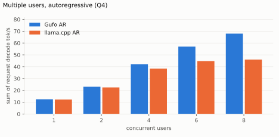
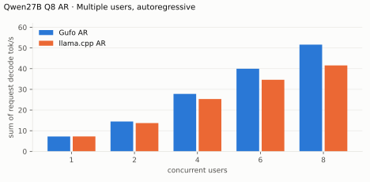
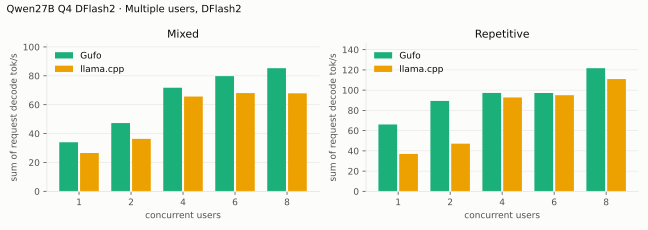
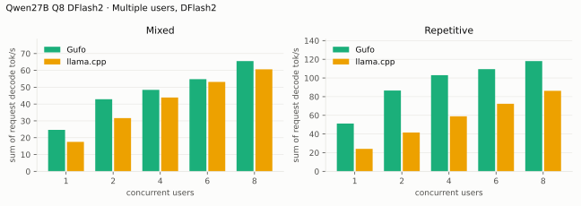

# Qwen27B benchmarks

AMD Strix Halo `gfx1151`, 128 GB unified memory. Gufo through `d0843504`
versus llama.cpp `b11069`, using the same Q4_K_XL / Q8_K_XL targets.
DFlash2 uses the Q4_K_M draft and adaptive controller. HTTP, greedy, thinking off.

Positive gain favors Gufo. **TODO** means unmeasured.
[Quality and measurement details](EVALUATION.md) · [Model identities](artifacts/model-identities.json)

## Single user, autoregressive

Approximately pp2048 / tg128; depth is the cached prefix in tokens.

<!-- bench:single-ar-q4 -->
| Qwen27B Q4 AR Depth (tokens) | Gufo pp (tok/s) | llama.cpp pp (tok/s) | Gain | Gufo tg (tok/s) | llama.cpp tg (tok/s) | Gain |
| ---: | ---: | ---: | ---: | ---: | ---: | ---: |
| 0 | 674.01 | 359.38 | +87.5% | 12.38 | 12.08 | +2.5% |
| 4,096 | TODO | 302.46 | TODO | TODO | 11.92 | TODO |
| 8,192 | TODO | 287.14 | TODO | TODO | 11.77 | TODO |
| 12,288 | TODO | 275.09 | TODO | TODO | 11.61 | TODO |
| 16,384 | TODO | 264.36 | TODO | TODO | 11.45 | TODO |
| 32,768 | 502.29 | 250.69 | +100.4% | 11.14 | 10.90 | +2.2% |
| 65,536 | TODO | 179.00 | TODO | TODO | 9.95 | TODO |
| 131,072 | TODO | 131.74 | TODO | TODO | 8.47 | TODO |
<!-- /bench -->

---

<!-- bench:single-ar-q8 -->
| Qwen27B Q8 AR Depth (tokens) | Gufo pp (tok/s) | llama.cpp pp (tok/s) | Gain | Gufo tg (tok/s) | llama.cpp tg (tok/s) | Gain |
| ---: | ---: | ---: | ---: | ---: | ---: | ---: |
| 0 | 489.22 | 355.17 | +37.7% | 7.20 | 7.20 | +0.0% |
| 4,096 | TODO | TODO | TODO | TODO | TODO | TODO |
| 8,192 | TODO | TODO | TODO | TODO | TODO | TODO |
| 12,288 | TODO | TODO | TODO | TODO | TODO | TODO |
| 16,384 | TODO | TODO | TODO | TODO | TODO | TODO |
| 32,768 | 386.61 | 249.07 | +55.2% | 6.76 | 6.76 | +0.0% |
| 65,536 | TODO | TODO | TODO | TODO | TODO | TODO |
| 131,072 | TODO | TODO | TODO | TODO | TODO | TODO |
<!-- /bench -->

## Single user, DFlash2

pp is the highest measured rate per engine and depth across mixed/repetitive
text. Gufo retains AR output; llama.cpp differs in some controls
([quality details](EVALUATION.md#meaning-of-exact)).

<!-- bench:single-dflash2-q4 -->
| Qwen27B Q4 DFlash2 Depth (tokens) | Gufo pp (tok/s) | llama.cpp pp (tok/s) | Gain pp | Gufo tg mixed (tok/s) | llama.cpp tg mixed (tok/s) | Gain mixed | Gufo tg repetitive (tok/s) | llama.cpp tg repetitive (tok/s) | Gain repetitive |
| ---: | ---: | ---: | ---: | ---: | ---: | ---: | ---: | ---: | ---: |
| 0 | 619.74 | 344.56 | +79.9% | 30.66 | 27.16 | +12.9% | TODO | TODO | TODO |
| 4,096 | TODO | 298.19 | TODO | TODO | 23.03 | TODO | TODO | TODO | TODO |
| 8,192 | TODO | 284.44 | TODO | TODO | 21.76 | TODO | TODO | TODO | TODO |
| 12,288 | TODO | 272.58 | TODO | TODO | 22.66 | TODO | TODO | TODO | TODO |
| 16,384 | TODO | 260.16 | TODO | TODO | 21.87 | TODO | TODO | TODO | TODO |
| 32,768 | 476.85 | TODO | TODO | 21.91 | TODO | TODO | TODO | TODO | TODO |
| 65,536 | TODO | 177.90 | TODO | TODO | 18.32 | TODO | TODO | TODO | TODO |
| 131,072 | TODO | 126.64 | TODO | TODO | 14.16 | TODO | TODO | TODO | TODO |
<!-- /bench -->

---

<!-- bench:single-dflash2-q8 -->
| Qwen27B Q8 DFlash2 Depth (tokens) | Gufo pp (tok/s) | llama.cpp pp (tok/s) | Gain pp | Gufo tg mixed (tok/s) | llama.cpp tg mixed (tok/s) | Gain mixed | Gufo tg repetitive (tok/s) | llama.cpp tg repetitive (tok/s) | Gain repetitive |
| ---: | ---: | ---: | ---: | ---: | ---: | ---: | ---: | ---: | ---: |
| 0 | 473.79 | 336.19 | +40.9% | 16.11 | 15.02 | +7.3% | TODO | TODO | TODO |
| 4,096 | TODO | TODO | TODO | TODO | TODO | TODO | TODO | TODO | TODO |
| 8,192 | TODO | TODO | TODO | TODO | TODO | TODO | TODO | TODO | TODO |
| 12,288 | TODO | TODO | TODO | TODO | TODO | TODO | TODO | TODO | TODO |
| 16,384 | TODO | TODO | TODO | TODO | TODO | TODO | TODO | TODO | TODO |
| 32,768 | 359.28 | 232.53 | +54.5% | 16.22 | 13.89 | +16.8% | TODO | TODO | TODO |
| 65,536 | TODO | TODO | TODO | TODO | TODO | TODO | TODO | TODO | TODO |
| 131,072 | TODO | TODO | TODO | TODO | TODO | TODO | TODO | TODO | TODO |
<!-- /bench -->

## Multiple users, autoregressive

Context 4096 per user, tg128. Throughput sums individual request decode rates,
excluding prefill and scheduling. One AR workload per concurrency.

<!-- bench:multi-ar-q4 -->
| Qwen27B Q4 AR Users | Gufo AR (tok/s) | llama.cpp AR (tok/s) | Gain |
| ---: | ---: | ---: | ---: |
| 1 | 12.42 | 12.20 | +1.8% |
| 2 | 23.04 | 22.46 | +2.6% |
| 4 | 41.97 | 38.32 | +9.5% |
| 6 | 56.96 | 44.74 | +27.3% |
| 8 | 67.94 | 46.02 | +47.6% |
<!-- /bench -->

---

<!-- bench:multi-ar-q8 -->
| Qwen27B Q8 AR Users | Gufo AR (tok/s) | llama.cpp AR (tok/s) | Gain |
| ---: | ---: | ---: | ---: |
| 1 | TODO | TODO | TODO |
| 2 | 14.45 | 13.78 | +4.9% |
| 4 | 27.81 | 25.35 | +9.7% |
| 6 | 39.96 | 34.72 | +15.1% |
| 8 | TODO | TODO | TODO |
<!-- /bench -->

## Multiple users, DFlash2

Mixed prompts and repetitive output, context 4096 per user, up to 128 output
tokens. Rates use actual emitted counts. Older Q4 controls include cache reuse;
[dates and qualification](EVALUATION.md#benchmark-method) distinguish them.

<!-- bench:multi-dflash2-q4 -->
| Qwen27B Q4 DFlash2 Users | Gufo mixed (tok/s) | llama.cpp mixed (tok/s) | Gain | Gufo repetitive (tok/s) | llama.cpp repetitive (tok/s) | Gain |
| ---: | ---: | ---: | ---: | ---: | ---: | ---: |
| 1 | 33.99 | 26.55 | +28.0% | 66.10 | 37.00 | +78.6% |
| 2 | 47.29 | 36.33 | +30.2% | 89.32 | 47.09 | +89.7% |
| 4 | 71.76 | 65.64 | +9.3% | 97.26 | 92.76 | +4.9% |
| 6 | 79.78 | 68.03 | +17.3% | 97.16 | 95.00 | +2.3% |
| 8 | 85.27 | 67.87 | +25.6% | 121.68 | 110.97 | +9.7% |
<!-- /bench -->

---

<!-- bench:multi-dflash2-q8 -->
| Qwen27B Q8 DFlash2 Users | Gufo mixed (tok/s) | llama.cpp mixed (tok/s) | Gain | Gufo repetitive (tok/s) | llama.cpp repetitive (tok/s) | Gain |
| ---: | ---: | ---: | ---: | ---: | ---: | ---: |
| 1 | TODO | TODO | TODO | TODO | TODO | TODO |
| 2 | 43.28 | 31.27 | +38.4% | TODO | TODO | TODO |
| 4 | 49.28 | 42.00 | +17.3% | TODO | TODO | TODO |
| 6 | 56.65 | 48.76 | +16.2% | TODO | TODO | TODO |
| 8 | 65.96 | 63.02 | +4.7% | 116.90 | 86.53 | +35.1% |
<!-- /bench -->

## Loading time

Cold-file-cache measurements are TODO; this host cannot clear the file cache.

<!-- bench:loading -->
| Qwen27B Target | Gufo ready (s) | llama.cpp ready (s) | Gain |
| --- | ---: | ---: | ---: |
| Q4 | TODO | TODO | TODO |
| Q8 | TODO | TODO | TODO |
<!-- /bench -->

## Memory occupation

C1, context capacity 262144, AR. Q8 values use the older **Q8_K_L** artifact;
remeasuring **Q8_K_XL** remains TODO.

<!-- bench:memory-q4 -->
| Qwen27B Q4 AR Workload | Gufo GiB | llama.cpp GiB | Gain |
| --- | ---: | ---: | ---: |
| pp2048 + tg128 | 37.99 | 36.72 | -3.3% |
| 16K prefix, pp4096 + tg128 | 39.89 | 37.42 | -6.2% |
<!-- /bench -->

---

<!-- bench:memory-q8 -->
| Qwen27B Q8 AR Workload | Gufo GiB | llama.cpp GiB | Gain |
| --- | ---: | ---: | ---: |
| pp2048 + tg128 | 47.76 | 46.32 | -3.0% |
| 16K prefix, pp4096 + tg128 | 49.65 | 47.01 | -5.3% |
<!-- /bench -->

## Image encoder

Shared BF16 projector. Encoder time only; excludes image preprocessing and
language-model prefill.

<!-- bench:image-encoder -->
| Qwen27B vision RGB image | Merged tokens | Gufo ms | llama.cpp ms | Gain |
| --- | ---: | ---: | ---: | ---: |
| 256×256 | 64 | TODO | TODO | TODO |
| 1024×1024 | 1024 | 1252 | TODO | TODO |
<!-- /bench -->

