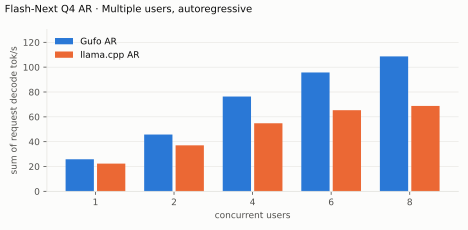
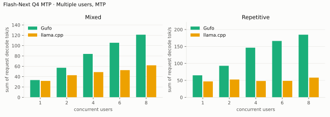
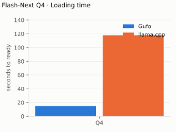
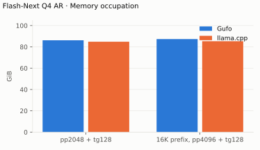

# Qwen3.8 Flash-Next benchmarks

AMD Strix Halo `gfx1151`, 128 GB unified memory. Unsloth `UD-Q4_K_XL` target and
shared-Q8_0 MTP sidecar; Gufo uses adaptive MTP. HTTP, greedy, thinking off.
Gufo pp/tg, concurrency and memory: October 8–9, 2026, production Nix build.
Loading and reference results: September 22–23.
llama.cpp uses `b11069` for AR and `6fcaa16f` for MTP.

Positive gain favors Gufo.
[Quality and measurement details](QUALITY.md#benchmark-method) · [Model identities](artifacts/model-identities.json)

## Single user, autoregressive

Approximately pp2048 / tg128; depth is the cached prefix in tokens.
Context capacities differ between engines; see the measurement details.

<!-- bench:single-ar -->
| Flash-Next Q4 AR Depth (tokens) | Gufo pp (tok/s) | llama.cpp pp (tok/s) | Gain | Gufo tg (tok/s) | llama.cpp tg (tok/s) | Gain |
| ---: | ---: | ---: | ---: | ---: | ---: | ---: |
| 0 | 1700.52 | 489.59 | +247.3% | 25.95 | 22.20 | +16.9% |
| 4,096 | 1618.60 | 455.24 | +255.5% | 25.84 | 21.21 | +21.8% |
| 8,192 | 1611.53 | 428.85 | +275.8% | 25.96 | 20.40 | +27.3% |
| 12,288 | 1602.99 | 400.21 | +300.5% | 25.94 | 19.64 | +32.1% |
| 16,384 | 1597.41 | 375.89 | +325.0% | 25.90 | 18.95 | +36.7% |
| 32,768 | 1585.98 | 301.31 | +426.4% | 25.78 | 16.54 | +55.9% |
| 65,536 | 1509.10 | 221.94 | +580.0% | 25.40 | 11.62 | +118.6% |
| 131,072 | 1478.66 | 144.78 | +921.3% | 24.92 | 7.98 | +212.3% |
<!-- /bench -->

## Single user, MTP

pp is the highest measured rate per engine and depth across mixed/repetitive
text, including Gufo predictor catch-up.

<!-- bench:single-mtp -->
| Flash-Next Q4 MTP Depth (tokens) | Gufo pp (tok/s) | llama.cpp pp (tok/s) | Gain pp | Gufo tg mixed (tok/s) | llama.cpp tg mixed (tok/s) | Gain mixed | Gufo tg repetitive (tok/s) | llama.cpp tg repetitive (tok/s) | Gain repetitive |
| ---: | ---: | ---: | ---: | ---: | ---: | ---: | ---: | ---: | ---: |
| 0 | 1642.85 | 468.76 | +250.5% | 31.32 | 31.73 | -1.3% | 60.39 | 48.12 | +25.5% |
| 4,096 | 1575.60 | 423.79 | +271.8% | 32.48 | 34.48 | -5.8% | 57.66 | 45.71 | +26.1% |
| 8,192 | 1573.54 | 394.98 | +298.4% | 32.38 | 32.20 | +0.6% | 49.28 | 44.31 | +11.2% |
| 12,288 | 1559.07 | 365.91 | +326.1% | 34.68 | 32.32 | +7.3% | 42.15 | 43.53 | -3.2% |
| 16,384 | 1547.52 | 341.98 | +352.5% | 35.09 | 32.07 | +9.4% | 50.58 | 43.66 | +15.8% |
| 32,768 | 1541.35 | 277.61 | +455.2% | 34.20 | 25.41 | +34.6% | 44.54 | 39.28 | +13.4% |
| 65,536 | 1466.98 | 208.04 | +605.1% | 33.49 | 19.65 | +70.4% | 44.45 | 27.75 | +60.2% |
| 131,072 | 1436.89 | 135.42 | +961.1% | 33.07 | 14.63 | +126.0% | 44.26 | 20.96 | +111.2% |
<!-- /bench -->

## Multiple users, autoregressive

Same pp2048 prose prompt as single-user d0, tg128, context 4096 per user.
All sessions prefilled before timed decoding; throughput sums individual rates.
llama.cpp re-evaluates its four-token checkpoint tail.

<!-- bench:multi-ar -->
| Flash-Next Q4 AR Users | Gufo AR (tok/s) | llama.cpp AR (tok/s) | Gain |
| ---: | ---: | ---: | ---: |
| 1 | 25.84 | 22.34 | +15.7% |
| 2 | 45.77 | 37.08 | +23.4% |
| 4 | 76.33 | 54.82 | +39.2% |
| 6 | 95.75 | 65.34 | +46.5% |
| 8 | 108.68 | 68.79 | +58.0% |
<!-- /bench -->

## Multiple users, MTP

Same pp2048 mixed/repetitive prompts as single-user d0, tg128, context 4096
per user. All sessions prefilled before timed decoding; rates sum individual
request decode rates. C1 cross-checks the single-user table.

<!-- bench:multi-mtp -->
| Flash-Next Q4 MTP Users | Gufo mixed (tok/s) | llama.cpp mixed (tok/s) | Gain | Gufo repetitive (tok/s) | llama.cpp repetitive (tok/s) | Gain |
| ---: | ---: | ---: | ---: | ---: | ---: | ---: |
| 1 | 31.28 | 31.77 | -1.5% | 60.10 | 46.93 | +28.1% |
| 2 | 52.22 | 42.79 | +22.0% | 84.52 | 52.57 | +60.8% |
| 4 | 76.16 | 48.78 | +56.1% | 131.10 | 48.23 | +171.8% |
| 6 | 96.01 | 52.59 | +82.6% | 145.38 | 48.51 | +199.7% |
| 8 | 107.77 | 61.92 | +74.0% | 162.98 | 58.13 | +180.4% |
<!-- /bench -->

## Loading time

C1, context capacity 262144, MTP. Cold target/sidecar files to HTTP readiness.

<!-- bench:loading -->
| Flash-Next Q4 Target | Gufo ready (s) | llama.cpp ready (s) | Gain |
| --- | ---: | ---: | ---: |
| Q4 | 15.45 | 117.83 | +662.7% |
<!-- /bench -->

## Memory occupation

C1, context capacity 133121, AR. Peak memory reported by HIP.

<!-- bench:memory -->
| Flash-Next Q4 AR Workload | Gufo GiB | llama.cpp GiB | Gain |
| --- | ---: | ---: | ---: |
| pp2048 + tg128 | 85.56 | 84.84 | -0.8% |
| 16K prefix, pp4096 + tg128 | 86.71 | 85.31 | -1.6% |
<!-- /bench -->

