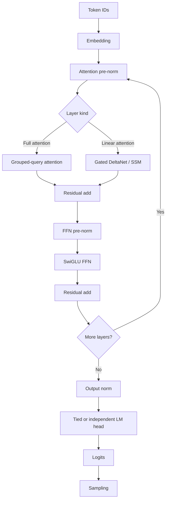

# Qwen model implementation

This directory contains the Qwen mixed-attention model implementation used by
Strix. It is not a generic implementation of every Qwen architecture: the main
GGUF path expects a repeating mixture of full grouped-query attention and
Gated DeltaNet/SSM layers, and the MTP path implements the separate single-layer
Qwen3.8 draft graph.

> **Supported target:** production support is Linux x86-64 on AMD Strix Halo,
> using the `gfx1151` GPU and, where enabled, the XDNA2 NPU. Compilation,
> numerical equivalence, graph replay, model quality, and performance must be
> validated on the supported target. See [AGENTS.md](../../../AGENTS.md).

## Model topology

The target model follows this composition:



The loader derives the kind of each layer from its tensors and verifies it
against `full_attention_interval`; a missing attention projection is therefore
not silently accepted as an SSM layer in the wrong position. Full-attention
layers own Q/K/V, per-head Q/K norms, RoPE/KV-cache work, and output projection.
SSM layers own QKV/gate/alpha/beta projections, causal convolution, recurrent
DeltaNet state, per-head normalization, gating, and output projection.

[MTP](#mtp-and-xdna2) is a draft-model path, not another target-model layer. It
combines a target hidden state with the next-token embedding, runs the dedicated
layer-64 graph, and feeds proposed tokens through the speculative backend.

## Source ownership

| Path | Responsibility |
|---|---|
| [`state.hpp`](state.hpp), [`state.cpp`](state.cpp) | Non-owning tensor references plus CPU KV cache and activation scratch state. |
| [`weights.cpp`](weights.cpp) | GGUF tensor-name binding, role-specific format/shape checks, encoded-storage validation, and mixed-layer-kind validation. |
| [`forward.hpp`](forward.hpp), [`forward.cpp`](forward.cpp) | CPU/reference tensor math, layer composition, full single-token forward, and sampling oracle. |
| [`generator.hpp`](generator.hpp), [`generator.cpp`](generator.cpp) | CPU autoregressive generation loop and GGUF-backed reference generator. |
| [`ssm.hpp`](ssm.hpp), [`ssm.cpp`](ssm.cpp) | CPU Gated DeltaNet cache and the typed SSM parameter-slice implementation. |
| [`modules/`](modules/) | Narrow stage contracts for embedding, norm, attention, RoPE, residual, FFN, SSM, unembedding, sampling, and quantized GEMM. [`module_ctx.hpp`](modules/module_ctx.hpp) separates CPU and HIP capabilities. |
| [`gemm_route.hpp`](gemm_route.hpp) | Pure, host-only format/shape/capability-to-GEMM-route resolver shared by CPU, HIP decode, HIP prefill, and HIP MTP. |
| [`hip/executor.hpp`](hip/executor.hpp), [`hip/executor.cpp`](hip/executor.cpp) | Immutable GPU-visible model, session executor, arena-facing API, generation loop, graph identity, and persistent execution state. |
| [`hip/decode.cpp`](hip/decode.cpp), [`hip/decode_step.cpp`](hip/decode_step.cpp) | Token I/O and graph orchestration versus the per-token decode composition root. |
| [`hip/prefill.cpp`](hip/prefill.cpp), [`hip/prefill_chunk.cpp`](hip/prefill_chunk.cpp) | Prompt chunking versus the batched prefill launch chain. |
| [`hip/arena.cpp`](hip/arena.cpp), [`hip/ssm_replay.cpp`](hip/ssm_replay.cpp) | Stable GPU allocation ownership versus recurrent snapshots and SSM replay. |
| [`hip/execution_policy.hpp`](hip/execution_policy.hpp) | Immutable execution policy, pure per-layer route resolution, rejection reasons, fingerprints, and graph eligibility. |
| [`hip/ops/`](hip/ops/) | Narrow launcher interfaces grouped by attention, GEMM, norm/residual, SSM, SwiGLU, and token operations. [`ops.hpp`](hip/ops.hpp) is a compatibility umbrella. |
| [`hip/kernels/`](hip/kernels/) | HIP implementations split by launch/experiment boundary; graph-pointer attention, decode recurrence, quant GEMV, and fused RMSNorm+SwiGLU have independent translation units. |
| [`mtp_reference.hpp`](mtp_reference.hpp), [`mtp_reference.cpp`](mtp_reference.cpp) | Stateful CPU oracle for the single-layer MTP graph. |
| [`hip/mtp/`](hip/mtp/), [`hip/mtp.hpp`](hip/mtp.hpp) | GPU MTP model conversion, executor, and speculative draft backend; optional hybrid NPU EH projection. |
| [`xdna2/`](xdna2/) | XRT sessions, packing contracts, and AIE2P programs for Qwen MTP operations. |
| [`tokenizer.*`](tokenizer.hpp), [`chat_template.*`](chat_template.hpp) | BPE vocabulary/merge handling and bounded deterministic Qwen ChatML formatting. |
| [`oracles.*`](oracles.hpp) | Independent reference helpers used for correctness comparison. |
| [`CMakeLists.txt`](CMakeLists.txt) | Explicit Qwen production source registration and HIP/XRT source ownership. |

The longer-term architecture and deferred sequencing live in
[`notes-for-refactoring.md`](../../../notes-for-refactoring.md); that document is
a roadmap, while this README describes the current implementation.

## Runtime entry points

### CPU/reference

- [`QwenModelWeights::LoadFromGguf`](state.hpp) binds and validates the target
  model without copying tensor payloads.
- [`ForwardModel`](forward.hpp) performs one reference token forward using
  `QwenKvCache`, `QwenSsmCache`, and `QwenScratchArena` supplied by the caller.
- [`QwenGenerator`](generator.hpp) owns those objects for an end-to-end CPU
  prompt/decode loop. This is a correctness and testing path, not the supported
  high-performance inference backend.
- [`QwenTokenizer`](tokenizer.hpp) loads GGUF vocabulary/merges, with the model
  loader retaining the existing binary-vocabulary fallback. [`QwenChatTemplate`](chat_template.hpp)
  renders structured messages before tokenization.

### HIP target model

- [`QwenGpuModel::CreateFromGguf`](hip/executor.hpp) owns the GGUF reader,
  validated weights, tokenizer, and GPU-visible weight regions. On an integrated
  GPU it prefers registered mapped storage; copy mode and automatic fallback are
  also supported.
- [`QwenGpuExecutor::Generate`](hip/executor.hpp) first calls
  `ForwardPromptBatch` for batched prefill and then `ForwardToken` for
  autoregressive decode.
- `ForwardPromptBatch` chunks to the arena's maximum batch and calls
  `ForwardPromptChunk`. Decode calls `ExecuteDecodeStep`, which is the
  composition root for the full layer stack, final norm, LM head, and sampling.
- `SaveState`/`RestoreState` preserve recurrent state for speculative execution;
  SSM replay can reconstruct recurrent positions without running the complete
  output path.

### Graph capture

Decode graph capture is a single-executor optimization around
`ExecuteDecodeStep`. The key in
[`HipGraphDecodeExecutor`](../../core/hip/detail/hip_graph_decode_executor.hpp)
contains:

1. the immutable `QwenExecutionPolicy` fingerprint; and
2. a deterministic workload identity built from model dimensions, maximum
   context, logits behavior, and every resolved decode-layer route fingerprint.

Raw addresses are deliberately excluded from the workload hash. A captured
instance refuses launch under a different identity instead of replaying the
wrong route.

Capture currently requires logits, graph enablement, no split-K decode
attention, and no side-stream layer prefetch. These exclusions are resolved and
reported explicitly; the executor falls back to the ordinary launch chain.
Layer prefetch remains incompatible because its fork/join is not captured as a
complete graph operation.

## Tensor and storage contracts

[`QwenTensorRef`](state.hpp) is a small, non-owning description of the bytes a
consumer will read:

- `data` is the current storage address;
- `type` is the **current runtime storage format**;
- `num_elements` is the logical element count; and
- `available_bytes` is the mapped extent from `data` to the end of its storage
  region.

`EncodedSizeBytes()` and `FitsAvailableStorage()` delegate physical-size
calculation to the canonical quant helpers in
[`src/core/quant/ggml_dequant.hpp`](../../core/quant/ggml_dequant.hpp). Loader
validation also checks quantized row alignment through `QuantizedRowBytes()`.
Do not compute packed sizes as `elements * sizeof(T)` and do not infer row
stride from a format name.

A tensor's original GGUF format and its runtime format are not always the same:

- target-model GPU mapping/copy changes the address but preserves the encoded
  bytes and `QwenTensorRef::type`;
- the GPU MTP loader expands supported matrix formats once into F32 or BF16
  allocations and updates the runtime tensor type accordingly; and
- the original raw MTP fusion projection is retained separately when the hybrid
  XDNA2 EH projection needs its packed source representation.

Always dispatch from the runtime `QwenTensorRef::type`. Original GGUF metadata
is provenance, not permission to reinterpret converted storage.

### Role validation

The target-model loader accepts formats by consumer capability, not by a single
global whitelist:

| Tensor role | Accepted runtime formats |
|---|---|
| Token embedding | F32, BF16, Q8_0 |
| Norms and direct SSM parameters | F32 |
| Projection matrices | F32, BF16, Q8_0, Q5_K, Q6_K, Q8_K |

Projection rows must be block-aligned for their quant format. The pure GEMM
resolver describes a somewhat wider lower-level CPU capability set (including
Q3_K and Q4_K), but that does not bypass the model loader's stricter production
role contract. Adding a format therefore requires both a valid byte/layout
contract and support in every consumer reached by that tensor role.

### Canonical GEMM routing

[`ResolveQwenGemmRoute`](gemm_route.hpp) takes runtime format, batch/M/K shape,
execution mode, available capabilities, and residual-epilogue intent. It returns
either a named route or a typed rejection. It owns the current choices among:

- CPU dense rows or canonical quant dot products;
- HIP direct quant GEMV/GEMM;
- decode/MTP BF16 wave32 or baseline block kernels;
- prefill hipBLAS; and
- a large-BF16 hipBLASLt attempt with hipBLAS runtime fallback.

CPU `TensorGEMV`, HIP decode launch dispatch, batched prefill, module capability
checks, and HIP MTP call this resolver. Kernel bodies and hipBLASLt's runtime
plan fallback remain separate implementation details. Fused multi-projection
kernels and the cross-device NPU projection are composition routes and are not
pretended to be ordinary GEMM routes.

## Execution policy, routes, and telemetry

[`QwenExecutionPolicy`](hip/execution_policy.hpp) is immutable for the lifetime
of a `QwenGpuExecutor`. Decode and prefill resolve it with the layer kind into a
pure `QwenLayerRouteResolution`; the result contains the launch plan, a stable
fingerprint, and a bitmask explaining requested routes that were masked by mode
or layer kind. Shape/format launch eligibility is still checked at the launch
boundary, so policy intent cannot force an unsupported kernel.

The telemetry implementation is in
[`dispatch_telemetry.hpp`](../../core/hip/detail/dispatch_telemetry.hpp). These
environment variables are read by the current source:

| Variable | Current meaning |
|---|---|
| `STRIX_DISPATCH_TELEMETRY` | Enables JSON-line dispatch events unless set to `0`, `false`, `OFF`, or `off`. Events include Qwen policy, per-layer route/rejection mask, graph eligibility, graph cache identity, attention, GEMV, and hipBLASLt data. |
| `STRIX_ENABLE_HIP_GRAPH` | Graph capture is enabled by default; the same false spellings disable it. |
| `STRIX_PROFILE` | Presence enables prefill timing output. It is diagnostic output, not a stable benchmark harness. |
| `STRIX_DISABLE_SSM_REPLAY` | Presence with a value other than `0`, `false`, or `off` disables SSM replay. |
| `STRIX_GPU_WEIGHT_MODE` | `mapped`, `copy`, or automatic GPU visibility selection. |
| `STRIX_HIPBLASLT_PLAN_CACHE` | Path used by hipBLASLt plan persistence when its caller has not supplied one. |

Record the policy fingerprint, resolved route fingerprints/rejections, graph
identity, model/shape, device, and revision with experiment results. Numeric
rejection masks are defined by the enums in `execution_policy.hpp`; do not copy
their bit values into scripts as a second source of truth.

## Scratch, aliases, and persistent state

[`QwenGpuArena`](hip/executor.hpp) owns all GPU allocations used by a session.
`GetScratchView()` returns non-owning nested spans over those stable addresses:

- `QwenDecodeScratch`: hidden/norm/logit buffers, BF16 conversion workspaces,
  token parameters, and sampled-token output;
- `QwenAttentionScratch`: Q/K/V, attention output, and split-K workspace;
- `QwenSsmScratch`: QKV, convolution, gate/output, alpha, and beta workspaces;
- `QwenFfnScratch`: gate, up, activation, and output workspaces.

The views do not allocate or extend lifetime. Stable addresses are part of the
HIP graph-capture contract, so changing allocation order, size, aliasing, or
lifetime is a behavioral change even if C++ types remain the same.

`QwenDecodeScratch::sampled_token` intentionally aliases the first element of
`QwenSsmScratch::alpha` as `std::uint32_t`. The alias is legal only in the
sampling/output epoch, after all layer execution has finished using alpha.
Never use both interpretations concurrently.

KV cache, SSM convolution state, DeltaNet state, their saved snapshots, and SSM
replay logs are persistent execution state, not scratch. They must not be moved
into short-lived stage capabilities. Decode and shared output/replay paths use
the typed views; prefill still contains a broad staged launch chain and some
public raw arena internals. Make those pointers private only after staged
migration and supported-host graph/address validation.

## CPU SSM contract

[`QwenSsmParameters`](ssm.hpp) is the complete non-owning CPU SSM input slice:
exactly nine tensor references plus key/value head counts, dimensions, and
convolution width. `modules::SsmLayerView` aliases this type, so the module no
longer holds a back-pointer to the complete `QwenLayerWeights`.

The slice overload of `ForwardSSM` performs shape/cache validation and owns the
implementation. The whole-layer overload remains as a compatibility entry
point: it constructs `QwenSsmParameters` with `MakeQwenSsmParameters` and then
delegates. New module code should use the typed slice rather than grow the
compatibility wrapper.

## MTP and XDNA2

The MTP paths share the target tokenizer/embedding/LM-head contract but own
their own model and session state:

- [`QwenMtpReference`](mtp_reference.hpp) is the CPU oracle.
- [`QwenMtpGpuModel` and `QwenMtpGpuExecutor`](hip/mtp.hpp) own converted GPU
  weights, the layer-64 graph, feedback state, and optional hybrid metrics.
- `QwenMtpGpuDraftBackend` adapts the executor to the speculative draft API and
  requires target hidden states.
- In `kHybridNpuEhProj` mode, the EH fusion projection may run through an XRT
  [`QwenMtpEhProjSession`](xdna2/mtp_eh_proj.h); the remainder of the graph is
  still HIP.

There are two distinct W4A8 byte ABIs in this directory:

1. [`aie2p_w4a8_pack.hpp`](xdna2/aie2p_w4a8_pack.hpp) defines the tiled AIE2P
   W4A8 records used by its program family: 16-lane tiles, per-group activation
   records, and tiled output accumulation.
2. [`mtp_eh_proj.cpp`](xdna2/mtp_eh_proj.cpp) owns the EH projection session;
   it starts from row-major Q4_K source rows and repacks them into its own
   4096-byte weight-record and 2048-byte input-record ABI.

They are **not interchangeable**. Sharing the words "W4A8" or a logical matrix
shape does not make packed bytes compatible. Any packing change must be checked
against the exact program manifest, host session, CPU reference, and device
program that consume that ABI. See also
[`docs/QUANTIZATION.md`](../../../docs/QUANTIZATION.md).

## Build and tests

Qwen production sources are registered explicitly from this directory's
[`CMakeLists.txt`](CMakeLists.txt). Classic Qwen tests are registered from
[`tests/models/qwen/CMakeLists.txt`](../../../tests/models/qwen/CMakeLists.txt).
Do not add documentation to a source list and do not replace explicit lists with
globbing. Public targets such as `strix_core` remain repository-owned even
though their Qwen sources are attached locally.

The test layout, focused CTest names, labels, and integration limitations are
documented in [`tests/models/qwen/README.md`](../../../tests/models/qwen/README.md).
Pure policy/GEMM tests run without a GPU; kernel tests are split by operation
family. HIP tests that explicitly declare the device optional return CTest skip
code 77 when no device is visible. HIP discovery errors, and absence for a
required-device test, fail rather than masquerading as a skip.

Use Nix for supported validation:

```sh
git add <new-files>                    # Nix only sees tracked files
nix build                              # optimized gfx1151 + XRT package
./result/bin/strix                     # hardware probe
nix build .#checks.x86_64-linux.pr     # canonical PR gate
```

For focused correctness/debugging on the supported host, use the intentionally
unoptimized `build/gpu-test` CTest tree, for example:

```sh
nix develop -c ctest --test-dir build/gpu-test -L qwen --output-on-failure
nix develop -c ctest --test-dir build/gpu-test \
  -R qwen_gemm_route_test --output-on-failure
nix develop -c ctest --test-dir build/gpu-test \
  -R qwen_attention_decode_ops_test --output-on-failure
```

Run model quality and performance only with the optimized `nix build` binaries:

```sh
./result/bin/strix-server bench --model <model.gguf> -p 128 -n 16 \
  --validate-prefill 128
```

## Safe experiment checklist

When adding or changing a route:

1. **Preserve the existing route first.** Add a policy/capability choice without
   deleting the reference path or changing mathematical behavior in the same
   revision.
2. **Put the decision in a pure resolver.** Add CPU tests for accepted routes,
   rejected format/shape/mode combinations, stable fingerprints, and rejection
   reasons.
3. **Add a focused kernel oracle.** Compare deterministic output with an
   independent CPU/reference implementation, including finite checks and
   realistic production shapes/formats.
4. **Keep graph identity complete.** Any choice that changes captured launches
   must affect the policy/workload key or explicitly disable capture. Verify
   capture miss, replay hit, and ordinary-launch parity.
5. **Emit reproducibility data.** Record selected/rejected route IDs, policy and
   graph fingerprints, model, shape, format, device, and revision.
6. **Validate in increasing scope.** Pure CPU checks, focused HIP kernel/module
   tests, synthetic integration, graph smoke, real-model logits/tokens, then an
   optimized production-binary benchmark on Strix Halo.
7. **Measure before claiming improvement.** Use interleaved A/B measurements;
   debug-tree timings and one-off `STRIX_PROFILE` output are not performance
   evidence.

## Known limitations and deferred work

- The current refactoring has not yet been compiled or run on the supported
  Linux x86-64 Strix Halo target. Static checks cannot establish numerical,
  capture/replay, quality, or performance parity.
- CPU code is an oracle and fallback for tests, not the supported production
  performance path.
- HIP module extraction is incomplete: decode/prefill composition still owns
  several direct cross-stage launch chains, especially prefill.
- Some raw arena pointers remain public during the typed-view parallel
  migration; making them private is deferred until address/lifetime validation.
- The HIP module-pipeline test is partial, not a complete synthetic production
  decode or a substitute for real-model quality validation.
- Runtime same-binary policy A/B selection is not exposed yet. Policies must be
  resolved before capture and remain immutable within an executor.
- Split-K decode attention and side-stream layer prefetch currently bypass graph
  capture.
- `hipblaslt_gemm.hip`, `aie2p_w4a8_pack.hpp`, and `mtp_eh_proj.cpp` remain
  intentionally cohesive because they each own private cache/session or packed
  ABI state that must change together.
- Model-local CMake registration improves ownership, but Qwen still attaches to
  the shared `strix_core` target; finer object-library build boundaries are
  deferred.
